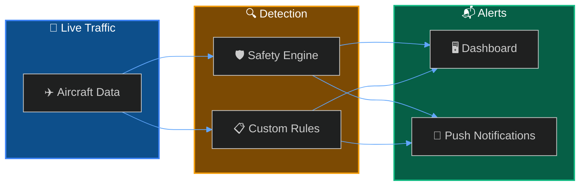
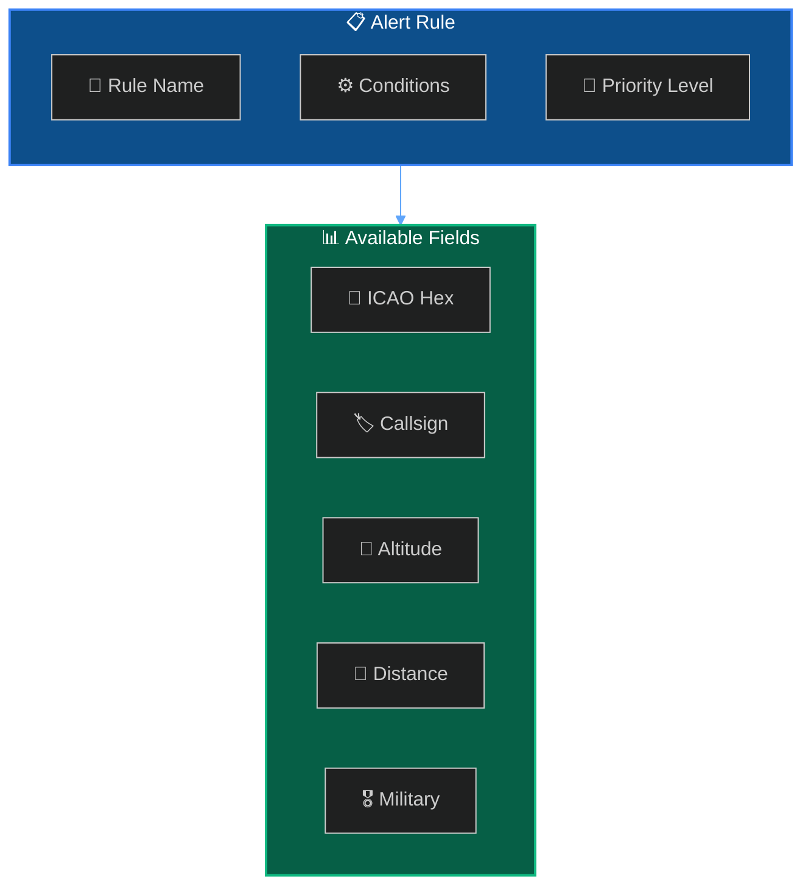
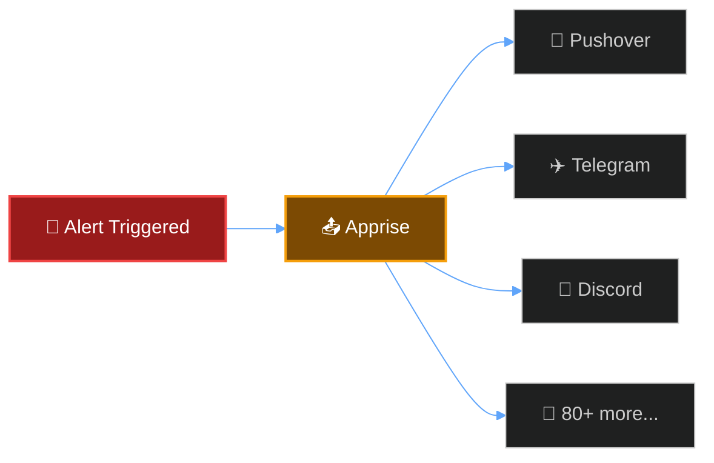

SkySpy provides two types of alerts: automatic **safety monitoring** that detects dangerous conditions, and **custom alert rules** you define to track specific aircraft or situations.



## Safety Monitoring

The safety engine continuously analyzes live traffic and automatically detects dangerous conditions.

- **TCAS RA** - **Critical** — Resolution Advisory detected
- **TCAS TA** - **Warning** — Traffic Advisory detected
- **Proximity Conflict** - **Critical** — Aircraft within threshold distance
- **Extreme Vertical Rate** - **Warning** — Climb/descent exceeding 4,500 ft/min
- **Emergency Squawk** - **Critical** — 7700, 7600, or 7500 detected

### Emergency Squawk Codes

> ❗️ Critical
>
> These codes indicate serious aviation emergencies. SkySpy triggers immediate alerts when detected.

| Code | Icon | Meaning | Priority |
| :--- | :--- | :--- | :--- |
| `7700` | 🚨 | **General Emergency** — Aircraft in distress | Critical |
| `7600` | 📻 | **Radio Failure** — Lost communications (NORDO) | High |
| `7500` | ⚠️ | **Hijack** — Unlawful interference | Critical |

### Configuration

```bash
SAFETY_MONITORING_ENABLED=true
SAFETY_PROXIMITY_NM=1.0        # Nautical miles
SAFETY_ALTITUDE_DIFF_FT=1000   # Feet
```

---

## Custom Alert Rules

Create rules to get notified when specific aircraft appear or conditions are met.



### Quick Example

```bash
curl -X POST http://localhost:5000/api/alerts/rules \
  -H "Content-Type: application/json" \
  -d '{
    "name": "Military Aircraft Nearby",
    "enabled": true,
    "priority": "high",
    "conditions": {
      "operator": "AND",
      "conditions": [
        { "field": "military", "operator": "eq", "value": true },
        { "field": "distance", "operator": "lt", "value": 50 }
      ]
    },
    "notification_enabled": true
  }'
```

---

## Notifications

When alerts trigger, SkySpy sends push notifications via [Apprise](https://github.com/caronc/apprise).



```bash
APPRISE_URLS="pushover://user@token;tgram://bot/chat"
NOTIFICATION_COOLDOWN=300
```

---

## Implementation

- **Custom Rules** - Rule structure, conditions, and operators. [Learn more →](/docs/safety-and-alerts/custom-rules)
- **Rule Examples** - Common rule patterns and use cases. [Learn more →](/docs/safety-and-alerts/examples)

---

## Troubleshooting

<Accordion title="Alerts not triggering" icon="fa-bell-slash">

**Check that safety monitoring is enabled:**
```bash
# In your .env file
SAFETY_MONITORING_ENABLED=true
```

**Verify the safety engine is running:**
```bash
curl http://localhost:5000/api/v1/safety/monitor/status
```

**Check alert rule is enabled:**
```bash
curl http://localhost:5000/api/alerts/rules | jq '.[] | {name, enabled}'
```

</Accordion>

<Accordion title="Too many notifications" icon="fa-volume-up">

**Increase the notification cooldown:**
```bash
# In your .env file - cooldown in seconds
NOTIFICATION_COOLDOWN=600  # 10 minutes between repeat alerts
```

**Adjust proximity thresholds:**
```bash
SAFETY_PROXIMITY_NM=2.0        # Increase to 2 nautical miles
SAFETY_ALTITUDE_DIFF_FT=2000   # Increase to 2000 feet vertical
```

</Accordion>

<Accordion title="Missing emergency squawk alerts" icon="fa-exclamation-circle">

Emergency squawk detection requires the aircraft to broadcast squawk codes via ADS-B. Not all aircraft transmit squawk codes.

**Verify your receiver is capturing squawk data:**
```bash
curl http://localhost:5000/api/v1/aircraft | jq '.[] | select(.squawk != null) | {hex, squawk}'
```

</Accordion>

---

## Next Steps

- **Real-Time API** - Subscribe to safety events via Socket.IO. [Learn more →](/docs/real-time-api)
- **SSE Streaming** - Receive alerts via Server-Sent Events. [Learn more →](/docs/sse)
