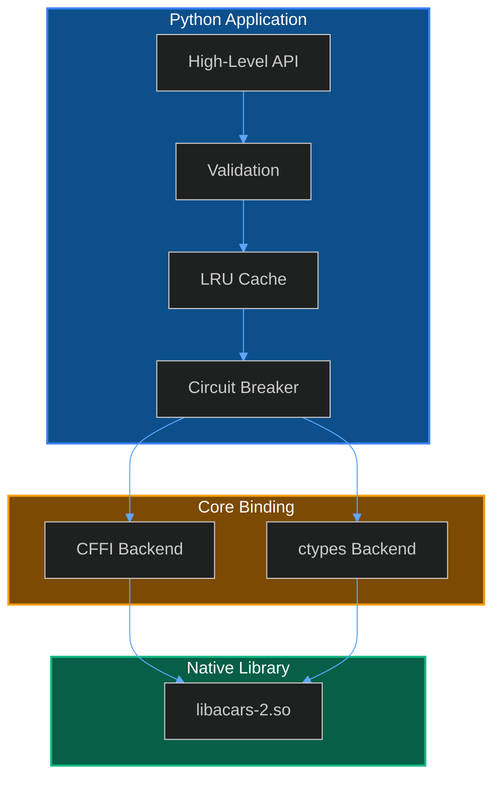

Decode ACARS application-layer messages using the libacars C library with full Python integration.


## Overview

The libacars Python binding provides a high-level interface to the [libacars](https://github.com/szpajder/libacars) C library for decoding ACARS application-layer protocol messages. It handles all the complexity of FFI (Foreign Function Interface), memory management, error handling, and provides production-ready features like caching, circuit breakers, and observability.

### Key Features

| Feature | Description |
| :--- | :--- |
| **Dual Backend Support** | CFFI (preferred) with ctypes fallback |
| **Async Support** | Full async/await API with thread pool |
| **Batch Processing** | Efficient processing of multiple messages |
| **LRU Cache** | Configurable decode result caching |
| **Circuit Breaker** | Automatic error recovery and protection |
| **Prometheus Metrics** | Built-in observability and health checks |
| **Input Validation** | Pre-decode validation to prevent crashes |

## Supported Message Types

The binding decodes ACARS application-layer content including:

- **FANS-1/A** - Future Air Navigation System messages including ADS-C (Automatic Dependent Surveillance - Contract) position reports and waypoint updates.
- **CPDLC** - Controller-Pilot Data Link Communications for ATC clearances, requests, and responses.
- **MIAM** - Media Independent Aircraft Messaging for general data transfer.
- **ARINC 622** - ATS Data Link applications including context management and address resolution.

## Quick Example

```python
from skyspy_common.libacars import (
    decode_acars_apps,
    is_available,
    MsgDir,
)

# Check if libacars is available
if is_available():
    # Decode an ACARS message
    result = decode_acars_apps(
        label="H1",
        text="/BOMASYA.ADS.VT-ANE072501A095CA95C1...",
        direction=MsgDir.AIR2GND,
    )

    if result:
        print(f"Decoded: {result}")
    else:
        print("Message could not be decoded (unsupported format)")
else:
    print("libacars library not available")
```

### Async Example

```python
import asyncio
from skyspy_common.libacars import decode_acars_apps_async, MsgDir

async def decode_message():
    result = await decode_acars_apps_async(
        label="H1",
        text="/BOMASYA.ADS.VT-ANE072501A095CA95C1...",
        direction=MsgDir.AIR2GND,
        timeout=5.0,
    )
    return result

# Run the async decoder
decoded = asyncio.run(decode_message())
```

### Batch Processing

```python
from skyspy_common.libacars import (
    decode_batch,
    BatchMessage,
    MsgDir,
)

messages = [
    BatchMessage(label="H1", text="...", direction=MsgDir.AIR2GND, id="msg1"),
    BatchMessage(label="SA", text="...", direction=MsgDir.AIR2GND, id="msg2"),
    BatchMessage(label="H1", text="...", direction=MsgDir.GND2AIR, id="msg3"),
]

results = decode_batch(messages)

for result in results:
    print(f"{result.id}: success={result.success}, cached={result.cached}")
```

## Architecture



## Documentation

<Cards columns={3}>
  <Card title="Installation" icon="fa-download" href="/docs/libacars/installation">
    Install native library and Python dependencies
  </Card>
  <Card title="API Reference" icon="fa-code" href="/docs/libacars/api">
    Complete function and class documentation
  </Card>
  <Card title="Configuration" icon="fa-cog" href="/docs/libacars/configuration">
    Environment variables and runtime settings
  </Card>
  <Card title="Error Handling" icon="fa-bug" href="/docs/libacars/error-handling">
    Exception types and validation
  </Card>
  <Card title="Observability" icon="fa-chart-bar" href="/docs/libacars/observability">
    Metrics, health checks, and monitoring
  </Card>
</Cards>

## When to Use

Use the libacars binding when you need to:

- Decode FANS-1/A ADS-C position reports from oceanic flights
- Parse CPDLC controller-pilot communications
- Extract structured data from ACARS message text
- Process high volumes of ACARS messages with caching
- Build monitoring or analysis applications for ACARS data

> **Note**
>
> The binding requires the native libacars-2 library to be installed on your system. Without it, all decode functions will return `None` and `is_available()` will return `False`.
