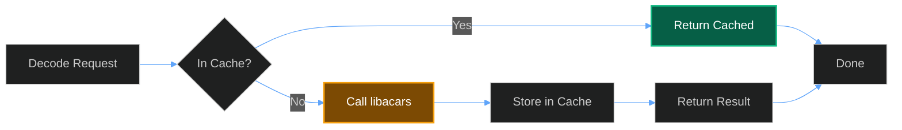
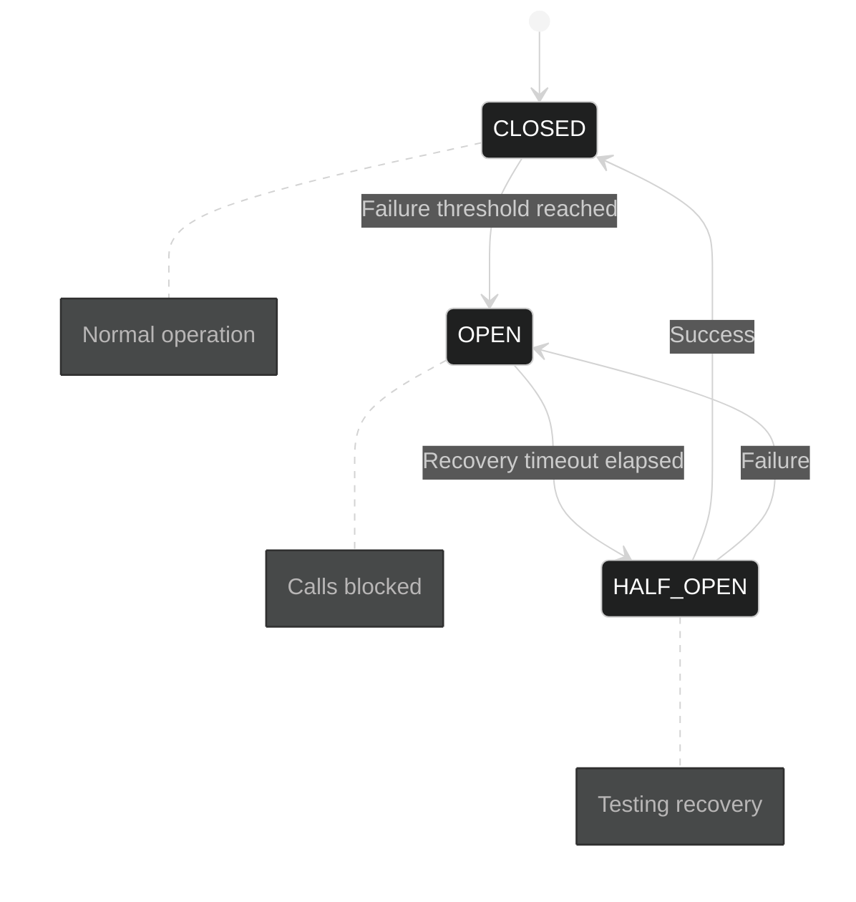

The libacars binding can be configured through environment variables (for deployment) and runtime configuration (for dynamic adjustments).

## Environment Variables

Set these variables before starting your application to configure the binding behavior.

### Core Settings

| Variable | Type | Default | Description |
| :--- | :--- | :--- | :--- |
| `LIBACARS_DISABLED` | `bool` | `false` | Completely disable libacars (all decodes return None) |
| `LIBACARS_DECODE_TIMEOUT` | `float` | `5.0` | Default timeout for async decode operations (seconds) |

### Thread Pool Settings

| Variable | Type | Default | Description |
| :--- | :--- | :--- | :--- |
| `LIBACARS_THREAD_POOL_MIN` | `int` | `2` | Minimum worker threads |
| `LIBACARS_THREAD_POOL_MAX` | `int` | `0` | Maximum worker threads (0 = auto: CPU count + 4) |

### Cache Settings

| Variable | Type | Default | Description |
| :--- | :--- | :--- | :--- |
| `LIBACARS_CACHE_ENABLED` | `bool` | `true` | Enable/disable the decode result cache |
| `LIBACARS_CACHE_MAX_SIZE` | `int` | `1000` | Maximum number of cached decode results |
| `LIBACARS_CACHE_TTL` | `float` | `300` | Cache entry time-to-live (seconds) |

### Example Configuration

```bash
# .env file or shell export

# Disable for testing
LIBACARS_DISABLED=false

# Increase cache for high-traffic deployment
LIBACARS_CACHE_MAX_SIZE=5000
LIBACARS_CACHE_TTL=600

# Tune thread pool for CPU-bound workloads
LIBACARS_THREAD_POOL_MIN=4
LIBACARS_THREAD_POOL_MAX=16

# Shorter timeout for interactive use
LIBACARS_DECODE_TIMEOUT=2.0
```

## Runtime Configuration

### LibacarsConfig Class

Use `LibacarsConfig` to set options on the underlying libacars library at runtime.

```python
from skyspy_common.libacars import LibacarsConfig

# Set boolean option
LibacarsConfig.set("option_name", True)

# Set integer option
LibacarsConfig.set("max_depth", 10)

# Set string option
LibacarsConfig.set("output_format", "json")
```

The `set()` method returns `True` if the configuration was applied successfully, `False` otherwise.

> **Note**
>
> Available configuration options depend on the libacars library version. Refer to the [libacars documentation](https://github.com/szpajder/libacars) for supported options.

## Cache Configuration

The decode cache improves performance by storing results for frequently-seen messages.



### Cache Behavior

- **Key Generation**: SHA-256 hash of `label + text + direction`
- **Eviction Policy**: LRU (Least Recently Used)
- **TTL Expiration**: Entries expire after `LIBACARS_CACHE_TTL` seconds
- **Thread Safety**: All cache operations are thread-safe

### Disabling Cache Per-Call

```python
from skyspy_common.libacars import decode_acars_apps

# Bypass cache for this specific call
result = decode_acars_apps(
    label="H1",
    text="...",
    use_cache=False,  # Don't read from or write to cache
)
```

### Cache Management

```python
from skyspy_common.libacars import (
    get_decode_cache,
    get_label_cache,
    reset_caches,
)

# Get cache instance
cache = get_decode_cache()

# Check cache statistics
stats = cache.get_stats()
print(f"Hit rate: {stats['hit_rate']}%")
print(f"Size: {stats['current_size']}/{stats['max_size']}")

# Manually clear cache
cleared = cache.clear()
print(f"Cleared {cleared} entries")

# Clean up expired entries
expired = cache.cleanup_expired()
print(f"Removed {expired} expired entries")

# Reset all caches to initial state
reset_caches()
```

### Label Format Cache

A separate cache tracks which message labels are supported by libacars:

```python
from skyspy_common.libacars import get_label_cache

label_cache = get_label_cache()

# Check if a label is known to be supported
supported = label_cache.is_supported("H1")  # True, False, or None (unknown)

# Get format name for a label
format_name = label_cache.get_format("H1")  # e.g., "acars" or None

# View statistics
stats = label_cache.get_stats()
print(f"Supported labels: {stats['supported_count']}")
print(f"Unsupported labels: {stats['unsupported_count']}")
```

## Circuit Breaker Configuration

The circuit breaker prevents cascade failures by temporarily disabling decoding after repeated errors.

### Circuit Breaker States



### Configuration Options

The circuit breaker is configured programmatically:

```python
from skyspy_common.libacars import get_circuit_breaker

# Get the global circuit breaker (configured on first call)
breaker = get_circuit_breaker(
    failure_threshold=5,      # Failures before opening
    recovery_timeout=60.0,    # Seconds before recovery attempt
)

# Check current state
print(f"State: {breaker.state.name}")
print(f"Can execute: {breaker.can_execute()}")

# View statistics
stats = breaker.get_stats()
print(f"Success rate: {stats['success_rate']}%")
print(f"Failed calls: {stats['failed_calls']}")

# Get failure analysis
analysis = breaker.get_failure_analysis()
print(f"Likely cause: {analysis['likely_cause']}")
print(f"Recommendation: {analysis['recommendation']}")
```

### Manual Circuit Control

```python
from skyspy_common.libacars import (
    get_circuit_breaker,
    reset_circuit_breaker,
    reset_error_state,
)

breaker = get_circuit_breaker()

# Force circuit to open (block all calls)
breaker.force_open()

# Force circuit to close (allow all calls)
breaker.force_close()

# Reset circuit to initial state
breaker.reset()

# Reset entire error state (convenience function)
reset_error_state()

# Reset and recreate circuit breaker
reset_circuit_breaker()
```

### Error Categories

The circuit breaker categorizes errors for differential handling:

| Category | Description | Handling |
| :--- | :--- | :--- |
| `MEMORY` | Out of memory | Critical - may need restart |
| `MALFORMED` | Input validation failed | Skip message |
| `UNSUPPORTED` | Format not supported | Skip message |
| `LIBRARY_CRASH` | Segfault/abort | Disable immediately |
| `JSON_ERROR` | Output parsing error | May retry |
| `TIMEOUT` | Operation timed out | May retry |
| `LOAD_ERROR` | Library failed to load | Disable |
| `UNKNOWN` | Unexpected error | Conservative handling |

## Configuration Examples

### High-Throughput Server

```bash
# Maximize caching and thread pool
LIBACARS_CACHE_MAX_SIZE=10000
LIBACARS_CACHE_TTL=3600
LIBACARS_THREAD_POOL_MAX=32
LIBACARS_DECODE_TIMEOUT=10.0
```

### Resource-Constrained Environment

```bash
# Minimize resource usage
LIBACARS_CACHE_MAX_SIZE=100
LIBACARS_CACHE_TTL=60
LIBACARS_THREAD_POOL_MIN=1
LIBACARS_THREAD_POOL_MAX=2
```

### Development / Testing

```bash
# Fast feedback, no caching
LIBACARS_CACHE_ENABLED=false
LIBACARS_DECODE_TIMEOUT=1.0
```

### Disable for Specific Environments

```bash
# Completely disable libacars (e.g., in CI without the library)
LIBACARS_DISABLED=true
```

## Next Steps

- **Error Handling** - Handle exceptions and validation errors. [Learn more →](/docs/libacars/error-handling)
- **Observability** - Monitor with metrics and health checks. [Learn more →](/docs/libacars/observability)
