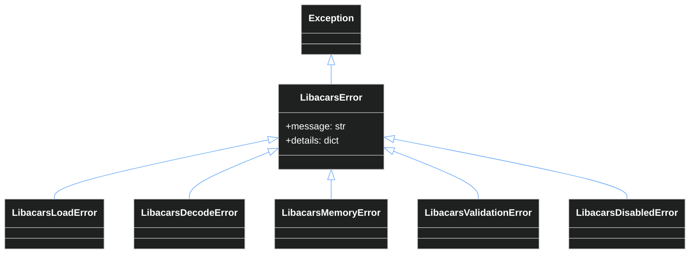

The libacars binding provides a comprehensive exception hierarchy and validation system to handle errors gracefully.

## Exception Hierarchy

All libacars exceptions inherit from `LibacarsError`:



### LibacarsError (Base)

Base exception for all libacars-related errors.

```python
from skyspy_common.libacars import LibacarsError

try:
    result = decode_acars_apps(label, text, raise_on_error=True)
except LibacarsError as e:
    print(f"Error: {e.message}")
    print(f"Details: {e.details}")
```

**Attributes:**

| Attribute | Type | Description |
| :--- | :--- | :--- |
| `message` | `str` | Human-readable error message |
| `details` | `dict` | Additional context about the error |

### LibacarsLoadError

Raised when the libacars shared library cannot be loaded.

```python
from skyspy_common.libacars import LibacarsLoadError

class LibacarsLoadError(LibacarsError):
    tried_paths: list[str]  # Paths that were attempted
```

**Common causes:**
- Library not installed
- Library in non-standard location
- Missing dependencies (e.g., libxml2)
- Architecture mismatch (x86 vs ARM)

**Example:**

```python
from skyspy_common.libacars import LibacarsLoadError, init_binding

try:
    init_binding()
except LibacarsLoadError as e:
    print(f"Failed to load library: {e.message}")
    print(f"Tried paths: {e.tried_paths}")
```

### LibacarsDecodeError

Raised when message decoding fails.

```python
from skyspy_common.libacars import LibacarsDecodeError

class LibacarsDecodeError(LibacarsError):
    label: Optional[str]           # Message label
    text_length: Optional[int]     # Length of input text
    direction: Optional[str]       # Message direction name
    original_error: Optional[Exception]  # Underlying exception
```

**Common causes:**
- Malformed message content
- Unsupported message format
- Timeout during decode
- Memory allocation failure

**Example:**

```python
from skyspy_common.libacars import decode_acars_apps, LibacarsDecodeError, MsgDir

try:
    result = decode_acars_apps(
        label="H1",
        text="invalid content",
        direction=MsgDir.AIR2GND,
        raise_on_error=True,
    )
except LibacarsDecodeError as e:
    print(f"Decode failed for label '{e.label}': {e.message}")
    if e.original_error:
        print(f"Caused by: {e.original_error}")
```

### LibacarsMemoryError

Raised when memory allocation fails in the C library.

```python
from skyspy_common.libacars import LibacarsMemoryError

class LibacarsMemoryError(LibacarsError):
    operation: Optional[str]  # Operation that failed (e.g., "vstring_new")
```

**Common causes:**
- System out of memory
- Memory leak in application
- Library state corruption

> **Warning**
>
> `LibacarsMemoryError` is a critical error. Consider restarting the process or reducing memory usage.

### LibacarsValidationError

Raised when input validation fails before calling the C library.

```python
from skyspy_common.libacars import LibacarsValidationError

class LibacarsValidationError(LibacarsError):
    field: Optional[str]   # Field that failed validation (e.g., "label", "text")
    value: Optional[str]   # The invalid value (truncated if too long)
```

**Common causes:**
- Empty or None label/text
- Label too long (max 4 characters)
- Text too long (max 10,000 characters)
- Null bytes in input strings

**Example:**

```python
from skyspy_common.libacars import decode_acars_apps, LibacarsValidationError

try:
    result = decode_acars_apps(
        label="",  # Invalid: empty label
        text="some text",
        raise_on_error=True,
    )
except LibacarsValidationError as e:
    print(f"Validation failed for '{e.field}': {e.message}")
    print(f"Invalid value: {e.value}")
```

### LibacarsDisabledError

Raised when libacars is disabled (by configuration or circuit breaker).

```python
from skyspy_common.libacars import LibacarsDisabledError

class LibacarsDisabledError(LibacarsError):
    reason: str  # Why disabled: "env", "circuit_open", etc.
    consecutive_errors: Optional[int]  # Error count if circuit-related
```

**Common causes:**
- `LIBACARS_DISABLED=true` environment variable
- Circuit breaker in OPEN state
- Library failed to load

**Example:**

```python
from skyspy_common.libacars import decode_acars_apps, LibacarsDisabledError

try:
    result = decode_acars_apps(label, text, raise_on_error=True)
except LibacarsDisabledError as e:
    if e.reason == "circuit_open":
        print(f"Circuit open after {e.consecutive_errors} errors")
    else:
        print(f"Disabled: {e.reason}")
```

## Validation Functions

Pre-validate inputs before attempting decode to avoid exceptions.

### validate_acars_message()

Validate a complete ACARS message (label and text).

```python
from skyspy_common.libacars import validate_acars_message

result = validate_acars_message(label="H1", text="some text")

if result.is_valid:
    # Safe to decode
    decoded = decode_acars_apps(label, text)
else:
    print(f"Invalid: {result.error_message}")
    print(f"Field: {result.field}")
```

### validate_label()

Validate only the message label.

```python
from skyspy_common.libacars import validate_label

result = validate_label("H1")
print(f"Valid: {result.is_valid}")

result = validate_label("TOOLONG")
print(f"Error: {result.error_message}")  # "Label too long (max 4 chars)"
```

### validate_text()

Validate only the message text.

```python
from skyspy_common.libacars import validate_text

result = validate_text("Normal message text")
print(f"Valid: {result.is_valid}")

result = validate_text("")
print(f"Error: {result.error_message}")  # "Text cannot be empty"
```

### validate_and_raise()

Validate and raise `LibacarsValidationError` if invalid.

```python
from skyspy_common.libacars import validate_and_raise, LibacarsValidationError

try:
    validate_and_raise(label="H1", text="message content")
    # Validation passed, safe to proceed
except LibacarsValidationError as e:
    # Handle validation error
    pass
```

### ValidationResult

Data class returned by validation functions.

```python
@dataclass
class ValidationResult:
    is_valid: bool
    error_message: Optional[str] = None
    field: Optional[str] = None  # "label" or "text"

    @property
    def as_tuple(self) -> tuple[bool, Optional[str]]:
        """Backwards-compatible tuple format."""
```

## Validation Constants

Use these constants for input length checks:

```python
from skyspy_common.libacars import (
    MAX_MESSAGE_LENGTH,  # 10,000 characters
    MAX_LABEL_LENGTH,    # 4 characters
    MIN_LABEL_LENGTH,    # 1 character
)

# Check before sending to validation
if len(text) > MAX_MESSAGE_LENGTH:
    print("Message too long, will be rejected")
```

## Error Handling Patterns

### Pattern 1: Silent Failure (Default)

Most common pattern - return `None` on any error:

```python
from skyspy_common.libacars import decode_acars_apps

# Returns None if anything fails
result = decode_acars_apps(label, text)

if result:
    process_decoded_message(result)
else:
    # Message couldn't be decoded (unsupported, invalid, or error)
    pass
```

### Pattern 2: Explicit Error Handling

Use `raise_on_error=True` for detailed error information:

```python
from skyspy_common.libacars import (
    decode_acars_apps,
    LibacarsError,
    LibacarsValidationError,
    LibacarsDecodeError,
    LibacarsDisabledError,
)

try:
    result = decode_acars_apps(label, text, raise_on_error=True)
    process_decoded_message(result)

except LibacarsValidationError as e:
    log.warning(f"Invalid input: {e.field} - {e.message}")

except LibacarsDisabledError as e:
    log.info(f"Decoding disabled: {e.reason}")

except LibacarsDecodeError as e:
    log.warning(f"Decode failed for {e.label}: {e.message}")

except LibacarsError as e:
    log.error(f"Unexpected error: {e}")
```

### Pattern 3: Pre-Validation

Validate inputs before attempting decode:

```python
from skyspy_common.libacars import (
    decode_acars_apps,
    validate_acars_message,
    is_available,
)

def safe_decode(label: str, text: str) -> Optional[dict]:
    # Check availability first
    if not is_available():
        return None

    # Validate inputs
    validation = validate_acars_message(label, text)
    if not validation.is_valid:
        log.debug(f"Skipping invalid message: {validation.error_message}")
        return None

    # Decode (still handle potential runtime errors)
    try:
        return decode_acars_apps(label, text)
    except Exception as e:
        log.error(f"Unexpected decode error: {e}")
        return None
```

### Pattern 4: Circuit Breaker Awareness

Handle circuit breaker states explicitly:

```python
from skyspy_common.libacars import (
    decode_acars_apps,
    get_circuit_breaker,
    CircuitState,
)

def decode_with_circuit_check(label: str, text: str) -> Optional[dict]:
    breaker = get_circuit_breaker()

    if breaker.state == CircuitState.OPEN:
        # Circuit is open, skip decode and return cached/fallback
        log.info("Circuit open, using fallback")
        return get_fallback_result(label, text)

    result = decode_acars_apps(label, text)

    if breaker.state == CircuitState.HALF_OPEN:
        log.info("Circuit recovering, decode attempted")

    return result
```

## Error Recovery

### Automatic Recovery

The circuit breaker handles automatic recovery:

```python
from skyspy_common.libacars import get_circuit_breaker

breaker = get_circuit_breaker()

# Check recovery status
stats = breaker.get_stats()
print(f"Recovery attempts: {stats['recovery_attempts']}")
print(f"Successful recoveries: {stats['successful_recoveries']}")
```

### Manual Recovery

Force reset after fixing issues:

```python
from skyspy_common.libacars import reset_error_state, reset_circuit_breaker

# Reset error counters (keeps circuit breaker)
reset_error_state()

# Full reset (recreates circuit breaker)
reset_circuit_breaker()
```

### Failure Analysis

Get insights into failure patterns:

```python
from skyspy_common.libacars import get_circuit_breaker

breaker = get_circuit_breaker()
analysis = breaker.get_failure_analysis()

print(f"Likely cause: {analysis['likely_cause']}")
print(f"Percentage: {analysis['likely_cause_percentage']}%")
print(f"Recommendation: {analysis['recommendation']}")
print(f"Breakdown: {analysis['failure_breakdown']}")
```

## Next Steps

- **Observability** - Monitor with metrics and health checks. [Learn more →](/docs/libacars/observability)
- **Configuration** - Configure error thresholds and recovery. [Learn more →](/docs/libacars/configuration)
