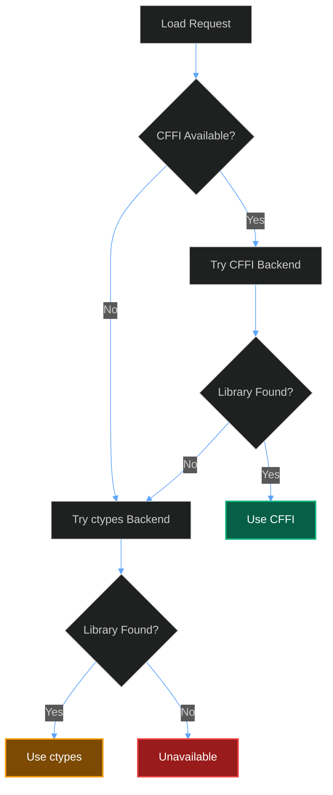

The libacars Python binding requires both the native C library and Python dependencies to function.

## Native Library Installation

The binding requires **libacars-2** to be installed on your system. The library is loaded at runtime, so installation is required before using the Python binding.

### macOS (Homebrew)

```bash
# Install via Homebrew
brew install libacars

# Verify installation
ls /opt/homebrew/lib/libacars-2.dylib
```

The library is typically installed at `/opt/homebrew/lib/libacars-2.dylib` on Apple Silicon Macs.

### Debian / Ubuntu

```bash
# Add the SDR Enthusiasts repository
sudo bash -c "$(wget -q -O - https://raw.githubusercontent.com/sdr-enthusiasts/repo/main/install.sh)"

# Install libacars
sudo apt update
sudo apt install libacars2

# Verify installation
ls /usr/lib/x86_64-linux-gnu/libacars-2.so
```

### Build from Source

```bash
# Install build dependencies
sudo apt install build-essential cmake libxml2-dev zlib1g-dev

# Clone and build
git clone https://github.com/szpajder/libacars.git
cd libacars
mkdir build && cd build
cmake ..
make
sudo make install

# Update library cache
sudo ldconfig
```

### Docker

If using Docker, include libacars in your image:

```dockerfile
FROM python:3.11-slim

# Install libacars
RUN apt-get update && apt-get install -y \
    libacars2 \
    && rm -rf /var/lib/apt/lists/*

# Your application setup...
```

## Library Search Paths

The binding searches for the library in these locations (in order):

| Order | Path | Platform |
| :--- | :--- | :--- |
| 1 | System library path via `find_library()` | All |
| 2 | `libacars-2.so` | Linux |
| 3 | `libacars-2.so.2` | Linux |
| 4 | `/usr/local/lib/libacars-2.so` | Linux |
| 5 | `/usr/lib/libacars-2.so` | Linux |
| 6 | `/usr/lib/x86_64-linux-gnu/libacars-2.so` | Debian/Ubuntu |
| 7 | `/opt/homebrew/lib/libacars-2.dylib` | macOS (Apple Silicon) |

## Python Dependencies

### Required

The core binding has no required Python dependencies beyond the standard library. It uses `ctypes` which is built into Python.

### Recommended

For optimal performance, install the `cffi` package:

```bash
pip install cffi
```

> **Performance Tip**
>
> CFFI provides better performance than ctypes for repeated FFI calls. The binding automatically uses CFFI when available.

### Full Installation

```bash
# Install skyspy_common with all dependencies
pip install -e ./skyspy_common

# Or install with development dependencies
pip install -e "./skyspy_common[dev]"
```

## Backend Selection

The binding automatically selects the best available backend:



### Checking the Backend

```python
from skyspy_common.libacars import is_available, get_backend

if is_available():
    backend = get_backend()
    print(f"Using backend: {backend}")  # "cffi" or "ctypes"
else:
    print("libacars not available")
```

## Verifying Installation

Run this script to verify your installation:

```python
from skyspy_common.libacars import (
    is_available,
    get_backend,
    get_health,
    decode_acars_apps,
    MsgDir,
)

print("=== libacars Installation Check ===")
print(f"Available: {is_available()}")
print(f"Backend: {get_backend()}")
print(f"Health: {get_health()}")

# Test decode
if is_available():
    # Simple test message
    result = decode_acars_apps(
        label="H1",
        text="TEST",
        direction=MsgDir.UNKNOWN,
    )
    print(f"Test decode: {'OK' if result is None else 'Decoded'}")
```

Expected output when properly installed:

```
=== libacars Installation Check ===
Available: True
Backend: cffi
Health: {'healthy': True, 'available': True, 'backend': 'cffi', 'circuit_state': 'closed'}
Test decode: OK
```

## Troubleshooting

### Library not found

If `is_available()` returns `False`:

1. Verify the library is installed:
   ```bash
   # Linux
   ldconfig -p | grep libacars

   # macOS
   ls /opt/homebrew/lib/libacars*
   ```

2. Check if Python can find it:
   ```python
   import ctypes.util
   print(ctypes.util.find_library("acars-2"))
   ```

3. Set `LD_LIBRARY_PATH` (Linux) or `DYLD_LIBRARY_PATH` (macOS) if needed:
   ```bash
   export LD_LIBRARY_PATH=/usr/local/lib:$LD_LIBRARY_PATH
   ```

### CFFI not loading

If the backend shows "ctypes" but you have CFFI installed:

1. Verify CFFI installation:
   ```bash
   python -c "import cffi; print(cffi.__version__)"
   ```

2. Check for import errors:
   ```python
   try:
       from cffi import FFI
       print("CFFI OK")
   except ImportError as e:
       print(f"CFFI error: {e}")
   ```

### Symbol errors on load

If you see "undefined symbol" errors:

1. Check libacars version (requires libacars 2.x):
   ```bash
   pkg-config --modversion libacars-2
   ```

2. Ensure you have the correct version installed
3. Try rebuilding from source with the latest version

## Next Steps

- **API Reference** - Learn the decoding functions and data types. [Learn more →](/docs/libacars/api)
- **Configuration** - Configure caching, timeouts, and more. [Learn more →](/docs/libacars/configuration)
