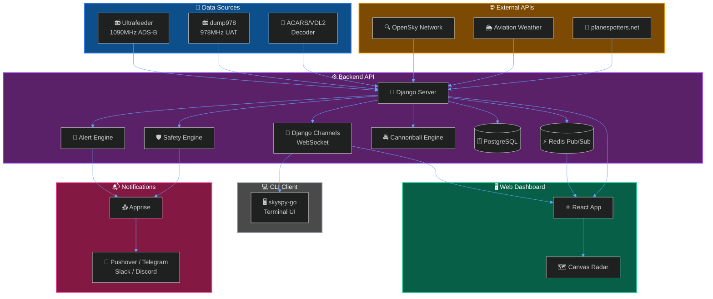
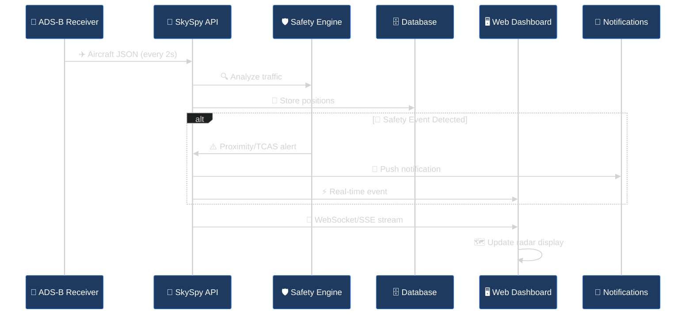

SkySpy is a real-time aircraft tracking platform that captures ADS-B position data from 1090MHz Mode S and 978MHz UAT receivers. It displays aircraft on an interactive map, monitors safety conditions, and provides custom alerts, weather integration, and push notifications.

## What You Can Do with SkySpy

- **Track Aircraft** - Monitor live positions with distance, altitude, speed, and climb rate from your ADS-B receiver
- **Detect Safety Events** - Get alerts for TCAS RA/TA, proximity warnings, and emergency squawks (7700/7600/7500)
- **Create Custom Alerts** - Build rules with AND/OR logic on ICAO, callsign, squawk, altitude, distance, and more
- **Cannonball Mode** - Law enforcement aircraft detection with pattern analysis, known LE database, and mobile threat tracking
- **Decode ACARS Messages** - Integrated libacars support for decoding ACARS and VDL2 datalink messages
- **View Weather Data** - Access METARs, TAFs, PIREPs, SIGMETs, and G-AIRMETs for your area
- **Receive Notifications** - Push alerts via 80+ services including Pushover, Telegram, Slack, and Discord
- **Explore Aircraft Data** - Look up registrations, photos, airframe details, and operator information
- **Terminal Interface** - Native Go CLI client (skyspy-go) for headless monitoring and scripting

## Architecture

SkySpy consists of two main components that work together to provide real-time aircraft tracking:

> 📘 **Data Sources**
>
> SkySpy integrates with [Ultrafeeder](https://github.com/sdr-enthusiasts/docker-adsb-ultrafeeder) (readsb/dump1090) for ADS-B data, dump978 for UAT data, libacars for ACARS/VDL2 decoding, and external APIs like OpenSky Network and Aviation Weather Center for enriched metadata.

## How It Works

## Cannonball Mode

Cannonball Mode is a specialized law enforcement aircraft detection system designed for mobile situational awareness. It provides real-time monitoring and pattern analysis for LE aircraft in your vicinity.

**Key Capabilities:**

- **Real-time LE Aircraft Detection** - Automatic identification of law enforcement aircraft using a curated database of known ICAO addresses and registration patterns
- **Pattern Analysis** - Detects surveillance behaviors including circling, loitering, grid search patterns, and pursuit maneuvers
- **Mobile Threat Tracking** - WebSocket-based updates optimized for mobile devices with low-latency position streaming
- **Multiple Display Modes** - Choose from Single aircraft focus, Grid overview, Radar sweep, or HUD overlay modes
- **Voice Announcements** - Audio alerts for new detections, threat level changes, and pattern identification
- **Haptic Feedback** - Vibration alerts on supported mobile devices for discreet notifications

> 📘 **Cannonball Database**
>
> The LE aircraft database includes federal, state, and local law enforcement aircraft registrations. The database is regularly updated and can be extended with custom entries.

## Key Features at a Glance

| Feature | Description | Learn More |
| :--- | :--- | :--- |
| **Live Tracking** | Real-time positions updated every 2 seconds | [Real-Time API](/docs/real-time-api) |
| **Safety Monitoring** | TCAS, proximity, and emergency detection | [Safety & Alerts](/docs/safety-and-alerts) |
| **Cannonball Mode** | LE aircraft detection with pattern analysis | [Cannonball Mode](/docs/cannonball-mode) |
| **Custom Rules** | Flexible AND/OR condition builder | [Safety & Alerts](/docs/safety-and-alerts#custom-alert-rules) |
| **WebSocket Streaming** | Real-time updates via Django Channels | [WebSocket API](/docs/websocket-api) |
| **ACARS Decoding** | Decode datalink messages with libacars | [ACARS Integration](/docs/acars) |
| **CLI Client** | Native Go terminal interface (skyspy-go) | [CLI Documentation](/docs/cli) |
| **Weather Integration** | METARs, TAFs, PIREPs from AWC | [Real-Time API](/docs/real-time-api#request-response-api) |
| **Photo Lookup** | Aircraft photos via planespotters.net | [Configuration](/docs/configuration#photo-cache) |

## Components

### Backend (Django)

The SkySpy backend is built on Django with Django Channels for WebSocket support. It handles:

- REST API endpoints for aircraft data, alerts, and configuration
- WebSocket connections via Django Channels for real-time streaming
- Background task processing with Celery
- ACARS message decoding via libacars integration
- Cannonball Mode pattern analysis engine

### CLI Client (skyspy-go)

A native Go terminal client that provides:

- Real-time aircraft display in the terminal
- Spectrum analyzer visualization
- Audio monitoring with VU meters
- Configurable themes and display modes
- Headless operation for scripting and automation

## Next Steps

<Cards columns={3}>
  <Card title="Quick Start" icon="fa-rocket" href="/docs/quick-start">
    Deploy with Docker Compose in minutes
  </Card>
  <Card title="Configuration" icon="fa-cog" href="/docs/configuration">
    Environment variables & settings
  </Card>
  <Card title="Safety & Alerts" icon="fa-shield-alt" href="/docs/safety-and-alerts">
    TCAS, proximity, emergency detection
  </Card>
  <Card title="CLI Client" icon="fa-terminal" href="/docs/cli">
    Terminal-based tracking with skyspy-go
  </Card>
  <Card title="Real-Time API" icon="fa-bolt" href="/docs/real-time-api">
    Socket.IO & SSE streaming
  </Card>
  <Card title="Recipes" icon="fa-book" href="/docs/recipes">
    Integration examples & tutorials
  </Card>
</Cards>

---

> 📘 Info
>
> **New to ADS-B?** ADS-B (Automatic Dependent Surveillance-Broadcast) is a surveillance technology where aircraft broadcast their position, altitude, and velocity. With a simple SDR receiver, you can track aircraft within 200+ miles of your location.
