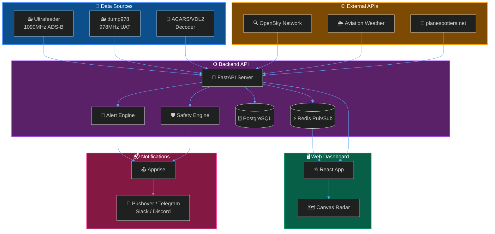
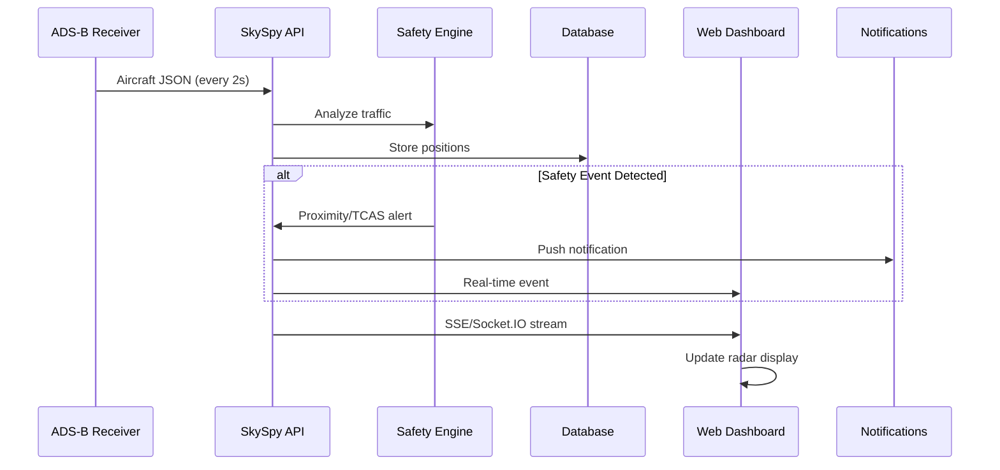

SkySpy is a real-time aircraft tracking platform that captures ADS-B position data from 1090MHz Mode S and 978MHz UAT receivers. It displays aircraft on an interactive map, monitors safety conditions, and provides custom alerts, weather integration, and push notifications.

## What You Can Do with SkySpy

<CardGroup cols={2}>
  <Card title="Track Aircraft" icon="plane">
    Monitor live positions with distance, altitude, speed, and climb rate from your ADS-B receiver
  </Card>
  <Card title="Detect Safety Events" icon="triangle-exclamation">
    Get alerts for TCAS RA/TA, proximity warnings, and emergency squawks (7700/7600/7500)
  </Card>
  <Card title="Create Custom Alerts" icon="bell">
    Build rules with AND/OR logic on ICAO, callsign, squawk, altitude, distance, and more
  </Card>
  <Card title="View Weather Data" icon="cloud-sun">
    Access METARs, TAFs, PIREPs, SIGMETs, and G-AIRMETs for your area
  </Card>
  <Card title="Receive Notifications" icon="mobile">
    Push alerts via 80+ services including Pushover, Telegram, Slack, and Discord
  </Card>
  <Card title="Explore Aircraft Data" icon="database">
    Look up registrations, photos, airframe details, and operator information
  </Card>
</CardGroup>

## Architecture

SkySpy consists of two main components that work together to provide real-time aircraft tracking:

> 📘 **Data Sources**
>
> SkySpy integrates with [Ultrafeeder](https://github.com/sdr-enthusiasts/docker-adsb-ultrafeeder) (readsb/dump1090) for ADS-B data, dump978 for UAT data, and external APIs like OpenSky Network and Aviation Weather Center for enriched metadata.

## How It Works

## Key Features at a Glance

| Feature | Description | Learn More |
| :--- | :--- | :--- |
| **Live Tracking** | Real-time positions updated every 2 seconds | [Real-Time API](/docs/real-time-api) |
| **Safety Monitoring** | TCAS, proximity, and emergency detection | [Safety & Alerts](/docs/safety-and-alerts) |
| **Custom Rules** | Flexible AND/OR condition builder | [Safety & Alerts](/docs/safety-and-alerts#custom-alert-rules) |
| **Multi-Protocol** | SSE and Socket.IO streaming options | [SSE API](/docs/sse) |
| **Weather Integration** | METARs, TAFs, PIREPs from AWC | [Real-Time API](/docs/real-time-api#request-response-api) |
| **Photo Lookup** | Aircraft photos via planespotters.net | [Configuration](/docs/configuration#photo-cache) |

## Next Steps

<Cards columns={2}>
  <Card title="Quick Start" icon="rocket" href="/docs/quick-start">
    Deploy SkySpy with Docker Compose in minutes
  </Card>
  <Card title="Configuration" icon="gear" href="/docs/configuration">
    Customize receiver settings, alerts, and integrations
  </Card>
  <Card title="Safety & Alerts" icon="bell" href="/docs/safety-and-alerts">
    Set up custom alert rules and notifications
  </Card>
  <Card title="Real-Time API" icon="bolt" href="/docs/real-time-api">
    Connect to the SSE stream for live aircraft data
  </Card>
</Cards>

---

<Info>
**New to ADS-B?** ADS-B (Automatic Dependent Surveillance-Broadcast) is a surveillance technology where aircraft broadcast their position, altitude, and velocity. With a simple SDR receiver, you can track aircraft within 200+ miles of your location.
</Info>
