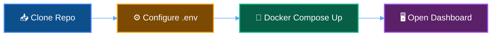
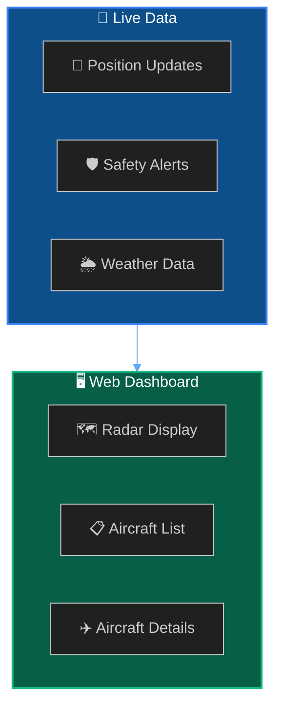

Deploy SkySpy using Docker Compose in under 5 minutes.



## Prerequisites

- **Docker & Docker Compose** — [Install Docker](https://docs.docker.com/get-docker/)
- **An ADS-B receiver** — Running [Ultrafeeder](https://github.com/sdr-enthusiasts/docker-adsb-ultrafeeder), readsb, or dump1090 on your network

## Installation

<Tabs>
  <Tab title="Docker Compose (Recommended)">

**1. Clone the repository**

```bash
git clone https://github.com/your-org/skyspy.git
cd skyspy
```

**2. Configure environment**

Copy the sample environment file and edit it with your settings:

```bash
cp .env.test.sample .env
```

Open `.env` and set these required variables:

| Variable | Description | Example |
| :--- | :--- | :--- |
| `FEEDER_LAT` | Your receiver's latitude | `47.9377` |
| `FEEDER_LON` | Your receiver's longitude | `-121.9687` |
| `ULTRAFEEDER_HOST` | Hostname or IP of your ADS-B receiver | `ultrafeeder` or `192.168.1.100` |

> **Finding your coordinates**
>
> Use [Google Maps](https://maps.google.com) — right-click your location and copy the coordinates.

**3. Start the services**

```bash
docker compose up -d
```

Wait for the containers to start (usually 10-30 seconds), then verify they're running:

```bash
docker compose ps
```

  </Tab>
  <Tab title="Local Development">

For contributors who want to run services without Docker:

**1. Clone and configure**

```bash
git clone https://github.com/your-org/skyspy.git
cd skyspy
cp .env.test.sample .env
# Edit .env with your settings
```

**2. Start the backend**

```bash
cd adsb-api
pip install -e ".[dev]"
uvicorn app.main:app --host 0.0.0.0 --port 5000 --reload
```

**3. Start the frontend**

```bash
cd web
npm install
npm run dev
```

  </Tab>
</Tabs>

## Access the Dashboard

Once the containers are running, you can access:

- **Web Dashboard** - Interactive aircraft radar at **localhost:3000**. [Open Dashboard →](http://localhost:3000)
- **API Documentation** - Swagger/OpenAPI reference at **localhost:5000/docs**. [View Docs →](http://localhost:5000/docs)

> 👍 Success
>
> **You should see aircraft appearing on the map within a few seconds** if your receiver is working properly.

## What You'll See



The dashboard shows:
- **Radar Display** — Aircraft positions on an interactive map
- **Aircraft List** — Sortable table of all tracked aircraft
- **Detail Panel** — Click any aircraft for photos, flight info, and track history
- **Safety Alerts** — Real-time notifications for TCAS, proximity, and emergencies

## Troubleshooting

### No aircraft appearing on the map

1. Verify your receiver is running and accessible:
   ```bash
   curl http://ULTRAFEEDER_HOST/tar1090/data/aircraft.json
   ```
2. Check that `ULTRAFEEDER_HOST` in your `.env` matches your receiver's address
3. View the API logs for connection errors:
   ```bash
   docker compose logs adsb-api
   ```

### Container fails to start

1. Check the logs for the failing container:
   ```bash
   docker compose logs <service-name>
   ```
2. Verify your `.env` file has all required variables set
3. Ensure ports 3000 and 5000 are not in use by other services

### Database connection errors

1. Ensure PostgreSQL container is running:
   ```bash
   docker compose ps postgres
   ```
2. Check database logs:
   ```bash
   docker compose logs postgres
   ```
3. Verify `DATABASE_URL` in your `.env` matches the Docker service name

## Deployment Checklist

- [ ] Docker and Docker Compose installed
- [ ] ADS-B receiver accessible on network
- [ ] `.env` file configured with coordinates
- [ ] Ports 3000 and 5000 available
- [ ] Containers running (`docker compose ps`)
- [ ] Aircraft visible on dashboard

## Next Steps

- **Configuration** - Customize polling, safety thresholds, and integrations. [Learn more →](/docs/configuration)
- **Safety & Alerts** - Set up custom alert rules and notifications. [Learn more →](/docs/safety-and-alerts)
