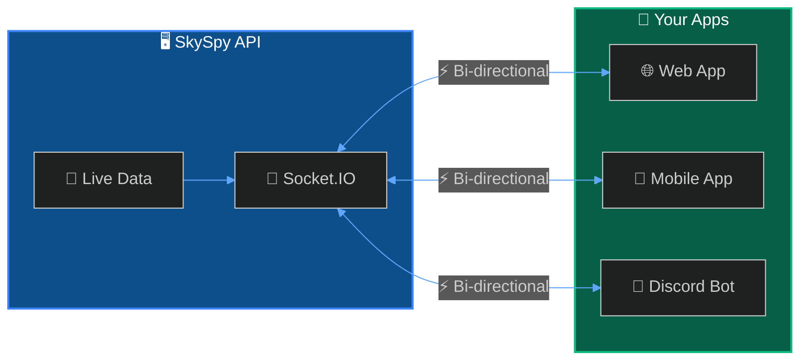

The SkySpy Real-Time API uses Socket.IO to stream aircraft positions, safety events, and aviation data to your application in real-time.



## Quick Start

<Steps>
  <Step title="Install Socket.IO client">
    ```bash
    npm install socket.io-client
    ```
  </Step>
  <Step title="Connect and subscribe">
    ```javascript
    import { io } from 'socket.io-client';

    const socket = io('http://localhost:5000', {
      path: '/socket.io/socket.io',
      query: { topics: 'aircraft,safety' },
      transports: ['websocket', 'polling']
    });

    socket.on('aircraft:update', (data) => {
      console.log('Aircraft update:', data.aircraft);
    });

    socket.on('safety:event', (event) => {
      console.log('Safety alert:', event.message);
    });
    ```
  </Step>
</Steps>

## Connection Settings

| Setting | Value |
| :--- | :--- |
| **URL** | `http://<host>:5000` |
| **Path** | `/socket.io/socket.io` |
| **Transports** | `websocket`, `polling` |
| **Query: topics** | Comma-separated list of topics |

## Topics

<CardGroup cols={3}>
  <Card title="✈️ aircraft" icon="plane">
    Live positions and metadata
  </Card>
  <Card title="🛡️ safety" icon="shield">
    TCAS, proximity, emergencies
  </Card>
  <Card title="🔔 alerts" icon="bell">
    Custom rule matches
  </Card>
  <Card title="🗺️ airspace" icon="map">
    G-AIRMET advisories
  </Card>
  <Card title="📡 acars" icon="message">
    ACARS/VDL2 messages
  </Card>
  <Card title="🌍 all" icon="globe">
    Subscribe to everything
  </Card>
</CardGroup>

---

## Comparison: Socket.IO vs SSE

| Feature | Socket.IO | SSE |
| :--- | :--- | :--- |
| **Direction** | Bi-directional | Server → Client only |
| **Request/Response** | ✅ Yes | ❌ No |
| **Weather API** | ✅ Yes | ❌ No |
| **Browser Support** | Requires library | Native `EventSource` |
| **Best For** | Full-featured apps | Simple dashboards |

<Info>
Use **Socket.IO** when you need the request/response API for weather data or bi-directional communication. Use **[SSE](/docs/sse)** for simple, read-only monitoring.
</Info>

---

## Implementation

<Cards columns={2}>
  <Card title="📤 Events" icon="signal-stream" href="/docs/real-time-api/events">
    Aircraft, safety, alert, and ACARS events
  </Card>
  <Card title="🔄 Request/Response" icon="arrows-rotate" href="/docs/real-time-api/requests">
    Fetch weather, airspace, and aircraft info
  </Card>
  <Card title="⚛️ React Hook" icon="react" href="/docs/real-time-api/react-hook">
    useSkySpySocket hook for React apps
  </Card>
</Cards>

---

## Next Steps

<Cards columns={2}>
  <Card title="SSE Streaming" icon="signal-stream" href="/docs/sse">
    Lightweight alternative using Server-Sent Events
  </Card>
  <Card title="Safety & Alerts" icon="bell" href="/docs/safety-and-alerts">
    Configure custom alert rules
  </Card>
</Cards>
