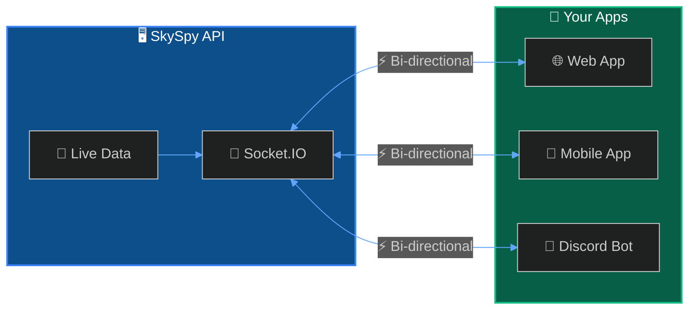
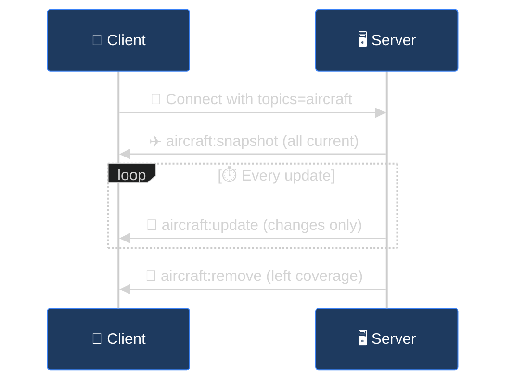
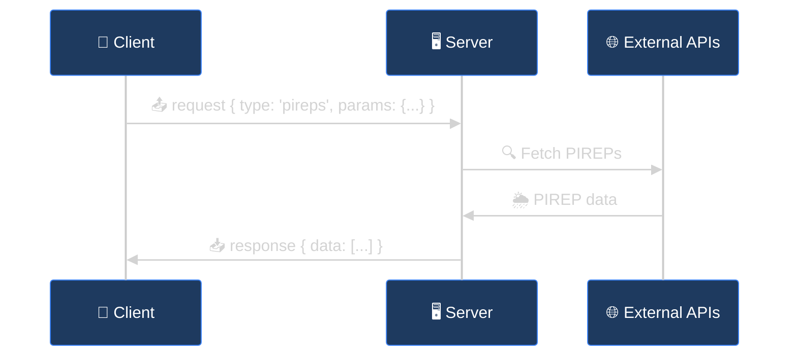

The SkySpy Real-Time API uses Socket.IO to stream aircraft positions, safety events, and aviation data to your application in real-time.



## Quick Start

<Steps>
  <Step title="Install Socket.IO client">
    ```bash
    npm install socket.io-client
    ```
  </Step>
  <Step title="Connect and subscribe">
    ```javascript
    import { io } from 'socket.io-client';

    const socket = io('http://localhost:5000', {
      path: '/socket.io/socket.io',
      query: { topics: 'aircraft,safety' },
      transports: ['websocket', 'polling']
    });

    socket.on('aircraft:update', (data) => {
      console.log('Aircraft update:', data.aircraft);
    });

    socket.on('safety:event', (event) => {
      console.log('Safety alert:', event.message);
    });
    ```
  </Step>
</Steps>

## Connection Settings

| Setting | Value |
| :--- | :--- |
| **URL** | `http://<host>:5000` |
| **Path** | `/socket.io/socket.io` |
| **Transports** | `websocket`, `polling` |
| **Query: topics** | Comma-separated list of topics to subscribe |

## Topics

Subscribe to specific data streams via the `topics` query parameter or dynamically after connecting.

<CardGroup cols={3}>
  <Card title="aircraft" icon="plane">
    Live positions and metadata
  </Card>
  <Card title="safety" icon="shield">
    TCAS, proximity, emergencies
  </Card>
  <Card title="alerts" icon="bell">
    Custom rule matches
  </Card>
  <Card title="airspace" icon="map">
    G-AIRMET advisories
  </Card>
  <Card title="acars" icon="message">
    ACARS/VDL2 messages
  </Card>
  <Card title="all" icon="globe">
    Subscribe to everything
  </Card>
</CardGroup>

| Topic | Events | Description |
| :--- | :--- | :--- |
| `aircraft` | `aircraft:snapshot`, `aircraft:update`, `aircraft:remove` | Live positions and metadata |
| `safety` | `safety:event` | TCAS, proximity, and emergency alerts |
| `alerts` | `alert:triggered` | Custom alert rule matches |
| `airspace` | `airspace:*` | G-AIRMET advisories |
| `acars` | `acars:message` | ACARS/VDL2 messages |
| `all` | All events | Subscribe to everything |

<Accordion title="Change subscriptions dynamically">

```javascript
// Add a subscription
socket.emit('subscribe', { topics: ['acars'] });

// Remove a subscription
socket.emit('unsubscribe', { topics: ['safety'] });
```

</Accordion>

---

## Events

### Aircraft Events

Subscribe to `aircraft` topic.



<Tabs>
  <Tab title="aircraft:snapshot">
    Sent immediately on connection. Contains all currently tracked aircraft.

    ```json
    {
      "aircraft": [
        {
          "hex": "A12345",
          "flight": "UAL123",
          "lat": 47.6062,
          "lon": -122.3321,
          "alt": 35000,
          "gs": 450,
          "track": 270,
          "vr": -500,
          "squawk": "1200",
          "category": "A3",
          "type": "B738",
          "military": false,
          "emergency": false
        }
      ],
      "count": 1,
      "timestamp": "2024-01-15T12:00:00Z"
    }
    ```
  </Tab>
  <Tab title="aircraft:update">
    Emitted when aircraft data changes. Contains only changed fields.

    ```json
    {
      "aircraft": [
        {
          "hex": "A12345",
          "alt": 35100,
          "vr": 1200
        }
      ],
      "timestamp": "2024-01-15T12:00:01Z"
    }
    ```
  </Tab>
  <Tab title="aircraft:remove">
    Emitted when aircraft leave coverage.

    ```json
    {
      "icaos": ["A12345", "B67890"],
      "timestamp": "2024-01-15T12:05:00Z"
    }
    ```
  </Tab>
</Tabs>

#### Aircraft Object Fields

| Field | Type | Description |
| :--- | :--- | :--- |
| `hex` | string | ICAO 24-bit address |
| `flight` | string | Callsign (if available) |
| `lat`, `lon` | number | Position coordinates |
| `alt` | number | Altitude in feet |
| `gs` | number | Ground speed in knots |
| `track` | number | Track heading in degrees |
| `vr` | number | Vertical rate in ft/min |
| `squawk` | string | Transponder code |
| `category` | string | Aircraft size category |
| `type` | string | ICAO aircraft type code |
| `military` | boolean | Military aircraft flag |
| `emergency` | boolean | Emergency squawk detected |

### Safety Events

Subscribe to `safety` topic.

#### `safety:event`

| Field | Type | Values |
| :--- | :--- | :--- |
| `event_type` | string | `proximity_conflict`, `tcas_ra_detected`, `extreme_vertical_rate`, `emergency_squawk` |
| `severity` | string | `warning`, `critical` |
| `icao` | string | Primary aircraft ICAO |
| `icao_2` | string | Secondary aircraft (for conflicts) |
| `message` | string | Human-readable description |
| `details` | object | Event-specific context |

```json
{
  "event_type": "proximity_conflict",
  "severity": "critical",
  "icao": "A12345",
  "icao_2": "B67890",
  "callsign": "UAL123",
  "message": "Proximity conflict: 0.5nm lateral, 500ft vertical separation",
  "details": {
    "distance_nm": 0.5,
    "altitude_diff_ft": 500
  },
  "timestamp": "2024-01-15T12:00:00Z"
}
```

### Alert Events

Subscribe to `alerts` topic. Fired when custom alert rules match.

#### `alert:triggered`

```json
{
  "rule_id": 1,
  "rule_name": "Low Altitude Alert",
  "icao": "A12345",
  "callsign": "UAL123",
  "message": "Aircraft below 3000ft within 10nm",
  "priority": "warning",
  "aircraft_data": {
    "hex": "A12345",
    "alt": 2500,
    "lat": 47.6,
    "lon": -122.3
  }
}
```

### ACARS Events

Subscribe to `acars` topic. Requires ACARS receiver configured.

#### `acars:message`

```json
{
  "source": "acars",
  "icao_hex": "A12345",
  "registration": "N12345",
  "label": "H1",
  "text": "DEPARTURE CLEARANCE CONFIRMED SEA",
  "frequency": 130.025,
  "signal_level": -42.5
}
```

---

## Request/Response API

Fetch on-demand data (weather, airspace, aircraft info) using an RPC-style pattern over the same Socket.IO connection.



### Making Requests

```javascript
import { v4 as uuid } from 'uuid';

function request(socket, type, params) {
  return new Promise((resolve, reject) => {
    const request_id = uuid();

    const onResponse = (data) => {
      if (data.request_id === request_id) {
        socket.off('response', onResponse);
        socket.off('error', onError);
        resolve(data.data);
      }
    };

    const onError = (err) => {
      if (err.request_id === request_id) {
        socket.off('response', onResponse);
        socket.off('error', onError);
        reject(new Error(err.error));
      }
    };

    socket.on('response', onResponse);
    socket.on('error', onError);
    socket.emit('request', { type, request_id, params });
  });
}

// Usage
const pireps = await request(socket, 'pireps', {
  lat: 47.5,
  lon: -122.3,
  radius: 150
});
```

### Available Requests

<Tabs>
  <Tab title="Weather">
    | Type | Required | Optional | Description |
    | :--- | :--- | :--- | :--- |
    | `metars` | `lat`, `lon` | `radius`, `hours`, `limit` | METARs for airports in area |
    | `metar` | `station` | `hours` | Single station METAR |
    | `taf` | `station` | — | Terminal Aerodrome Forecast |
    | `pireps` | `lat`, `lon` | `radius`, `hours` | Pilot Reports (turbulence, icing) |
    | `sigmets` | — | `hazard`, `lat`, `lon`, `radius` | Active SIGMETs |
  </Tab>
  <Tab title="Airspace">
    | Type | Required | Optional | Description |
    | :--- | :--- | :--- | :--- |
    | `airspaces` | `lat`, `lon` | `hazard` | G-AIRMET advisories for location |
    | `airspace-boundaries` | — | `lat`, `lon`, `radius`, `class` | Static airspace geometry |
  </Tab>
  <Tab title="Navigation">
    | Type | Required | Optional | Description |
    | :--- | :--- | :--- | :--- |
    | `airports` | `lat`, `lon` | `radius`, `limit` | Nearby airports |
    | `navaids` | `lat`, `lon` | `radius`, `limit`, `type` | Nearby VORs/NDBs |
  </Tab>
  <Tab title="Aircraft">
    | Type | Required | Optional | Description |
    | :--- | :--- | :--- | :--- |
    | `aircraft-info` | `icao` | — | Static database info (registration, type, operator) |
  </Tab>
</Tabs>

---

## React Integration

<AccordionGroup>
  <Accordion title="useSkySpySocket hook" icon="react" defaultOpen>
    ```typescript
    import { useEffect, useState, useCallback, useRef } from 'react';
    import { io, Socket } from 'socket.io-client';

    interface Aircraft {
      hex: string;
      flight?: string;
      lat: number;
      lon: number;
      alt: number;
      gs: number;
      track: number;
      vr: number;
    }

    interface UseSkySpySocketOptions {
      url?: string;
      topics?: string;
    }

    export function useSkySpySocket(options: UseSkySpySocketOptions = {}) {
      const { url = 'http://localhost:5000', topics = 'aircraft' } = options;
      const [connected, setConnected] = useState(false);
      const [aircraft, setAircraft] = useState<Map<string, Aircraft>>(new Map());
      const socketRef = useRef<Socket | null>(null);

      useEffect(() => {
        const socket = io(url, {
          path: '/socket.io/socket.io',
          query: { topics },
          transports: ['websocket', 'polling']
        });

        socketRef.current = socket;

        socket.on('connect', () => setConnected(true));
        socket.on('disconnect', () => setConnected(false));

        socket.on('aircraft:snapshot', (data) => {
          setAircraft(new Map(data.aircraft.map((a: Aircraft) => [a.hex, a])));
        });

        socket.on('aircraft:update', (data) => {
          setAircraft((prev) => {
            const next = new Map(prev);
            for (const a of data.aircraft) {
              const existing = next.get(a.hex);
              next.set(a.hex, { ...existing, ...a });
            }
            return next;
          });
        });

        socket.on('aircraft:remove', (data) => {
          setAircraft((prev) => {
            const next = new Map(prev);
            for (const icao of data.icaos) {
              next.delete(icao);
            }
            return next;
          });
        });

        return () => {
          socket.disconnect();
        };
      }, [url, topics]);

      return {
        connected,
        aircraft: Array.from(aircraft.values()),
        socket: socketRef.current
      };
    }
    ```
  </Accordion>

  <Accordion title="Usage example" icon="code">
    ```tsx
    function AircraftList() {
      const { connected, aircraft } = useSkySpySocket({
        topics: 'aircraft,safety'
      });

      if (!connected) {
        return <div>Connecting...</div>;
      }

      return (
        <ul>
          {aircraft.map((a) => (
            <li key={a.hex}>
              {a.flight || a.hex} - {a.alt}ft @ {a.gs}kts
            </li>
          ))}
        </ul>
      );
    }
    ```
  </Accordion>
</AccordionGroup>

## Comparison: Socket.IO vs SSE

| Feature | Socket.IO | SSE |
| :--- | :--- | :--- |
| **Direction** | Bi-directional | Server → Client only |
| **Request/Response** | Yes | No |
| **Weather API** | Yes | No |
| **Browser Support** | Requires library | Native `EventSource` |
| **Reconnection** | Automatic | Automatic |
| **Best For** | Full-featured apps | Simple dashboards |

<Info>
Use **Socket.IO** when you need the request/response API for weather data or bi-directional communication. Use **[SSE](/docs/sse)** for simple, read-only monitoring.
</Info>

## Next Steps

<Cards columns={2}>
  <Card title="SSE Streaming" icon="signal-stream" href="/docs/sse">
    Lightweight alternative using Server-Sent Events
  </Card>
  <Card title="Safety & Alerts" icon="bell" href="/docs/safety-and-alerts">
    Configure custom alert rules
  </Card>
</Cards>
