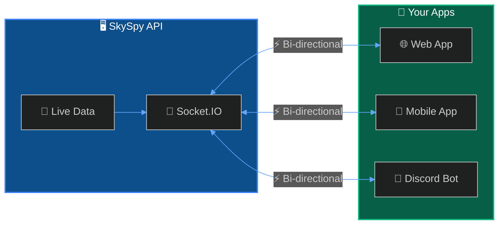

The SkySpy Real-Time API uses Socket.IO to stream aircraft positions, safety events, and aviation data to your application in real-time.



## Quick Start

**1. Install the client library**

```bash npm
npm install socket.io-client
```
```bash pip
pip install python-socketio
```

**2. Connect and subscribe**

```javascript JavaScript
import { io } from 'socket.io-client';

const socket = io('http://localhost:5000', {
  path: '/socket.io/socket.io',
  query: { topics: 'aircraft,safety' },
  transports: ['websocket', 'polling']
});

socket.on('aircraft:update', (data) => {
  console.log('Aircraft update:', data.aircraft);
});

socket.on('safety:event', (event) => {
  console.log('Safety alert:', event.message);
});
```
```python Python
import socketio

sio = socketio.Client()

@sio.on('aircraft:update')
def on_aircraft_update(data):
    print('Aircraft update:', data['aircraft'])

@sio.on('safety:event')
def on_safety_event(event):
    print('Safety alert:', event['message'])

sio.connect('http://localhost:5000', socketio_path='/socket.io/socket.io')
sio.wait()
```

## Connection Settings

| Setting | Value |
| :--- | :--- |
| **URL** | `http://<host>:5000` |
| **Path** | `/socket.io/socket.io` |
| **Transports** | `websocket`, `polling` |
| **Query: topics** | Comma-separated list of topics |

## Topics

- **aircraft** - Live positions and metadata
- **safety** - TCAS, proximity, emergencies
- **alerts** - Custom rule matches
- **airspace** - G-AIRMET advisories
- **acars** - ACARS/VDL2 messages
- **cannonball** - Mobile threat detection
- **all** - Subscribe to everything

---

## Socket.IO vs SSE

SkySpy offers two streaming options. Choose based on your use case:

<Tabs>
  <Tab title="Socket.IO">

**Best for:** Full-featured apps, mobile clients, bi-directional communication

**Advantages:**
- ✅ Bi-directional communication
- ✅ Request/Response API for weather, aircraft info
- ✅ Automatic reconnection with fallback
- ✅ Room-based subscriptions

**Quick Example:**
```javascript
import { io } from 'socket.io-client';
const socket = io('http://localhost:5000', {
  path: '/socket.io/socket.io',
  query: { topics: 'aircraft,safety' }
});
socket.on('aircraft:update', (data) => console.log(data));
```

  </Tab>
  <Tab title="SSE (Server-Sent Events)">

**Best for:** Simple dashboards, read-only monitoring, lightweight clients

**Advantages:**
- ✅ Native browser support (no libraries)
- ✅ Simpler implementation
- ✅ Lower overhead
- ✅ Works through proxies easily

**Quick Example:**
```javascript
const stream = new EventSource('/api/v1/map/sse');
stream.addEventListener('aircraft_update', (e) => {
  console.log(JSON.parse(e.data));
});
```

  </Tab>
</Tabs>

| Feature | Socket.IO | SSE |
| :--- | :--- | :--- |
| **Direction** | Bi-directional | Server → Client only |
| **Request/Response** | ✅ Yes | ❌ No |
| **Weather API** | ✅ Yes | ❌ No |
| **Browser Support** | Requires library | Native `EventSource` |
| **Best For** | Full-featured apps | Simple dashboards |

---

## Implementation

- **Events** - Aircraft, safety, alert, and ACARS events. [Learn more →](/docs/real-time-api/events)
- **Request/Response** - Fetch weather, airspace, and aircraft info. [Learn more →](/docs/real-time-api/requests)
- **React Hook** - useSkySpySocket hook for React apps. [Learn more →](/docs/real-time-api/react-hook)
- **Cannonball Mode** - Mobile threat detection WebSocket. [Learn more →](/docs/real-time-api/cannonball)

---

## Next Steps

- **SSE Streaming** - Lightweight alternative using Server-Sent Events. [Learn more →](/docs/sse)
- **Safety & Alerts** - Configure custom alert rules. [Learn more →](/docs/safety-and-alerts)
