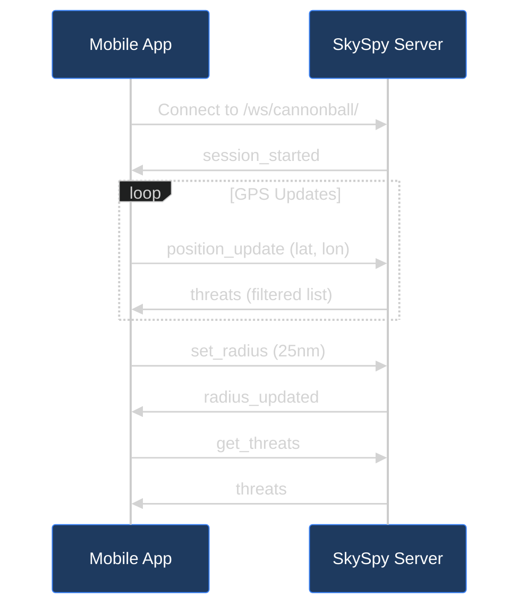

Cannonball Mode provides a dedicated WebSocket endpoint optimized for mobile applications that need real-time threat detection based on the user's GPS position.



## Connection

| Setting | Value |
| :--- | :--- |
| **Endpoint** | `/ws/cannonball/` |
| **Protocol** | WebSocket (native, not Socket.IO) |
| **Authentication** | Optional (anonymous sessions supported) |

```javascript
const ws = new WebSocket('ws://localhost:8000/ws/cannonball/');

ws.onopen = () => {
  console.log('Connected to Cannonball');
};

ws.onmessage = (event) => {
  const message = JSON.parse(event.data);
  console.log('Received:', message.type);
};
```

---

## Message Types

### Client to Server

### position_update

Send the user's current GPS position. The server responds with filtered threats within the configured radius.

```json
{
  "type": "position_update",
  "lat": 34.0522,
  "lon": -118.2437,
  "heading": 180,
  "accuracy": 10
}
```

| Field | Type | Required | Description |
| :--- | :--- | :--- | :--- |
| `lat` | number | Yes | Latitude in decimal degrees |
| `lon` | number | Yes | Longitude in decimal degrees |
| `heading` | number | No | Device heading in degrees (0-360) |
| `accuracy` | number | No | GPS accuracy in meters |

### set_radius

Configure the threat detection radius. Default is 25 nautical miles.

```json
{
  "type": "set_radius",
  "radius_nm": 15
}
```

| Field | Type | Required | Description |
| :--- | :--- | :--- | :--- |
| `radius_nm` | number | Yes | Radius in nautical miles (1-100) |

### get_threats

Request the current threat list without updating position. Requires a prior `position_update`.

```json
{
  "type": "get_threats"
}
```

### Server to Client

### session_started

Sent immediately after connection. Contains the unique session identifier.

```json
{
  "type": "session_started",
  "session_id": "550e8400-e29b-41d4-a716-446655440000",
  "timestamp": "2024-01-15T12:00:00Z"
}
```

### threats

Sent in response to `position_update` or `get_threats`. Contains filtered threat aircraft sorted by urgency.

```json
{
  "type": "threats",
  "data": [
    {
      "hex": "A12345",
      "callsign": "N123PD",
      "category": "Police Aviation",
      "description": "Los Angeles Police Dept",
      "distance_nm": 2.5,
      "bearing": 45.0,
      "relative_bearing": 90.0,
      "direction": "NE",
      "altitude": 1500,
      "ground_speed": 85,
      "vertical_rate": 0,
      "trend": "approaching",
      "threat_level": "warning",
      "is_law_enforcement": true,
      "is_helicopter": true,
      "confidence": "high",
      "aircraft_type": "AS50",
      "registration": "N123PD",
      "lat": 34.0612,
      "lon": -118.2350
    }
  ],
  "count": 1,
  "position": {
    "lat": 34.0522,
    "lon": -118.2437
  },
  "timestamp": "2024-01-15T12:00:01Z"
}
```

### radius_updated

Confirmation that the threat radius was updated.

```json
{
  "type": "radius_updated",
  "radius_nm": 15
}
```

### threat_update

Broadcast when threat data changes (pushed without request). Only sent if a position has been set.

```json
{
  "type": "threats",
  "data": [...],
  "count": 3,
  "position": { "lat": 34.0522, "lon": -118.2437 },
  "timestamp": "2024-01-15T12:00:05Z"
}
```

### error

Sent when an error occurs processing a request.

```json
{
  "type": "error",
  "message": "lat and lon are required"
}
```

---

## Threat Object Fields

| Field | Type | Description |
| :--- | :--- | :--- |
| `hex` | string | ICAO 24-bit address |
| `callsign` | string | Aircraft callsign (may be null) |
| `category` | string | Threat category (Police Aviation, Sheriff Aviation, etc.) |
| `description` | string | Detailed description of the aircraft/operator |
| `distance_nm` | number | Distance from user in nautical miles |
| `bearing` | number | Absolute bearing from user (0-360 degrees) |
| `relative_bearing` | number | Bearing relative to user heading (if heading provided) |
| `direction` | string | Cardinal direction (N, NE, E, SE, S, SW, W, NW) |
| `altitude` | number | Altitude in feet |
| `ground_speed` | number | Ground speed in knots |
| `vertical_rate` | number | Vertical rate in feet per minute |
| `trend` | string | `approaching`, `departing`, `holding`, or `unknown` |
| `threat_level` | string | `critical`, `warning`, or `info` |
| `is_law_enforcement` | boolean | True if identified as law enforcement |
| `is_helicopter` | boolean | True if rotorcraft |
| `confidence` | string | Identification confidence: `high`, `medium`, `low`, `unknown` |
| `aircraft_type` | string | ICAO aircraft type code |
| `registration` | string | Aircraft registration (N-number) |
| `lat`, `lon` | number | Aircraft position coordinates |

---

## Threat Levels

| Level | Criteria |
| :--- | :--- |
| **critical** | Law enforcement within 2nm and approaching |
| **warning** | Law enforcement within 5nm or helicopter within 2nm |
| **info** | Aircraft of interest at greater distance |

---

## Example: JavaScript Client

```javascript
class CannonballClient {
  constructor(url = 'ws://localhost:8000/ws/cannonball/') {
    this.url = url;
    this.ws = null;
    this.sessionId = null;
    this.onThreats = null;
  }

  connect() {
    this.ws = new WebSocket(this.url);

    this.ws.onopen = () => {
      console.log('Cannonball connected');
    };

    this.ws.onmessage = (event) => {
      const message = JSON.parse(event.data);
      this.handleMessage(message);
    };

    this.ws.onerror = (error) => {
      console.error('Cannonball error:', error);
    };

    this.ws.onclose = () => {
      console.log('Cannonball disconnected');
      // Implement reconnection logic here
    };
  }

  handleMessage(message) {
    switch (message.type) {
      case 'session_started':
        this.sessionId = message.session_id;
        console.log('Session:', this.sessionId);
        break;

      case 'threats':
        if (this.onThreats) {
          this.onThreats(message.data, message.count);
        }
        break;

      case 'radius_updated':
        console.log('Radius set to:', message.radius_nm, 'nm');
        break;

      case 'error':
        console.error('Server error:', message.message);
        break;
    }
  }

  updatePosition(lat, lon, heading = null) {
    if (this.ws?.readyState === WebSocket.OPEN) {
      this.ws.send(JSON.stringify({
        type: 'position_update',
        lat,
        lon,
        heading,
      }));
    }
  }

  setRadius(radiusNm) {
    if (this.ws?.readyState === WebSocket.OPEN) {
      this.ws.send(JSON.stringify({
        type: 'set_radius',
        radius_nm: radiusNm,
      }));
    }
  }

  getThreats() {
    if (this.ws?.readyState === WebSocket.OPEN) {
      this.ws.send(JSON.stringify({
        type: 'get_threats',
      }));
    }
  }

  disconnect() {
    if (this.ws) {
      this.ws.close();
      this.ws = null;
    }
  }
}

// Usage
const client = new CannonballClient();
client.onThreats = (threats, count) => {
  console.log(`${count} threats detected:`);
  threats.forEach(t => {
    console.log(`- ${t.category}: ${t.distance_nm}nm ${t.direction} (${t.trend})`);
  });
};

client.connect();

// Send GPS updates (typically from device location API)
navigator.geolocation.watchPosition((position) => {
  client.updatePosition(
    position.coords.latitude,
    position.coords.longitude,
    position.coords.heading
  );
});
```

---

## React Hook

For React applications, use the `useCannonballAPI` hook:

```javascript
import { useCannonballAPI } from './hooks/useCannonballAPI';

function CannonballView() {
  const {
    threats,
    threatCount,
    connected,
    sessionId,
    error,
    updateLocation,
    setThreatRadius,
  } = useCannonballAPI({
    apiBase: 'http://localhost:8000',
    enabled: true,
    useWebSocket: true,
    threatRadius: 25,
  });

  // Update location from GPS
  useEffect(() => {
    const watchId = navigator.geolocation.watchPosition(
      (pos) => updateLocation(pos.coords.latitude, pos.coords.longitude),
      (err) => console.error('GPS error:', err),
      { enableHighAccuracy: true }
    );
    return () => navigator.geolocation.clearWatch(watchId);
  }, [updateLocation]);

  return (
    <div>
      <p>Status: {connected ? 'Connected' : 'Disconnected'}</p>
      <p>Threats: {threatCount}</p>
      {threats.map(threat => (
        <div key={threat.hex}>
          {threat.category} - {threat.distance_nm}nm {threat.direction}
        </div>
      ))}
    </div>
  );
}
```

---

## Next Steps

- **Cannonball Integration Recipe** - Complete mobile app integration guide. [Learn more →](/docs/cannonball-integration)
- **Safety & Alerts** - Configure custom alert rules. [Learn more →](/docs/safety-and-alerts)
