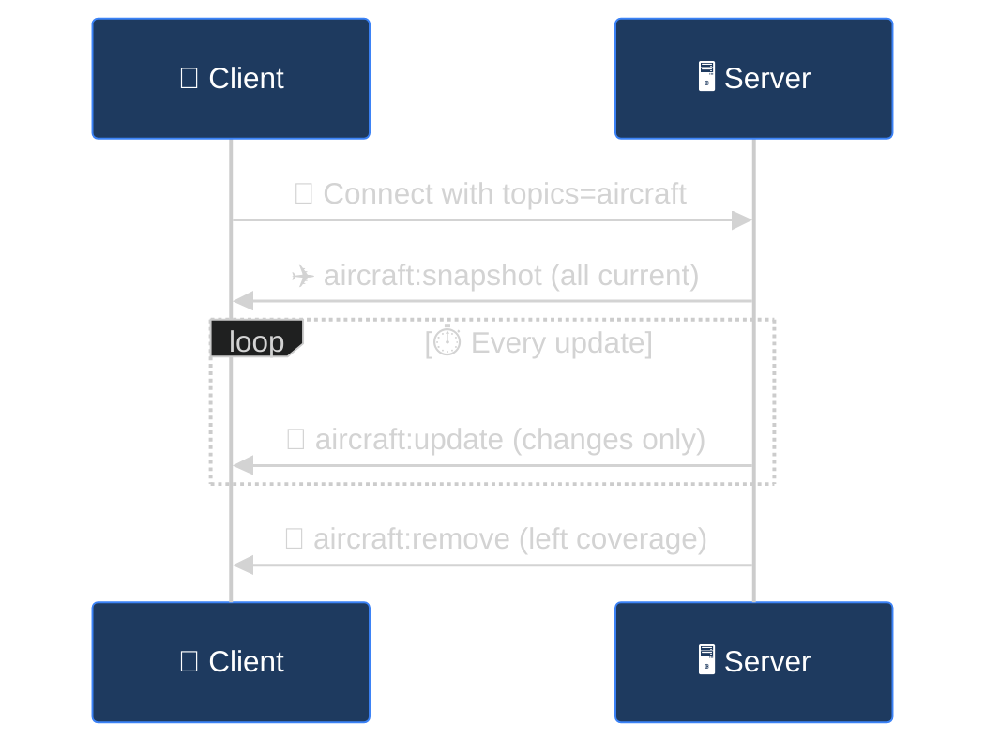

## Aircraft Events

Subscribe to `aircraft` topic.



### aircraft:snapshot

Sent immediately on connection. Contains all currently tracked aircraft.

> 👍 Success Response
>
> A successful connection returns all aircraft in coverage:

```json
{
  "aircraft": [
    {
      "hex": "A12345",
      "flight": "UAL123",
      "lat": 47.6062,
      "lon": -122.3321,
      "alt": 35000,
      "gs": 450,
      "track": 270,
      "vr": -500,
      "squawk": "1200",
      "category": "A3",
      "type": "B738",
      "military": false,
      "emergency": false
    }
  ],
  "count": 1,
  "timestamp": "2024-01-15T12:00:00Z"
}
```

### aircraft:update

Emitted when aircraft data changes. Contains only changed fields.

```json
{
  "aircraft": [
    {
      "hex": "A12345",
      "alt": 35100,
      "vr": 1200
    }
  ],
  "timestamp": "2024-01-15T12:00:01Z"
}
```

### aircraft:remove

Emitted when aircraft leave coverage.

```json
{
  "icaos": ["A12345", "B67890"],
  "timestamp": "2024-01-15T12:05:00Z"
}
```

### Aircraft Object Fields

| Field | Type | Description |
| :--- | :--- | :--- |
| `hex` | string | 🔢 ICAO 24-bit address |
| `flight` | string | 🏷️ Callsign (if available) |
| `lat`, `lon` | number | 📍 Position coordinates |
| `alt` | number | 📏 Altitude in feet |
| `gs` | number | 💨 Ground speed in knots |
| `track` | number | 🧭 Track heading in degrees |
| `vr` | number | ↕️ Vertical rate in ft/min |
| `squawk` | string | 📻 Transponder code |
| `category` | string | 📦 Aircraft size category |
| `type` | string | ✈️ ICAO aircraft type code |
| `military` | boolean | 🎖️ Military aircraft flag |
| `emergency` | boolean | 🚨 Emergency squawk detected |

---

## Safety Events

Subscribe to `safety` topic.

> ❗️ Critical Events
>
> Safety events with `severity: "critical"` indicate immediate hazards like TCAS RAs, close proximity conflicts, or emergency squawks.

### `safety:event`

| Field | Type | Values |
| :--- | :--- | :--- |
| `event_type` | string | `proximity_conflict`, `tcas_ra_detected`, `extreme_vertical_rate`, `emergency_squawk` |
| `severity` | string | `warning`, `critical` |
| `icao` | string | Primary aircraft ICAO |
| `icao_2` | string | Secondary aircraft (for conflicts) |
| `message` | string | Human-readable description |

```json
{
  "event_type": "proximity_conflict",
  "severity": "critical",
  "icao": "A12345",
  "icao_2": "B67890",
  "callsign": "UAL123",
  "message": "Proximity conflict: 0.5nm lateral, 500ft vertical separation",
  "details": {
    "distance_nm": 0.5,
    "altitude_diff_ft": 500
  },
  "timestamp": "2024-01-15T12:00:00Z"
}
```

---

## Alert Events

Subscribe to `alerts` topic. Fired when custom alert rules match.

### `alert:triggered`

```json
{
  "rule_id": 1,
  "rule_name": "Low Altitude Alert",
  "icao": "A12345",
  "callsign": "UAL123",
  "message": "Aircraft below 3000ft within 10nm",
  "priority": "warning",
  "aircraft_data": {
    "hex": "A12345",
    "alt": 2500,
    "lat": 47.6,
    "lon": -122.3
  }
}
```

---

## ACARS Events

Subscribe to `acars` topic. Requires ACARS receiver configured.

### `acars:message`

```json
{
  "source": "acars",
  "icao_hex": "A12345",
  "registration": "N12345",
  "label": "H1",
  "text": "DEPARTURE CLEARANCE CONFIRMED SEA",
  "frequency": 130.025,
  "signal_level": -42.5
}
```

---

## Dynamic Subscriptions

### Change subscriptions at runtime

```javascript
// Add a subscription
socket.emit('subscribe', { topics: ['acars'] });

// Remove a subscription
socket.emit('unsubscribe', { topics: ['safety'] });
```
