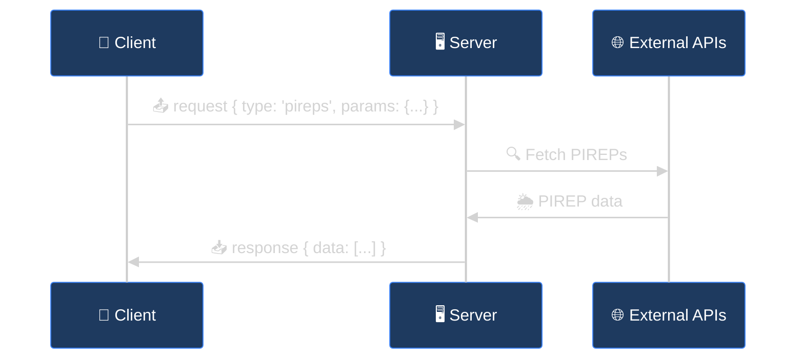

Fetch on-demand data using an RPC-style pattern over the same Socket.IO connection.



## Making Requests

```javascript
import { v4 as uuid } from 'uuid';

function request(socket, type, params) {
  return new Promise((resolve, reject) => {
    const request_id = uuid();

    const onResponse = (data) => {
      if (data.request_id === request_id) {
        socket.off('response', onResponse);
        socket.off('error', onError);
        resolve(data.data);
      }
    };

    const onError = (err) => {
      if (err.request_id === request_id) {
        socket.off('response', onResponse);
        socket.off('error', onError);
        reject(new Error(err.error));
      }
    };

    socket.on('response', onResponse);
    socket.on('error', onError);
    socket.emit('request', { type, request_id, params });
  });
}

// Usage
const pireps = await request(socket, 'pireps', {
  lat: 47.5,
  lon: -122.3,
  radius: 150
});
```

---

## Available Requests

### Weather

| Type | Required | Optional | Description |
| :--- | :--- | :--- | :--- |
| `metars` | `lat`, `lon` | `radius`, `hours`, `limit` | METARs for airports in area |
| `metar` | `station` | `hours` | Single station METAR |
| `taf` | `station` | — | Terminal Aerodrome Forecast |
| `pireps` | `lat`, `lon` | `radius`, `hours` | Pilot Reports (turbulence, icing) |
| `sigmets` | — | `hazard`, `lat`, `lon`, `radius` | Active SIGMETs |

### Airspace

| Type | Required | Optional | Description |
| :--- | :--- | :--- | :--- |
| `airspaces` | `lat`, `lon` | `hazard` | G-AIRMET advisories for location |
| `airspace-boundaries` | — | `lat`, `lon`, `radius`, `class` | Static airspace geometry |

### Navigation

| Type | Required | Optional | Description |
| :--- | :--- | :--- | :--- |
| `airports` | `lat`, `lon` | `radius`, `limit` | Nearby airports |
| `navaids` | `lat`, `lon` | `radius`, `limit`, `type` | Nearby VORs/NDBs |

### Aircraft

| Type | Required | Optional | Description |
| :--- | :--- | :--- | :--- |
| `aircraft-info` | `icao` | — | Static database info (registration, type, operator) |
