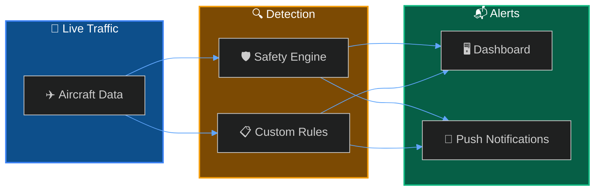
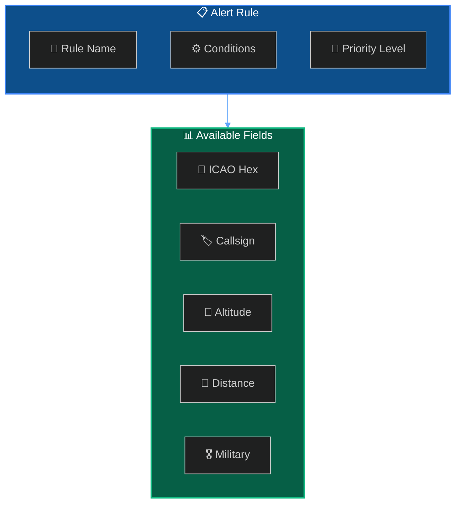
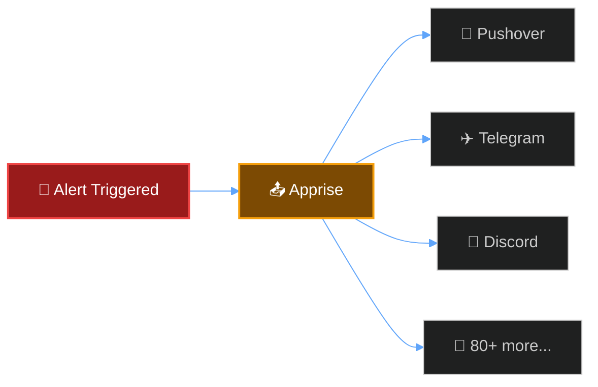

SkySpy provides two types of alerts: automatic **safety monitoring** that detects dangerous conditions, and **custom alert rules** you define to track specific aircraft or situations.



## Safety Monitoring

The safety engine continuously analyzes live traffic and automatically detects dangerous conditions.

<CardGroup cols={2}>
  <Card title="🚨 TCAS RA" icon="circle-exclamation">
    **Critical** — Resolution Advisory detected
  </Card>
  <Card title="⚠️ TCAS TA" icon="triangle-exclamation">
    **Warning** — Traffic Advisory detected
  </Card>
  <Card title="🎯 Proximity Conflict" icon="arrows-to-circle">
    **Critical** — Aircraft within threshold distance
  </Card>
  <Card title="↕️ Extreme Vertical Rate" icon="arrows-up-down">
    **Warning** — Climb/descent exceeding 4,500 ft/min
  </Card>
  <Card title="📻 Emergency Squawk" icon="radio">
    **Critical** — 7700, 7600, or 7500 detected
  </Card>
</CardGroup>

### Emergency Squawk Codes

<Warning>
These codes indicate serious aviation emergencies and trigger immediate alerts.
</Warning>

| Code | Icon | Meaning |
| :--- | :--- | :--- |
| `7700` | 🚨 | **General Emergency** — Aircraft in distress |
| `7600` | 📻 | **Radio Failure** — Lost communications (NORDO) |
| `7500` | ⚠️ | **Hijack** — Unlawful interference |

### Configuration

```bash
SAFETY_MONITORING_ENABLED=true
SAFETY_PROXIMITY_NM=1.0        # Nautical miles
SAFETY_ALTITUDE_DIFF_FT=1000   # Feet
```

---

## Custom Alert Rules

Create rules to get notified when specific aircraft appear or conditions are met.



### Quick Example

```bash
curl -X POST http://localhost:5000/api/alerts/rules \
  -H "Content-Type: application/json" \
  -d '{
    "name": "Military Aircraft Nearby",
    "enabled": true,
    "priority": "high",
    "conditions": {
      "operator": "AND",
      "conditions": [
        { "field": "military", "operator": "eq", "value": true },
        { "field": "distance", "operator": "lt", "value": 50 }
      ]
    },
    "notification_enabled": true
  }'
```

---

## Notifications

When alerts trigger, SkySpy sends push notifications via [Apprise](https://github.com/caronc/apprise).



```bash
APPRISE_URLS="pushover://user@token;tgram://bot/chat"
NOTIFICATION_COOLDOWN=300
```

---

## Implementation

<Cards columns={2}>
  <Card title="📋 Custom Rules" icon="list-check" href="/docs/safety-and-alerts/custom-rules">
    Rule structure, conditions, and operators
  </Card>
  <Card title="📝 Rule Examples" icon="code" href="/docs/safety-and-alerts/examples">
    Common rule patterns and use cases
  </Card>
</Cards>

---

## Next Steps

<Cards columns={2}>
  <Card title="Real-Time API" icon="bolt" href="/docs/real-time-api">
    Subscribe to safety events via Socket.IO
  </Card>
  <Card title="SSE Streaming" icon="signal-stream" href="/docs/sse">
    Receive alerts via Server-Sent Events
  </Card>
</Cards>
