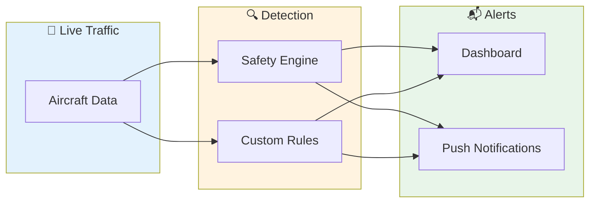
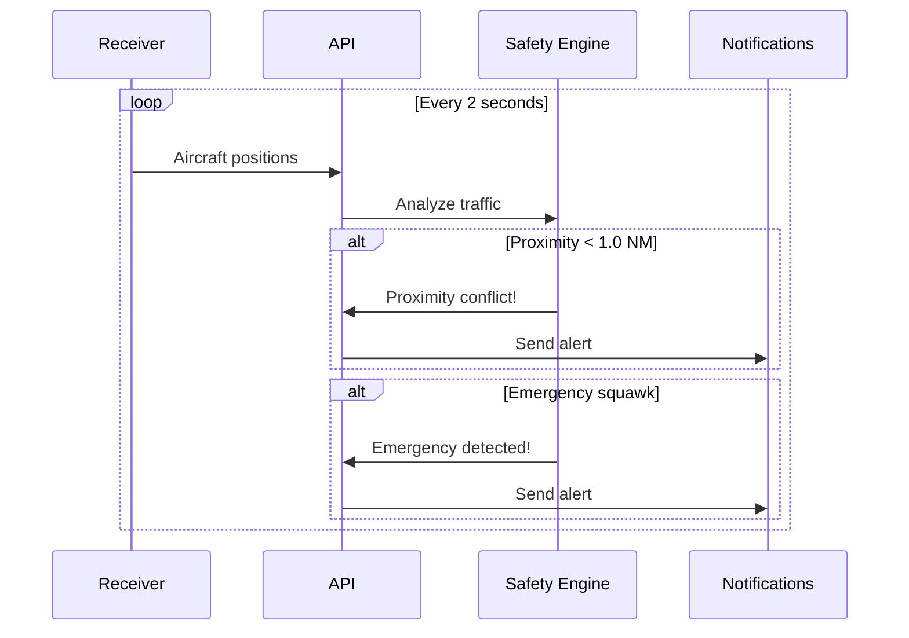
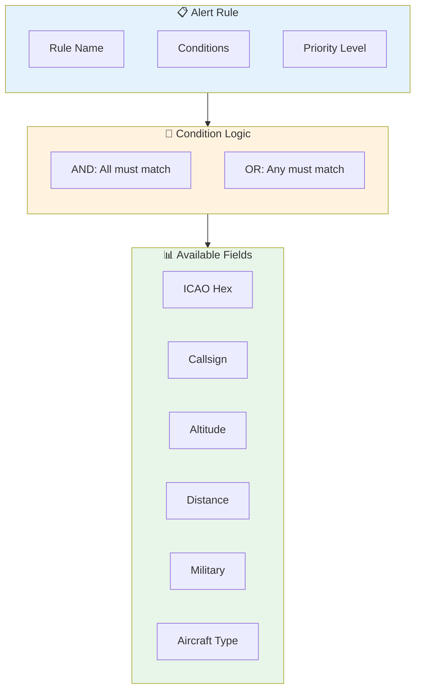
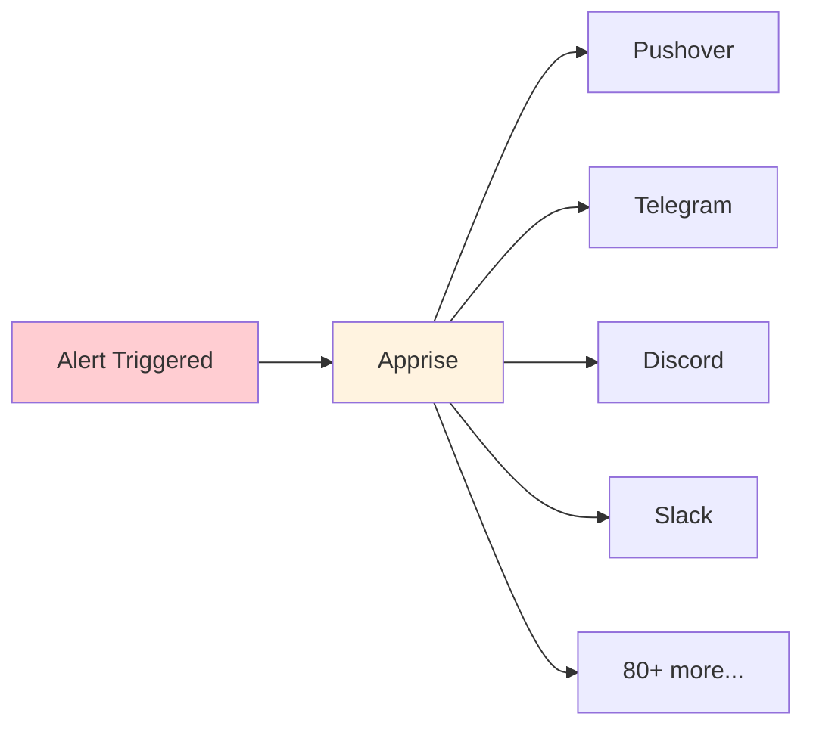

SkySpy provides two types of alerts: automatic **safety monitoring** that detects dangerous conditions, and **custom alert rules** you define to track specific aircraft or situations.



## Safety Monitoring

The safety engine continuously analyzes live traffic and automatically detects dangerous conditions.

<CardGroup cols={2}>
  <Card title="TCAS RA" icon="circle-exclamation">
    **Critical** — Resolution Advisory detected in ADS-B data
  </Card>
  <Card title="TCAS TA" icon="triangle-exclamation">
    **Warning** — Traffic Advisory detected
  </Card>
  <Card title="Proximity Conflict" icon="arrows-to-circle">
    **Critical** — Aircraft within threshold distance
  </Card>
  <Card title="Extreme Vertical Rate" icon="arrows-up-down">
    **Warning** — Climb/descent exceeding 4,500 ft/min
  </Card>
  <Card title="Emergency Squawk" icon="radio">
    **Critical** — Transponder code 7700, 7600, or 7500
  </Card>
</CardGroup>

### Emergency Squawk Codes

<Warning>
These codes indicate serious aviation emergencies and will trigger immediate alerts.
</Warning>

| Code | Icon | Meaning | Description |
| :--- | :--- | :--- | :--- |
| `7700` | 🚨 | **General Emergency** | Aircraft in distress |
| `7600` | 📻 | **Radio Failure** | Lost communications (NORDO) |
| `7500` | ⚠️ | **Hijack** | Unlawful interference |

### How Safety Detection Works



### Configuration

Control safety monitoring thresholds in your `.env` file:

```bash
SAFETY_MONITORING_ENABLED=true
SAFETY_PROXIMITY_NM=1.0        # Nautical miles
SAFETY_ALTITUDE_DIFF_FT=1000   # Feet
```

See [Configuration](/docs/configuration#safety-monitoring) for all options.

---

## Custom Alert Rules

Create rules to get notified when specific aircraft appear or conditions are met. Rules support flexible AND/OR logic to combine multiple conditions.

### Rule Builder Concept



### Creating Rules

<Tabs>
  <Tab title="Dashboard">
    <Steps>
      <Step title="Open Alert Rules">
        Navigate to **Settings** → **Alert Rules** in the dashboard
      </Step>
      <Step title="Create New Rule">
        Click **New Rule** to open the rule builder
      </Step>
      <Step title="Configure Conditions">
        Add conditions using the visual builder and set priority
      </Step>
      <Step title="Enable Notifications">
        Toggle push notifications if desired
      </Step>
    </Steps>
  </Tab>
  <Tab title="API">
    ```bash
    curl -X POST http://localhost:5000/api/alerts/rules \
      -H "Content-Type: application/json" \
      -d '{
        "name": "Military Aircraft Nearby",
        "enabled": true,
        "priority": "high",
        "conditions": {
          "operator": "AND",
          "conditions": [
            { "field": "military", "operator": "eq", "value": true },
            { "field": "distance", "operator": "lt", "value": 50 }
          ]
        },
        "notification_enabled": true
      }'
    ```
  </Tab>
</Tabs>

### Rule Structure

```json
{
  "name": "Rule name shown in alerts",
  "enabled": true,
  "priority": "high",
  "conditions": {
    "operator": "AND",
    "conditions": [
      { "field": "...", "operator": "...", "value": "..." }
    ]
  },
  "notification_enabled": true
}
```

| Field | Type | Description |
| :--- | :--- | :--- |
| `name` | string | Display name for the rule |
| `enabled` | boolean | Whether the rule is active |
| `priority` | string | `low`, `medium`, `high`, or `critical` |
| `conditions` | object | Condition tree (see below) |
| `notification_enabled` | boolean | Send push notifications when triggered |

### Condition Fields

| Field | Type | Description | Example |
| :--- | :--- | :--- | :--- |
| `icao` | string | 24-bit ICAO hex address | `A12345` |
| `callsign` | string | Flight number or callsign | `UAL123` |
| `squawk` | string | Transponder code | `7700` |
| `altitude` | number | Barometric altitude (feet) | `35000` |
| `distance` | number | Distance from receiver (NM) | `10` |
| `type` | string | ICAO aircraft type code | `B738` |
| `military` | boolean | Military aircraft flag | `true` |
| `category` | string | Aircraft size category | `A3` |

### Operators

| Operator | Meaning | Works With |
| :--- | :--- | :--- |
| `eq` | Equals | All types |
| `ne` | Not equals | All types |
| `lt` | Less than | Numbers |
| `gt` | Greater than | Numbers |
| `le` | Less than or equal | Numbers |
| `ge` | Greater than or equal | Numbers |
| `contains` | Contains substring | Strings |
| `startswith` | Starts with | Strings |

### Combining Conditions

Use `AND` and `OR` operators to build complex rules. You can nest condition groups.

<Tabs>
  <Tab title="AND (all must match)">
    Alert when a military aircraft is below 10,000ft within 25nm:

    ```json
    {
      "operator": "AND",
      "conditions": [
        { "field": "military", "operator": "eq", "value": true },
        { "field": "altitude", "operator": "lt", "value": 10000 },
        { "field": "distance", "operator": "lt", "value": 25 }
      ]
    }
    ```

    ```mermaid
    flowchart LR
        M[Military = true] --> AND{AND}
        A[Altitude < 10000] --> AND
        D[Distance < 25] --> AND
        AND --> ALERT[Alert!]

        style AND fill:#fff3e0
        style ALERT fill:#c8e6c9
    ```
  </Tab>
  <Tab title="OR (any must match)">
    Alert for any emergency squawk:

    ```json
    {
      "operator": "OR",
      "conditions": [
        { "field": "squawk", "operator": "eq", "value": "7700" },
        { "field": "squawk", "operator": "eq", "value": "7600" },
        { "field": "squawk", "operator": "eq", "value": "7500" }
      ]
    }
    ```

    ```mermaid
    flowchart LR
        S1[Squawk = 7700] --> OR{OR}
        S2[Squawk = 7600] --> OR
        S3[Squawk = 7500] --> OR
        OR --> ALERT[Alert!]

        style OR fill:#e3f2fd
        style ALERT fill:#c8e6c9
    ```
  </Tab>
  <Tab title="Nested Logic">
    Alert for specific callsigns OR any military within 10nm:

    ```json
    {
      "operator": "OR",
      "conditions": [
        { "field": "callsign", "operator": "startswith", "value": "AFR" },
        {
          "operator": "AND",
          "conditions": [
            { "field": "military", "operator": "eq", "value": true },
            { "field": "distance", "operator": "lt", "value": 10 }
          ]
        }
      ]
    }
    ```

    ```mermaid
    flowchart TB
        CALL[Callsign starts with AFR] --> OR{OR}

        subgraph Nested["Nested AND"]
            MIL[Military = true] --> AND{AND}
            DIST[Distance < 10] --> AND
        end

        AND --> OR
        OR --> ALERT[Alert!]

        style OR fill:#e3f2fd
        style Nested fill:#fff3e0
        style ALERT fill:#c8e6c9
    ```
  </Tab>
</Tabs>

---

## Example Rules

<AccordionGroup>
  <Accordion title="Track specific aircraft by ICAO" icon="plane">
    ```json
    {
      "name": "Track N12345",
      "priority": "medium",
      "conditions": {
        "operator": "OR",
        "conditions": [
          { "field": "icao", "operator": "eq", "value": "A12345" },
          { "field": "icao", "operator": "eq", "value": "A67890" }
        ]
      },
      "notification_enabled": true
    }
    ```
  </Accordion>

  <Accordion title="Low-flying aircraft nearby" icon="mountain">
    ```json
    {
      "name": "Low Flyer Alert",
      "priority": "high",
      "conditions": {
        "operator": "AND",
        "conditions": [
          { "field": "altitude", "operator": "lt", "value": 1000 },
          { "field": "distance", "operator": "lt", "value": 5 }
        ]
      },
      "notification_enabled": true
    }
    ```
  </Accordion>

  <Accordion title="Airline callsign prefix" icon="building">
    ```json
    {
      "name": "United Airlines",
      "priority": "low",
      "conditions": {
        "operator": "AND",
        "conditions": [
          { "field": "callsign", "operator": "startswith", "value": "UAL" }
        ]
      },
      "notification_enabled": false
    }
    ```
  </Accordion>

  <Accordion title="Heavy jets overhead" icon="plane-up">
    ```json
    {
      "name": "Heavy Traffic",
      "priority": "medium",
      "conditions": {
        "operator": "AND",
        "conditions": [
          { "field": "category", "operator": "eq", "value": "A5" },
          { "field": "distance", "operator": "lt", "value": 20 }
        ]
      },
      "notification_enabled": true
    }
    ```
  </Accordion>
</AccordionGroup>

---

## Notifications

When alerts trigger, SkySpy can send push notifications via [Apprise](https://github.com/caronc/apprise).



Configure notification services in your `.env`:

```bash
APPRISE_URLS="pushover://user@token;tgram://bot/chat"
NOTIFICATION_COOLDOWN=300
```

<Info>
The cooldown prevents duplicate notifications for the same alert within the specified seconds.
</Info>

See [Configuration → Notifications](/docs/configuration#notifications) for setup details.

## Next Steps

<Cards columns={2}>
  <Card title="Real-Time API" icon="bolt" href="/docs/real-time-api">
    Subscribe to safety events via Socket.IO
  </Card>
  <Card title="SSE Streaming" icon="signal-stream" href="/docs/sse">
    Receive alerts via Server-Sent Events
  </Card>
</Cards>
