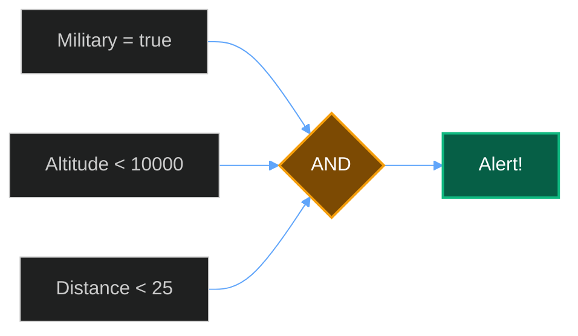
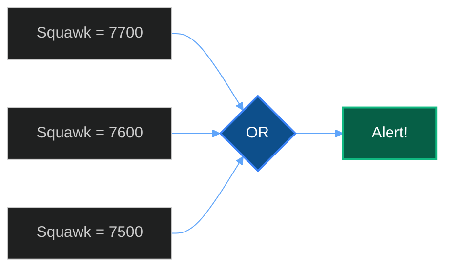
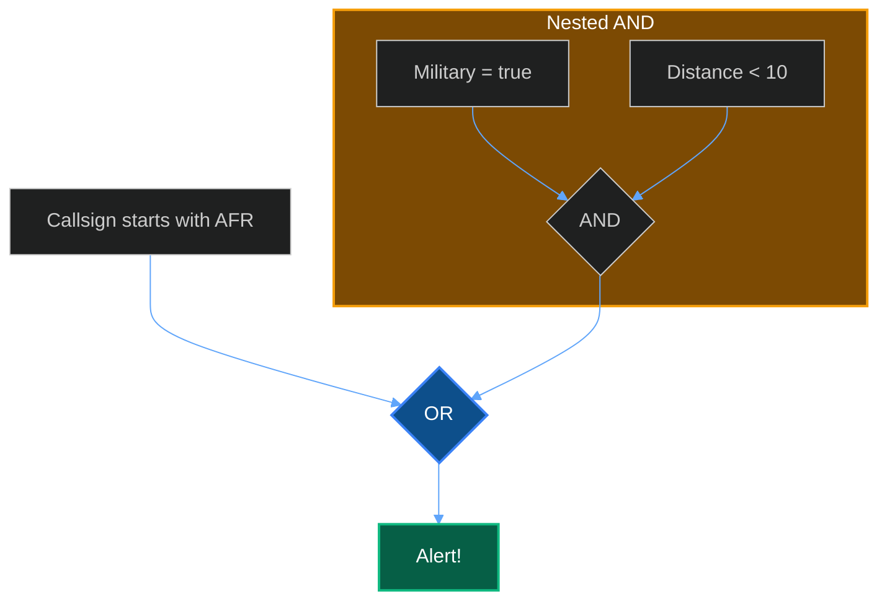

## Rule Structure

```json
{
  "name": "Rule name shown in alerts",
  "enabled": true,
  "priority": "high",
  "conditions": {
    "operator": "AND",
    "conditions": [
      { "field": "...", "operator": "...", "value": "..." }
    ]
  },
  "notification_enabled": true
}
```

| Field | Type | Description |
| :--- | :--- | :--- |
| `name` | string | 📝 Display name for the rule |
| `enabled` | boolean | ✅ Whether the rule is active |
| `priority` | string | 🎯 `low`, `medium`, `high`, or `critical` |
| `conditions` | object | ⚙️ Condition tree (see below) |
| `notification_enabled` | boolean | 📱 Send push notifications when triggered |

---

## Condition Fields

| Field | Type | Description | Example |
| :--- | :--- | :--- | :--- |
| `icao` | string | 🔢 24-bit ICAO hex address | `A12345` |
| `callsign` | string | 🏷️ Flight number or callsign | `UAL123` |
| `squawk` | string | 📻 Transponder code | `7700` |
| `altitude` | number | 📏 Barometric altitude (feet) | `35000` |
| `distance` | number | 📍 Distance from receiver (NM) | `10` |
| `type` | string | ✈️ ICAO aircraft type code | `B738` |
| `military` | boolean | 🎖️ Military aircraft flag | `true` |
| `category` | string | 📦 Aircraft size category | `A3` |

---

## Operators

| Operator | Meaning | Works With |
| :--- | :--- | :--- |
| `eq` | ✅ Equals | All types |
| `ne` | ❌ Not equals | All types |
| `lt` | ⬇️ Less than | Numbers |
| `gt` | ⬆️ Greater than | Numbers |
| `le` | ⬇️ Less than or equal | Numbers |
| `ge` | ⬆️ Greater than or equal | Numbers |
| `contains` | 🔍 Contains substring | Strings |
| `startswith` | 🏁 Starts with | Strings |

---

## Combining Conditions

Use `AND` and `OR` operators to build complex rules. You can nest condition groups.

### AND (all must match)

Alert when a military aircraft is below 10,000ft within 25nm:

```json
{
  "operator": "AND",
  "conditions": [
    { "field": "military", "operator": "eq", "value": true },
    { "field": "altitude", "operator": "lt", "value": 10000 },
    { "field": "distance", "operator": "lt", "value": 25 }
  ]
}
```



### OR (any must match)

Alert for any emergency squawk:

```json
{
  "operator": "OR",
  "conditions": [
    { "field": "squawk", "operator": "eq", "value": "7700" },
    { "field": "squawk", "operator": "eq", "value": "7600" },
    { "field": "squawk", "operator": "eq", "value": "7500" }
  ]
}
```



### Nested Logic

Alert for specific callsigns OR any military within 10nm:

```json
{
  "operator": "OR",
  "conditions": [
    { "field": "callsign", "operator": "startswith", "value": "AFR" },
    {
      "operator": "AND",
      "conditions": [
        { "field": "military", "operator": "eq", "value": true },
        { "field": "distance", "operator": "lt", "value": 10 }
      ]
    }
  ]
}
```



---

## Creating Rules

### Dashboard

1. **Open Alert Rules** - Navigate to **Settings** → **Alert Rules** in the dashboard
2. **Create New Rule** - Click **New Rule** to open the rule builder
3. **Configure Conditions** - Add conditions using the visual builder and set priority
4. **Enable Notifications** - Toggle push notifications if desired

### API

```bash
curl -X POST http://localhost:5000/api/alerts/rules \
  -H "Content-Type: application/json" \
  -d '{
    "name": "Military Aircraft Nearby",
    "enabled": true,
    "priority": "high",
    "conditions": {
      "operator": "AND",
      "conditions": [
        { "field": "military", "operator": "eq", "value": true },
        { "field": "distance", "operator": "lt", "value": 50 }
      ]
    },
    "notification_enabled": true
  }'
```
