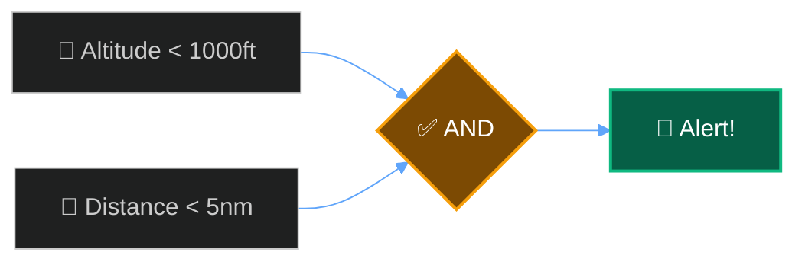
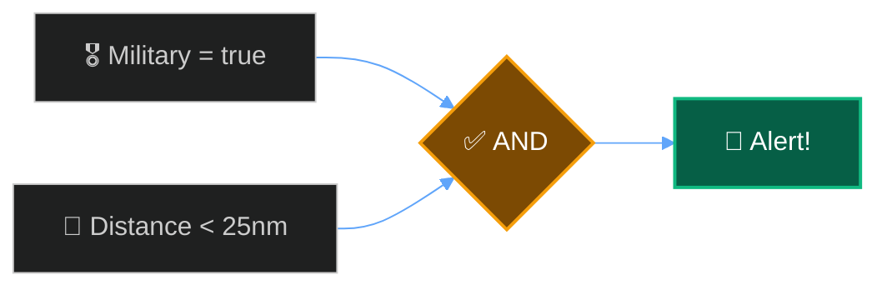

## Track Specific Aircraft

```json
{
  "name": "Track N12345",
  "priority": "medium",
  "conditions": {
    "operator": "OR",
    "conditions": [
      { "field": "icao", "operator": "eq", "value": "A12345" },
      { "field": "icao", "operator": "eq", "value": "A67890" }
    ]
  },
  "notification_enabled": true
}
```

---

## Low-Flying Aircraft Nearby

```json
{
  "name": "Low Flyer Alert",
  "priority": "high",
  "conditions": {
    "operator": "AND",
    "conditions": [
      { "field": "altitude", "operator": "lt", "value": 1000 },
      { "field": "distance", "operator": "lt", "value": 5 }
    ]
  },
  "notification_enabled": true
}
```



---

## Airline Callsign Prefix

```json
{
  "name": "United Airlines",
  "priority": "low",
  "conditions": {
    "operator": "AND",
    "conditions": [
      { "field": "callsign", "operator": "startswith", "value": "UAL" }
    ]
  },
  "notification_enabled": false
}
```

---

## Heavy Jets Overhead

```json
{
  "name": "Heavy Traffic",
  "priority": "medium",
  "conditions": {
    "operator": "AND",
    "conditions": [
      { "field": "category", "operator": "eq", "value": "A5" },
      { "field": "distance", "operator": "lt", "value": 20 }
    ]
  },
  "notification_enabled": true
}
```

---

## Military Aircraft

```json
{
  "name": "Military Alert",
  "priority": "high",
  "conditions": {
    "operator": "AND",
    "conditions": [
      { "field": "military", "operator": "eq", "value": true },
      { "field": "distance", "operator": "lt", "value": 25 }
    ]
  },
  "notification_enabled": true
}
```



---

## Emergency Squawks

```json
{
  "name": "Emergency Alert",
  "priority": "critical",
  "conditions": {
    "operator": "OR",
    "conditions": [
      { "field": "squawk", "operator": "eq", "value": "7700" },
      { "field": "squawk", "operator": "eq", "value": "7600" },
      { "field": "squawk", "operator": "eq", "value": "7500" }
    ]
  },
  "notification_enabled": true
}
```

---

## Specific Aircraft Type

```json
{
  "name": "Boeing 747 Spotter",
  "priority": "medium",
  "conditions": {
    "operator": "AND",
    "conditions": [
      { "field": "type", "operator": "startswith", "value": "B74" },
      { "field": "distance", "operator": "lt", "value": 50 }
    ]
  },
  "notification_enabled": true
}
```
