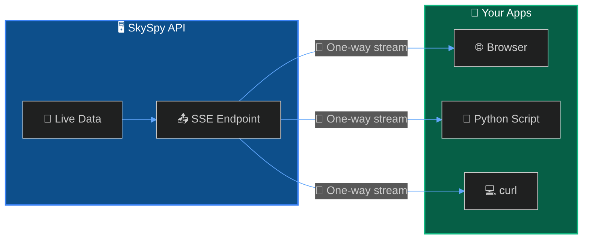

SkySpy provides a Server-Sent Events (SSE) stream for applications that only need to receive data. SSE is a lightweight alternative to Socket.IO, supported natively in all browsers without additional libraries.



> 📘 Info
>
> **When to use SSE vs Socket.IO** — Use **SSE** for simple, read-only clients (dashboards, monitors). Use **[Socket.IO](/docs/real-time-api)** when you need bi-directional communication or the request/response API for weather data.

## Quick Start

Connect to the SSE stream using your preferred language:

```javascript JavaScript
const stream = new EventSource('http://localhost:5000/api/v1/map/sse');

stream.addEventListener('aircraft_update', (event) => {
  const data = JSON.parse(event.data);
  console.log('Aircraft:', data.aircraft);
});

stream.addEventListener('safety_event', (event) => {
  const alert = JSON.parse(event.data);
  console.warn('Safety:', alert.message);
});
```
```python Python
import sseclient
import requests

url = 'http://localhost:5000/api/v1/map/sse'
response = requests.get(url, stream=True)
client = sseclient.SSEClient(response)

for event in client.events():
    if event.event == 'aircraft_update':
        print('Aircraft:', event.data)
    elif event.event == 'safety_event':
        print('Safety:', event.data)
```
```bash curl
curl -N http://localhost:5000/api/v1/map/sse
```

## Connection

| Setting | Value |
| :--- | :--- |
| **Endpoint** | `GET /api/v1/map/sse` |
| **Content-Type** | `text/event-stream` |

### Query Parameters

| Parameter | Type | Default | Description |
| :--- | :--- | :--- | :--- |
| `replay_history` | boolean | `false` | 📜 Replay buffered events on connect |

> 💡 Tip
>
> Use `replay_history=true` to receive recent events immediately upon connection—useful for populating a dashboard with current state.

---

## Events

- **aircraft_update** - Position/telemetry changes
- **aircraft_new** - New aircraft in coverage
- **aircraft_remove** - Aircraft left coverage
- **safety_event** - TCAS, proximity, emergencies
- **alert_triggered** - Custom rule matched
- **acars_message** - ACARS/VDL2 decoded

---

## Comparison: SSE vs Socket.IO

| Feature | SSE | Socket.IO |
| :--- | :--- | :--- |
| **Direction** | Server → Client only | Bi-directional |
| **Request/Response** | ❌ No | ✅ Yes |
| **Weather API** | ❌ No | ✅ Yes |
| **Browser Support** | Native `EventSource` | Requires library |
| **Best For** | Simple dashboards | Full-featured apps |

---

## Implementation

- **Events** - Event types and JSON payloads. [Learn more →](/docs/sse/events)
- **Client Examples** - JavaScript, React, Python, and curl. [Learn more →](/docs/sse/client-examples)

---

## Next Steps

- **Real-Time API** - Full-featured Socket.IO streaming with request/response. [Learn more →](/docs/real-time-api)
- **Safety & Alerts** - Configure custom alert rules. [Learn more →](/docs/safety-and-alerts)
