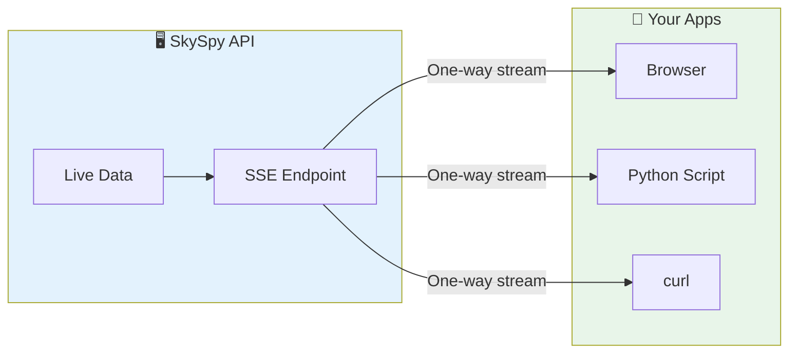
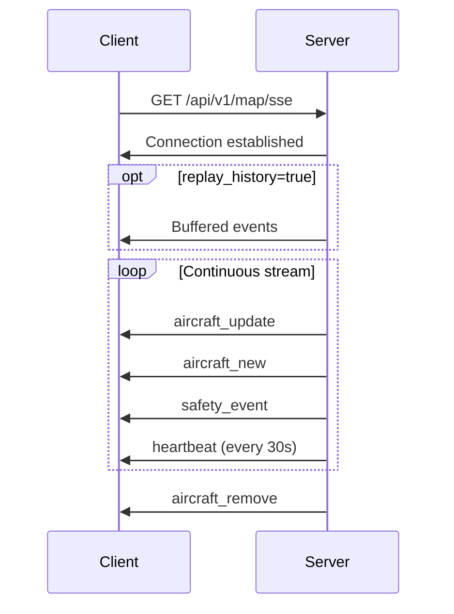
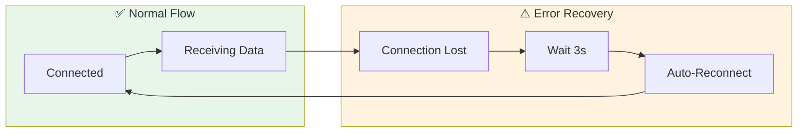

SkySpy provides a Server-Sent Events (SSE) stream for applications that only need to receive data. SSE is a lightweight alternative to Socket.IO, supported natively in all browsers without additional libraries.



<Info>
**When to use SSE vs Socket.IO** — Use **SSE** for simple, read-only clients (dashboards, monitors). Use **[Socket.IO](/docs/real-time-api)** when you need bi-directional communication or the request/response API for weather data.
</Info>

## Quick Start

Connect using the native browser `EventSource` API — no libraries required:

```javascript
const stream = new EventSource('http://localhost:5000/api/v1/map/sse');

stream.addEventListener('aircraft_update', (event) => {
  const data = JSON.parse(event.data);
  console.log('Aircraft:', data.aircraft);
});

stream.addEventListener('safety_event', (event) => {
  const alert = JSON.parse(event.data);
  console.warn('Safety:', alert.message);
});
```

## Connection

| Setting | Value |
| :--- | :--- |
| **Endpoint** | `GET /api/v1/map/sse` |
| **Content-Type** | `text/event-stream` |

### Query Parameters

| Parameter | Type | Default | Description |
| :--- | :--- | :--- | :--- |
| `replay_history` | boolean | `false` | Replay buffered events on connect |

<Tip>
Use `replay_history=true` to receive recent events immediately upon connection—useful for populating a dashboard with current state.
</Tip>

```javascript
const stream = new EventSource('/api/v1/map/sse?replay_history=true');
```

---

## Events

<CardGroup cols={3}>
  <Card title="aircraft_update" icon="plane">
    Position/telemetry changes
  </Card>
  <Card title="aircraft_new" icon="plane-arrival">
    New aircraft in coverage
  </Card>
  <Card title="aircraft_remove" icon="plane-departure">
    Aircraft left coverage
  </Card>
  <Card title="safety_event" icon="shield-exclamation">
    TCAS, proximity, emergencies
  </Card>
  <Card title="alert_triggered" icon="bell">
    Custom rule matched
  </Card>
  <Card title="acars_message" icon="message">
    ACARS/VDL2 decoded
  </Card>
</CardGroup>

| Event | Description |
| :--- | :--- |
| `aircraft_update` | Position/telemetry changes |
| `aircraft_new` | New aircraft in coverage |
| `aircraft_remove` | Aircraft left coverage |
| `safety_event` | TCAS, proximity, emergency alerts |
| `alert_triggered` | Custom rule matched |
| `acars_message` | ACARS/VDL2 message decoded |
| `heartbeat` | Keep-alive (every ~30s) |

### Event Flow



<Tabs>
  <Tab title="aircraft_update">
    Emitted when aircraft positions or telemetry change.

    ```json
    {
      "aircraft": [
        {
          "hex": "A12345",
          "flight": "UAL123",
          "lat": 47.6062,
          "lon": -122.3321,
          "alt": 35000,
          "gs": 450,
          "track": 270,
          "vr": 0,
          "squawk": "1200",
          "category": "A3",
          "type": "B738",
          "rssi": -12.5,
          "military": false,
          "emergency": false
        }
      ],
      "timestamp": "2024-01-15T12:00:00Z"
    }
    ```
  </Tab>
  <Tab title="aircraft_new">
    Emitted when a new aircraft enters coverage.

    ```json
    {
      "aircraft": [
        { "hex": "B67890", "flight": "DAL88" }
      ],
      "timestamp": "2024-01-15T12:00:05Z"
    }
    ```
  </Tab>
  <Tab title="aircraft_remove">
    Emitted when aircraft leave coverage or signal is lost.

    ```json
    {
      "icaos": ["A12345"],
      "timestamp": "2024-01-15T12:05:00Z"
    }
    ```
  </Tab>
  <Tab title="safety_event">
    Emitted when the safety engine detects a conflict.

    ```json
    {
      "event_type": "proximity_conflict",
      "severity": "critical",
      "icao": "A12345",
      "icao_2": "B67890",
      "callsign": "UAL123",
      "callsign_2": "DAL456",
      "message": "Proximity conflict: 0.5nm lateral, 500ft vertical",
      "details": {
        "distance_nm": 0.5,
        "altitude_diff_ft": 500
      },
      "timestamp": "2024-01-15T12:00:00Z"
    }
    ```
  </Tab>
  <Tab title="alert_triggered">
    Emitted when a custom alert rule matches.

    ```json
    {
      "rule_id": 1,
      "rule_name": "Low Altitude",
      "icao": "A12345",
      "callsign": "UAL123",
      "message": "Aircraft below 3000ft",
      "priority": "warning",
      "aircraft_data": {
        "hex": "A12345",
        "alt": 2500,
        "lat": 47.5,
        "lon": -122.3
      }
    }
    ```
  </Tab>
  <Tab title="acars_message">
    Emitted when an ACARS/VDL2 message is decoded.

    ```json
    {
      "source": "acars",
      "icao_hex": "A12345",
      "registration": "N12345",
      "callsign": "UAL123",
      "label": "H1",
      "text": "CONFIRM DEPARTURE",
      "frequency": 130.025,
      "signal_level": -15.0,
      "timestamp": "2024-01-15T12:10:00Z"
    }
    ```
  </Tab>
  <Tab title="heartbeat">
    Emitted every ~30 seconds to keep the connection alive.

    ```json
    {
      "count": 45,
      "timestamp": "2024-01-15T12:00:30Z"
    }
    ```
  </Tab>
</Tabs>

---

## Client Examples

<Tabs>
  <Tab title="JavaScript">
    ```javascript
    const stream = new EventSource('/api/v1/map/sse?replay_history=true');
    const aircraft = new Map();

    stream.addEventListener('aircraft_update', (e) => {
      const data = JSON.parse(e.data);
      data.aircraft.forEach(a => aircraft.set(a.hex, { ...aircraft.get(a.hex), ...a }));
    });

    stream.addEventListener('aircraft_new', (e) => {
      const data = JSON.parse(e.data);
      data.aircraft.forEach(a => aircraft.set(a.hex, a));
    });

    stream.addEventListener('aircraft_remove', (e) => {
      const data = JSON.parse(e.data);
      data.icaos.forEach(hex => aircraft.delete(hex));
    });

    stream.onerror = () => {
      console.error('Connection lost, reconnecting...');
      // EventSource auto-reconnects
    };
    ```
  </Tab>
  <Tab title="React Hook">
    ```typescript
    import { useEffect, useState } from 'react';

    interface Aircraft {
      hex: string;
      flight?: string;
      lat: number;
      lon: number;
      alt: number;
    }

    export function useSkySpySSE(url = '/api/v1/map/sse?replay_history=true') {
      const [aircraft, setAircraft] = useState<Map<string, Aircraft>>(new Map());
      const [connected, setConnected] = useState(false);

      useEffect(() => {
        const stream = new EventSource(url);

        stream.onopen = () => setConnected(true);
        stream.onerror = () => setConnected(false);

        stream.addEventListener('aircraft_update', (e) => {
          const data = JSON.parse(e.data);
          setAircraft(prev => {
            const next = new Map(prev);
            data.aircraft.forEach((a: Aircraft) => {
              next.set(a.hex, { ...next.get(a.hex), ...a });
            });
            return next;
          });
        });

        stream.addEventListener('aircraft_new', (e) => {
          const data = JSON.parse(e.data);
          setAircraft(prev => {
            const next = new Map(prev);
            data.aircraft.forEach((a: Aircraft) => next.set(a.hex, a));
            return next;
          });
        });

        stream.addEventListener('aircraft_remove', (e) => {
          const data = JSON.parse(e.data);
          setAircraft(prev => {
            const next = new Map(prev);
            data.icaos.forEach((hex: string) => next.delete(hex));
            return next;
          });
        });

        return () => stream.close();
      }, [url]);

      return { aircraft: Array.from(aircraft.values()), connected };
    }
    ```
  </Tab>
  <Tab title="Python">
    ```python
    import json
    import sseclient
    import requests

    def stream_aircraft():
        url = 'http://localhost:5000/api/v1/map/sse?replay_history=true'
        response = requests.get(url, stream=True)
        client = sseclient.SSEClient(response)

        for event in client.events():
            data = json.loads(event.data)

            if event.event == 'aircraft_update':
                for aircraft in data['aircraft']:
                    print(f"{aircraft.get('flight', aircraft['hex'])}: {aircraft.get('alt')}ft")

            elif event.event == 'safety_event':
                print(f"⚠️ {data['message']}")

    if __name__ == '__main__':
        stream_aircraft()
    ```

    Install dependencies:
    ```bash
    pip install sseclient-py requests
    ```
  </Tab>
  <Tab title="curl">
    ```bash
    curl -N http://localhost:5000/api/v1/map/sse
    ```

    <Tip>
    Use `-N` to disable buffering and see events in real-time.
    </Tip>
  </Tab>
</Tabs>

---

## Error Handling

SSE connections automatically reconnect on failure. Handle the `onerror` event to update UI state:

```javascript
stream.onerror = (err) => {
  console.error('SSE connection error:', err);
  // Update UI to show reconnecting state
  // EventSource will auto-reconnect
};
```



<Warning>
**Cross-Origin Requests** — If connecting from a different origin, ensure CORS is configured on the API. The SSE endpoint supports CORS by default.
</Warning>

---

## Status Endpoint

Check SSE broadcaster status including subscriber counts and Redis mode:

```bash
curl http://localhost:5000/api/v1/map/sse/status
```

```json
{
  "mode": "redis",
  "redis_enabled": true,
  "subscribers": 15,
  "subscribers_local": 2,
  "tracked_aircraft": 45,
  "last_publish": "2024-01-15T12:00:00Z",
  "history": {
    "size": 500,
    "max_size": 5000
  }
}
```

| Field | Description |
| :--- | :--- |
| `mode` | `memory` or `redis` |
| `subscribers` | Total connected clients |
| `subscribers_local` | Clients on this worker |
| `tracked_aircraft` | Currently tracked aircraft |
| `history.size` | Buffered events for replay |

---

## Comparison: SSE vs Socket.IO

| Feature | SSE | Socket.IO |
| :--- | :--- | :--- |
| **Direction** | Server → Client only | Bi-directional |
| **Request/Response** | No | Yes |
| **Weather API** | No | Yes |
| **Browser Support** | Native `EventSource` | Requires library |
| **Reconnection** | Automatic | Automatic |
| **Best For** | Simple dashboards | Full-featured apps |

<Info>
Use **SSE** when you just need to display live data. Use **[Socket.IO](/docs/real-time-api)** when you need to fetch weather, airspace data, or send commands to the server.
</Info>

## Next Steps

<Cards columns={2}>
  <Card title="Real-Time API" icon="bolt" href="/docs/real-time-api">
    Full-featured Socket.IO streaming with request/response
  </Card>
  <Card title="Safety & Alerts" icon="bell" href="/docs/safety-and-alerts">
    Configure custom alert rules
  </Card>
</Cards>
