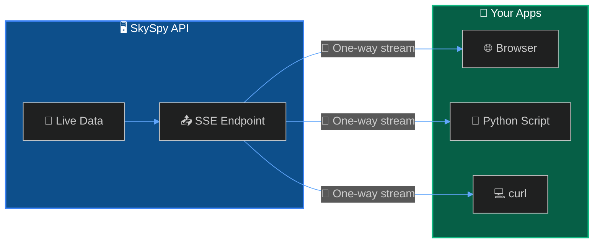

SkySpy provides a Server-Sent Events (SSE) stream for applications that only need to receive data. SSE is a lightweight alternative to Socket.IO, supported natively in all browsers without additional libraries.



<Info>
**When to use SSE vs Socket.IO** — Use **SSE** for simple, read-only clients (dashboards, monitors). Use **[Socket.IO](/docs/real-time-api)** when you need bi-directional communication or the request/response API for weather data.
</Info>

## Quick Start

Connect using the native browser `EventSource` API — no libraries required:

```javascript
const stream = new EventSource('http://localhost:5000/api/v1/map/sse');

stream.addEventListener('aircraft_update', (event) => {
  const data = JSON.parse(event.data);
  console.log('Aircraft:', data.aircraft);
});

stream.addEventListener('safety_event', (event) => {
  const alert = JSON.parse(event.data);
  console.warn('Safety:', alert.message);
});
```

## Connection

| Setting | Value |
| :--- | :--- |
| **Endpoint** | `GET /api/v1/map/sse` |
| **Content-Type** | `text/event-stream` |

### Query Parameters

| Parameter | Type | Default | Description |
| :--- | :--- | :--- | :--- |
| `replay_history` | boolean | `false` | 📜 Replay buffered events on connect |

<Tip>
Use `replay_history=true` to receive recent events immediately upon connection—useful for populating a dashboard with current state.
</Tip>

---

## Events

<CardGroup cols={3}>
  <Card title="✈️ aircraft_update" icon="plane">
    Position/telemetry changes
  </Card>
  <Card title="🛬 aircraft_new" icon="plane-arrival">
    New aircraft in coverage
  </Card>
  <Card title="🛫 aircraft_remove" icon="plane-departure">
    Aircraft left coverage
  </Card>
  <Card title="🛡️ safety_event" icon="shield-exclamation">
    TCAS, proximity, emergencies
  </Card>
  <Card title="🔔 alert_triggered" icon="bell">
    Custom rule matched
  </Card>
  <Card title="📡 acars_message" icon="message">
    ACARS/VDL2 decoded
  </Card>
</CardGroup>

---

## Comparison: SSE vs Socket.IO

| Feature | SSE | Socket.IO |
| :--- | :--- | :--- |
| **Direction** | Server → Client only | Bi-directional |
| **Request/Response** | ❌ No | ✅ Yes |
| **Weather API** | ❌ No | ✅ Yes |
| **Browser Support** | Native `EventSource` | Requires library |
| **Best For** | Simple dashboards | Full-featured apps |

---

## Implementation

<Cards columns={2}>
  <Card title="📤 Events" icon="signal-stream" href="/docs/sse/events">
    Event types and JSON payloads
  </Card>
  <Card title="💻 Client Examples" icon="code" href="/docs/sse/client-examples">
    JavaScript, React, Python, and curl
  </Card>
</Cards>

---

## Next Steps

<Cards columns={2}>
  <Card title="Real-Time API" icon="bolt" href="/docs/real-time-api">
    Full-featured Socket.IO streaming with request/response
  </Card>
  <Card title="Safety & Alerts" icon="bell" href="/docs/safety-and-alerts">
    Configure custom alert rules
  </Card>
</Cards>
