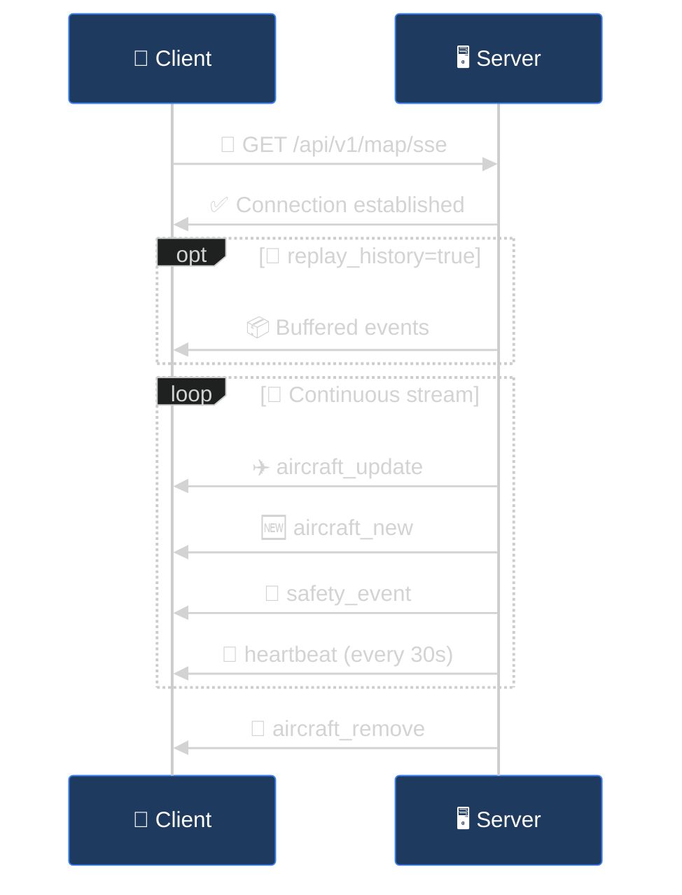
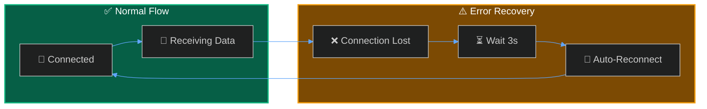

## Event Flow



---

## Event Reference

<Tabs>
  <Tab title="✈️ aircraft_update">
    Emitted when aircraft positions or telemetry change.

    ```json
    {
      "aircraft": [
        {
          "hex": "A12345",
          "flight": "UAL123",
          "lat": 47.6062,
          "lon": -122.3321,
          "alt": 35000,
          "gs": 450,
          "track": 270,
          "vr": 0,
          "squawk": "1200",
          "category": "A3",
          "type": "B738",
          "rssi": -12.5,
          "military": false,
          "emergency": false
        }
      ],
      "timestamp": "2024-01-15T12:00:00Z"
    }
    ```
  </Tab>
  <Tab title="🆕 aircraft_new">
    Emitted when a new aircraft enters coverage.

    ```json
    {
      "aircraft": [
        { "hex": "B67890", "flight": "DAL88" }
      ],
      "timestamp": "2024-01-15T12:00:05Z"
    }
    ```
  </Tab>
  <Tab title="👋 aircraft_remove">
    Emitted when aircraft leave coverage or signal is lost.

    ```json
    {
      "icaos": ["A12345"],
      "timestamp": "2024-01-15T12:05:00Z"
    }
    ```
  </Tab>
  <Tab title="🛡️ safety_event">
    Emitted when the safety engine detects a conflict.

    ```json
    {
      "event_type": "proximity_conflict",
      "severity": "critical",
      "icao": "A12345",
      "icao_2": "B67890",
      "callsign": "UAL123",
      "callsign_2": "DAL456",
      "message": "Proximity conflict: 0.5nm lateral, 500ft vertical",
      "details": {
        "distance_nm": 0.5,
        "altitude_diff_ft": 500
      },
      "timestamp": "2024-01-15T12:00:00Z"
    }
    ```
  </Tab>
  <Tab title="🔔 alert_triggered">
    Emitted when a custom alert rule matches.

    ```json
    {
      "rule_id": 1,
      "rule_name": "Low Altitude",
      "icao": "A12345",
      "callsign": "UAL123",
      "message": "Aircraft below 3000ft",
      "priority": "warning",
      "aircraft_data": {
        "hex": "A12345",
        "alt": 2500,
        "lat": 47.5,
        "lon": -122.3
      }
    }
    ```
  </Tab>
  <Tab title="📡 acars_message">
    Emitted when an ACARS/VDL2 message is decoded.

    ```json
    {
      "source": "acars",
      "icao_hex": "A12345",
      "registration": "N12345",
      "callsign": "UAL123",
      "label": "H1",
      "text": "CONFIRM DEPARTURE",
      "frequency": 130.025,
      "signal_level": -15.0,
      "timestamp": "2024-01-15T12:10:00Z"
    }
    ```
  </Tab>
  <Tab title="💓 heartbeat">
    Emitted every ~30 seconds to keep the connection alive.

    ```json
    {
      "count": 45,
      "timestamp": "2024-01-15T12:00:30Z"
    }
    ```
  </Tab>
</Tabs>

---

## Error Handling

SSE connections automatically reconnect on failure:

```javascript
stream.onerror = (err) => {
  console.error('SSE connection error:', err);
  // EventSource will auto-reconnect
};
```



<Warning>
**Cross-Origin Requests** — If connecting from a different origin, ensure CORS is configured on the API. The SSE endpoint supports CORS by default.
</Warning>

---

## Status Endpoint

Check SSE broadcaster status:

```bash
curl http://localhost:5000/api/v1/map/sse/status
```

```json
{
  "mode": "redis",
  "redis_enabled": true,
  "subscribers": 15,
  "tracked_aircraft": 45,
  "history": {
    "size": 500,
    "max_size": 5000
  }
}
```
