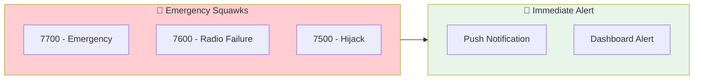
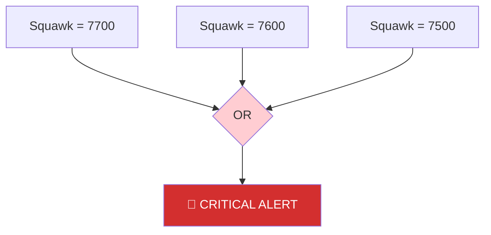

Set up real-time monitoring for aircraft broadcasting emergency squawk codes. Get instant alerts when aircraft in distress enter your receiver's coverage.



## Emergency Squawk Codes

<Warning>
These codes indicate serious aviation emergencies. SkySpy automatically detects and highlights these.
</Warning>

| Code | Meaning | Description |
| :--- | :--- | :--- |
| **7700** | 🚨 General Emergency | Mayday - aircraft in distress |
| **7600** | 📻 Radio Failure | Lost communications (NORDO) |
| **7500** | ⚠️ Hijack | Unlawful interference |

---

## Built-in Safety Monitoring

SkySpy's safety engine automatically detects emergency squawks. To enable:

```bash
# In your .env file
SAFETY_MONITORING_ENABLED=true
```

When enabled, emergency squawks trigger:
- Real-time dashboard alerts
- Push notifications (if configured)
- SSE/Socket.IO events

---

## Custom Alert Rule

Create a dedicated alert rule for emergency tracking:

```bash
curl -X POST http://localhost:5000/api/alerts/rules \
  -H "Content-Type: application/json" \
  -d '{
    "name": "Emergency Squawk Monitor",
    "enabled": true,
    "priority": "critical",
    "conditions": {
      "operator": "OR",
      "conditions": [
        { "field": "squawk", "operator": "eq", "value": "7700" },
        { "field": "squawk", "operator": "eq", "value": "7600" },
        { "field": "squawk", "operator": "eq", "value": "7500" }
      ]
    },
    "notification_enabled": true
  }'
```



---

## Python Emergency Monitor

For dedicated monitoring with logging and notifications:

```python
#!/usr/bin/env python3
"""
Emergency Squawk Monitor

Monitors for 7700, 7600, and 7500 squawks with detailed logging.
"""

import json
import os
from datetime import datetime
from typing import Optional

import requests
import sseclient

SKYSPY_URL = os.getenv("SKYSPY_URL", "http://localhost:5000")
LOG_FILE = "emergency_events.log"

# Emergency squawk definitions
EMERGENCY_SQUAWKS = {
    "7700": ("GENERAL EMERGENCY", "🚨", "Aircraft in distress - Mayday"),
    "7600": ("RADIO FAILURE", "📻", "Lost communications (NORDO)"),
    "7500": ("HIJACK", "⚠️", "Unlawful interference"),
}


def log_event(message: str):
    """Log event to file and console."""
    timestamp = datetime.now().isoformat()
    log_line = f"[{timestamp}] {message}"
    print(log_line)
    with open(LOG_FILE, "a") as f:
        f.write(log_line + "\n")


def format_emergency_alert(aircraft: dict, squawk: str) -> str:
    """Format an emergency alert message."""
    name, icon, description = EMERGENCY_SQUAWKS[squawk]
    callsign = aircraft.get("flight", "Unknown").strip() or "Unknown"

    return f"""
{'='*60}
{icon} {icon} {icon}  {name}  {icon} {icon} {icon}
{'='*60}

Description: {description}

AIRCRAFT DETAILS:
  Callsign:  {callsign}
  ICAO Hex:  {aircraft.get("hex", "Unknown")}
  Type:      {aircraft.get("type", "Unknown")}
  Squawk:    {squawk}

POSITION:
  Latitude:  {aircraft.get("lat", "Unknown")}
  Longitude: {aircraft.get("lon", "Unknown")}
  Altitude:  {aircraft.get("alt", "Unknown")} ft
  Speed:     {aircraft.get("gs", "Unknown")} kts
  Heading:   {aircraft.get("track", "Unknown")}°
  Distance:  {aircraft.get("distance", 0):.1f} NM

TIME: {datetime.now().strftime("%Y-%m-%d %H:%M:%S UTC")}

{'='*60}
"""


def send_notification(aircraft: dict, squawk: str):
    """Send emergency notification (customize this)."""
    name, icon, description = EMERGENCY_SQUAWKS[squawk]
    callsign = aircraft.get("flight", aircraft.get("hex", "Unknown"))

    message = f"{icon} {name}: {callsign} squawking {squawk}"

    # Example: Send to Discord webhook
    webhook_url = os.getenv("DISCORD_WEBHOOK_URL")
    if webhook_url:
        try:
            requests.post(webhook_url, json={
                "content": f"@everyone {message}",
                "embeds": [{
                    "title": f"{icon} {name}",
                    "description": description,
                    "color": 0xED4245,  # Red
                    "fields": [
                        {"name": "Callsign", "value": callsign, "inline": True},
                        {"name": "Squawk", "value": squawk, "inline": True},
                        {"name": "Altitude", "value": f"{aircraft.get('alt', 'N/A')} ft", "inline": True},
                    ]
                }]
            })
        except Exception as e:
            log_event(f"Failed to send Discord notification: {e}")


def check_emergency_squawk(aircraft: dict) -> Optional[str]:
    """Check if aircraft has emergency squawk."""
    squawk = aircraft.get("squawk", "")
    if squawk in EMERGENCY_SQUAWKS:
        return squawk
    return None


def main():
    print("""
╔══════════════════════════════════════════════════════════╗
║           🚨 EMERGENCY SQUAWK MONITOR 🚨                  ║
║                                                          ║
║  Monitoring for: 7700 (Emergency)                        ║
║                  7600 (Radio Failure)                    ║
║                  7500 (Hijack)                           ║
╚══════════════════════════════════════════════════════════╝
    """)

    log_event(f"Starting emergency monitor, connecting to {SKYSPY_URL}")

    # Track already-alerted aircraft
    alerted = {}

    while True:
        try:
            url = f"{SKYSPY_URL}/api/v1/map/sse"
            response = requests.get(url, stream=True)
            client = sseclient.SSEClient(response)

            log_event("Connected to SkySpy SSE stream")

            for event in client.events():
                try:
                    if event.event not in ["aircraft_update", "aircraft_new"]:
                        continue

                    data = json.loads(event.data)

                    for aircraft in data.get("aircraft", []):
                        icao = aircraft.get("hex")
                        squawk = check_emergency_squawk(aircraft)

                        if squawk:
                            # Check if we've already alerted on this
                            last_alert = alerted.get(icao)
                            now = datetime.now()

                            # Re-alert if 5 minutes have passed
                            if last_alert and (now - last_alert).seconds < 300:
                                continue

                            # New emergency!
                            alert_text = format_emergency_alert(aircraft, squawk)
                            log_event(alert_text)

                            # Send notification
                            send_notification(aircraft, squawk)

                            # Track this alert
                            alerted[icao] = now

                except json.JSONDecodeError:
                    continue

        except requests.exceptions.ConnectionError:
            log_event("Connection lost, reconnecting in 5 seconds...")
            import time
            time.sleep(5)
        except KeyboardInterrupt:
            log_event("Shutting down emergency monitor")
            break


if __name__ == "__main__":
    main()
```

Run it:

```bash
pip install sseclient-py requests
python emergency_monitor.py
```

---

## Dashboard Integration

SkySpy's built-in dashboard automatically:

<CardGroup cols={2}>
  <Card title="Visual Highlighting" icon="eye">
    Emergency aircraft shown in red with blinking indicator
  </Card>
  <Card title="Priority Sorting" icon="arrow-up">
    Emergency traffic sorted to top of aircraft list
  </Card>
  <Card title="Alert Banner" icon="triangle-exclamation">
    Full-width alert banner for active emergencies
  </Card>
  <Card title="Squawk Display" icon="hashtag">
    Emergency squawk codes highlighted in bright red
  </Card>
</CardGroup>

---

## Example Alert Output

```
============================================================
🚨 🚨 🚨  GENERAL EMERGENCY  🚨 🚨 🚨
============================================================

Description: Aircraft in distress - Mayday

AIRCRAFT DETAILS:
  Callsign:  UAL1234
  ICAO Hex:  A12345
  Type:      B738
  Squawk:    7700

POSITION:
  Latitude:  47.6062
  Longitude: -122.3321
  Altitude:  8500 ft
  Speed:     280 kts
  Heading:   270°
  Distance:  12.4 NM

TIME: 2024-01-15 14:32:18 UTC

============================================================
```

---

## Important Notes

<Info>
**False Positives**: Pilots occasionally squawk emergency codes accidentally or during training. Not every 7700 is a real emergency.
</Info>

<Warning>
**Do Not Interfere**: If you observe a real emergency, do not attempt to contact the aircraft or interfere with emergency services. ATC and first responders are already handling it.
</Warning>

---

## Combine with Safety Monitoring

The built-in safety engine also detects:

- TCAS Resolution Advisories (RA)
- TCAS Traffic Advisories (TA)
- Proximity conflicts
- Extreme vertical rates

Enable all safety monitoring:

```bash
SAFETY_MONITORING_ENABLED=true
SAFETY_PROXIMITY_NM=1.0
SAFETY_ALTITUDE_DIFF_FT=1000
```

---

## Next Steps

<Cards columns={2}>
  <Card title="Safety & Alerts" icon="shield" href="/docs/safety-and-alerts">
    Configure all safety monitoring options
  </Card>
  <Card title="Discord Alert Bot" icon="discord" href="/docs/discord-alert-bot">
    Send emergency alerts to Discord
  </Card>
</Cards>
