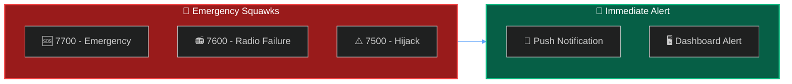
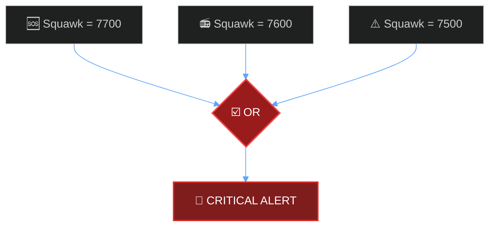

Set up real-time monitoring for aircraft broadcasting emergency squawk codes.



## Emergency Squawk Codes

<Warning>
These codes indicate serious aviation emergencies. SkySpy automatically detects and highlights these.
</Warning>

| Code | Meaning | Description |
| :--- | :--- | :--- |
| **7700** | 🚨 General Emergency | Mayday - aircraft in distress |
| **7600** | 📻 Radio Failure | Lost communications (NORDO) |
| **7500** | ⚠️ Hijack | Unlawful interference |

---

## Built-in Safety Monitoring

Enable in your `.env` file:

```bash
SAFETY_MONITORING_ENABLED=true
```

When enabled, emergency squawks trigger dashboard alerts and push notifications automatically.

---

## Custom Alert Rule

```bash
curl -X POST http://localhost:5000/api/alerts/rules \
  -H "Content-Type: application/json" \
  -d '{
    "name": "Emergency Squawk Monitor",
    "enabled": true,
    "priority": "critical",
    "conditions": {
      "operator": "OR",
      "conditions": [
        { "field": "squawk", "operator": "eq", "value": "7700" },
        { "field": "squawk", "operator": "eq", "value": "7600" },
        { "field": "squawk", "operator": "eq", "value": "7500" }
      ]
    },
    "notification_enabled": true
  }'
```



---

## Dashboard Integration

<CardGroup cols={2}>
  <Card title="Visual Highlighting" icon="eye">
    Emergency aircraft shown in red with blinking indicator
  </Card>
  <Card title="Priority Sorting" icon="arrow-up">
    Emergency traffic sorted to top of aircraft list
  </Card>
</CardGroup>

---

## Important Notes

<Info>
**False Positives**: Pilots occasionally squawk emergency codes accidentally or during training.
</Info>

<Warning>
**Do Not Interfere**: If you observe a real emergency, do not attempt to contact the aircraft. ATC and first responders are already handling it.
</Warning>

---

## Next Steps

<Cards columns={2}>
  <Card title="Safety & Alerts" icon="shield" href="/docs/safety-and-alerts">
    Configure all safety monitoring options
  </Card>
  <Card title="Discord Alert Bot" icon="discord" href="/docs/discord-alert-bot">
    Send emergency alerts to Discord
  </Card>
</Cards>
