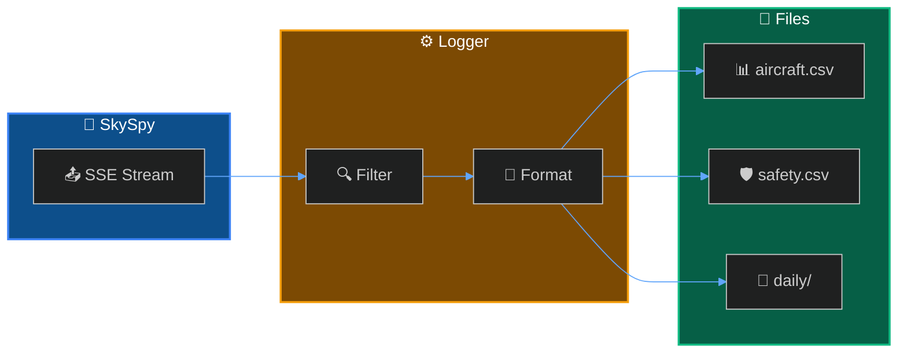

Create a logging system that records all aircraft sightings to CSV files.



## What You'll Build

<CardGroup cols={2}>
  <Card title="Continuous Logging" icon="clock">
    Record every aircraft sighting automatically
  </Card>
  <Card title="Daily Rotation" icon="calendar">
    Organize logs by date for easy analysis
  </Card>
  <Card title="Safety Events" icon="shield">
    Separate log for safety and emergency events
  </Card>
  <Card title="Configurable Fields" icon="sliders">
    Choose which data points to record
  </Card>
</CardGroup>

## Prerequisites

<Check>
**SkySpy running** — API accessible at `http://localhost:5000`
</Check>

<Check>
**Python 3.8+** — With pip for package installation
</Check>

---

## Quick Start

```bash
pip install sseclient-py requests
python csv_logger.py
```

---

## Implementation

<Cards columns={2}>
  <Card title="Basic Logger" icon="code" href="/docs/export-csv/basic">
    Simple CSV logging script
  </Card>
  <Card title="Daily Rotation" icon="calendar" href="/docs/export-csv/daily">
    Rotate logs by date
  </Card>
  <Card title="Safety Events" icon="shield" href="/docs/export-csv/safety">
    Log emergencies separately
  </Card>
  <Card title="Analysis" icon="chart-line" href="/docs/export-csv/analysis">
    Analyze with pandas
  </Card>
</Cards>

---

## Example Output

```csv
timestamp,hex,flight,type,lat,lon,alt,gs,distance,military,emergency
2024-01-15T14:32:18,A12345,UAL123,B738,47.6062,-122.3321,35000,450,12.4,False,False
2024-01-15T14:32:18,AE1234,RCH419,C17,47.5500,-122.4000,28000,420,18.2,True,False
```

---

## Next Steps

<Cards columns={2}>
  <Card title="Track Specific Aircraft" icon="plane" href="/docs/track-aircraft">
    Filter logging to specific aircraft
  </Card>
  <Card title="Military Spotter" icon="jet-fighter" href="/docs/military-spotter">
    Log only military aircraft
  </Card>
</Cards>
