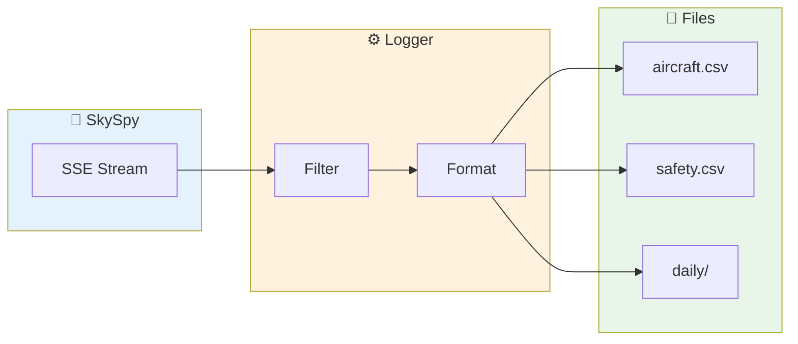

Create a logging system that records all aircraft sightings to CSV files. Perfect for building historical records, analyzing traffic patterns, or feeding data to other tools.



## What You'll Build

<CardGroup cols={2}>
  <Card title="Continuous Logging" icon="clock">
    Record every aircraft sighting automatically
  </Card>
  <Card title="Daily Rotation" icon="calendar">
    Organize logs by date for easy analysis
  </Card>
  <Card title="Safety Events" icon="shield">
    Separate log for safety and emergency events
  </Card>
  <Card title="Configurable Fields" icon="sliders">
    Choose which data points to record
  </Card>
</CardGroup>

## Prerequisites

<Check>
**SkySpy running** — API accessible at `http://localhost:5000`
</Check>

<Check>
**Python 3.8+** — With pip for package installation
</Check>

---

## Basic CSV Logger

A simple script that logs all aircraft to a single CSV file:

```python
#!/usr/bin/env python3
"""
SkySpy CSV Logger

Logs all aircraft sightings to a CSV file.
"""

import csv
import json
import os
from datetime import datetime
from pathlib import Path

import requests
import sseclient

# Configuration
SKYSPY_URL = os.getenv("SKYSPY_URL", "http://localhost:5000")
OUTPUT_DIR = Path("logs")
OUTPUT_FILE = OUTPUT_DIR / "aircraft.csv"

# Fields to log
FIELDS = [
    "timestamp",
    "hex",
    "flight",
    "type",
    "lat",
    "lon",
    "alt",
    "gs",
    "track",
    "vr",
    "squawk",
    "distance",
    "military",
    "emergency",
]


def setup_csv():
    """Create output directory and CSV with headers."""
    OUTPUT_DIR.mkdir(exist_ok=True)

    if not OUTPUT_FILE.exists():
        with open(OUTPUT_FILE, "w", newline="") as f:
            writer = csv.DictWriter(f, fieldnames=FIELDS)
            writer.writeheader()
        print(f"Created {OUTPUT_FILE}")


def log_aircraft(aircraft: dict):
    """Append aircraft to CSV file."""
    row = {
        "timestamp": datetime.now().isoformat(),
        "hex": aircraft.get("hex", ""),
        "flight": aircraft.get("flight", "").strip(),
        "type": aircraft.get("type", ""),
        "lat": aircraft.get("lat", ""),
        "lon": aircraft.get("lon", ""),
        "alt": aircraft.get("alt", ""),
        "gs": aircraft.get("gs", ""),
        "track": aircraft.get("track", ""),
        "vr": aircraft.get("vr", ""),
        "squawk": aircraft.get("squawk", ""),
        "distance": round(aircraft.get("distance", 0), 2),
        "military": aircraft.get("military", False),
        "emergency": aircraft.get("emergency", False),
    }

    with open(OUTPUT_FILE, "a", newline="") as f:
        writer = csv.DictWriter(f, fieldnames=FIELDS)
        writer.writerow(row)


def main():
    print(f"📝 SkySpy CSV Logger")
    print(f"📡 Connecting to {SKYSPY_URL}")
    print(f"📁 Output: {OUTPUT_FILE}")
    print()

    setup_csv()

    # Track logged aircraft to avoid duplicates per session
    logged_this_minute = set()
    last_minute = None

    count = 0

    while True:
        try:
            url = f"{SKYSPY_URL}/api/v1/map/sse"
            response = requests.get(url, stream=True)
            client = sseclient.SSEClient(response)

            print("✅ Connected, logging aircraft...")

            for event in client.events():
                try:
                    if event.event not in ["aircraft_update", "aircraft_new"]:
                        continue

                    data = json.loads(event.data)
                    current_minute = datetime.now().replace(second=0, microsecond=0)

                    # Reset duplicate tracking each minute
                    if current_minute != last_minute:
                        logged_this_minute.clear()
                        last_minute = current_minute

                    for aircraft in data.get("aircraft", []):
                        icao = aircraft.get("hex")

                        # Skip if already logged this minute
                        if icao in logged_this_minute:
                            continue

                        log_aircraft(aircraft)
                        logged_this_minute.add(icao)
                        count += 1

                        if count % 100 == 0:
                            print(f"📊 Logged {count} records")

                except json.JSONDecodeError:
                    continue

        except requests.exceptions.ConnectionError:
            print("❌ Connection lost, reconnecting...")
            import time
            time.sleep(5)
        except KeyboardInterrupt:
            print(f"\n✅ Logged {count} total records to {OUTPUT_FILE}")
            break


if __name__ == "__main__":
    main()
```

Run it:

```bash
pip install sseclient-py requests
python csv_logger.py
```

---

## Advanced: Daily Rotation

Rotate log files daily for better organization:

```python
#!/usr/bin/env python3
"""
SkySpy Daily CSV Logger

Logs aircraft to daily CSV files with automatic rotation.
"""

import csv
import json
import os
from datetime import datetime, date
from pathlib import Path

import requests
import sseclient

SKYSPY_URL = os.getenv("SKYSPY_URL", "http://localhost:5000")
OUTPUT_DIR = Path("logs")

FIELDS = [
    "timestamp", "hex", "flight", "type", "lat", "lon",
    "alt", "gs", "track", "vr", "squawk", "distance",
    "military", "emergency", "category"
]


class DailyCSVLogger:
    def __init__(self, base_dir: Path):
        self.base_dir = base_dir
        self.base_dir.mkdir(exist_ok=True)
        self.current_date = None
        self.writer = None
        self.file_handle = None

    def get_file_path(self, d: date) -> Path:
        """Get file path for a specific date."""
        return self.base_dir / f"aircraft_{d.isoformat()}.csv"

    def rotate_if_needed(self):
        """Rotate to new file if date changed."""
        today = date.today()

        if today != self.current_date:
            # Close existing file
            if self.file_handle:
                self.file_handle.close()

            # Open new file
            file_path = self.get_file_path(today)
            file_exists = file_path.exists()

            self.file_handle = open(file_path, "a", newline="")
            self.writer = csv.DictWriter(self.file_handle, fieldnames=FIELDS)

            if not file_exists:
                self.writer.writeheader()
                print(f"📁 Created new log file: {file_path}")

            self.current_date = today

    def log(self, aircraft: dict):
        """Log aircraft to current day's file."""
        self.rotate_if_needed()

        row = {
            "timestamp": datetime.now().isoformat(),
            "hex": aircraft.get("hex", ""),
            "flight": aircraft.get("flight", "").strip(),
            "type": aircraft.get("type", ""),
            "lat": aircraft.get("lat", ""),
            "lon": aircraft.get("lon", ""),
            "alt": aircraft.get("alt", ""),
            "gs": aircraft.get("gs", ""),
            "track": aircraft.get("track", ""),
            "vr": aircraft.get("vr", ""),
            "squawk": aircraft.get("squawk", ""),
            "distance": round(aircraft.get("distance", 0), 2),
            "military": aircraft.get("military", False),
            "emergency": aircraft.get("emergency", False),
            "category": aircraft.get("category", ""),
        }

        self.writer.writerow(row)
        self.file_handle.flush()

    def close(self):
        """Close the current file."""
        if self.file_handle:
            self.file_handle.close()


def main():
    print(f"📝 SkySpy Daily CSV Logger")
    print(f"📡 Connecting to {SKYSPY_URL}")
    print(f"📁 Output directory: {OUTPUT_DIR}")
    print()

    logger = DailyCSVLogger(OUTPUT_DIR)
    logged_this_minute = set()
    last_minute = None
    count = 0

    try:
        while True:
            try:
                url = f"{SKYSPY_URL}/api/v1/map/sse"
                response = requests.get(url, stream=True)
                client = sseclient.SSEClient(response)

                print("✅ Connected, logging aircraft...")

                for event in client.events():
                    try:
                        if event.event not in ["aircraft_update", "aircraft_new"]:
                            continue

                        data = json.loads(event.data)
                        current_minute = datetime.now().replace(second=0, microsecond=0)

                        if current_minute != last_minute:
                            logged_this_minute.clear()
                            last_minute = current_minute

                        for aircraft in data.get("aircraft", []):
                            icao = aircraft.get("hex")

                            if icao in logged_this_minute:
                                continue

                            logger.log(aircraft)
                            logged_this_minute.add(icao)
                            count += 1

                            if count % 100 == 0:
                                print(f"📊 Logged {count} records")

                    except json.JSONDecodeError:
                        continue

            except requests.exceptions.ConnectionError:
                print("❌ Connection lost, reconnecting...")
                import time
                time.sleep(5)

    except KeyboardInterrupt:
        print(f"\n✅ Logged {count} total records")
    finally:
        logger.close()


if __name__ == "__main__":
    main()
```

---

## Safety Events Logger

Log safety events (emergencies, TCAS, proximity) separately:

```python
#!/usr/bin/env python3
"""
SkySpy Safety Events Logger

Logs safety events and emergencies to a separate CSV.
"""

import csv
import json
import os
from datetime import datetime
from pathlib import Path

import requests
import sseclient

SKYSPY_URL = os.getenv("SKYSPY_URL", "http://localhost:5000")
OUTPUT_FILE = Path("logs/safety_events.csv")

FIELDS = [
    "timestamp",
    "event_type",
    "severity",
    "icao",
    "icao_2",
    "callsign",
    "message",
    "details",
]


def setup_csv():
    """Create output file with headers."""
    OUTPUT_FILE.parent.mkdir(exist_ok=True)

    if not OUTPUT_FILE.exists():
        with open(OUTPUT_FILE, "w", newline="") as f:
            writer = csv.DictWriter(f, fieldnames=FIELDS)
            writer.writeheader()


def log_safety_event(event: dict):
    """Log safety event to CSV."""
    row = {
        "timestamp": datetime.now().isoformat(),
        "event_type": event.get("event_type", ""),
        "severity": event.get("severity", ""),
        "icao": event.get("icao", ""),
        "icao_2": event.get("icao_2", ""),
        "callsign": event.get("callsign", ""),
        "message": event.get("message", ""),
        "details": json.dumps(event.get("details", {})),
    }

    with open(OUTPUT_FILE, "a", newline="") as f:
        writer = csv.DictWriter(f, fieldnames=FIELDS)
        writer.writerow(row)

    print(f"⚠️ {event.get('severity', '').upper()}: {event.get('message', '')}")


def main():
    print(f"🛡️ SkySpy Safety Events Logger")
    print(f"📁 Output: {OUTPUT_FILE}")
    print()

    setup_csv()

    while True:
        try:
            url = f"{SKYSPY_URL}/api/v1/map/sse"
            response = requests.get(url, stream=True)
            client = sseclient.SSEClient(response)

            print("✅ Connected, monitoring for safety events...")

            for event in client.events():
                try:
                    if event.event == "safety_event":
                        data = json.loads(event.data)
                        log_safety_event(data)

                except json.JSONDecodeError:
                    continue

        except requests.exceptions.ConnectionError:
            print("❌ Connection lost, reconnecting...")
            import time
            time.sleep(5)
        except KeyboardInterrupt:
            print("\n✅ Logger stopped")
            break


if __name__ == "__main__":
    main()
```

---

## Example CSV Output

```csv
timestamp,hex,flight,type,lat,lon,alt,gs,track,vr,squawk,distance,military,emergency
2024-01-15T14:32:18.123456,A12345,UAL123,B738,47.6062,-122.3321,35000,450,270,-500,1200,12.4,False,False
2024-01-15T14:32:18.234567,AE1234,RCH419,C17,47.5500,-122.4000,28000,420,180,0,4621,18.2,True,False
2024-01-15T14:32:18.345678,B67890,DAL456,A321,47.7000,-122.2500,15000,320,90,1500,1200,8.7,False,False
```

---

## Analyzing the Data

Once you have CSV files, analyze them with Python:

```python
import pandas as pd

# Load data
df = pd.read_csv("logs/aircraft_2024-01-15.csv")

# Basic statistics
print(f"Total sightings: {len(df)}")
print(f"Unique aircraft: {df['hex'].nunique()}")
print(f"Military: {df['military'].sum()}")
print(f"Emergencies: {df['emergency'].sum()}")

# Most common aircraft types
print("\nTop Aircraft Types:")
print(df['type'].value_counts().head(10))

# Distance distribution
print(f"\nDistance Stats:")
print(df['distance'].describe())

# Altitude distribution
print(f"\nAltitude Stats:")
print(df['alt'].describe())
```

---

## Running as a Service

<Accordion title="Systemd service (Linux)" icon="linux">

Create `/etc/systemd/system/skyspy-logger.service`:

```ini
[Unit]
Description=SkySpy CSV Logger
After=network.target

[Service]
Type=simple
User=your-user
WorkingDirectory=/path/to/logger
ExecStart=/usr/bin/python3 csv_logger.py
Restart=always
RestartSec=10

[Install]
WantedBy=multi-user.target
```

</Accordion>

<Accordion title="Docker" icon="docker">

```dockerfile
FROM python:3.11-slim

WORKDIR /app
COPY csv_logger.py .
RUN pip install sseclient-py requests

VOLUME /app/logs

CMD ["python", "csv_logger.py"]
```

```bash
docker run -d \
  -v ./logs:/app/logs \
  -e SKYSPY_URL="http://host.docker.internal:5000" \
  skyspy-logger
```

</Accordion>

---

## Next Steps

<Cards columns={2}>
  <Card title="Track Specific Aircraft" icon="plane" href="/docs/track-aircraft">
    Filter logging to specific aircraft
  </Card>
  <Card title="Military Spotter" icon="jet-fighter" href="/docs/military-spotter">
    Log only military aircraft
  </Card>
</Cards>
