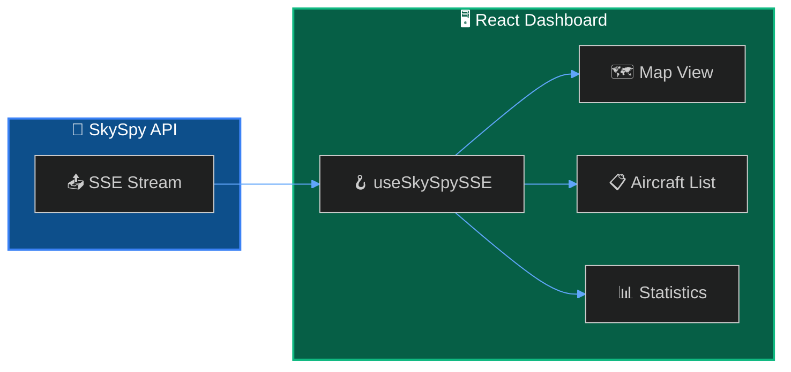

Build a custom aircraft monitoring dashboard that displays live data from SkySpy.



## What You'll Build

<CardGroup cols={2}>
  <Card title="Live Aircraft List" icon="list">
    Real-time table with sorting and filtering
  </Card>
  <Card title="Statistics Panel" icon="chart-bar">
    Live counts, distances, and altitude distribution
  </Card>
  <Card title="Safety Alerts" icon="bell">
    Toast notifications for safety events
  </Card>
  <Card title="Zero Dependencies" icon="feather">
    Uses native EventSource API
  </Card>
</CardGroup>

## Prerequisites

<Check>
**SkySpy running** — API accessible (we'll use `http://localhost:5000`)
</Check>

<Check>
**Node.js 18+** — For running the React development server
</Check>

---

## Quick Start

```bash
npm create vite@latest skyspy-dashboard -- --template react-ts
cd skyspy-dashboard
npm install
```

---

## Implementation

<Cards columns={2}>
  <Card title="SSE Hook" icon="code" href="/docs/live-dashboard/sse-hook">
    Create the useSkySpySSE React hook
  </Card>
  <Card title="Components" icon="puzzle-piece" href="/docs/live-dashboard/components">
    Build AircraftList, Statistics, and ConnectionStatus
  </Card>
  <Card title="Main App" icon="window" href="/docs/live-dashboard/app">
    Wire everything together
  </Card>
  <Card title="Styling" icon="palette" href="/docs/live-dashboard/styling">
    Add dark theme CSS
  </Card>
</Cards>

---

## Run the Dashboard

```bash
npm run dev
```

Open `http://localhost:5173` to see your dashboard.

---

## Extend It

<AccordionGroup>
  <Accordion title="Add a map view" icon="map">
    ```bash
    npm install leaflet react-leaflet
    ```
    See the [React Leaflet documentation](https://react-leaflet.js.org/) for integration.
  </Accordion>

  <Accordion title="Add sound alerts" icon="volume-high">
    ```typescript
    const playAlert = () => {
      const audio = new Audio('/alert.mp3');
      audio.play();
    };
    ```
  </Accordion>
</AccordionGroup>

---

## Next Steps

<Cards columns={2}>
  <Card title="SSE Streaming API" icon="signal-stream" href="/docs/sse">
    Learn more about SSE event types
  </Card>
  <Card title="Discord Alert Bot" icon="discord" href="/docs/discord-alert-bot">
    Add Discord notifications
  </Card>
</Cards>
