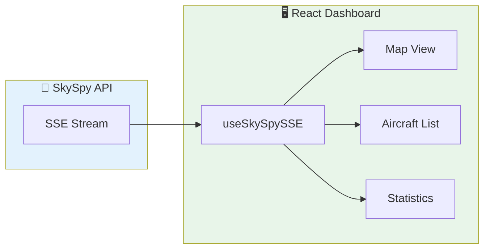

Build a custom aircraft monitoring dashboard that displays live data from SkySpy. Perfect for creating custom displays, embedding in other applications, or building specialized monitoring tools.



## What You'll Build

<CardGroup cols={2}>
  <Card title="Live Aircraft List" icon="list">
    Real-time table with sorting and filtering
  </Card>
  <Card title="Statistics Panel" icon="chart-bar">
    Live counts, distances, and altitude distribution
  </Card>
  <Card title="Safety Alerts" icon="bell">
    Toast notifications for safety events
  </Card>
  <Card title="Zero Dependencies" icon="feather">
    Uses native EventSource API
  </Card>
</CardGroup>

## Prerequisites

<Check>
**SkySpy running** — API accessible (we'll use `http://localhost:5000`)
</Check>

<Check>
**Node.js 18+** — For running the React development server
</Check>

<Check>
**React knowledge** — Basic understanding of hooks and components
</Check>

---

## Step 1: Create React App

```bash
npm create vite@latest skyspy-dashboard -- --template react-ts
cd skyspy-dashboard
npm install
```

---

## Step 2: Create the SSE Hook

Create `src/hooks/useSkySpySSE.ts`:

```typescript
import { useEffect, useState, useCallback } from 'react';

export interface Aircraft {
  hex: string;
  flight?: string;
  lat?: number;
  lon?: number;
  alt?: number;
  gs?: number;
  track?: number;
  vr?: number;
  squawk?: string;
  category?: string;
  type?: string;
  military?: boolean;
  emergency?: boolean;
  distance?: number;
}

export interface SafetyEvent {
  event_type: string;
  severity: string;
  icao: string;
  message: string;
  timestamp: string;
}

interface UseSkySpySSEOptions {
  url?: string;
  onSafetyEvent?: (event: SafetyEvent) => void;
}

export function useSkySpySSE(options: UseSkySpySSEOptions = {}) {
  const {
    url = 'http://localhost:5000/api/v1/map/sse?replay_history=true',
    onSafetyEvent
  } = options;

  const [aircraft, setAircraft] = useState<Map<string, Aircraft>>(new Map());
  const [connected, setConnected] = useState(false);
  const [error, setError] = useState<string | null>(null);

  useEffect(() => {
    const eventSource = new EventSource(url);

    eventSource.onopen = () => {
      setConnected(true);
      setError(null);
    };

    eventSource.onerror = () => {
      setConnected(false);
      setError('Connection lost. Reconnecting...');
    };

    // Handle aircraft updates
    eventSource.addEventListener('aircraft_update', (e) => {
      const data = JSON.parse(e.data);
      setAircraft(prev => {
        const next = new Map(prev);
        data.aircraft.forEach((a: Aircraft) => {
          const existing = next.get(a.hex);
          next.set(a.hex, { ...existing, ...a });
        });
        return next;
      });
    });

    // Handle new aircraft
    eventSource.addEventListener('aircraft_new', (e) => {
      const data = JSON.parse(e.data);
      setAircraft(prev => {
        const next = new Map(prev);
        data.aircraft.forEach((a: Aircraft) => next.set(a.hex, a));
        return next;
      });
    });

    // Handle aircraft removal
    eventSource.addEventListener('aircraft_remove', (e) => {
      const data = JSON.parse(e.data);
      setAircraft(prev => {
        const next = new Map(prev);
        data.icaos.forEach((hex: string) => next.delete(hex));
        return next;
      });
    });

    // Handle safety events
    eventSource.addEventListener('safety_event', (e) => {
      const data = JSON.parse(e.data);
      onSafetyEvent?.(data);
    });

    return () => {
      eventSource.close();
    };
  }, [url, onSafetyEvent]);

  return {
    aircraft: Array.from(aircraft.values()),
    connected,
    error,
    count: aircraft.size
  };
}
```

---

## Step 3: Create the Dashboard Components

### Aircraft List Component

Create `src/components/AircraftList.tsx`:

```tsx
import { useState, useMemo } from 'react';
import { Aircraft } from '../hooks/useSkySpySSE';

interface AircraftListProps {
  aircraft: Aircraft[];
}

type SortField = 'flight' | 'alt' | 'gs' | 'distance';
type SortDirection = 'asc' | 'desc';

export function AircraftList({ aircraft }: AircraftListProps) {
  const [sortField, setSortField] = useState<SortField>('distance');
  const [sortDirection, setSortDirection] = useState<SortDirection>('asc');
  const [filter, setFilter] = useState('');

  const sortedAircraft = useMemo(() => {
    return [...aircraft]
      .filter(a => {
        if (!filter) return true;
        const search = filter.toLowerCase();
        return (
          a.hex.toLowerCase().includes(search) ||
          a.flight?.toLowerCase().includes(search) ||
          a.type?.toLowerCase().includes(search)
        );
      })
      .sort((a, b) => {
        const aVal = a[sortField] ?? 0;
        const bVal = b[sortField] ?? 0;
        const cmp = aVal < bVal ? -1 : aVal > bVal ? 1 : 0;
        return sortDirection === 'asc' ? cmp : -cmp;
      });
  }, [aircraft, sortField, sortDirection, filter]);

  const handleSort = (field: SortField) => {
    if (sortField === field) {
      setSortDirection(d => d === 'asc' ? 'desc' : 'asc');
    } else {
      setSortField(field);
      setSortDirection('asc');
    }
  };

  const SortHeader = ({ field, label }: { field: SortField; label: string }) => (
    <th
      onClick={() => handleSort(field)}
      style={{ cursor: 'pointer', userSelect: 'none' }}
    >
      {label} {sortField === field && (sortDirection === 'asc' ? '↑' : '↓')}
    </th>
  );

  return (
    <div className="aircraft-list">
      <div className="list-header">
        <h2>Aircraft ({sortedAircraft.length})</h2>
        <input
          type="text"
          placeholder="Filter by callsign, ICAO, type..."
          value={filter}
          onChange={e => setFilter(e.target.value)}
          className="filter-input"
        />
      </div>

      <table>
        <thead>
          <tr>
            <SortHeader field="flight" label="Callsign" />
            <th>ICAO</th>
            <th>Type</th>
            <SortHeader field="alt" label="Altitude" />
            <SortHeader field="gs" label="Speed" />
            <SortHeader field="distance" label="Distance" />
            <th>Squawk</th>
          </tr>
        </thead>
        <tbody>
          {sortedAircraft.map(a => (
            <tr
              key={a.hex}
              className={`
                ${a.military ? 'military' : ''}
                ${a.emergency ? 'emergency' : ''}
              `}
            >
              <td className="callsign">{a.flight || '—'}</td>
              <td className="icao">{a.hex}</td>
              <td>{a.type || '—'}</td>
              <td>{a.alt ? `${a.alt.toLocaleString()} ft` : '—'}</td>
              <td>{a.gs ? `${a.gs} kts` : '—'}</td>
              <td>{a.distance ? `${a.distance.toFixed(1)} NM` : '—'}</td>
              <td className={
                ['7700', '7600', '7500'].includes(a.squawk || '')
                  ? 'emergency-squawk'
                  : ''
              }>
                {a.squawk || '—'}
              </td>
            </tr>
          ))}
        </tbody>
      </table>
    </div>
  );
}
```

### Statistics Component

Create `src/components/Statistics.tsx`:

```tsx
import { useMemo } from 'react';
import { Aircraft } from '../hooks/useSkySpySSE';

interface StatisticsProps {
  aircraft: Aircraft[];
}

export function Statistics({ aircraft }: StatisticsProps) {
  const stats = useMemo(() => {
    const withAlt = aircraft.filter(a => a.alt !== undefined);
    const withDist = aircraft.filter(a => a.distance !== undefined);

    return {
      total: aircraft.length,
      military: aircraft.filter(a => a.military).length,
      emergency: aircraft.filter(a => a.emergency).length,
      avgAltitude: withAlt.length
        ? Math.round(withAlt.reduce((sum, a) => sum + (a.alt || 0), 0) / withAlt.length)
        : 0,
      maxDistance: withDist.length
        ? Math.max(...withDist.map(a => a.distance || 0))
        : 0,
      closest: withDist.length
        ? Math.min(...withDist.map(a => a.distance || Infinity))
        : 0,
    };
  }, [aircraft]);

  return (
    <div className="statistics">
      <div className="stat-card">
        <div className="stat-value">{stats.total}</div>
        <div className="stat-label">Total Aircraft</div>
      </div>

      <div className="stat-card military">
        <div className="stat-value">{stats.military}</div>
        <div className="stat-label">Military</div>
      </div>

      <div className="stat-card emergency">
        <div className="stat-value">{stats.emergency}</div>
        <div className="stat-label">Emergency</div>
      </div>

      <div className="stat-card">
        <div className="stat-value">{stats.avgAltitude.toLocaleString()}</div>
        <div className="stat-label">Avg Altitude (ft)</div>
      </div>

      <div className="stat-card">
        <div className="stat-value">{stats.maxDistance.toFixed(1)}</div>
        <div className="stat-label">Max Range (NM)</div>
      </div>

      <div className="stat-card">
        <div className="stat-value">{stats.closest.toFixed(1)}</div>
        <div className="stat-label">Closest (NM)</div>
      </div>
    </div>
  );
}
```

### Connection Status Component

Create `src/components/ConnectionStatus.tsx`:

```tsx
interface ConnectionStatusProps {
  connected: boolean;
  error: string | null;
  count: number;
}

export function ConnectionStatus({ connected, error, count }: ConnectionStatusProps) {
  return (
    <div className={`connection-status ${connected ? 'connected' : 'disconnected'}`}>
      <span className="status-dot" />
      <span className="status-text">
        {connected ? `Connected • ${count} aircraft` : error || 'Disconnected'}
      </span>
    </div>
  );
}
```

---

## Step 4: Main App Component

Replace `src/App.tsx`:

```tsx
import { useCallback, useState } from 'react';
import { useSkySpySSE, SafetyEvent } from './hooks/useSkySpySSE';
import { AircraftList } from './components/AircraftList';
import { Statistics } from './components/Statistics';
import { ConnectionStatus } from './components/ConnectionStatus';
import './App.css';

function App() {
  const [alerts, setAlerts] = useState<SafetyEvent[]>([]);

  const handleSafetyEvent = useCallback((event: SafetyEvent) => {
    setAlerts(prev => [event, ...prev].slice(0, 10));
  }, []);

  const { aircraft, connected, error, count } = useSkySpySSE({
    url: 'http://localhost:5000/api/v1/map/sse?replay_history=true',
    onSafetyEvent: handleSafetyEvent
  });

  return (
    <div className="app">
      <header>
        <h1>✈️ SkySpy Dashboard</h1>
        <ConnectionStatus connected={connected} error={error} count={count} />
      </header>

      <main>
        <Statistics aircraft={aircraft} />

        <div className="content">
          <AircraftList aircraft={aircraft} />

          <div className="alerts-panel">
            <h3>Safety Alerts</h3>
            {alerts.length === 0 ? (
              <p className="no-alerts">No recent alerts</p>
            ) : (
              <ul className="alerts-list">
                {alerts.map((alert, i) => (
                  <li key={i} className={`alert ${alert.severity}`}>
                    <span className="alert-type">{alert.event_type}</span>
                    <span className="alert-message">{alert.message}</span>
                  </li>
                ))}
              </ul>
            )}
          </div>
        </div>
      </main>
    </div>
  );
}

export default App;
```

---

## Step 5: Add Styles

Replace `src/App.css`:

```css
* {
  box-sizing: border-box;
  margin: 0;
  padding: 0;
}

body {
  font-family: -apple-system, BlinkMacSystemFont, 'Segoe UI', Roboto, sans-serif;
  background: #0f172a;
  color: #e2e8f0;
}

.app {
  min-height: 100vh;
  display: flex;
  flex-direction: column;
}

header {
  display: flex;
  justify-content: space-between;
  align-items: center;
  padding: 1rem 2rem;
  background: #1e293b;
  border-bottom: 1px solid #334155;
}

header h1 {
  font-size: 1.5rem;
  font-weight: 600;
}

/* Connection Status */
.connection-status {
  display: flex;
  align-items: center;
  gap: 0.5rem;
  padding: 0.5rem 1rem;
  border-radius: 9999px;
  font-size: 0.875rem;
}

.connection-status.connected {
  background: rgba(34, 197, 94, 0.1);
  color: #22c55e;
}

.connection-status.disconnected {
  background: rgba(239, 68, 68, 0.1);
  color: #ef4444;
}

.status-dot {
  width: 8px;
  height: 8px;
  border-radius: 50%;
  background: currentColor;
}

/* Statistics */
.statistics {
  display: grid;
  grid-template-columns: repeat(auto-fit, minmax(150px, 1fr));
  gap: 1rem;
  padding: 1.5rem 2rem;
  background: #1e293b;
}

.stat-card {
  background: #334155;
  padding: 1rem;
  border-radius: 0.5rem;
  text-align: center;
}

.stat-card.military {
  border-left: 3px solid #6366f1;
}

.stat-card.emergency {
  border-left: 3px solid #ef4444;
}

.stat-value {
  font-size: 2rem;
  font-weight: 700;
  color: #fff;
}

.stat-label {
  font-size: 0.75rem;
  color: #94a3b8;
  text-transform: uppercase;
  margin-top: 0.25rem;
}

/* Main Content */
main {
  flex: 1;
  display: flex;
  flex-direction: column;
}

.content {
  display: grid;
  grid-template-columns: 1fr 300px;
  gap: 1rem;
  padding: 1rem 2rem;
  flex: 1;
}

/* Aircraft List */
.aircraft-list {
  background: #1e293b;
  border-radius: 0.5rem;
  overflow: hidden;
}

.list-header {
  display: flex;
  justify-content: space-between;
  align-items: center;
  padding: 1rem;
  border-bottom: 1px solid #334155;
}

.filter-input {
  background: #334155;
  border: 1px solid #475569;
  color: #e2e8f0;
  padding: 0.5rem 1rem;
  border-radius: 0.25rem;
  width: 250px;
}

table {
  width: 100%;
  border-collapse: collapse;
}

th, td {
  padding: 0.75rem 1rem;
  text-align: left;
  border-bottom: 1px solid #334155;
}

th {
  background: #334155;
  font-weight: 600;
  font-size: 0.75rem;
  text-transform: uppercase;
  color: #94a3b8;
}

tr:hover {
  background: #334155;
}

tr.military {
  background: rgba(99, 102, 241, 0.1);
}

tr.emergency {
  background: rgba(239, 68, 68, 0.1);
}

.callsign {
  font-weight: 600;
  font-family: monospace;
}

.icao {
  font-family: monospace;
  color: #94a3b8;
}

.emergency-squawk {
  color: #ef4444;
  font-weight: 700;
}

/* Alerts Panel */
.alerts-panel {
  background: #1e293b;
  border-radius: 0.5rem;
  padding: 1rem;
}

.alerts-panel h3 {
  margin-bottom: 1rem;
  font-size: 0.875rem;
  text-transform: uppercase;
  color: #94a3b8;
}

.no-alerts {
  color: #64748b;
  text-align: center;
  padding: 2rem;
}

.alerts-list {
  list-style: none;
  display: flex;
  flex-direction: column;
  gap: 0.5rem;
}

.alert {
  padding: 0.75rem;
  border-radius: 0.25rem;
  font-size: 0.875rem;
}

.alert.warning {
  background: rgba(250, 204, 21, 0.1);
  border-left: 3px solid #facc15;
}

.alert.critical {
  background: rgba(239, 68, 68, 0.1);
  border-left: 3px solid #ef4444;
}

.alert-type {
  display: block;
  font-weight: 600;
  margin-bottom: 0.25rem;
}

.alert-message {
  color: #94a3b8;
}
```

---

## Step 6: Run the Dashboard

```bash
npm run dev
```

Open `http://localhost:5173` to see your dashboard.

---

## Customize and Extend

<AccordionGroup>
  <Accordion title="Add a map view" icon="map">
    Integrate with Leaflet or Mapbox:

    ```bash
    npm install leaflet react-leaflet
    ```

    See the [React Leaflet documentation](https://react-leaflet.js.org/) for integration.
  </Accordion>

  <Accordion title="Add sound alerts" icon="volume-high">
    ```typescript
    const playAlert = () => {
      const audio = new Audio('/alert.mp3');
      audio.play();
    };

    const handleSafetyEvent = (event: SafetyEvent) => {
      if (event.severity === 'critical') {
        playAlert();
      }
    };
    ```
  </Accordion>

  <Accordion title="Add dark/light theme" icon="sun">
    Use CSS custom properties and a theme toggle:

    ```css
    :root {
      --bg-primary: #0f172a;
      --bg-secondary: #1e293b;
      --text-primary: #e2e8f0;
    }

    [data-theme="light"] {
      --bg-primary: #ffffff;
      --bg-secondary: #f1f5f9;
      --text-primary: #0f172a;
    }
    ```
  </Accordion>
</AccordionGroup>

---

## Next Steps

<Cards columns={2}>
  <Card title="SSE Streaming API" icon="signal-stream" href="/docs/sse">
    Learn more about SSE event types
  </Card>
  <Card title="Discord Alert Bot" icon="discord" href="/docs/discord-alert-bot">
    Add Discord notifications
  </Card>
</Cards>
