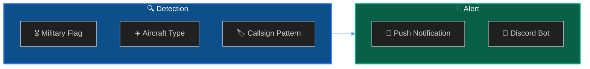
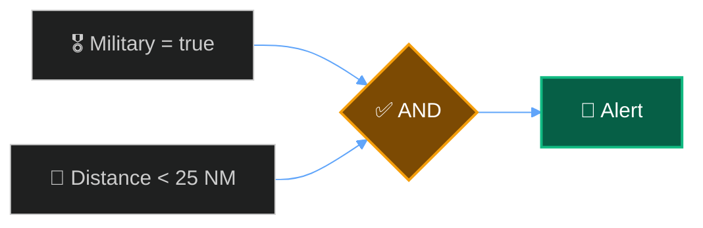

Set up alerts to track military aircraft in your receiver's coverage area.



## How Military Detection Works

<CardGroup cols={3}>
  <Card title="Military Flag" icon="flag">
    ADS-B category indicates military/government
  </Card>
  <Card title="ICAO Range" icon="hashtag">
    Military ICAO hex ranges by country
  </Card>
  <Card title="Callsign" icon="plane">
    Known military callsign patterns
  </Card>
</CardGroup>

---

## Dashboard Quick Setup

<Steps>
  <Step title="Open Alert Rules">
    Navigate to **Settings** → **Alert Rules**
  </Step>
  <Step title="Create Rule">
    Set Field: `military`, Operator: `eq`, Value: `true`
  </Step>
  <Step title="Add Distance Filter (Optional)">
    Field: `distance`, Operator: `lt`, Value: `50`
  </Step>
</Steps>

---

## API Rules

### Basic Military Alert

```bash
curl -X POST http://localhost:5000/api/alerts/rules \
  -H "Content-Type: application/json" \
  -d '{
    "name": "Military Aircraft",
    "enabled": true,
    "priority": "high",
    "conditions": {
      "operator": "AND",
      "conditions": [
        { "field": "military", "operator": "eq", "value": true }
      ]
    },
    "notification_enabled": true
  }'
```

### Military Within 25nm

```bash
curl -X POST http://localhost:5000/api/alerts/rules \
  -H "Content-Type: application/json" \
  -d '{
    "name": "Military Nearby",
    "priority": "high",
    "conditions": {
      "operator": "AND",
      "conditions": [
        { "field": "military", "operator": "eq", "value": true },
        { "field": "distance", "operator": "lt", "value": 25 }
      ]
    },
    "notification_enabled": true
  }'
```



---

## Common Military Aircraft

<AccordionGroup>
  <Accordion title="US Military" icon="flag-usa">
    | Type | Aircraft |
    | :--- | :--- |
    | F16 | Fighting Falcon |
    | F15 | Eagle |
    | C17 | Globemaster III |
    | C130 | Hercules |
    | KC135 | Stratotanker |
    | B52 | Stratofortress |
  </Accordion>
  <Accordion title="NATO / Allied" icon="globe">
    | Type | Aircraft |
    | :--- | :--- |
    | TYPHOON | Eurofighter |
    | RAFALE | Rafale |
    | TORNADO | Tornado |
    | GRIPEN | Gripen |
  </Accordion>
</AccordionGroup>

---

## Next Steps

<Cards columns={2}>
  <Card title="Discord Alert Bot" icon="discord" href="/docs/discord-alert-bot">
    Send military sightings to Discord
  </Card>
  <Card title="Export to CSV" icon="file-csv" href="/docs/export-csv">
    Log all sightings for analysis
  </Card>
</Cards>
