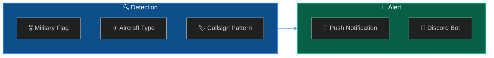
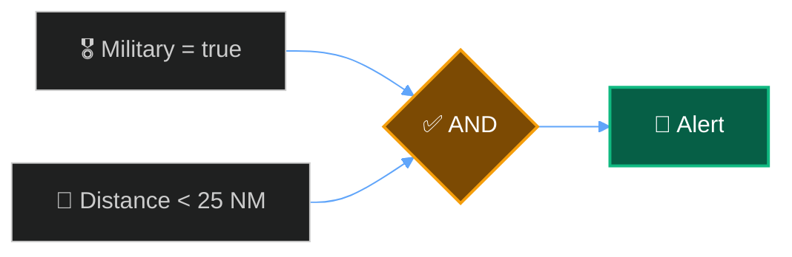

Set up alerts to track military aircraft in your receiver's coverage area. Great for aviation enthusiasts who want to spot interesting military traffic.



## How Military Detection Works

SkySpy identifies military aircraft through multiple signals:

<CardGroup cols={3}>
  <Card title="Military Flag" icon="flag">
    ADS-B category indicates military/government
  </Card>
  <Card title="ICAO Range" icon="hashtag">
    Military ICAO hex ranges by country
  </Card>
  <Card title="Callsign" icon="plane">
    Known military callsign patterns
  </Card>
</CardGroup>

---

## Quick Setup: Dashboard Rule

The fastest way to start tracking military aircraft:

<Steps>
  <Step title="Open Alert Rules">
    Navigate to **Settings** → **Alert Rules** in SkySpy
  </Step>
  <Step title="Create Rule">
    Click **New Rule** and configure:
    - **Name**: "Military Aircraft"
    - **Field**: `military`
    - **Operator**: `eq`
    - **Value**: `true`
  </Step>
  <Step title="Add Distance Filter (Optional)">
    Add another condition:
    - **Field**: `distance`
    - **Operator**: `lt`
    - **Value**: `50` (nautical miles)
  </Step>
  <Step title="Enable Notifications">
    Toggle **Push Notifications** on
  </Step>
</Steps>

---

## API Rule: Basic Military Alert

```bash
curl -X POST http://localhost:5000/api/alerts/rules \
  -H "Content-Type: application/json" \
  -d '{
    "name": "Military Aircraft",
    "enabled": true,
    "priority": "high",
    "conditions": {
      "operator": "AND",
      "conditions": [
        { "field": "military", "operator": "eq", "value": true }
      ]
    },
    "notification_enabled": true
  }'
```

---

## Advanced: Military + Distance Filter

Only alert when military aircraft are within 25 nautical miles:

```bash
curl -X POST http://localhost:5000/api/alerts/rules \
  -H "Content-Type: application/json" \
  -d '{
    "name": "Military Nearby",
    "enabled": true,
    "priority": "high",
    "conditions": {
      "operator": "AND",
      "conditions": [
        { "field": "military", "operator": "eq", "value": true },
        { "field": "distance", "operator": "lt", "value": 25 }
      ]
    },
    "notification_enabled": true
  }'
```



---

## Advanced: Low-Flying Military

Alert when military aircraft are below 10,000 feet nearby:

```bash
curl -X POST http://localhost:5000/api/alerts/rules \
  -H "Content-Type: application/json" \
  -d '{
    "name": "Low Military Traffic",
    "enabled": true,
    "priority": "critical",
    "conditions": {
      "operator": "AND",
      "conditions": [
        { "field": "military", "operator": "eq", "value": true },
        { "field": "altitude", "operator": "lt", "value": 10000 },
        { "field": "distance", "operator": "lt", "value": 30 }
      ]
    },
    "notification_enabled": true
  }'
```

---

## Python Spotter Script

For more control and logging, use this Python script:

```python
#!/usr/bin/env python3
"""
Military Aircraft Spotter

Monitors for military aircraft and logs sightings.
"""

import json
import os
from datetime import datetime

import requests
import sseclient

SKYSPY_URL = os.getenv("SKYSPY_URL", "http://localhost:5000")
MAX_DISTANCE = 50  # NM
LOG_FILE = "military_sightings.csv"

# Common military callsign prefixes
MILITARY_CALLSIGNS = [
    "RCH",   # US Air Mobility Command
    "EVAC",  # Aeromedical evacuation
    "REACH", # USAF tankers
    "DUKE",  # KC-135
    "BRASS", # Various military
    "IRON",  # USAF
    "KNIFE", # Special ops
    "TOPCAT", # F/A-18
    "VIPER", # F-16
    "RAIDER", # B-2
    "DEATH", # A-10
]


def is_military(aircraft: dict) -> tuple[bool, str]:
    """Check if aircraft appears to be military."""

    # Direct military flag
    if aircraft.get("military"):
        return True, "military_flag"

    # Check callsign patterns
    callsign = aircraft.get("flight", "").strip().upper()
    for prefix in MILITARY_CALLSIGNS:
        if callsign.startswith(prefix):
            return True, f"callsign_{prefix}"

    # Check aircraft type (common military types)
    mil_types = ["F16", "F15", "F18", "F22", "F35", "C17", "C130", "C5",
                 "KC10", "KC135", "KC46", "B52", "B1", "B2", "A10",
                 "E3", "E6", "E8", "P8", "RC135", "U2", "RQ4"]
    ac_type = aircraft.get("type", "").upper()
    for mil_type in mil_types:
        if mil_type in ac_type:
            return True, f"type_{ac_type}"

    return False, ""


def log_sighting(aircraft: dict, reason: str):
    """Log a military sighting to CSV."""
    with open(LOG_FILE, "a") as f:
        row = [
            datetime.now().isoformat(),
            aircraft.get("hex", ""),
            aircraft.get("flight", "").strip(),
            aircraft.get("type", ""),
            str(aircraft.get("alt", "")),
            str(aircraft.get("gs", "")),
            str(aircraft.get("distance", "")),
            reason,
        ]
        f.write(",".join(row) + "\n")


def format_sighting(aircraft: dict, reason: str) -> str:
    """Format a sighting for display."""
    callsign = aircraft.get("flight", "Unknown").strip()
    return f"""
🎖️ MILITARY AIRCRAFT SPOTTED
━━━━━━━━━━━━━━━━━━━━━━━━━━━━
Detection: {reason}
Callsign:  {callsign}
ICAO:      {aircraft.get("hex", "Unknown")}
Type:      {aircraft.get("type", "Unknown")}
Altitude:  {aircraft.get("alt", 0):,} ft
Speed:     {aircraft.get("gs", 0)} kts
Distance:  {aircraft.get("distance", 0):.1f} NM
Time:      {datetime.now().strftime("%Y-%m-%d %H:%M:%S")}
━━━━━━━━━━━━━━━━━━━━━━━━━━━━
"""


def main():
    print("🎖️ Military Aircraft Spotter")
    print(f"📡 Connecting to {SKYSPY_URL}")
    print(f"📍 Max distance: {MAX_DISTANCE} NM")
    print(f"📝 Logging to: {LOG_FILE}")
    print()

    # Initialize CSV header
    if not os.path.exists(LOG_FILE):
        with open(LOG_FILE, "w") as f:
            f.write("timestamp,icao,callsign,type,altitude,speed,distance,detection\n")

    spotted = set()

    while True:
        try:
            url = f"{SKYSPY_URL}/api/v1/map/sse"
            response = requests.get(url, stream=True)
            client = sseclient.SSEClient(response)

            print("✅ Connected, watching for military traffic...")

            for event in client.events():
                try:
                    if event.event not in ["aircraft_update", "aircraft_new"]:
                        continue

                    data = json.loads(event.data)

                    for aircraft in data.get("aircraft", []):
                        icao = aircraft.get("hex")
                        distance = aircraft.get("distance", 0)

                        # Skip if too far or already spotted
                        if distance > MAX_DISTANCE or icao in spotted:
                            continue

                        is_mil, reason = is_military(aircraft)

                        if is_mil:
                            print(format_sighting(aircraft, reason))
                            log_sighting(aircraft, reason)
                            spotted.add(icao)

                except json.JSONDecodeError:
                    continue

        except requests.exceptions.ConnectionError:
            print("❌ Connection lost, reconnecting...")
            import time
            time.sleep(5)
        except KeyboardInterrupt:
            print(f"\n👋 Spotted {len(spotted)} military aircraft")
            break


if __name__ == "__main__":
    main()
```

Run it:

```bash
pip install sseclient-py requests
python military_spotter.py
```

---

## Common Military Aircraft Types

<AccordionGroup>
  <Accordion title="US Military" icon="flag-usa">
    | Type | Aircraft |
    | :--- | :--- |
    | F16 | Fighting Falcon |
    | F15 | Eagle |
    | F18 | Hornet / Super Hornet |
    | F22 | Raptor |
    | F35 | Lightning II |
    | A10 | Thunderbolt II (Warthog) |
    | C17 | Globemaster III |
    | C130 | Hercules |
    | C5 | Galaxy |
    | KC135 | Stratotanker |
    | KC10 | Extender |
    | B52 | Stratofortress |
    | B1 | Lancer |
    | B2 | Spirit |
    | E3 | Sentry (AWACS) |
  </Accordion>

  <Accordion title="NATO / Allied" icon="globe">
    | Type | Aircraft | Country |
    | :--- | :--- | :--- |
    | TYPHOON | Eurofighter | UK/DE/IT/ES |
    | RAFALE | Rafale | France |
    | TORNADO | Tornado | UK/DE/IT |
    | GRIPEN | Gripen | Sweden |
    | F35 | Lightning II | Various |
  </Accordion>
</AccordionGroup>

---

## Example Output

```
🎖️ MILITARY AIRCRAFT SPOTTED
━━━━━━━━━━━━━━━━━━━━━━━━━━━━
Detection: military_flag
Callsign:  RCH419
ICAO:      AE1234
Type:      C17
Altitude:  28,000 ft
Speed:     420 kts
Distance:  18.2 NM
Time:      2024-01-15 14:32:18
━━━━━━━━━━━━━━━━━━━━━━━━━━━━
```

---

## Next Steps

<Cards columns={2}>
  <Card title="Discord Alert Bot" icon="discord" href="/docs/discord-alert-bot">
    Send military sightings to Discord
  </Card>
  <Card title="Export to CSV" icon="file-csv" href="/docs/export-csv">
    Log all sightings for analysis
  </Card>
</Cards>
