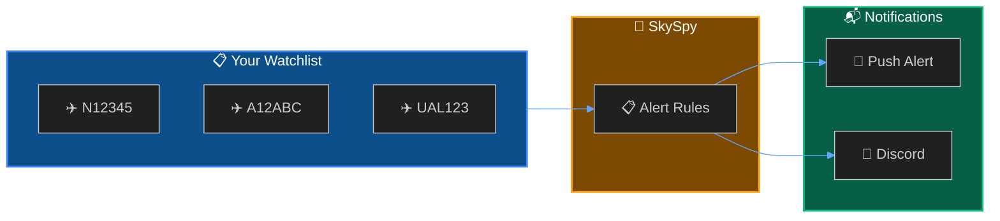

Set up alerts to track specific aircraft whenever they appear in your receiver's coverage area.



## What You'll Build

<CardGroup cols={2}>
  <Card title="ICAO Tracking" icon="hashtag">
    Track by 24-bit ICAO hex address
  </Card>
  <Card title="Callsign Matching" icon="plane">
    Match flight numbers and callsigns
  </Card>
  <Card title="Pattern Matching" icon="asterisk">
    Use prefixes like "UAL*" for all United flights
  </Card>
  <Card title="Push Notifications" icon="bell">
    Get instant alerts on your phone
  </Card>
</CardGroup>

---

## Finding Aircraft Identifiers

<Tabs>
  <Tab title="From SkySpy">
    Click any aircraft on the map → ICAO hex shown in detail panel (e.g., `A12345`)
  </Tab>
  <Tab title="From Registration">
    Use [planespotters.net](https://www.planespotters.net) to look up registration → Find Mode S code
  </Tab>
</Tabs>

<Info>
Callsigns can change between flights. ICAO hex addresses are permanent for the aircraft.
</Info>

---

## Dashboard Method

<Steps>
  <Step title="Open Alert Rules">
    Navigate to **Settings** → **Alert Rules**
  </Step>
  <Step title="Create New Rule">
    Click **New Rule**, set Field to `icao` or `callsign`
  </Step>
  <Step title="Enable Notifications">
    Toggle **Push Notifications** if Apprise is configured
  </Step>
</Steps>

---

## API Method

### Track Single Aircraft

```bash
curl -X POST http://localhost:5000/api/alerts/rules \
  -H "Content-Type: application/json" \
  -d '{
    "name": "Track N12345",
    "enabled": true,
    "priority": "high",
    "conditions": {
      "operator": "AND",
      "conditions": [
        { "field": "icao", "operator": "eq", "value": "A12345" }
      ]
    },
    "notification_enabled": true
  }'
```

### Track Multiple Aircraft

```bash
curl -X POST http://localhost:5000/api/alerts/rules \
  -H "Content-Type: application/json" \
  -d '{
    "name": "Friends Fleet",
    "conditions": {
      "operator": "OR",
      "conditions": [
        { "field": "icao", "operator": "eq", "value": "A12345" },
        { "field": "icao", "operator": "eq", "value": "A67890" }
      ]
    },
    "notification_enabled": true
  }'
```

### Track by Callsign Prefix

```bash
curl -X POST http://localhost:5000/api/alerts/rules \
  -H "Content-Type: application/json" \
  -d '{
    "name": "United Airlines",
    "conditions": {
      "operator": "AND",
      "conditions": [
        { "field": "callsign", "operator": "startswith", "value": "UAL" }
      ]
    }
  }'
```

---

## Next Steps

<Cards columns={2}>
  <Card title="Discord Alert Bot" icon="discord" href="/docs/discord-alert-bot">
    Send tracking alerts to Discord
  </Card>
  <Card title="Safety & Alerts" icon="bell" href="/docs/safety-and-alerts">
    Learn more about alert rule syntax
  </Card>
</Cards>
