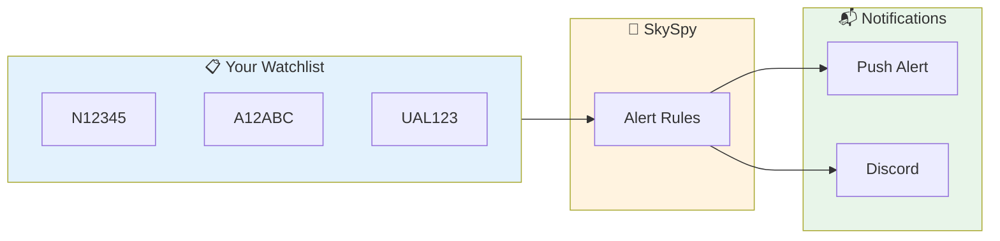
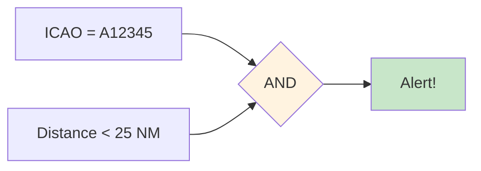

Set up alerts to track specific aircraft whenever they appear in your receiver's coverage area. Perfect for tracking interesting aircraft, your own plane, or friends' flights.



## What You'll Build

<CardGroup cols={2}>
  <Card title="ICAO Tracking" icon="hashtag">
    Track by 24-bit ICAO hex address
  </Card>
  <Card title="Callsign Matching" icon="plane">
    Match flight numbers and callsigns
  </Card>
  <Card title="Pattern Matching" icon="asterisk">
    Use prefixes like "UAL*" for all United flights
  </Card>
  <Card title="Push Notifications" icon="bell">
    Get instant alerts on your phone
  </Card>
</CardGroup>

## Prerequisites

<Check>
**SkySpy running** — API accessible at `http://localhost:5000`
</Check>

<Check>
**Aircraft identifiers** — ICAO hex codes or callsigns you want to track
</Check>

---

## Finding Aircraft Identifiers

Before creating rules, you need to find the aircraft's identifier.

### ICAO Hex Address

The ICAO hex is a unique 6-character code assigned to each aircraft. Find it:

<Tabs>
  <Tab title="From SkySpy">
    Click any aircraft on the map → The ICAO hex is shown in the detail panel (e.g., `A12345`)
  </Tab>
  <Tab title="From Registration">
    Use [planespotters.net](https://www.planespotters.net) or [flightaware.com](https://flightaware.com) to look up registration → Find Mode S code
  </Tab>
  <Tab title="Common Prefixes">
    | Country | ICAO Prefix |
    | :--- | :--- |
    | USA | `A00000` - `AFFFFF` |
    | UK | `400000` - `43FFFF` |
    | Germany | `3C0000` - `3FFFFF` |
    | France | `380000` - `3BFFFF` |
    | Canada | `C00000` - `C3FFFF` |
  </Tab>
</Tabs>

### Callsign

Callsigns are the flight identifiers broadcast by aircraft (e.g., `UAL123`, `N12345`).

<Info>
Callsigns can change between flights. ICAO hex addresses are permanent for the aircraft.
</Info>

---

## Method 1: Dashboard Alert Rules

The easiest way to track aircraft is through the SkySpy dashboard.

<Steps>
  <Step title="Open Alert Rules">
    Navigate to **Settings** → **Alert Rules**
  </Step>
  <Step title="Create New Rule">
    Click **New Rule**
  </Step>
  <Step title="Configure">
    - **Name**: "Track N12345"
    - **Field**: `icao` or `callsign`
    - **Operator**: `eq` (equals)
    - **Value**: Your aircraft's identifier
  </Step>
  <Step title="Enable Notifications">
    Toggle **Push Notifications** if you have Apprise configured
  </Step>
</Steps>

---

## Method 2: API Alert Rules

Create rules programmatically via the API.

### Track Single Aircraft by ICAO

```bash
curl -X POST http://localhost:5000/api/alerts/rules \
  -H "Content-Type: application/json" \
  -d '{
    "name": "Track N12345",
    "enabled": true,
    "priority": "high",
    "conditions": {
      "operator": "AND",
      "conditions": [
        { "field": "icao", "operator": "eq", "value": "A12345" }
      ]
    },
    "notification_enabled": true
  }'
```

### Track Multiple Aircraft

```bash
curl -X POST http://localhost:5000/api/alerts/rules \
  -H "Content-Type: application/json" \
  -d '{
    "name": "Friends Fleet",
    "enabled": true,
    "priority": "medium",
    "conditions": {
      "operator": "OR",
      "conditions": [
        { "field": "icao", "operator": "eq", "value": "A12345" },
        { "field": "icao", "operator": "eq", "value": "A67890" },
        { "field": "icao", "operator": "eq", "value": "ABCDEF" }
      ]
    },
    "notification_enabled": true
  }'
```

### Track by Callsign Prefix

Track all United Airlines flights:

```bash
curl -X POST http://localhost:5000/api/alerts/rules \
  -H "Content-Type: application/json" \
  -d '{
    "name": "United Airlines",
    "enabled": true,
    "priority": "low",
    "conditions": {
      "operator": "AND",
      "conditions": [
        { "field": "callsign", "operator": "startswith", "value": "UAL" }
      ]
    },
    "notification_enabled": false
  }'
```

---

## Method 3: Python Watchlist Script

For more control, create a Python script that monitors a watchlist:

```python
#!/usr/bin/env python3
"""
Aircraft Watchlist Monitor

Tracks specific aircraft and sends alerts when they're detected.
"""

import json
import os
from datetime import datetime

import requests
import sseclient

# Configuration
SKYSPY_URL = os.getenv("SKYSPY_URL", "http://localhost:5000")

# Your watchlist - add ICAO hex codes here
WATCHLIST_ICAO = {
    "A12345": "My Cessna",
    "A67890": "Friend's Piper",
    "ABCDEF": "Interesting Aircraft",
}

# Track by callsign prefix
WATCHLIST_CALLSIGN_PREFIX = [
    "AFR",    # Air France
    "BAW",    # British Airways
    "UAE",    # Emirates
]


def check_watchlist(aircraft: dict) -> tuple[bool, str]:
    """Check if aircraft is on our watchlist."""

    # Check ICAO
    icao = aircraft.get("hex", "").upper()
    if icao in WATCHLIST_ICAO:
        return True, WATCHLIST_ICAO[icao]

    # Check callsign prefix
    callsign = aircraft.get("flight", "").strip()
    for prefix in WATCHLIST_CALLSIGN_PREFIX:
        if callsign.startswith(prefix):
            return True, f"Callsign match: {prefix}"

    return False, ""


def format_alert(aircraft: dict, reason: str) -> str:
    """Format an alert message."""
    callsign = aircraft.get("flight", "Unknown").strip()
    icao = aircraft.get("hex", "Unknown")
    alt = aircraft.get("alt", 0)
    gs = aircraft.get("gs", 0)
    distance = aircraft.get("distance", 0)

    return f"""
🛫 AIRCRAFT DETECTED
━━━━━━━━━━━━━━━━━━━━━━━━
Reason:   {reason}
Callsign: {callsign}
ICAO:     {icao}
Altitude: {alt:,} ft
Speed:    {gs} kts
Distance: {distance:.1f} NM
Time:     {datetime.now().strftime("%H:%M:%S")}
━━━━━━━━━━━━━━━━━━━━━━━━
"""


def main():
    print("🔍 Aircraft Watchlist Monitor")
    print(f"📡 Connecting to {SKYSPY_URL}")
    print(f"📋 Watching {len(WATCHLIST_ICAO)} ICAO codes")
    print(f"📋 Watching {len(WATCHLIST_CALLSIGN_PREFIX)} callsign prefixes")
    print()

    # Track what we've already alerted on
    alerted = set()

    while True:
        try:
            url = f"{SKYSPY_URL}/api/v1/map/sse"
            response = requests.get(url, stream=True)
            client = sseclient.SSEClient(response)

            print("✅ Connected")

            for event in client.events():
                try:
                    if event.event not in ["aircraft_update", "aircraft_new"]:
                        continue

                    data = json.loads(event.data)

                    for aircraft in data.get("aircraft", []):
                        icao = aircraft.get("hex")

                        # Skip if already alerted
                        if icao in alerted:
                            continue

                        is_match, reason = check_watchlist(aircraft)

                        if is_match:
                            print(format_alert(aircraft, reason))
                            alerted.add(icao)

                            # Optional: send webhook, push notification, etc.
                            # send_notification(aircraft, reason)

                except json.JSONDecodeError:
                    continue

        except requests.exceptions.ConnectionError:
            print("❌ Connection lost, reconnecting...")
            import time
            time.sleep(5)
        except KeyboardInterrupt:
            print("\n👋 Goodbye")
            break


if __name__ == "__main__":
    main()
```

Run it:

```bash
pip install sseclient-py requests
python watchlist.py
```

---

## Combine with Distance Filter

Track aircraft only when they're close:

```bash
curl -X POST http://localhost:5000/api/alerts/rules \
  -H "Content-Type: application/json" \
  -d '{
    "name": "N12345 Nearby",
    "enabled": true,
    "priority": "high",
    "conditions": {
      "operator": "AND",
      "conditions": [
        { "field": "icao", "operator": "eq", "value": "A12345" },
        { "field": "distance", "operator": "lt", "value": 25 }
      ]
    },
    "notification_enabled": true
  }'
```



---

## Example Use Cases

<AccordionGroup>
  <Accordion title="Track your own aircraft" icon="plane">
    ```json
    {
      "name": "My Cessna 172",
      "conditions": {
        "operator": "AND",
        "conditions": [
          { "field": "icao", "operator": "eq", "value": "A12345" }
        ]
      },
      "notification_enabled": true
    }
    ```
  </Accordion>

  <Accordion title="Track friends' flights" icon="users">
    ```json
    {
      "name": "Flying Club Fleet",
      "conditions": {
        "operator": "OR",
        "conditions": [
          { "field": "icao", "operator": "eq", "value": "A11111" },
          { "field": "icao", "operator": "eq", "value": "A22222" },
          { "field": "icao", "operator": "eq", "value": "A33333" }
        ]
      },
      "notification_enabled": true
    }
    ```
  </Accordion>

  <Accordion title="Track a specific airline" icon="building">
    ```json
    {
      "name": "All Delta Flights",
      "conditions": {
        "operator": "AND",
        "conditions": [
          { "field": "callsign", "operator": "startswith", "value": "DAL" }
        ]
      },
      "notification_enabled": false
    }
    ```
  </Accordion>

  <Accordion title="Track rare aircraft types" icon="gem">
    ```json
    {
      "name": "Concorde Successor",
      "conditions": {
        "operator": "AND",
        "conditions": [
          { "field": "type", "operator": "eq", "value": "CONC" }
        ]
      },
      "notification_enabled": true
    }
    ```
  </Accordion>
</AccordionGroup>

---

## Next Steps

<Cards columns={2}>
  <Card title="Discord Alert Bot" icon="discord" href="/docs/discord-alert-bot">
    Send tracking alerts to Discord
  </Card>
  <Card title="Safety & Alerts" icon="bell" href="/docs/safety-and-alerts">
    Learn more about alert rule syntax
  </Card>
</Cards>
