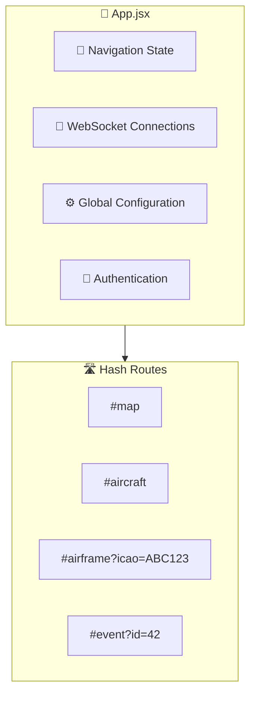
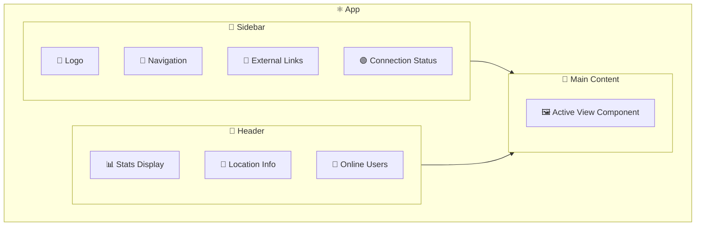
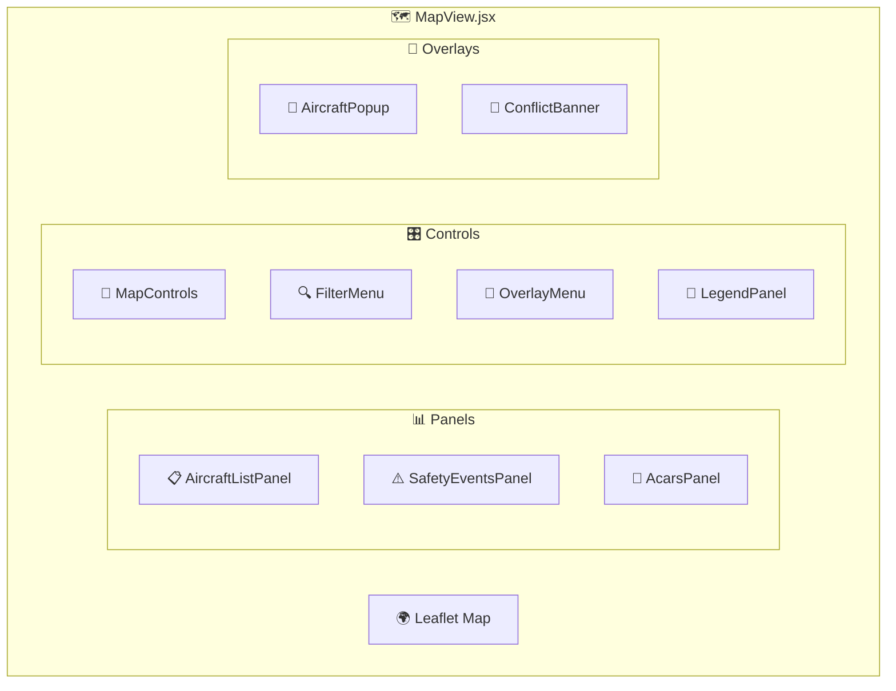
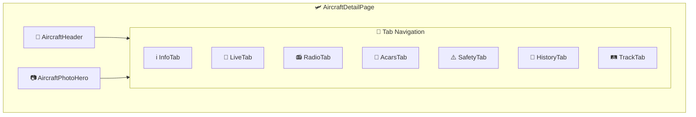
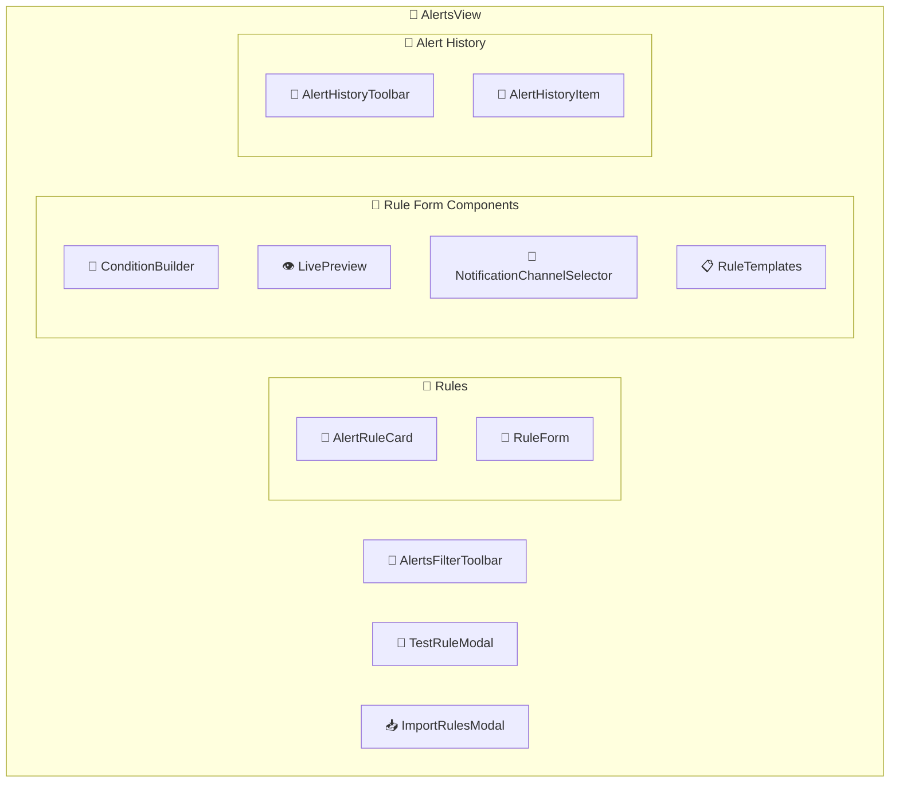
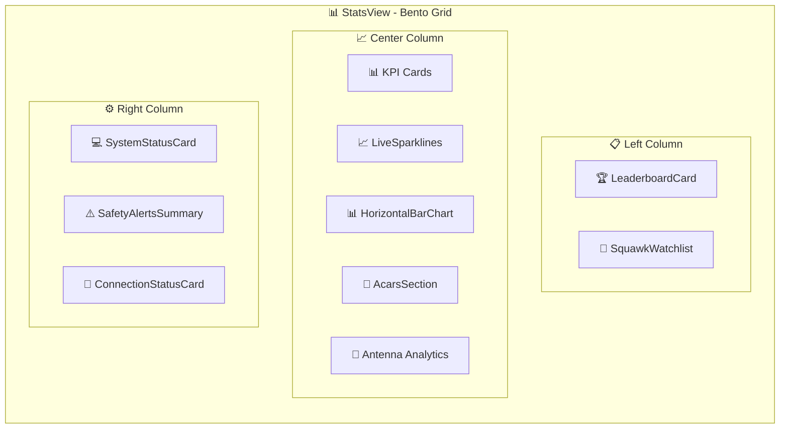
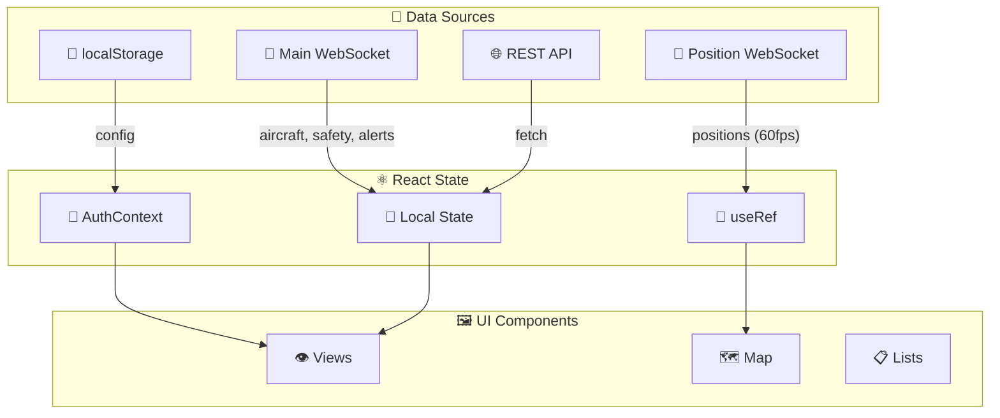
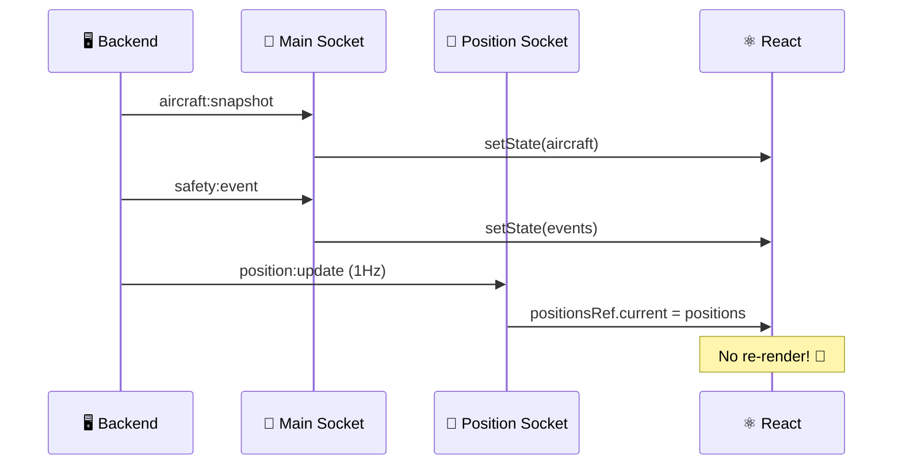
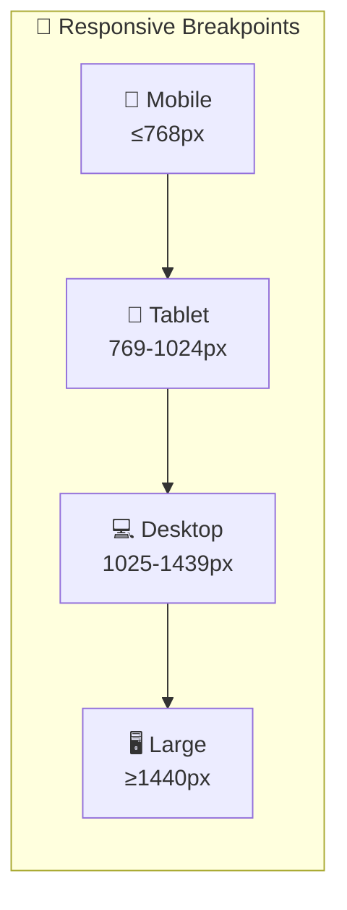
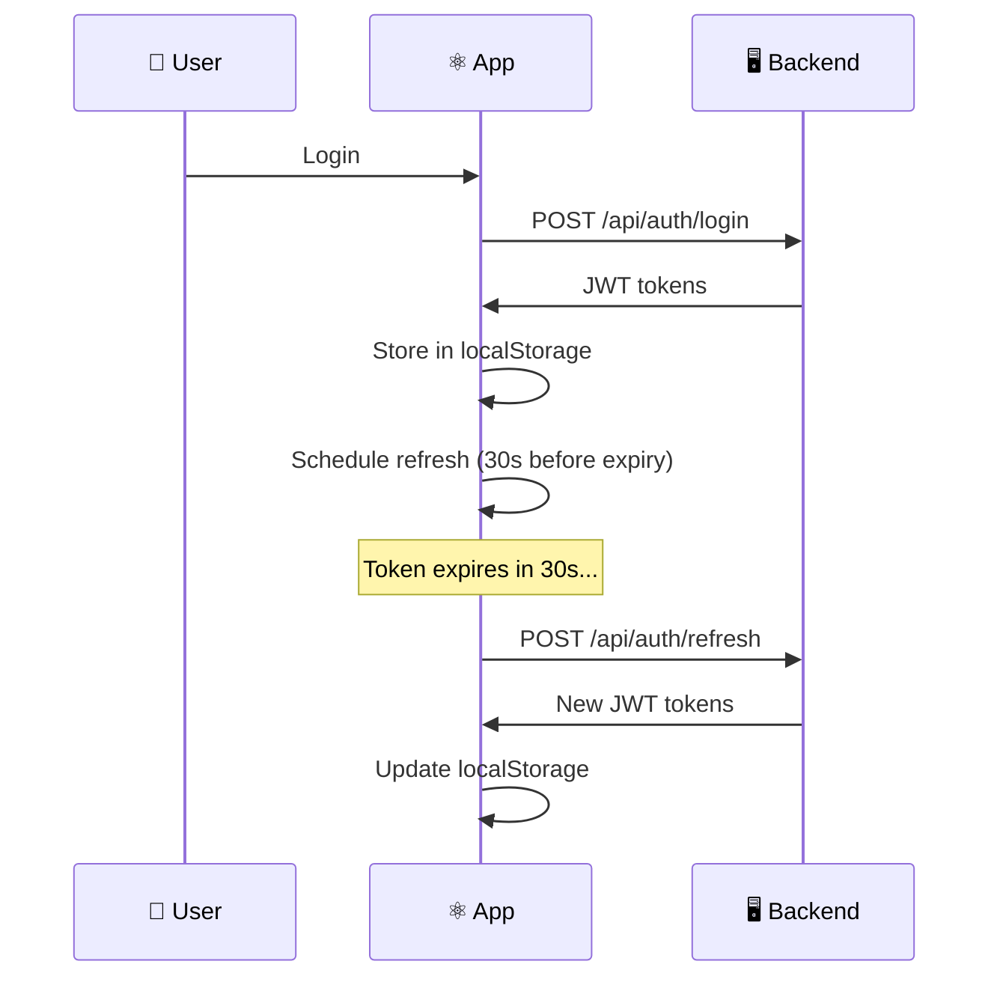

# ⚛️ SkySpy Frontend Architecture

> **Premium React application for real-time aircraft tracking and monitoring**


---

## 🎯 Overview

The SkySpy frontend is a **modern React application** built with Vite, delivering a real-time aircraft tracking and monitoring dashboard. Features include a modular component architecture, WebSocket-based real-time data streaming, and responsive design for desktop and mobile.

> 📸 **Screenshot Placeholder**
> 
> *The main dashboard showing live aircraft tracking with real-time updates*

---

## 🛠️ Technology Stack

| Technology | Purpose | Badge |
|:----------:|:--------|:-----:|
| ⚛️ **React 18+** | UI framework with hooks-based architecture |  |
| ⚡ **Vite** | Lightning-fast build tool and dev server |  |
| 🗺️ **Leaflet** | Interactive map rendering |  |
| 🔌 **WebSocket** | Real-time data via Django Channels |  |
| 🎨 **CSS3** | Custom styling with CSS variables |  |
| 🔷 **Lucide** | Icon library |  |

---

## 📁 Directory Structure

```
web/src/
├── 📄 App.jsx                    # 🚀 Main application entry point
│
├── 📂 components/                # React components by feature
│   ├── 🛩️ aircraft/             # Aircraft detail components
│   ├── 📋 aircraft-list/        # Aircraft list view
│   ├── 🔔 alerts/               # Alert rule management
│   ├── 📦 archive/              # Historical data archive
│   ├── 🎵 audio/                # Radio transmission playback
│   ├── 🔐 auth/                 # Authentication components
│   ├── 🎯 cannonball/           # Mobile proximity mode
│   ├── 🧩 common/               # Shared components
│   ├── 🏆 gamification/         # Achievement system
│   ├── 📜 history/              # Historical views
│   ├── 📐 layout/               # Layout (Sidebar, Header)
│   ├── 🗺️ map/                  # Map view and overlays
│   ├── 📋 notams/               # NOTAM display
│   ├── ⚠️ safety/               # Safety event components
│   └── 👁️ views/                # Main view containers
│
├── 📂 contexts/                  # React context providers
│   └── 🔑 AuthContext.jsx       # Auth state management
│
├── 📂 hooks/                     # Custom React hooks
│   ├── 📡 channels/             # WebSocket handlers
│   └── ℹ️ aircraftInfo/         # Data fetching utilities
│
├── 📂 styles/                    # CSS stylesheets
└── 📂 utils/                     # Utility functions
```

---

## 🏗️ Application Architecture

### Main Application Flow

The application uses **hash-based routing** for view navigation. `App.jsx` serves as the central orchestrator:



> 💡 **Tip**
> Hash routing enables deep linking and browser history support without server-side routing configuration.

### 🗺️ Valid Navigation Tabs

| Tab | Icon | Description |
|:----|:----:|:------------|
| `map` | 🗺️ | Live aircraft map *(default)* |
| `aircraft` | ✈️ | Sortable aircraft list |
| `stats` | 📊 | Statistics dashboard |
| `history` | 📜 | Historical data (sessions, sightings, ACARS, safety) |
| `audio` | 🎵 | Radio transmission archive |
| `notams` | 📋 | NOTAMs display |
| `archive` | 📦 | Data archive browser |
| `alerts` | 🔔 | Alert rule management |
| `system` | ⚙️ | System status and configuration |
| `airframe` | 🛩️ | Aircraft detail page |
| `event` | ⚠️ | Safety event detail page |

---

## 🧩 Component Hierarchy

### 🏠 Layout Architecture



### 🗺️ Map View Components

> 📸 **Screenshot Placeholder**
> 
> *Interactive map with aircraft tracking, safety events, and ACARS panel*



#### 🎨 Map Display Modes

[block:parameters]
{
  "data": {
    "h-0": "Mode",
    "h-1": "Description",
    "h-2": "Preview",
    "0-0": "`radar`",
    "0-1": "Traditional radar display with sweep animation",
    "0-2": "🟢",
    "1-0": "`crt`",
    "1-1": "Retro CRT-style phosphor display",
    "1-2": "🟡",
    "2-0": "`pro`",
    "2-1": "Professional ATC-style with customizable themes",
    "2-2": "🔵",
    "3-0": "`map`",
    "3-1": "Standard map with satellite/terrain options",
    "3-2": "🟠"
  },
  "cols": 3,
  "rows": 4
}
[/block]

**Pro Mode Theme Colors:**
- 🔵 **Classic Cyan** — Default professional look
- 🟡 **Amber/Gold** — Traditional ATC aesthetic
- 🟢 **Green Phosphor** — Retro terminal style
- ⚪ **High Contrast** — Accessibility optimized

---

### 🛩️ Aircraft Detail Components



> ⚡ **Performance**
> All tabs are **lazy-loaded** using `React.lazy()` for optimal initial load performance.

---

### 🔔 Alerts System Components



#### 🎯 Alert Condition Types

[block:callout]
{
  "type": "info",
  "title": "Supported Alert Conditions",
  "body": "Create complex rules using AND/OR logic with these condition types:"
}
[/block]

| Category | Conditions |
|:---------|:-----------|
| **🔢 Identifiers** | ICAO hex, Callsign pattern, Squawk code, Aircraft type |
| **📏 Telemetry** | Altitude thresholds, Speed thresholds, Distance proximity |
| **🏷️ Classification** | Military aircraft, Emergency status, Law enforcement, Helicopter |
| **📱 Mobile** | Proximity detection (Cannonball mode) |

---

### 📊 Stats Dashboard Layout

> 📸 **Screenshot Placeholder**
> 
> *Bento grid layout with live data, charts, and system status*



---

### 🎯 Cannonball Mode (Mobile)

> 📸 **Screenshot Placeholder**
> 
> *Fullscreen mobile proximity detection with HUD overlay*

A **fullscreen mobile-optimized mode** for proximity-based aircraft detection:

| Component | Purpose | Icon |
|:----------|:--------|:----:|
| `CannonballMode.jsx` | Main container | 🎯 |
| `HeadsUpDisplay.jsx` | HUD-style overlay | 🎮 |
| `RadarView.jsx` | Radar-style display | 📡 |
| `ThreatDisplay.jsx` | Proximity threat cards | ⚠️ |
| `ThreatList.jsx` | Sorted threat list | 📋 |
| `StatusBar.jsx` | GPS and connection status | 📍 |
| `EdgeIndicators.jsx` | Off-screen aircraft indicators | ↗️ |

---

## 🔄 State Management

### State Flow Diagram



### 🔑 AuthContext API

[block:code]
{
  "codes": [
    {
      "code": "const {\n  // 📊 State\n  status,           // 'loading' | 'anonymous' | 'authenticated'\n  user,             // User object with permissions\n  config,           // Auth configuration\n  error,            // Last auth error\n  isAuthenticated,  // Boolean shorthand\n\n  // 🔧 Methods\n  login,            // Username/password login\n  logout,           // Clear session\n  loginWithOIDC,    // OAuth/OIDC popup flow\n  authFetch,        // Authenticated fetch wrapper\n  hasPermission,    // Check single permission\n  hasAnyPermission, // Check any of the permissions\n  hasAllPermissions,// Check all permissions\n  canAccessFeature, // Feature-based access check\n  getAccessToken,   // Get JWT for WebSocket\n} = useAuth();",
      "language": "javascript",
      "name": "AuthContext Usage"
    }
  ]
}
[/block]

### 🔌 WebSocket State



### 💾 localStorage Keys

| Key | Purpose | Icon |
|:----|:--------|:----:|
| `adsb-dashboard-config` | Map mode, dark mode, notifications | ⚙️ |
| `adsb-dashboard-overlays` | Map overlay visibility | 🗺️ |
| `adsb-layer-opacities` | Overlay opacity settings | 🎨 |
| `adsb-show-aircraft-list` | List panel visibility | 📋 |
| `adsb-show-short-tracks` | Track trail display | 🛤️ |
| `adsb-sound-muted` | Sound preferences | 🔇 |
| `skyspy-auth-tokens` | JWT access/refresh tokens | 🔑 |
| `skyspy-user` | Cached user profile | 👤 |

---

## 🪝 Custom Hooks Reference

### 📡 Data Hooks

[block:parameters]
{
  "data": {
    "h-0": "Hook",
    "h-1": "Purpose",
    "h-2": "Example",
    "0-0": "`useApi`",
    "0-1": "HTTP API calls with loading/error states",
    "0-2": "`const { data, loading, error } = useApi('/api/stats')`",
    "1-0": "`useSocketApi`",
    "1-1": "HTTP with WebSocket fallback",
    "1-2": "`useSocketApi('/api/aircraft', wsData)`",
    "2-0": "`useAircraftInfo`",
    "2-1": "Aircraft registry lookups with caching",
    "2-2": "`const info = useAircraftInfo(icao)`",
    "3-0": "`useAviationData`",
    "3-1": "Aviation reference data (airports, VORs)",
    "3-2": "`const { airports } = useAviationData()`",
    "4-0": "`useAlertRules`",
    "4-1": "Alert rule CRUD operations",
    "4-2": "`const { rules, createRule } = useAlertRules()`",
    "5-0": "`useStatsData`",
    "5-1": "Statistics data aggregation",
    "5-2": "`const stats = useStatsData(timeRange)`"
  },
  "cols": 3,
  "rows": 6
}
[/block]

### 🔌 WebSocket Hooks

[block:code]
{
  "codes": [
    {
      "code": "// 📡 Main channels socket\nconst { aircraft, safetyEvents, acarsMessages } = useChannelsSocket();\n\n// 📍 High-frequency position updates (ref-based)\nconst positionsRef = usePositionChannels();\n\n// 🎵 Audio streaming\nconst { transmissions, isConnected } = useAudioSocket();",
      "language": "javascript",
      "name": "WebSocket Hooks"
    }
  ]
}
[/block]

### 🗺️ Map Hooks

| Hook | Purpose | Returns |
|:-----|:--------|:--------|
| `useTrackHistory` | Aircraft track trail management | `{ tracks, addTrack, clearTracks }` |
| `useMapAlarms` | Proximity and alert sound triggers | `{ playAlarm, stopAlarm }` |
| `useSafetyEvents` | Safety event state management | `{ events, activeEvent }` |
| `useGestures` | Touch gesture handling | `{ onPinch, onPan }` |
| `useDraggable` | Drag interaction for panels | `{ position, handlers }` |

### 🎯 Cannonball Mode Hooks

[block:code]
{
  "codes": [
    {
      "code": "// 📍 GPS tracking\nconst { position, accuracy, error } = useDeviceGPS();\n\n// ⚠️ Threat calculation\nconst threats = useThreatCalculation(aircraft, position);\n\n// 🔊 Voice alerts\nconst { speak, isSpeaking } = useVoiceAlerts();\n\n// 📳 Haptic feedback\nconst { vibrate } = useHapticFeedback();\n\n// 🔒 Screen wake lock\nconst { requestWakeLock, releaseWakeLock } = useWakeLock();",
      "language": "javascript",
      "name": "Cannonball Hooks"
    }
  ]
}
[/block]

---

## 🔧 Utility Functions

### ✈️ Aircraft Utilities

[block:code]
{
  "codes": [
    {
      "code": "import { \n  icaoToNNumber,\n  getCountryFromIcao,\n  getTailNumber,\n  getCategoryName,\n  callsignsMatch,\n  getPirepType \n} from '@/utils/aircraft';\n\n// 🔢 ICAO to N-number conversion\nicaoToNNumber('A1B2C3');      // → \"N12345\"\n\n// 🌍 Country identification\ngetCountryFromIcao('A1B2C3'); // → { country: 'USA', flag: '🇺🇸' }\n\n// 📋 Category names\ngetCategoryName('A1');        // → \"Light\"\n\n// 🔀 Callsign matching (IATA/ICAO)\ncallsignsMatch('AAL123', 'AA123'); // → true",
      "language": "javascript",
      "name": "Aircraft Utilities"
    }
  ]
}
[/block]

### 🔔 Alert Evaluation

[block:code]
{
  "codes": [
    {
      "code": "import { \n  evaluateCondition,\n  evaluateConditionGroup,\n  evaluateRule,\n  findMatchingAircraft,\n  getMatchReasons \n} from '@/utils/alertEvaluator';\n\n// ✅ Single condition evaluation\nevaluateCondition(condition, aircraft, distanceNm);\n\n// 🔀 Group evaluation with AND/OR logic\nevaluateConditionGroup(group, aircraft, distanceNm);\n\n// 📋 Find all matching aircraft\nconst matches = findMatchingAircraft(rule, aircraftList, feederLocation);\n\n// 💬 Human-readable match reasons\nconst reasons = getMatchReasons(rule, aircraft, distanceNm);\n// → [\"Squawk 7700 (Emergency)\", \"Altitude below 1000ft\"]",
      "language": "javascript",
      "name": "Alert Evaluation"
    }
  ]
}
[/block]

---

## 🎨 Styling Architecture

### 📁 CSS File Organization

```
styles/
├── 📄 index.css              # 🚀 Main entry, imports all
├── 📄 base.css               # 🎨 Variables, reset, typography
├── 📄 layout.css             # 📐 Layout grid and containers
├── 📄 components.css         # 🧩 Shared component styles
├── 📄 map.css                # 🗺️ Map-specific styles
├── 📄 pro-mode.css           # 📡 Pro radar mode
├── 📄 views.css              # 👁️ View-specific styles
├── 📄 aircraft-detail.css    # 🛩️ Aircraft detail page
├── 📄 stats-extended.css     # 📊 Statistics dashboard
├── 📄 cannonball.css         # 🎯 Cannonball mode
├── 📄 acars.css              # 📨 ACARS messages
├── 📄 auth.css               # 🔐 Authentication forms
├── 📄 toast.css              # 🔔 Toast notifications
├── 📄 visualizations.css     # 📈 Charts and graphs
└── 📄 responsive.css         # 📱 Mobile breakpoints
```

### 🎨 CSS Variables Reference

[block:code]
{
  "codes": [
    {
      "code": ":root {\n  /* 🎨 Colors */\n  --bg-primary: #0a0d12;      /* Main background */\n  --bg-secondary: #141922;    /* Card background */\n  --text-primary: #e5e5e5;    /* Main text */\n  --text-secondary: #9ca3af;  /* Muted text */\n  \n  /* 🌈 Accent Colors */\n  --accent-cyan: #00c8ff;     /* Primary accent */\n  --accent-green: #10b981;    /* Success states */\n  --accent-red: #ef4444;      /* Error/danger */\n  --accent-yellow: #f59e0b;   /* Warning states */\n\n  /* 📏 Spacing Scale */\n  --spacing-xs: 0.25rem;      /* 4px */\n  --spacing-sm: 0.5rem;       /* 8px */\n  --spacing-md: 1rem;         /* 16px */\n  --spacing-lg: 1.5rem;       /* 24px */\n  --spacing-xl: 2rem;         /* 32px */\n\n  /* 🔤 Typography */\n  --font-mono: 'JetBrains Mono', monospace;\n  --font-sans: -apple-system, BlinkMacSystemFont, 'Segoe UI', sans-serif;\n\n  /* ⚡ Transitions */\n  --transition-fast: 150ms ease;\n  --transition-normal: 250ms ease;\n}",
      "language": "css",
      "name": "CSS Variables"
    }
  ]
}
[/block]

#### 🎨 Color Palette Visual

| Variable | Color | Usage |
|:---------|:-----:|:------|
| `--bg-primary` |  `#0a0d12` | Main background |
| `--bg-secondary` |  `#141922` | Card background |
| `--accent-cyan` |  `#00c8ff` | Primary accent |
| `--accent-green` |  `#10b981` | Success states |
| `--accent-red` |  `#ef4444` | Error/danger |
| `--accent-yellow` |  `#f59e0b` | Warnings |

### 📱 Responsive Breakpoints



---

## 🏗️ Build and Development

### ⚡ Vite Configuration

[block:code]
{
  "codes": [
    {
      "code": "// vite.config.js\nexport default defineConfig({\n  plugins: [react()],\n  base: '/static/',           // 🗂️ Django static path\n  build: {\n    outDir: 'dist',\n    sourcemap: false,\n    minify: 'terser',\n  },\n  server: {\n    host: '0.0.0.0',\n    port: 3000,\n    proxy: {\n      '/api': {\n        target: process.env.VITE_API_TARGET || 'http://localhost:8000',\n        changeOrigin: true,\n      },\n      '/ws': {\n        target: apiTarget.replace('http', 'ws'),\n        ws: true,\n        changeOrigin: true,\n      },\n    },\n  },\n});",
      "language": "javascript",
      "name": "vite.config.js"
    }
  ]
}
[/block]

### 🛠️ Development Commands

[block:code]
{
  "codes": [
    {
      "code": "# 📦 Install dependencies\nnpm install\n\n# 🚀 Start development server\nnpm run dev\n\n# 🏗️ Build for production\nnpm run build\n\n# 👁️ Preview production build\nnpm run preview\n\n# 🔍 Lint code\nnpm run lint",
      "language": "bash",
      "name": "Development Commands"
    }
  ]
}
[/block]

### 🌍 Environment Variables

| Variable | Purpose | Default |
|:---------|:--------|:--------|
| `VITE_API_TARGET` | Backend API URL for dev proxy | `http://localhost:8000` |

> 📝 **Note**
> In production, the frontend is served by Django using relative URLs. `VITE_API_TARGET` is only used for the Vite dev server proxy.

---

## ⚡ Performance Optimization

[block:callout]
{
  "type": "success",
  "title": "Performance Tips",
  "body": "SkySpy is optimized for real-time data at 60fps. Here's how:"
}
[/block]

### 🚀 Virtual Scrolling

Large lists use the `VirtualList` component to render **only visible items**, enabling smooth scrolling with thousands of aircraft.

### 🧠 Memoization

[block:code]
{
  "codes": [
    {
      "code": "// ✅ Expensive computations memoized\nconst filteredAircraft = useMemo(() => {\n  return aircraft\n    .filter(a => matchesFilters(a, filters))\n    .sort((a, b) => sortComparator(a, b, sortField));\n}, [aircraft, filters, sortField]);",
      "language": "javascript",
      "name": "useMemo Example"
    }
  ]
}
[/block]

### 🔗 Ref-Based State for High-Frequency Data

[block:code]
{
  "codes": [
    {
      "code": "// 🚀 Positions in ref = no React re-renders!\nconst positionsRef = useRef({});\n\n// Animation loop reads directly from ref\nrequestAnimationFrame(() => {\n  const positions = positionsRef.current;\n  // Update map markers at 60fps\n  // Zero React overhead! ⚡\n});",
      "language": "javascript",
      "name": "Ref-Based State"
    }
  ]
}
[/block]

### ⏱️ Debounced Updates

Search and filter inputs are **debounced** to prevent excessive re-renders during typing.

### 📦 Lazy Loading

[block:code]
{
  "codes": [
    {
      "code": "// 📦 Components loaded on-demand\nconst InfoTab = lazy(() => import('./tabs/InfoTab'));\nconst LiveTab = lazy(() => import('./tabs/LiveTab'));\nconst RadioTab = lazy(() => import('./tabs/RadioTab'));\nconst AcarsTab = lazy(() => import('./tabs/AcarsTab'));\nconst SafetyTab = lazy(() => import('./tabs/SafetyTab'));\nconst HistoryTab = lazy(() => import('./tabs/HistoryTab'));\nconst TrackTab = lazy(() => import('./tabs/TrackTab'));",
      "language": "javascript",
      "name": "Lazy Loading"
    }
  ]
}
[/block]

### 🛡️ Error Boundaries

[block:code]
{
  "codes": [
    {
      "code": "// 🛡️ Prevents cascading failures\n<ErrorBoundary \n  onRetry={retry}\n  fallback={<ErrorFallback />}\n>\n  {renderTabContent()}\n</ErrorBoundary>",
      "language": "jsx",
      "name": "Error Boundaries"
    }
  ]
}
[/block]

---

## 🔐 Authentication Integration

### 🔑 Token Management



### 🔒 Permission-Based UI

[block:code]
{
  "codes": [
    {
      "code": "const { canAccessFeature } = useAuth();\n\n// 🔐 Conditional rendering based on permissions\nif (canAccessFeature('alerts', 'write')) {\n  return <AlertRuleForm />;\n}\n\n// 🛡️ Protected route wrapper\n<ProtectedRoute permission=\"audio:read\">\n  <AudioView />\n</ProtectedRoute>",
      "language": "jsx",
      "name": "Permission-Based UI"
    }
  ]
}
[/block]

---

## 🌐 Browser Compatibility

### Desktop Browsers

| Browser | Version | Status |
|:--------|:--------|:------:|
|  | 90+ | ✅ Supported |
|  | 88+ | ✅ Supported |
|  | 14+ | ✅ Supported |
|  | 90+ | ✅ Supported |

### Mobile Browsers

| Browser | Version | Status |
|:--------|:--------|:------:|
|  | 14+ | ✅ Supported |
|  | 90+ | ✅ Supported |

---

## 📚 Related Documentation

| Document | Description |
|:---------|:------------|
| 📡 [Backend API Documentation](./07-api.md) | REST API reference |
| 🔌 [WebSocket Protocol](./06-websocket.md) | Real-time messaging protocol |
| 🚀 [Deployment Guide](./03-deployment.md) | Production deployment |
| ⚙️ [Configuration Reference](./02-configuration.md) | Environment configuration |

---

<div align="center">

**Built with ⚛️ React + ⚡ Vite + 🗺️ Leaflet**

*Real-time aircraft tracking at 60fps*

</div>
