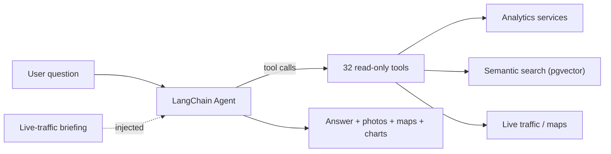

# 🤖 AI Assistant

> Natural-language questions over your live traffic, history, safety events, ACARS, and airframe intelligence — answered by a tool-calling LLM agent.

---

## 📖 Overview

The **AI Assistant** is a LangChain tool-calling agent served by any OpenAI-compatible endpoint (vLLM in production, OpenAI or Ollama in development). Ask it plain-English questions — *"is anyone orbiting near the airport right now?"*, *"show me business jets owned by trusts I've seen this week"*, *"what emergency squawks happened today?"* — and it chains **read-only** analytics and search tools to build a grounded answer.

> 🛡️ **Read-only by design**
>
> Every tool the agent can call is read-only. It reports on data SkySpy already has; it cannot arm alerts, change config, or mutate records.

Answers can include rendered charts, maps, and airframe photos. The agent never authors photo or map URLs itself — the backend templates them from vetted tool output (see [Photo rendering](#-photo-rendering)).




---

## 🚀 Quick Start

The assistant requires an LLM endpoint that supports **tool/function calling**.

```env
# 1. Enable the LLM layer + assistant
LLM_ENABLED=True
ASSISTANT_ENABLED=True

# 2. Point at a tool-calling model
LLM_API_URL=http://vllm:8000/v1
LLM_MODEL=Qwen/Qwen2.5-7B-Instruct
# LLM_API_KEY=sk-...            # only for cloud providers
```

Ask a question:


```bash
curl -X POST https://your-domain.com/api/v1/assistant/ask/ \
  -H "Content-Type: application/json" \
  -d '{"query": "What are the closest and highest aircraft right now?"}'
```

> ✅ In the dashboard, open the **Assistant** screen from the nav rail, or use the floating support-chat dock available app-wide.

---

## 🧩 REST Endpoints

### POST `/api/v1/assistant/ask/`

Synchronous request/response.

**Request body**

| Field | Type | Required | Description |
|:------|:-----|:--------:|:------------|
| `query` | string | ✅ | The user's question |
| `context` | string | ⚪ | Page/DOM snapshot for grounding (what the user is looking at) |
| `history` | array | ⚪ | Prior turns: `[{"role": "user"\|"assistant", "content": "..."}]` |

**Response**

```json
{
  "answer": "string or null",
  "steps": [{"tool": "live_traffic_summary", "args": {}, "result_preview": "..."}],
  "sources": [{"icao_hex": "A835AF", "registration": "N628TS"}],
  "photos": [{"src": "...", "alt": "...", "photographer": "...", "source": "..."}],
  "maps": [{"title": "...", "points": [{"lat": 0, "lon": 0}]}],
  "status": "ok"
}
```

`status` is one of `ok`, `empty_query`, `unavailable`, `error`. HTTP `200` for `ok`/`empty_query`, otherwise `503`.

### POST `/api/v1/assistant/stream/`

Same request body, streamed as **Server-Sent Events** (`text/event-stream`). Frame types:

| `type` | Payload | Meaning |
|:-------|:--------|:--------|
| `tool` | `tool`, `args` | A tool was invoked |
| `token` | `text` | Partial answer token |
| `photo` | `src`, `alt`, `photographer`, `source` | Airframe photo to render |
| `map` | `title`, `points` | Map of coordinates to render |
| `final` | `answer`, `sources`, `photos`, `maps` | Final answer + metadata |
| `error` | `message` | Error occurred |
| `unavailable` | — | Assistant not configured |

The stream ends with `event: done`.

---

## 🛠️ Tool Catalog

The agent has **32 read-only tools** grouped by purpose. It picks and chains them automatically within its step budget.

<details>
<summary><strong>📊 Analytics & Platform Activity (8)</strong></summary>

| Tool | Purpose |
|:-----|:--------|
| `platform_activity` | Tracking activity over N hours — sightings/sessions, unique + military counts, altitude/distance/speed stats |
| `safety_summary` | Safety/emergency events by type & severity, rate per hour |
| `flight_patterns` | Busiest hours, peak hour, common types, avg session duration, frequent routes |
| `geographic_breakdown` | Aircraft by registration country, top operators, most-connected airports, mil vs civ |
| `time_comparison` | Long-term trends — week-over-week, seasonal, day/night, weekend vs weekday |
| `antenna_coverage` | Receiver performance — range percentiles, RSSI stats, directional coverage |
| `acars_summary` | ACARS/VDL2 activity — totals, by source, unique aircraft/flights, top labels |
| `collection_stats` | Lifetime spotting collection — unique aircraft, types, operators, countries, records |

</details>

<details>
<summary><strong>🗺️ Live Traffic & Maps (2)</strong></summary>

| Tool | Purpose |
|:-----|:--------|
| `live_traffic_summary` | Right-now counts, category breakdown, closest/highest/fastest |
| `live_aircraft_map` | Positioned aircraft for mapping; filterable by callsigns/hexes/military |

</details>

<details>
<summary><strong>🌤️ Aviation Reference & Weather (4)</strong></summary>

| Tool | Purpose |
|:-----|:--------|
| `airport_weather` | Current decoded METAR for an ICAO airport |
| `recent_pireps` | Recent pilot reports decoded to plain language |
| `airport_notams` | Active NOTAMs for an ICAO airport |
| `acars_timeline` | ACARS/VDL2 volume as an hourly/daily time series |

</details>

<details>
<summary><strong>🔎 Search & Lookup (11)</strong></summary>

| Tool | Purpose |
|:-----|:--------|
| `lookup_airframe` | Everything about one airframe by hex/tail/callsign, incl. ownership-risk signals |
| `fetch_airframe_photo` | Photo of an airframe (server-templated src, never model-authored) |
| `lookup_route` | Origin/destination for a callsign/flight number |
| `find_sightings` | Recent sightings of an aircraft |
| `find_safety_events` | Recent safety events filtered by type/severity |
| `find_incidents` | NTSB accident/incident history by registration |
| `semantic_airframe_search` | Vector search over airframe dossiers ("jets owned by shell LLCs") |
| `notable_acars_messages` | Most interesting ACARS messages, ranked by anomaly keywords |
| `semantic_acars_search` | Vector search over ACARS/VDL2 message text |
| `semantic_notam_search` | Vector search over cached NOTAMs |
| `semantic_pirep_search` | Vector search over pilot reports |

</details>

<details>
<summary><strong>🎯 Correlation & Behavior Detection (5)</strong></summary>

| Tool | Purpose |
|:-----|:--------|
| `semantic_event_search` | Vector search over safety events + NTSB history |
| `metric_correlations` | Statistical relationships in telemetry (Pearson r, slope) |
| `aircraft_track` | Reconstruct a flown path + behavior flags (orbit/loiter, rapid climb/descent) |
| `detect_unusual_patterns` | Scan tracks for unusual flight paths — see [Anomaly Detection](./anomaly-detection) |
| `identify_law_enforcement` | Classify aircraft as LE/government/surveillance |
| `threat_assessment` | Scan live traffic for 'cannonball' mobile-threat patterns near the receiver |

</details>

> 📘 Several tools depend on other v3 subsystems: the `semantic_*` tools use [Airframe Intelligence / RAG](./airframe-intelligence), `find_incidents` uses NTSB records, and `lookup_airframe` surfaces [Ownership & Shell-Risk Screening](./ownership-screening).

---

## 📡 Live-Traffic Briefing

When `ASSISTANT_BRIEFING_ENABLED=True` (default), every query is silently prefixed with a compact live-situation snapshot so answers are grounded in the current picture **without spending a tool call**:

```json
{
  "now_tracked": 142, "with_position": 138,
  "military": 3, "emergency": 0,
  "safety_events_last_hour": 1, "closest": "SWA1234"
}
```

The snapshot is cached for 20 seconds and injected inside `<live_situation>` tags alongside any optional `<page_context>` DOM snapshot. It is best-effort — if stats are unavailable the query proceeds without it. Disable on tiny/RPi models if the extra context hurts.

---

## 🗜️ Compact Mode

Small local models (e.g. an 8k-context vLLM/Ollama) cannot hold the full system prompt plus 32 tool schemas plus a query plus a tool result on the first call. Set `ASSISTANT_CONTEXT_WINDOW` to the model's real window; when it is **≤ 16000** the assistant auto-switches to **compact mode**:

| Aspect | Full | Compact (≤16k) |
|:-------|:-----|:---------------|
| System prompt | Full `SYSTEM_PROMPT` | Short `COMPACT_SYSTEM_PROMPT` |
| Tool descriptions | Full | First sentence only (≤200 chars) |
| Per-tool result cap | 6000 chars | 1200 chars |
| History messages | 16 | 4 |
| Per-message cap | 3000 chars | 800 chars |
| Briefing cap | 1500 chars | 600 chars |
| Page-context cap | 4000 chars | 1000 chars |

> ⚠️ `ASSISTANT_CONTEXT_WINDOW=0` (default) assumes a large window and applies **no** compaction. Setting it too low needlessly starves capable models; leaving it at 0 on an 8k model overflows on the first call (`prompt contains at least 8193 input tokens`).

---

## 📷 Photo Rendering

The `fetch_airframe_photo` tool returns **metadata only** — never a URL — because models were hallucinating photo links. The backend deterministically resolves the `` src:

1. If `ASSISTANT_PHOTO_BASE_URL` is set → `<base>/<HEX>.jpg`
2. Else if `S3_ENABLED` → a signed S3 URL (works with private buckets)
3. Else → same-origin `/api/v1/photos/<hex>`

The resolved `src` is attached to the SSE `photo` frame / sync `photos` array, and the frontend renders the ``.

---

## ⚙️ Configuration

See the [Configuration Reference](../getting-started/config-reference#-ai-assistant) for the full table. Core knobs:

| Variable | Default | Description |
|:---------|:--------|:------------|
| `ASSISTANT_ENABLED` | `False` | Enable the agent (also needs `LLM_ENABLED`) |
| `ASSISTANT_MODEL` | *(= `LLM_MODEL`)* | Model override; must support tool calling |
| `ASSISTANT_MAX_STEPS` | `10` | Tool-call budget per query |
| `ASSISTANT_TIMEOUT` | `60` | Request timeout (seconds) |
| `ASSISTANT_BRIEFING_ENABLED` | `True` | Inject live-traffic snapshot |
| `ASSISTANT_CONTEXT_WINDOW` | `0` | Model window (tokens); ≤16000 → compact mode |
| `ASSISTANT_MAX_RESULT_CHARS` | `6000` | Per-tool result cap |
| `ASSISTANT_MAX_HISTORY_MSGS` | `16` | Prior turns carried |
| `ASSISTANT_MAX_HISTORY_CHARS` | `3000` | Per-message cap |
| `ASSISTANT_PHOTO_BASE_URL` | *(auto)* | Override photo `` base |

### vLLM (GPU) profile

Production serves the model with vLLM under the Docker Compose `gpu` profile:

```bash
docker compose --profile gpu up -d vllm
```

```yaml
# docker-compose.yml (excerpt)
vllm:
  image: vllm/vllm-openai:latest
  profiles: [gpu]
  command: >
    --model ${VLLM_MODEL:-Qwen/Qwen2.5-7B-Instruct}
    --served-model-name ${ASSISTANT_MODEL:-Qwen/Qwen2.5-7B-Instruct}
    --max-model-len ${VLLM_MAX_MODEL_LEN:-32768}
    --gpu-memory-utilization ${VLLM_GPU_MEMORY_UTILIZATION:-0.90}
    --enable-auto-tool-choice
    --tool-call-parser ${VLLM_TOOL_PARSER:-hermes}
```

> 💡 The model **must** support OpenAI-style tool calling. Non-tool models fail at the first tool-schema validation. Tested with Qwen2.5-7B-Instruct, GPT-4o-mini, and Hermes-style models.

---

## 📚 Related

- [Airframe Intelligence & RAG](./airframe-intelligence) — the semantic search backing the `semantic_*` tools
- [Ownership & Shell-Risk Screening](./ownership-screening)
- [Anomaly Detection](./anomaly-detection)
- [Configuration Reference](../getting-started/config-reference)
