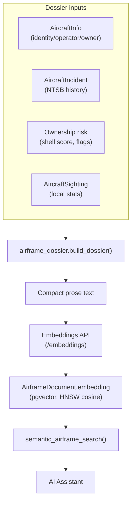

# 🧠 Airframe Intelligence & RAG

> Per-airframe dossiers, NTSB safety history, field-level data provenance, and semantic (vector) search powered by pgvector embeddings.

---

## 📖 Overview

SkySpy v3 builds a compact **dossier** for each airframe it identifies — merging registration/operator/owner identity, ownership-risk signals, NTSB accident history, and your own local observation statistics into one prose document. Those dossiers (plus ACARS messages, NOTAMs, PIREPs, and safety events) are embedded into a **pgvector** store so the [AI Assistant](./ai-assistant) can answer fuzzy, meaning-based questions like *"business jets registered to a trust"* or *"messages about a medical diversion."*



---

## 🗄️ pgvector Requirement

The vector store depends on the **pgvector** Postgres extension, so SkySpy's compose files pin the image:

```yaml
# docker-compose.yml
postgres:
  image: pgvector/pgvector:pg16
```

A migration enables the extension and creates the embedding column with an **HNSW** index (cosine similarity, `m=16`, `ef_construction=64`). `EMBEDDING_DIM` must match your embedding model (default `1536` for `text-embedding-3-small`).

> ⚠️ If you run a different Postgres image, the `AirframeDocument` embedding column and similarity search will fail to migrate. Use `pgvector/pgvector:pg16` (already set in the shipped compose files).

---

## 📄 The Airframe Dossier

`build_dossier(icao_hex)` returns a structured record and a rendered `text` blob (the part that gets embedded):

| Section | Source | Notes |
|:--------|:-------|:------|
| `identity` | `AircraftInfo` | Registration, type, manufacturer, model, country |
| `operator` | `AircraftInfo` | Airline/operator + owner |
| `ownership_risk` | Registration analysis | Shell score, owner type, flags — see [Ownership Screening](./ownership-screening) |
| `privacy_flags` | `AircraftInfo` | LADD / privacy-ICAO indicators |
| `incidents` | `AircraftIncident` | Up to 20 most-recent NTSB records |
| `observations` | `AircraftSighting` | Local sighting count, first/last seen, altitude/distance envelope |
| `provenance` | `field_sources` | Which source filled each field |
| `sources` | — | List of contributing databases |


---

## 🛰️ NTSB Accident & Incident History

For US-registered aircraft, SkySpy queries the **NTSB CAROL** public API by registration (N-number) and stores normalized records in the `AircraftIncident` model.

**Data source:** `POST https://data.ntsb.gov/carol-main-public/api/Query/Main` (30 req / 60s aggregate, 25s timeout).

Each record carries:

| Field | Description |
|:------|:------------|
| `external_id` | NTSB case number |
| `event_type` | `Accident` or `Incident` |
| `event_date` | Parsed timestamp |
| `severity` | Highest injury level / damage code |
| `city` / `state` / `country` | Location |
| `make` / `model` | Aircraft make & model |
| `url` | Public NTSB summary link |
| `raw_data` | Full flattened CAROL result (audit / RAG) |

Records are deduped on `(source, external_id)` and linked by both `registration` and `icao_hex`.


> 📘 Incidents are surfaced through the airframe **dossier** and the assistant's `find_incidents(registration)` and `semantic_event_search(...)` tools. There is no standalone incidents REST endpoint — they ride along with airframe intelligence.

---

## 🏷️ Field-Level Provenance

When SkySpy merges an airframe from multiple databases (FAA → ADS-B Exchange → tar1090-db → OpenSky), it records **which source first filled each field** in a `field_sources` map, returned on the airframe response:

```json
{
  "registration": "N123AB",
  "manufacturer": "Boeing",
  "operator": "United Airlines",
  "field_sources": {
    "registration": "faa",
    "manufacturer": "adsbx",
    "operator": "opensky",
    "owner": "faa"
  },
  "sources": ["faa", "adsbx", "opensky"]
}
```

This drives UI attribution ("Registration from FAA, model from ADS-B Exchange"), gives the LLM authoritative-source context, and enables cross-database audits. FAA is authoritative for US registrations; it is never overwritten by a lower-priority source.

---

## 🔎 Semantic Search

The RAG layer embeds five document kinds and exposes them to the assistant as `semantic_*` tools:

| Kind | Assistant tool | Example query |
|:-----|:---------------|:--------------|
| Airframe dossiers | `semantic_airframe_search` | "business jets owned by shell LLCs" |
| ACARS / VDL2 | `semantic_acars_search` | "messages about a medical diversion" |
| NOTAMs | `semantic_notam_search` | "GPS/RAIM outages", "VIP TFRs" |
| PIREPs | `semantic_pirep_search` | "severe turbulence at altitude" |
| Safety events + NTSB | `semantic_event_search` | "prior accidents involving this type" |

Search is cosine-distance nearest-neighbor over the pgvector store, returning the top *k* (default 5) with a short dossier/text snippet and a similarity score.

> 📘 Semantic search is **assistant-only** — there is no public REST endpoint for raw vector queries. Ask through `/api/v1/assistant/ask/` and the agent invokes the right tool.

---

## ⚙️ Embedding Configuration

Each embedding setting falls back to the matching `LLM_*` value, so a single provider covers both chat and embeddings; override only to split them.

| Variable | Default | Description |
|:---------|:--------|:------------|
| `EMBEDDING_API_URL` | *(= `LLM_API_URL`)* | OpenAI-compatible `/embeddings` endpoint |
| `EMBEDDING_API_KEY` | *(= `LLM_API_KEY`)* | API key |
| `EMBEDDING_MODEL` | `text-embedding-3-small` | Embedding model |
| `EMBEDDING_DIM` | `1536` | Must match the model's output dimension |

If `LLM_ENABLED` is false, embedding is skipped and dossiers are stored without vectors (`stored_no_embedding`).

---

## 🔄 Refresh Schedule

Embedding is incremental — a content hash skips re-embedding unchanged dossiers. Celery Beat keeps the store fresh on the `database` queue:

| Task | Schedule | Scope |
|:-----|:---------|:------|
| `refresh_airframe_documents` | Daily 07:00 UTC | `AircraftInfo` updated in the last 25h |
| `refresh_rag_documents` | Every 30 min | Recent ACARS, NOTAMs, PIREPs, safety events, NTSB incidents |

Single airframes/documents can also be indexed on demand (`index_airframe_document`, `index_rag_document`).

---

## 📚 Related

- [AI Assistant](./ai-assistant) — consumes semantic search
- [Ownership & Shell-Risk Screening](./ownership-screening) — feeds the dossier's risk section
- [Configuration Reference](../getting-started/config-reference#-airframe-rag--embeddings)
