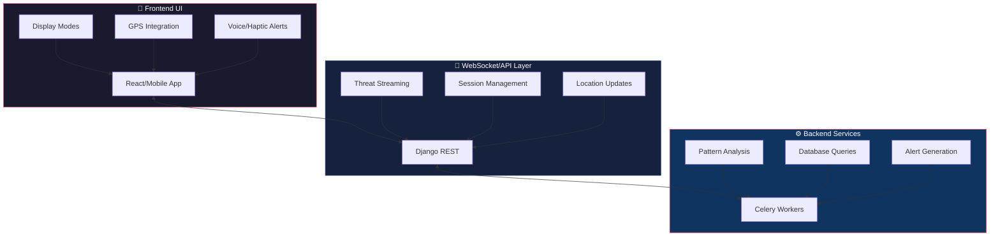
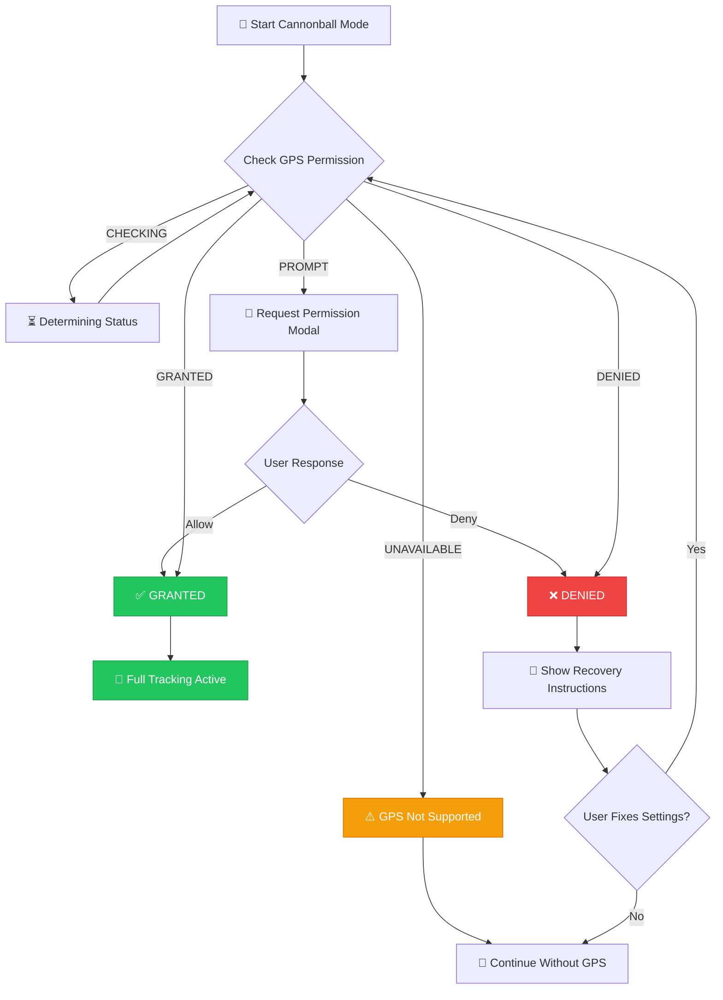
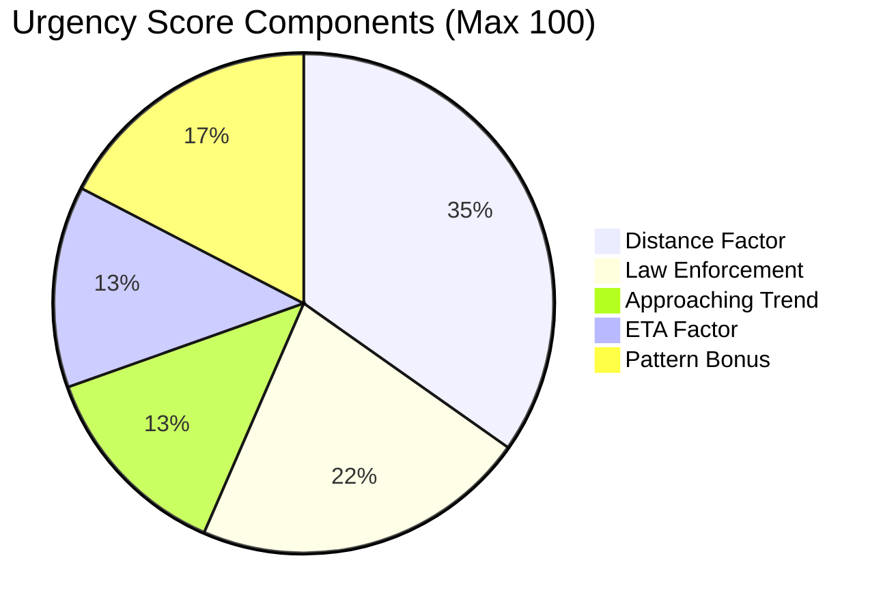
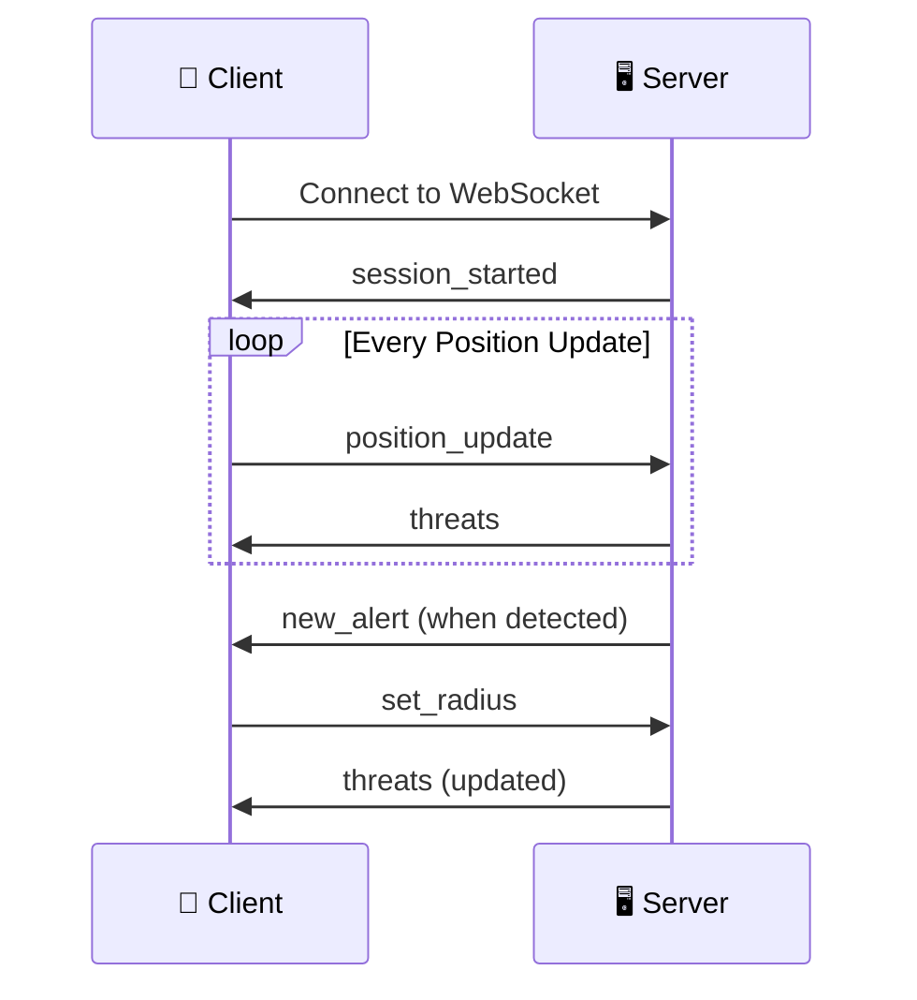

# 🎯 Cannonball Mode

> 📱 **Enterprise-grade law enforcement aircraft detection and situational awareness system**

Cannonball Mode is SkySpy's advanced feature designed to detect, track, and alert users about potential law enforcement and surveillance aircraft in real-time. It provides a full-screen, high-contrast, glanceable interface optimized for situational awareness while driving.

---

## 🚀 Feature Highlights

[block:html]
{"html": "<div style='display: grid; grid-template-columns: repeat(auto-fit, minmax(280px, 1fr)); gap: 16px; margin: 20px 0;'>\n  <div style='background: linear-gradient(135deg, #1a1a2e 0%, #16213e 100%); border-radius: 12px; padding: 20px; border: 1px solid #0f3460;'>\n    <div style='font-size: 32px; margin-bottom: 12px;'>🎯</div>\n    <h3 style='color: #e94560; margin: 0 0 8px 0;'>Real-time Detection</h3>\n    <p style='color: #a0a0a0; margin: 0; font-size: 14px;'>Sub-second threat identification using ADS-B data streams</p>\n  </div>\n  <div style='background: linear-gradient(135deg, #1a1a2e 0%, #16213e 100%); border-radius: 12px; padding: 20px; border: 1px solid #0f3460;'>\n    <div style='font-size: 32px; margin-bottom: 12px;'>📍</div>\n    <h3 style='color: #e94560; margin: 0 0 8px 0;'>GPS-based Tracking</h3>\n    <p style='color: #a0a0a0; margin: 0; font-size: 14px;'>Distance, bearing, and closing speed calculations from your position</p>\n  </div>\n  <div style='background: linear-gradient(135deg, #1a1a2e 0%, #16213e 100%); border-radius: 12px; padding: 20px; border: 1px solid #0f3460;'>\n    <div style='font-size: 32px; margin-bottom: 12px;'>🔄</div>\n    <h3 style='color: #e94560; margin: 0 0 8px 0;'>Pattern Analysis</h3>\n    <p style='color: #a0a0a0; margin: 0; font-size: 14px;'>Automatic detection of surveillance flight patterns</p>\n  </div>\n  <div style='background: linear-gradient(135deg, #1a1a2e 0%, #16213e 100%); border-radius: 12px; padding: 20px; border: 1px solid #0f3460;'>\n    <div style='font-size: 32px; margin-bottom: 12px;'>🔊</div>\n    <h3 style='color: #e94560; margin: 0 0 8px 0;'>Multi-modal Alerts</h3>\n    <p style='color: #a0a0a0; margin: 0; font-size: 14px;'>Voice, haptic, and visual alert notifications</p>\n  </div>\n  <div style='background: linear-gradient(135deg, #1a1a2e 0%, #16213e 100%); border-radius: 12px; padding: 20px; border: 1px solid #0f3460;'>\n    <div style='font-size: 32px; margin-bottom: 12px;'>🔒</div>\n    <h3 style='color: #e94560; margin: 0 0 8px 0;'>Wake Lock</h3>\n    <p style='color: #a0a0a0; margin: 0; font-size: 14px;'>Keeps screen on during active monitoring sessions</p>\n  </div>\n  <div style='background: linear-gradient(135deg, #1a1a2e 0%, #16213e 100%); border-radius: 12px; padding: 20px; border: 1px solid #0f3460;'>\n    <div style='font-size: 32px; margin-bottom: 12px;'>🎤</div>\n    <h3 style='color: #e94560; margin: 0 0 8px 0;'>Voice Control</h3>\n    <p style='color: #a0a0a0; margin: 0; font-size: 14px;'>Hands-free operation via voice commands</p>\n  </div>\n</div>"}
[/block]

---

## 🛡️ What Cannonball Detects

[block:callout]
{
  "type": "info",
  "title": "Aircraft Categories",
  "body": "Cannonball Mode identifies and tracks multiple categories of aircraft that may be of interest."
}
[/block]

| Category | Examples | Icon |
|----------|----------|------|
| 🚔 **Law Enforcement** | Police helicopters, CBP aircraft, DEA planes, FBI platforms | 🔴 |
| 🚁 **Traffic Enforcement** | Highway patrol aircraft, speed enforcement helicopters | 🟠 |
| 🔄 **Surveillance Patterns** | Aircraft exhibiting circling, loitering, or grid-search behavior | 🟡 |
| 🏛️ **Government Aircraft** | Federal agency aircraft (DHS, ICE, USMS, ATF) | 🔴 |

---

## 🏗️ Architecture Overview



### 📦 Component Overview

[block:parameters]
{
  "data": {
    "h-0": "Layer",
    "h-1": "Component",
    "h-2": "Purpose",
    "0-0": "**Frontend**",
    "0-1": "`CannonballMode.jsx`",
    "0-2": "Main orchestration component",
    "1-0": "**Frontend**",
    "1-1": "`HeadsUpDisplay.jsx`",
    "1-2": "Minimal glanceable HUD",
    "2-0": "**Frontend**",
    "2-1": "`ThreatDisplay.jsx`",
    "2-2": "Detailed single-threat view",
    "3-0": "**Frontend**",
    "3-1": "`RadarView.jsx`",
    "3-2": "Full-screen radar visualization",
    "4-0": "**Backend**",
    "4-1": "`CannonballService`",
    "4-2": "Core threat analysis engine",
    "5-0": "**Backend**",
    "5-1": "`analyze_aircraft_patterns`",
    "5-2": "Celery task for real-time analysis",
    "6-0": "**Backend**",
    "6-1": "`CannonballConsumer`",
    "6-2": "WebSocket consumer for real-time updates"
  },
  "cols": 3,
  "rows": 7
}
[/block]

---

## 🔍 Aircraft Identification Methods

### 1️⃣ Callsign Pattern Matching

```python
# Example law enforcement patterns
LAW_ENFORCEMENT_PATTERNS = [
    (r'^N?(PAS|POL)\d*', 'Police Aviation', 'Police Air Support'),
    (r'^CHP\d*', 'Police Aviation', 'California Highway Patrol'),
    (r'^CBP\d*', 'Federal Law Enforcement', 'Customs & Border Protection'),
    (r'^DEA\d*', 'Federal Law Enforcement', 'Drug Enforcement Admin'),
    (r'^FBI\d*', 'Federal Law Enforcement', 'FBI'),
    (r'^TROOPER\d*', 'State Police', 'State Trooper'),
]
```

### 2️⃣ Operator ICAO Code Matching

```python
LE_OPERATORS = {
    'CBP': ('Federal Law Enforcement', 'Customs & Border Protection'),
    'USMS': ('Federal Law Enforcement', 'US Marshals Service'),
    'TSA': ('Federal Law Enforcement', 'Transportation Security Administration'),
    'USCG': ('Federal Law Enforcement', 'US Coast Guard'),
}
```

### 3️⃣ Aircraft Type Analysis

[block:callout]
{
  "type": "warning",
  "title": "Common Surveillance Aircraft Types",
  "body": "These aircraft types are frequently used for law enforcement and surveillance operations."
}
[/block]

| Category | Types |
|----------|-------|
| ✈️ **Cessna** | C208, C206, C182, C172 |
| 👑 **King Air** | BE20, BE30, PC12 |
| 🚁 **Helicopters** | EC35, EC45, H125, H135, H145, B407, B429 |

### 4️⃣ Behavioral Pattern Detection

Aircraft exhibiting these behaviors are flagged even without LE identifiers:

- 🔄 Circling/orbiting patterns
- ⏸️ Loitering in an area
- 📐 Grid search patterns
- 🛣️ Highway parallel tracking

---

## 📍 GPS Integration

[block:callout]
{
  "type": "success",
  "title": "GPS Powers Everything",
  "body": "GPS is central to Cannonball Mode's threat assessment capabilities, enabling distance calculations, bearing detection, and closing speed analysis."
}
[/block]

### 🎣 GPS Hook (`useCannonballGPS`)

```javascript
const {
  position,        // {lat, lon} - Current GPS coordinates
  heading,         // User's heading/direction of travel
  accuracy,        // GPS accuracy in meters
  userSpeed,       // User's ground speed
  gpsError,        // Error message if GPS fails
  permissionState, // 'granted', 'denied', 'prompt', etc.
  gpsActive,       // Boolean - GPS tracking active
} = useCannonballGPS();
```

### 📊 GPS Permission Flow



### 📱 Permission States

| State | Icon | Description |
|-------|------|-------------|
| `CHECKING` | ⏳ | Determining permission status |
| `PROMPT` | 📍 | Permission not yet requested |
| `REQUESTING` | 🔄 | Awaiting user response |
| `GRANTED` | ✅ | Permission granted, tracking active |
| `DENIED` | ❌ | Permission denied by user |
| `UNAVAILABLE` | ⚠️ | Geolocation not supported |

### 📊 Feature Comparison: With vs Without GPS

| Feature | ✅ With GPS | ❌ Without GPS |
|---------|------------|---------------|
| Distance to threat | ✅ Yes | ❌ No |
| Bearing/direction | ✅ Yes | ❌ No |
| Closing speed | ✅ Yes | ❌ No |
| ETA calculation | ✅ Yes | ❌ No |
| Threat level | ✅ Full accuracy | ⚠️ Reduced accuracy |
| Pattern detection | ✅ Yes | ✅ Yes |

---

## 🚨 Threat Detection & Calculation

### Threat Calculation Flow

```mermaid
flowchart LR
    subgraph Inputs["📥 Data Inputs"]
        A[ADS-B Aircraft Data]
        B[User GPS Position]
        C[Backend Analysis]
        D[User Settings]
    end

    subgraph Processing["⚙️ Processing"]
        E[Distance Calculation]
        F[Bearing Analysis]
        G[Pattern Detection]
        H[LE Database Lookup]
    end

    subgraph Output["📤 Threat Output"]
        I[Threat Level]
        J[Urgency Score]
        K[Alert Triggers]
    end

    A --> E
    B --> E
    B --> F
    A --> G
    A --> H
    C --> G
    D --> I
    E --> I
    F --> I
    G --> I
    H --> I
    I --> J
    J --> K

    style Inputs fill:#1a1a2e,stroke:#e94560
    style Processing fill:#16213e,stroke:#0f3460
    style Output fill:#0f3460,stroke:#e94560
```



### 🎯 Threat Level Badges

[block:html]
{"html": "<div style='display: flex; gap: 16px; flex-wrap: wrap; margin: 20px 0;'>\n  <div style='background: linear-gradient(135deg, #dc2626 0%, #991b1b 100%); border-radius: 8px; padding: 16px 24px; min-width: 200px;'>\n    <div style='display: flex; align-items: center; gap: 8px; margin-bottom: 8px;'>\n      <span style='font-size: 24px;'>🔴</span>\n      <span style='color: #fff; font-weight: bold; font-size: 18px;'>CRITICAL</span>\n    </div>\n    <p style='color: #fecaca; margin: 0; font-size: 13px;'>Confirmed LE within 2nm, or any aircraft within 1nm with concerning patterns</p>\n  </div>\n  <div style='background: linear-gradient(135deg, #f59e0b 0%, #b45309 100%); border-radius: 8px; padding: 16px 24px; min-width: 200px;'>\n    <div style='display: flex; align-items: center; gap: 8px; margin-bottom: 8px;'>\n      <span style='font-size: 24px;'>🟠</span>\n      <span style='color: #fff; font-weight: bold; font-size: 18px;'>WARNING</span>\n    </div>\n    <p style='color: #fef3c7; margin: 0; font-size: 13px;'>Confirmed LE within 5nm, helicopter within 3nm, or surveillance type within 5nm</p>\n  </div>\n  <div style='background: linear-gradient(135deg, #22c55e 0%, #15803d 100%); border-radius: 8px; padding: 16px 24px; min-width: 200px;'>\n    <div style='display: flex; align-items: center; gap: 8px; margin-bottom: 8px;'>\n      <span style='font-size: 24px;'>🟢</span>\n      <span style='color: #fff; font-weight: bold; font-size: 18px;'>INFO</span>\n    </div>\n    <p style='color: #bbf7d0; margin: 0; font-size: 13px;'>Any aircraft of interest beyond warning thresholds</p>\n  </div>\n</div>"}
[/block]

### 📊 Threat Object Structure

```javascript
{
  hex: "A12345",                    // ICAO transponder code
  callsign: "CHP123",               // Flight callsign
  category: "Police Aviation",       // Threat category
  description: "California Highway Patrol",
  distance_nm: 2.5,                 // Distance in nautical miles
  bearing: 45,                      // Bearing from user (degrees)
  direction: "NE",                  // Cardinal direction
  altitude: 1500,                   // Altitude in feet
  ground_speed: 120,                // Speed in knots
  track: 270,                       // Aircraft heading
  trend: "approaching",             // approaching/departing/holding
  threat_level: "warning",          // critical/warning/info
  is_law_enforcement: true,         // Confirmed LE
  is_helicopter: true,              // Helicopter type
  closingSpeed: 85,                 // Relative approach speed (kts)
  urgencyScore: 72,                 // 0-100 urgency rating
  patterns: [...],                  // Detected flight patterns
  behavior: {
    isCircling: true,
    isLoitering: false,
  }
}
```

### 📈 Urgency Score Calculation



```python
def calculate_urgency(distance, threat_level, le_info, trend, closing_speed, eta, patterns):
    score = 0

    # 📍 Distance factor (up to 40 points)
    if distance < 1: score += 40
    elif distance < 2: score += 30
    elif distance < 5: score += 20
    elif distance < 10: score += 10

    # 🚔 Law enforcement (25 points)
    if le_info.is_law_enforcement: score += 25

    # ➡️ Approaching (15 points)
    if trend == 'approaching': score += 15

    # ⏱️ ETA factor (up to 15 points)
    if eta < 60: score += 15
    elif eta < 180: score += 10
    elif eta < 300: score += 5

    # 🔄 Pattern factors (up to 20 points)
    for pattern in patterns:
        if pattern.type == 'speed_trap': score += 20
        elif pattern.type == 'circling': score += 15
        elif pattern.type == 'grid_search': score += 15
        elif pattern.type == 'loitering': score += 10

    return min(100, score)
```

---

## 👁️ Heads-Up Display (HUD)

[block:callout]
{
  "type": "info",
  "title": "Designed for Safety",
  "body": "The HUD provides a minimal, glanceable interface optimized for peripheral vision while driving."
}
[/block]

### 🖥️ HUD Layout

[block:html]
{"html": "<div style='background: #000; border-radius: 12px; padding: 20px; font-family: monospace; margin: 20px 0; border: 2px solid #333;'>\n  <div style='display: flex; justify-content: space-between; align-items: center; padding: 8px 12px; background: #111; border-radius: 6px; margin-bottom: 20px;'>\n    <div style='display: flex; gap: 12px;'>\n      <span style='color: #22c55e;'>● GPS</span>\n      <span style='color: #22c55e;'>● LIVE</span>\n      <span style='color: #22c55e;'>● API</span>\n    </div>\n    <div style='display: flex; gap: 8px; align-items: center;'>\n      <span style='background: #ef4444; color: #fff; padding: 2px 8px; border-radius: 4px; font-size: 12px;'>2</span>\n      <span style='color: #666;'>🔊 👁 ⚙ ✕</span>\n    </div>\n  </div>\n  <div style='text-align: center; padding: 40px 0;'>\n    <div style='font-size: 64px; color: #ef4444; transform: rotate(45deg); display: inline-block;'>↑</div>\n    <div style='font-size: 48px; color: #fff; margin-top: 10px;'>2.5</div>\n    <div style='font-size: 24px; color: #666;'>NM</div>\n    <div style='font-size: 28px; color: #f59e0b; margin-top: 10px;'>NE</div>\n    <div style='display: flex; justify-content: center; gap: 12px; margin-top: 20px;'>\n      <span style='background: #f59e0b; color: #000; padding: 4px 12px; border-radius: 4px; font-size: 12px;'>APPROACHING</span>\n      <span style='background: #ef4444; color: #fff; padding: 4px 12px; border-radius: 4px; font-size: 12px;'>⚠ CIRCLING</span>\n    </div>\n    <div style='color: #666; margin-top: 20px; font-size: 14px;'>1,500 FT &nbsp;&nbsp;&nbsp; 120 KTS</div>\n  </div>\n</div>"}
[/block]

### 📋 HUD Elements Guide

| Element | Description | Visual |
|---------|-------------|--------|
| **Direction Arrow** | Large rotating arrow pointing toward threat | ↗️ |
| **Distance Display** | Distance in NM (auto-converts to feet below 0.5nm) | `2.5 NM` |
| **Direction Label** | Cardinal direction (N, NE, E, etc.) | `NE` |
| **Trend Indicator** | Movement status | `APPROACHING` |
| **Urgency Badge** | Numerical score with color coding | 🟠 72 |
| **Behavior Badges** | Pattern indicators | `CIRCLING` |

### ✅ All Clear State

[block:html]
{"html": "<div style='background: #000; border-radius: 12px; padding: 60px 20px; font-family: monospace; text-align: center; margin: 20px 0; border: 2px solid #22c55e;'>\n  <div style='font-size: 72px; color: #22c55e; margin-bottom: 20px;'>✓</div>\n  <div style='font-size: 32px; color: #22c55e; font-weight: bold;'>ALL CLEAR</div>\n  <div style='font-size: 16px; color: #666; margin-top: 12px;'>Scanning for threats...</div>\n</div>"}
[/block]

---

## 🖼️ Display Modes

Cannonball Mode offers four display modes, switchable via swipe gestures:

[block:html]
{"html": "<div style='display: grid; grid-template-columns: repeat(auto-fit, minmax(280px, 1fr)); gap: 16px; margin: 20px 0;'>\n  <div style='background: linear-gradient(135deg, #1e3a5f 0%, #0d1b2a 100%); border-radius: 12px; padding: 20px; border: 2px solid #3b82f6;'>\n    <div style='display: flex; align-items: center; gap: 10px; margin-bottom: 12px;'>\n      <span style='font-size: 28px;'>1️⃣</span>\n      <h3 style='color: #3b82f6; margin: 0;'>Single Mode</h3>\n      <span style='background: #3b82f6; color: #fff; padding: 2px 8px; border-radius: 4px; font-size: 11px;'>DEFAULT</span>\n    </div>\n    <p style='color: #a0a0a0; margin: 0 0 12px 0; font-size: 14px;'>Detailed view of the highest-priority threat with optional mini-radar overlay.</p>\n    <ul style='color: #6b7280; margin: 0; padding-left: 20px; font-size: 13px;'>\n      <li>Full threat details</li>\n      <li>Direction arrow</li>\n      <li>Pattern badges</li>\n      <li>Agency information</li>\n      <li>Mini radar overlay</li>\n    </ul>\n  </div>\n  <div style='background: linear-gradient(135deg, #1e3a5f 0%, #0d1b2a 100%); border-radius: 12px; padding: 20px; border: 2px solid #22c55e;'>\n    <div style='display: flex; align-items: center; gap: 10px; margin-bottom: 12px;'>\n      <span style='font-size: 28px;'>2️⃣</span>\n      <h3 style='color: #22c55e; margin: 0;'>Heads-Up Mode</h3>\n    </div>\n    <p style='color: #a0a0a0; margin: 0 0 12px 0; font-size: 14px;'>Minimal glanceable display with essential information only.</p>\n    <ul style='color: #6b7280; margin: 0; padding-left: 20px; font-size: 13px;'>\n      <li>Large direction arrow</li>\n      <li>Distance only</li>\n      <li>Threat count badge</li>\n      <li>Optimized for peripheral vision</li>\n    </ul>\n  </div>\n  <div style='background: linear-gradient(135deg, #1e3a5f 0%, #0d1b2a 100%); border-radius: 12px; padding: 20px; border: 2px solid #f59e0b;'>\n    <div style='display: flex; align-items: center; gap: 10px; margin-bottom: 12px;'>\n      <span style='font-size: 28px;'>3️⃣</span>\n      <h3 style='color: #f59e0b; margin: 0;'>Grid Mode</h3>\n    </div>\n    <p style='color: #a0a0a0; margin: 0 0 12px 0; font-size: 14px;'>Multi-threat dashboard showing up to 4 threats simultaneously.</p>\n    <ul style='color: #6b7280; margin: 0; padding-left: 20px; font-size: 13px;'>\n      <li>2x2 grid layout</li>\n      <li>Direction, distance, category per cell</li>\n      <li>Tap to focus on specific threat</li>\n      <li>Auto-cycle option</li>\n    </ul>\n  </div>\n  <div style='background: linear-gradient(135deg, #1e3a5f 0%, #0d1b2a 100%); border-radius: 12px; padding: 20px; border: 2px solid #a855f7;'>\n    <div style='display: flex; align-items: center; gap: 10px; margin-bottom: 12px;'>\n      <span style='font-size: 28px;'>4️⃣</span>\n      <h3 style='color: #a855f7; margin: 0;'>Radar Mode</h3>\n    </div>\n    <p style='color: #a0a0a0; margin: 0 0 12px 0; font-size: 14px;'>Full-screen radar visualization centered on user position.</p>\n    <ul style='color: #6b7280; margin: 0; padding-left: 20px; font-size: 13px;'>\n      <li>SVG-based radar display</li>\n      <li>Range rings (5nm, 10nm, max)</li>\n      <li>Color-coded threat blips</li>\n      <li>Heading indicator</li>\n    </ul>\n  </div>\n</div>"}
[/block]

---

## 🔔 Alert System

### 📋 Alert Types

| Type | Trigger | Priority | Icon |
|------|---------|----------|------|
| `le_detected` | Law enforcement aircraft identified | 🟡 Info/Warning | 🚔 |
| `pattern_detected` | Surveillance pattern detected | 🟠 Warning | 🔄 |
| `closing_fast` | Aircraft closing >50 kts | 🟠 Warning | ⚡ |
| `overhead` | Aircraft within 1nm | 🔴 Critical | 🎯 |
| `threat_escalated` | Threat level increased to critical | 🔴 Critical | ⬆️ |
| `new_threat` | New threat enters monitoring zone | 🟢 Info | 🆕 |
| `threat_cleared` | All threats departed | 🟢 Info | ✅ |

### 🔊 Voice Alerts

```javascript
const {
  announceThreat,      // Announce specific threat
  announceNewThreat,   // Announce new threat entry
  announceClear,       // Announce all clear
  stop,                // Stop current announcement
} = useVoiceAlerts({
  enabled: settings.voiceEnabled,
  rate: settings.voiceRate,  // 0.5 - 2.0
});
```

[block:callout]
{
  "type": "success",
  "title": "Example Voice Announcements",
  "body": "- \"Warning: Police helicopter, 2.5 miles northeast, approaching\"\n- \"Critical: Law enforcement overhead at 1500 feet\"\n- \"All clear. No threats detected.\""
}
[/block]

### 📳 Haptic Feedback Patterns

| Event | Pattern | Intensity |
|-------|---------|-----------|
| 🆕 New Threat | Short pulse | Normal |
| 🔴 Critical Threat | Continuous vibration | Strong |
| ✅ Clear | Double pulse | Gentle |
| ❌ Error | Error pattern | Normal |
| 👆 Selection | Light tap | Gentle |

### 🌈 Edge Indicators

Peripheral vision indicators that highlight screen edges based on threat direction:

[block:html]
{"html": "<div style='background: #000; border-radius: 12px; overflow: hidden; margin: 20px 0;'>\n  <div style='height: 8px; background: linear-gradient(90deg, transparent 0%, #ef4444 50%, transparent 100%);'></div>\n  <div style='padding: 40px; text-align: center;'>\n    <p style='color: #666; margin: 0;'>↑ Red glow indicates threat to the North</p>\n  </div>\n</div>"}
[/block]

- 🔴 **Red glow** - Critical threat
- 🟠 **Orange glow** - Warning threat
- Edge position indicates direction

---

## 🔄 Pattern Detection

The backend service analyzes aircraft position history to detect surveillance patterns.

### Pattern Types

```mermaid
flowchart LR
    A[📍 Position History] --> B{Pattern Analyzer}
    B --> C[🔄 Circling]
    B --> D[⏸️ Loitering]
    B --> E[📐 Grid Search]
    B --> F[🚗 Speed Trap]

    C --> G[Orbit Detection]
    D --> H[Dwell Time Analysis]
    E --> I[Turn Pattern Analysis]
    F --> J[Low Altitude + Orbit]

    style A fill:#1a1a2e,stroke:#e94560
    style B fill:#16213e,stroke:#0f3460
    style C fill:#ef4444,stroke:#dc2626,color:#fff
    style D fill:#f59e0b,stroke:#d97706,color:#fff
    style E fill:#3b82f6,stroke:#2563eb,color:#fff
    style F fill:#a855f7,stroke:#9333ea,color:#fff
```



### 🔄 Circling Detection

Identifies aircraft orbiting a fixed point:

```python
def detect_circling(positions):
    # Calculate centroid
    center = average(positions)

    # Check distance variance from center
    distances = [distance(center, p) for p in positions]
    coefficient_variation = std_dev(distances) / mean(distances)

    # Calculate cumulative heading change
    heading_change = sum(bearing_changes(center, positions))
    circles_completed = heading_change / 360

    # Circling if:
    # - Low variance (< 0.4)
    # - Reasonable radius (0.1-2nm)
    # - At least 0.5 orbits completed
    return coefficient_variation < 0.4 and circles_completed >= 0.5
```

### ⏸️ Loitering Detection

Identifies aircraft remaining in an area for extended time:

```python
def detect_loitering(positions, threshold_minutes=10):
    duration = (last.timestamp - first.timestamp).minutes

    # Calculate bounding box
    lat_range = max(lats) - min(lats)
    lon_range = max(lons) - min(lons)
    max_range_nm = max(lat_range, lon_range) * 60

    # Loitering if:
    # - Duration >= threshold (10 min default)
    # - Stayed within 5nm box
    return duration >= threshold and max_range_nm <= 5
```

### 🚗 Speed Trap Detection

Special case of circling at low altitude near potential traffic areas:

```python
is_speed_trap = is_circling and avg_altitude < 3000 and radius < 1.0
```

---

## ⚙️ Configuration Options

### 🎨 Theme Options

[block:html]
{"html": "<div style='display: flex; gap: 12px; flex-wrap: wrap; margin: 20px 0;'>\n  <div style='background: #1a1a2e; border: 2px solid #333; border-radius: 8px; padding: 12px 20px; text-align: center;'>\n    <div style='color: #fff; font-weight: bold;'>🌙 Dark</div>\n    <div style='color: #666; font-size: 12px;'>Standard</div>\n  </div>\n  <div style='background: #000; border: 2px solid #333; border-radius: 8px; padding: 12px 20px; text-align: center;'>\n    <div style='color: #fff; font-weight: bold;'>⬛ AMOLED</div>\n    <div style='color: #666; font-size: 12px;'>True black</div>\n  </div>\n  <div style='background: #1a0000; border: 2px solid #660000; border-radius: 8px; padding: 12px 20px; text-align: center;'>\n    <div style='color: #ff4444; font-weight: bold;'>🔴 Red</div>\n    <div style='color: #884444; font-size: 12px;'>Night vision</div>\n  </div>\n  <div style='background: #000; border: 2px solid #fff; border-radius: 8px; padding: 12px 20px; text-align: center;'>\n    <div style='color: #fff; font-weight: bold;'>◐ High Contrast</div>\n    <div style='color: #999; font-size: 12px;'>Max visibility</div>\n  </div>\n  <div style='background: #f0f0f0; border: 2px solid #ddd; border-radius: 8px; padding: 12px 20px; text-align: center;'>\n    <div style='color: #333; font-weight: bold;'>☀️ Daylight</div>\n    <div style='color: #666; font-size: 12px;'>Bright mode</div>\n  </div>\n</div>"}
[/block]

### 📋 Settings Reference

[block:parameters]
{
  "data": {
    "h-0": "Category",
    "h-1": "Setting",
    "h-2": "Default",
    "h-3": "Description",
    "0-0": "**🔔 Alerts**",
    "0-1": "`voiceEnabled`",
    "0-2": "`true`",
    "0-3": "Enable voice announcements",
    "1-0": "",
    "1-1": "`voiceRate`",
    "1-2": "`1.0`",
    "1-3": "Speech rate (0.5 - 2.0)",
    "2-0": "",
    "2-1": "`hapticEnabled`",
    "2-2": "`true`",
    "2-3": "Enable vibration feedback",
    "3-0": "",
    "3-1": "`hapticIntensity`",
    "3-2": "`normal`",
    "3-3": "gentle / normal / strong",
    "4-0": "**🖥️ Display**",
    "4-1": "`theme`",
    "4-2": "`dark`",
    "4-3": "Visual theme",
    "5-0": "",
    "5-1": "`displayMode`",
    "5-2": "`single`",
    "5-3": "single / grid / radar / headsUp",
    "6-0": "",
    "6-1": "`showMiniRadar`",
    "6-2": "`true`",
    "6-3": "Show radar overlay in single mode",
    "7-0": "**🎯 Filtering**",
    "7-1": "`threatRadius`",
    "7-2": "`25`",
    "7-3": "Max range in nautical miles (5-50)",
    "8-0": "",
    "8-1": "`showAllHelicopters`",
    "8-2": "`true`",
    "8-3": "Track all helicopters",
    "9-0": "",
    "9-1": "`showLawEnforcementOnly`",
    "9-2": "`false`",
    "9-3": "Only show confirmed LE",
    "10-0": "",
    "10-1": "`ignoreAboveAltitude`",
    "10-2": "`20000`",
    "10-3": "Ignore aircraft above this altitude (ft)",
    "11-0": "**🔄 Patterns**",
    "11-1": "`detectCircling`",
    "11-2": "`true`",
    "11-3": "Detect orbit patterns",
    "12-0": "",
    "12-1": "`detectLoitering`",
    "12-2": "`true`",
    "12-3": "Detect loitering behavior",
    "13-0": "",
    "13-1": "`loiterThreshold`",
    "13-2": "`10`",
    "13-3": "Minutes before flagging as loitering"
  },
  "cols": 4,
  "rows": 14
}
[/block]

### 👆 Gesture Controls

| Gesture | Action | Icon |
|---------|--------|------|
| Swipe Left | Next display mode | ➡️ |
| Swipe Right | Previous display mode | ⬅️ |
| Swipe Up | Open settings | ⬆️ |
| Swipe Down | Dismiss selected threat | ⬇️ |
| Double Tap | Toggle voice alerts | 👆👆 |
| Tap Threat | Select/focus threat | 👆 |

### 🎤 Voice Commands

| Command | Action |
|---------|--------|
| 🔇 "mute" | Disable voice alerts |
| 🔊 "unmute" | Enable voice alerts |
| 1️⃣ "mode single" | Switch to single mode |
| 📊 "mode grid" | Switch to grid mode |
| 📡 "mode radar" | Switch to radar mode |
| 👁️ "mode HUD" | Switch to heads-up mode |
| ⚙️ "settings" | Open settings panel |
| 📢 "report" | Announce current threat |
| ❌ "dismiss" | Dismiss selected threat |
| 🚪 "exit" | Exit Cannonball mode |

---

## 🔌 API Reference

### REST Endpoints

#### `GET /api/v1/cannonball/threats`

Get current threats from real-time analysis.

**Query Parameters:**

| Parameter | Type | Description |
|-----------|------|-------------|
| `max_range` | float | Filter by maximum distance (nm) |
| `threat_level` | string | Filter by threat level |

**Response:**
```json
{
  "threats": [...],
  "count": 3,
  "total_detected": 5,
  "timestamp": "2024-01-15T12:00:00Z"
}
```

#### `POST /api/v1/cannonball/location`

Update user location for threat calculations.

```json
{
  "lat": 34.0522,
  "lon": -118.2437,
  "heading": 270,
  "speed": 65
}
```

#### `POST /api/v1/cannonball/activate`

Activate Cannonball mode session.

#### `DELETE /api/v1/cannonball/activate`

Deactivate Cannonball mode session.

[block:callout]
{
  "type": "info",
  "title": "Additional Endpoints",
  "body": "- `GET /api/v1/cannonball/sessions/` - List tracking sessions\n- `GET /api/v1/cannonball/patterns/` - List detected flight patterns\n- `GET /api/v1/cannonball/alerts/` - List generated alerts\n- `GET /api/v1/cannonball/known-aircraft/` - List known LE aircraft\n- `GET /api/v1/cannonball/stats/summary/` - Get statistics summary"
}
[/block]

---

## 🔗 WebSocket Integration

### Connection

```javascript
const wsUrl = `wss://api.example.com/ws/cannonball/`;
const ws = new WebSocket(wsUrl);
```

### Message Flow



### 📤 Client Messages

**Position Update:**
```json
{
  "type": "position_update",
  "lat": 34.0522,
  "lon": -118.2437,
  "heading": 270,
  "speed": 65
}
```

**Set Radius:**
```json
{
  "type": "set_radius",
  "radius_nm": 25
}
```

### 📥 Server Messages

**Threats Update:**
```json
{
  "type": "threats",
  "data": [...],
  "count": 3,
  "timestamp": "2024-01-15T12:00:00Z"
}
```

**New Alert:**
```json
{
  "type": "new_alert",
  "data": {
    "id": 456,
    "alert_type": "closing_fast",
    "priority": "warning",
    "title": "Closing: CHP123",
    "message": "Aircraft closing at 85 kts"
  }
}
```

---

## 📊 Data Models

### CannonballSession

| Field | Type | Description |
|-------|------|-------------|
| `icao_hex` | string | Unique transponder code |
| `callsign` | string | Flight callsign |
| `identification_method` | string | How identified |
| `threat_level` | string | Current threat level |
| `urgency_score` | float | 0-100 urgency score |
| `is_active` | bool | Session still active |

### CannonballPattern

| Field | Type | Description |
|-------|------|-------------|
| `pattern_type` | string | circling, loitering, grid_search, speed_trap |
| `confidence` | string | low, medium, high |
| `center_lat` | float | Pattern center latitude |
| `center_lon` | float | Pattern center longitude |
| `radius_nm` | float | Pattern radius |

### CannonballKnownAircraft

| Field | Type | Description |
|-------|------|-------------|
| `icao_hex` | string | Unique transponder code |
| `registration` | string | FAA N-number |
| `agency_name` | string | Operating agency name |
| `agency_type` | string | federal, state, local, military |
| `verified` | bool | Community verified |

---

## 📱 Use Cases

[block:html]
{"html": "<div style='display: grid; grid-template-columns: repeat(auto-fit, minmax(300px, 1fr)); gap: 16px; margin: 20px 0;'>\n  <div style='background: linear-gradient(135deg, #0f172a 0%, #1e293b 100%); border-radius: 12px; padding: 24px; border-left: 4px solid #3b82f6;'>\n    <div style='display: flex; align-items: center; gap: 12px; margin-bottom: 16px;'>\n      <span style='font-size: 32px;'>🛣️</span>\n      <h3 style='color: #3b82f6; margin: 0;'>Highway Travel</h3>\n    </div>\n    <p style='color: #94a3b8; margin: 0 0 16px 0;'>Monitor for traffic enforcement aircraft while driving on highways.</p>\n    <div style='background: #1e293b; border-radius: 8px; padding: 12px; font-family: monospace; font-size: 12px;'>\n      <div style='color: #64748b;'>threatRadius: 15</div>\n      <div style='color: #64748b;'>showLawEnforcementOnly: true</div>\n      <div style='color: #64748b;'>ignoreAboveAltitude: 10000</div>\n      <div style='color: #64748b;'>displayMode: 'headsUp'</div>\n    </div>\n  </div>\n  <div style='background: linear-gradient(135deg, #0f172a 0%, #1e293b 100%); border-radius: 12px; padding: 24px; border-left: 4px solid #22c55e;'>\n    <div style='display: flex; align-items: center; gap: 12px; margin-bottom: 16px;'>\n      <span style='font-size: 32px;'>🏙️</span>\n      <h3 style='color: #22c55e; margin: 0;'>Urban Monitoring</h3>\n    </div>\n    <p style='color: #94a3b8; margin: 0 0 16px 0;'>Track police helicopter activity in metropolitan areas.</p>\n    <div style='background: #1e293b; border-radius: 8px; padding: 12px; font-family: monospace; font-size: 12px;'>\n      <div style='color: #64748b;'>threatRadius: 10</div>\n      <div style='color: #64748b;'>showAllHelicopters: true</div>\n      <div style='color: #64748b;'>loiterThreshold: 5</div>\n      <div style='color: #64748b;'>displayMode: 'radar'</div>\n    </div>\n  </div>\n  <div style='background: linear-gradient(135deg, #0f172a 0%, #1e293b 100%); border-radius: 12px; padding: 24px; border-left: 4px solid #f59e0b;'>\n    <div style='display: flex; align-items: center; gap: 12px; margin-bottom: 16px;'>\n      <span style='font-size: 32px;'>📰</span>\n      <h3 style='color: #f59e0b; margin: 0;'>Journalism</h3>\n    </div>\n    <p style='color: #94a3b8; margin: 0 0 16px 0;'>Situational awareness during coverage of public events.</p>\n    <div style='background: #1e293b; border-radius: 8px; padding: 12px; font-family: monospace; font-size: 12px;'>\n      <div style='color: #64748b;'>threatRadius: 25</div>\n      <div style='color: #64748b;'>persistent: true</div>\n      <div style='color: #64748b;'>autoLogCritical: true</div>\n      <div style='color: #64748b;'>showAgencyInfo: true</div>\n    </div>\n  </div>\n  <div style='background: linear-gradient(135deg, #0f172a 0%, #1e293b 100%); border-radius: 12px; padding: 24px; border-left: 4px solid #a855f7;'>\n    <div style='display: flex; align-items: center; gap: 12px; margin-bottom: 16px;'>\n      <span style='font-size: 32px;'>🗺️</span>\n      <h3 style='color: #a855f7; margin: 0;'>Long-Distance Travel</h3>\n    </div>\n    <p style='color: #94a3b8; margin: 0 0 16px 0;'>Monitoring during extended road trips.</p>\n    <div style='background: #1e293b; border-radius: 8px; padding: 12px; font-family: monospace; font-size: 12px;'>\n      <div style='color: #64748b;'>threatRadius: 50</div>\n      <div style='color: #64748b;'>ignoreAboveAltitude: 15000</div>\n      <div style='color: #64748b;'>voiceRate: 0.8</div>\n      <div style='color: #64748b;'>displayMode: 'single'</div>\n    </div>\n  </div>\n</div>"}
[/block]

---

## 🔒 Privacy & Security

[block:callout]
{
  "type": "danger",
  "title": "Your Privacy Matters",
  "body": "Cannonball Mode is designed with privacy-first principles. Your location data is protected and handled responsibly."
}
[/block]

### 📊 Data Handling

| Data Type | Storage | Retention |
|-----------|---------|-----------|
| 📍 **GPS Location** | Processed locally; server only when backend enabled | Ephemeral |
| 📜 **Position History** | Redis cache | 10-minute TTL |
| 📁 **Session Data** | Database | Configurable (default 30 days) |
| 🔔 **Alert History** | Database | Configurable retention |

### 🛡️ Privacy Mode Settings

```javascript
{
  useBackend: false,  // 🔒 Local-only analysis (no server communication)
  persistent: false,  // 🔒 Ephemeral mode (no history logging)
}
```

[block:callout]
{
  "type": "success",
  "title": "Security Measures",
  "body": "- ✅ All API endpoints support JWT authentication\n- ✅ WebSocket connections are authenticated\n- ✅ Rate limiting on location updates\n- ✅ No PII collected or stored"
}
[/block]

---

## ⏰ Celery Task Schedule

Background tasks that power Cannonball Mode:

| Task | Interval | Description |
|------|----------|-------------|
| `analyze_aircraft_patterns` | 5-10 seconds | 🔄 Real-time threat analysis |
| `cleanup_cannonball_sessions` | 5 minutes | 🧹 Deactivate stale sessions |
| `cleanup_old_patterns` | Daily | 🗑️ Delete old patterns |
| `aggregate_cannonball_stats` | Hourly | 📊 Generate statistics |

---

## 🔧 Troubleshooting

[block:callout]
{
  "type": "warning",
  "title": "GPS Issues",
  "body": "**Problem:** GPS permission denied\n**Solution:** Check browser/device settings, use recovery instructions in GPS modal\n\n**Problem:** Poor GPS accuracy\n**Solution:** Move to area with clear sky view, wait for GPS lock"
}
[/block]

[block:callout]
{
  "type": "warning",
  "title": "Connection Issues",
  "body": "**Problem:** WebSocket disconnects frequently\n**Solution:** Check network stability, system will auto-reconnect with exponential backoff\n\n**Problem:** Threats not updating\n**Solution:** Verify backend connection status in status bar, check API connectivity"
}
[/block]

[block:callout]
{
  "type": "warning",
  "title": "Detection Issues",
  "body": "**Problem:** Known LE aircraft not flagged\n**Solution:** Report via community submission for database update\n\n**Problem:** Too many false positives\n**Solution:** Enable `showLawEnforcementOnly`, adjust `threatRadius`"
}
[/block]

---

## 📅 Version History

| Version | Date | Changes |
|---------|------|---------|
| 1.0.0 | 2024-01 | 🚀 Initial release |
| 1.1.0 | 2024-02 | 🔄 Added pattern detection |
| 1.2.0 | 2024-03 | 🔌 WebSocket real-time updates |
| 2.0.0 | 2024-06 | 👁️ Heads-up display, voice control |

---

[block:callout]
{
  "type": "info",
  "title": "Disclaimer",
  "body": "Cannonball Mode is designed for situational awareness and educational purposes. Always obey traffic laws and drive responsibly."
}
[/block]
