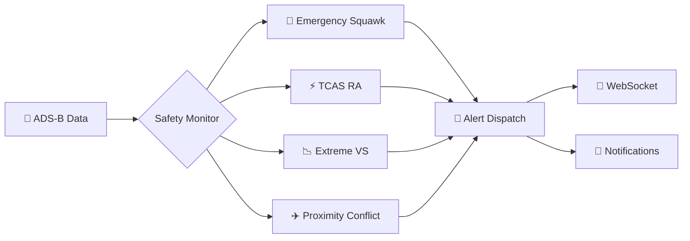
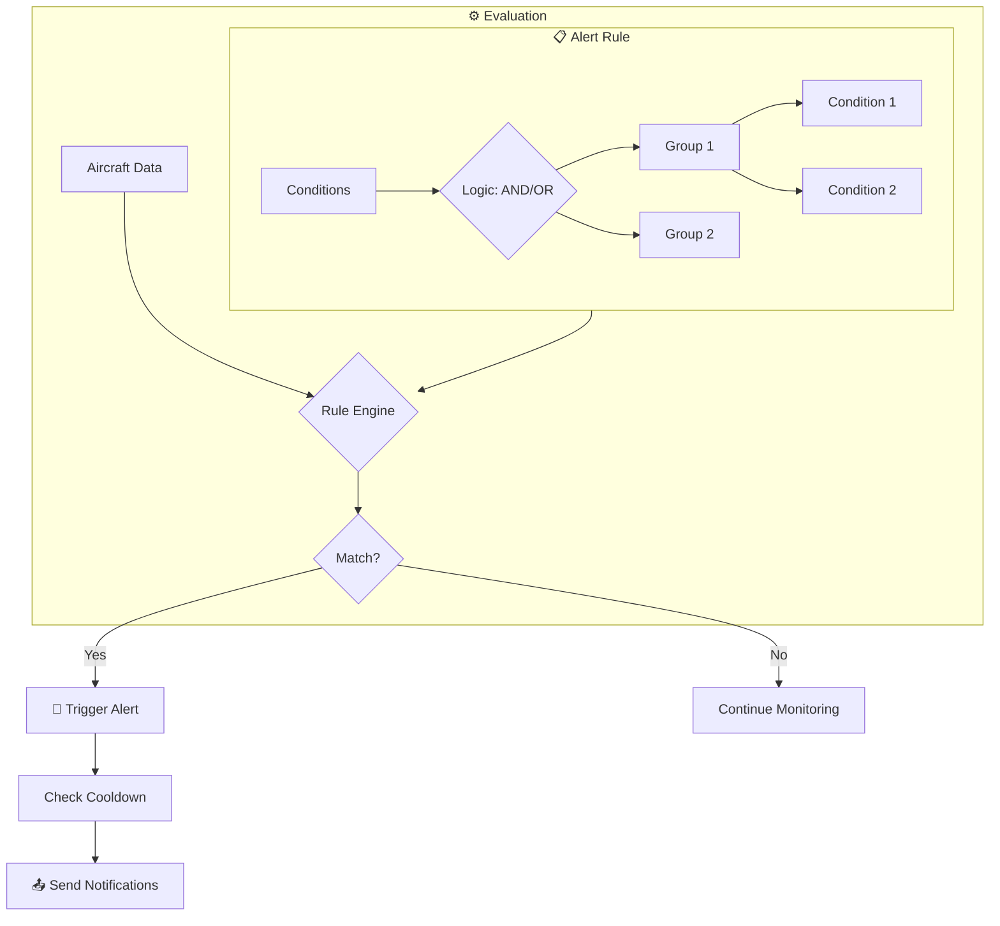
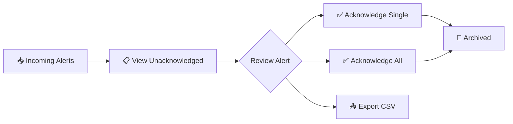

# 🛡️ Safety Events & Alert System

> 🚨 **Real-time flight safety monitoring with intelligent alerting** - Detect emergencies, TCAS events, and custom conditions as they happen.

---

## 📋 Overview

SkysPy provides a powerful **dual-layer** alert and monitoring system:

<Cards>
  <Card title="🔴 Automated Safety Monitoring" icon="fa-shield-alt">
    Real-time detection of dangerous flight conditions, TCAS events, and emergency squawks
  </Card>
  <Card title="🔔 Custom Alert Rules" icon="fa-bell">
    User-defined rules with flexible conditions, scheduling, and multi-channel notifications
  </Card>
</Cards>

> 📡 Both systems integrate with **WebSocket streaming** for real-time notifications and support enterprise features including role-based access control, notification channels, and audit history.

---

## ⚠️ Safety Events

### What Are Safety Events?

Safety events are **automatically detected anomalies** in aircraft behavior that may indicate dangerous situations. The `SafetyMonitor` service continuously analyzes incoming ADS-B data to identify potential safety concerns.



---

### 🚨 Types of Safety Events

| Event Type | Icon | Description | Severity |
|------------|------|-------------|----------|
| `squawk_hijack` | 🆘 | Aircraft squawking **7500** (hijack code) | 🔴 Critical |
| `squawk_radio_failure` | 📻 | Aircraft squawking **7600** (radio failure) | 🟡 Warning |
| `squawk_emergency` | 🚨 | Aircraft squawking **7700** (general emergency) | 🔴 Critical |
| `tcas_ra` | ⚡ | Suspected TCAS Resolution Advisory - rapid VS reversal indicating collision avoidance | 🔴 Critical |
| `vs_reversal` | 📈 | Significant vertical speed reversal without TCAS-level magnitude | 🟡 Warning / 🔵 Low |
| `extreme_vs` | 📉 | Vertical speed exceeding 6,000 fpm (configurable) | 🔵 Low - 🔴 Critical |
| `proximity_conflict` | ✈️✈️ | Two aircraft within dangerous proximity (< 1nm horizontal, < 1000ft vertical) | 🟡 Warning - 🔴 Critical |

---

### 🎨 Severity Levels

<Tabs>
  <Tab title="🔴 Critical">
    **Immediate attention required**

    - Emergency squawks (7500, 7700)
    - TCAS Resolution Advisories
    - Very close proximity conflicts
    - Extreme vertical rates

    > ⚠️ Critical events trigger immediate notifications and are highlighted prominently in the UI.
  </Tab>

  <Tab title="🟡 Warning">
    **Notable events requiring awareness**

    - Radio failure squawks (7600)
    - Moderate proximity conflicts
    - Significant VS reversals

    > 💡 Warning events are logged and displayed but may not require immediate action.
  </Tab>

  <Tab title="🔵 Low">
    **Informational events for logging**

    - Minor anomalies
    - Informational VS changes
    - Events filtered by smart detection

    > 📝 Low severity events are primarily for record-keeping and analysis.
  </Tab>
</Tabs>

---

### ⚙️ Detection Thresholds

> 🔧 **Quick Setup** - Configure these thresholds in your Django `settings.py` to tune sensitivity.

```python
# Django settings.py
SAFETY_MONITORING_ENABLED = True
SAFETY_VS_CHANGE_THRESHOLD = 3000      # fpm - triggers VS reversal detection
SAFETY_VS_EXTREME_THRESHOLD = 6000     # fpm - triggers extreme VS event
SAFETY_PROXIMITY_NM = 1.0              # nautical miles - horizontal proximity
SAFETY_ALTITUDE_DIFF_FT = 1000         # feet - vertical separation
SAFETY_CLOSURE_RATE_KT = 100           # knots - minimum closure rate
SAFETY_TCAS_VS_THRESHOLD = 1500        # fpm - magnitude for TCAS RA detection
```

| Setting | Default | Description |
|---------|---------|-------------|
| `SAFETY_VS_CHANGE_THRESHOLD` | 3000 fpm | Minimum VS change to trigger reversal detection |
| `SAFETY_VS_EXTREME_THRESHOLD` | 6000 fpm | Threshold for extreme vertical speed events |
| `SAFETY_PROXIMITY_NM` | 1.0 nm | Horizontal separation for proximity alerts |
| `SAFETY_ALTITUDE_DIFF_FT` | 1000 ft | Vertical separation for proximity alerts |
| `SAFETY_TCAS_VS_THRESHOLD` | 1500 fpm | VS magnitude indicating TCAS RA |

---

### 📦 Safety Event Data Structure

<Accordion title="📄 View Complete Event Schema">

Each safety event contains comprehensive data:

```json
{
  "id": "tcas_ra:ABC123",
  "event_type": "tcas_ra",
  "severity": "critical",
  "icao_hex": "ABC123",
  "icao_hex_2": "DEF456",           // For proximity events
  "callsign": "UAL123",
  "callsign_2": "DAL456",           // For proximity events
  "message": "TCAS RA suspected: UAL123 VS reversed from -2500 to +2500 fpm",
  "timestamp": "2024-01-15T10:30:00Z",
  "acknowledged": false,
  "details": {
    "previous_vs": -2500,
    "current_vs": 2500,
    "vs_change": 5000,
    "altitude": 35000,
    "lat": 47.5,
    "lon": -122.3,
    "distance_nm": 0.8,             // For proximity events
    "altitude_diff_ft": 400         // For proximity events
  },
  "aircraft_snapshot": {
    "hex": "ABC123",
    "flight": "UAL123",
    "lat": 47.5,
    "lon": -122.3,
    "alt_baro": 35000,
    "gs": 450,
    "track": 180,
    "baro_rate": 2500,
    "squawk": "1200"
  }
}
```

</Accordion>

---

### 🧠 Smart Filtering

> 💡 **Pro Tip** - The safety monitor includes intelligent filtering to reduce false positives.

<Cards>
  <Card title="🛫 Airport Proximity Filter" icon="fa-plane-departure">
    Ignores low-altitude proximity events near major airports (takeoff/landing pairs)
  </Card>
  <Card title="↔️ Diverging Aircraft Filter" icon="fa-arrows-alt-h">
    Skips proximity alerts when aircraft are moving apart from each other
  </Card>
  <Card title="🚀 Takeoff VS Filter" icon="fa-rocket">
    Ignores VS reversals during initial climb phase
  </Card>
</Cards>

---

## 🔔 Alert Rule System

### Overview

Custom alert rules allow users to define specific conditions for notification:



<Cards>
  <Card title="🧮 Complex Conditions" icon="fa-code-branch">
    AND/OR logic with multiple condition groups
  </Card>
  <Card title="📅 Scheduling" icon="fa-calendar">
    Start/expiration times and suppression windows
  </Card>
  <Card title="⏱️ Cooldowns" icon="fa-clock">
    Prevent alert spam for the same aircraft
  </Card>
  <Card title="📱 Multi-Channel" icon="fa-bell">
    Discord, Slack, Telegram, Email, and more
  </Card>
  <Card title="👁️ Visibility Control" icon="fa-eye">
    Private, shared, or public rules
  </Card>
  <Card title="🔍 Live Preview" icon="fa-search">
    Test rules against current aircraft before saving
  </Card>
</Cards>

---

### 🏗️ Alert Rule Builder

#### Basic Rule Structure

> 🚀 **Quick Start** - Here's a simple rule to detect military aircraft.

<CodeGroup title="Rule Examples">

```json {{ title: "Basic Rule" }}
{
  "name": "Military Aircraft Alert",
  "description": "Alert when military aircraft are detected",
  "priority": "warning",
  "enabled": true,
  "cooldown": 300,
  "conditions": {
    "logic": "AND",
    "groups": [
      {
        "logic": "AND",
        "conditions": [
          {
            "type": "military",
            "operator": "eq",
            "value": "true"
          }
        ]
      }
    ]
  }
}
```

```json {{ title: "Complex Multi-Condition" }}
{
  "name": "Low Flying Helicopter Near Me",
  "description": "Alert when helicopters fly low within 5nm",
  "priority": "info",
  "enabled": true,
  "cooldown": 300,
  "conditions": {
    "logic": "AND",
    "groups": [
      {
        "logic": "AND",
        "conditions": [
          { "type": "helicopter", "operator": "eq", "value": "true" },
          { "type": "altitude_below", "operator": "lt", "value": "2000" },
          { "type": "distance_within", "operator": "lte", "value": "5" }
        ]
      }
    ]
  }
}
```

```json {{ title: "OR Logic Example" }}
{
  "name": "Track N12345 or UAL Flights",
  "priority": "info",
  "conditions": {
    "logic": "OR",
    "groups": [
      {
        "logic": "AND",
        "conditions": [
          { "type": "registration", "operator": "eq", "value": "N12345" }
        ]
      },
      {
        "logic": "AND",
        "conditions": [
          { "type": "callsign", "operator": "startswith", "value": "UAL" }
        ]
      }
    ]
  }
}
```

</CodeGroup>

---

### 📊 Condition Types

<Tabs>
  <Tab title="✈️ Aircraft Identity">
    | Type | Description | Example Value | Operators |
    |------|-------------|---------------|-----------|
    | `icao` / `hex` | Aircraft ICAO hex code | `A12345` | eq, neq, contains, startswith, endswith |
    | `callsign` | Flight callsign | `UAL123` | eq, neq, contains, startswith, endswith |
    | `registration` | Aircraft registration | `N12345` | eq, neq, contains, startswith, endswith |
    | `type` / `aircraft_type` | Aircraft type code | `B738` | eq, neq, contains, startswith, endswith |
    | `category` | ADS-B category | `A3` | eq, neq |
  </Tab>

  <Tab title="📏 Flight Data">
    | Type | Description | Example Value | Operators |
    |------|-------------|---------------|-----------|
    | `altitude_above` | Altitude floor (ft) | `10000` | N/A (implicit >) |
    | `altitude_below` | Altitude ceiling (ft) | `5000` | N/A (implicit <) |
    | `altitude` | Exact altitude comparison | `35000` | eq, lt, gt, lte, gte |
    | `speed_above` | Ground speed floor (kts) | `300` | N/A (implicit >) |
    | `speed_below` | Ground speed ceiling (kts) | `100` | N/A (implicit <) |
    | `speed` | Exact speed comparison | `250` | eq, lt, gt, lte, gte |
    | `vertical_rate` | Vertical rate (fpm) | `-2000` | eq, lt, gt, lte, gte |
  </Tab>

  <Tab title="📍 Location">
    | Type | Description | Example Value | Operators |
    |------|-------------|---------------|-----------|
    | `distance_within` | Distance from feeder (nm) | `10` | N/A (implicit <=) |
    | `distance_from_mobile` | Distance from mobile GPS (nm) | `5` | N/A (implicit <=) |
  </Tab>

  <Tab title="🏷️ Classifications">
    | Type | Description | Example Value | Operators |
    |------|-------------|---------------|-----------|
    | `military` | Military aircraft flag | `true` | eq (boolean) |
    | `emergency` | Emergency squawk active | `true` | eq (boolean) |
    | `law_enforcement` | Law enforcement aircraft | `true` | eq (boolean) |
    | `helicopter` | Rotorcraft category | `true` | eq (boolean) |
    | `squawk` | Transponder squawk code | `7700` | eq, neq |
  </Tab>
</Tabs>

---

### 🔣 Available Operators

<Tabs>
  <Tab title="📝 String Operators">
    | Operator | Label | Example | Description |
    |----------|-------|---------|-------------|
    | `eq` | equals | `callsign eq "UAL123"` | Exact match (case-insensitive) |
    | `neq` | not equals | `type neq "B738"` | Does not match |
    | `contains` | contains | `callsign contains "UAL"` | Value contains substring |
    | `startswith` | starts with | `callsign startswith "DAL"` | Value starts with string |
    | `endswith` | ends with | `registration endswith "AB"` | Value ends with string |
    | `regex` | regex match | `callsign regex "^[A-Z]{3}\d+"` | Regular expression match |
  </Tab>

  <Tab title="🔢 Numeric Operators">
    | Operator | Symbol | Example | Description |
    |----------|--------|---------|-------------|
    | `eq` | = | `altitude eq 35000` | Equal to |
    | `lt` | < | `altitude lt 10000` | Less than |
    | `gt` | > | `speed gt 500` | Greater than |
    | `lte` | <= | `distance_within lte 5` | Less than or equal |
    | `gte` | >= | `altitude gte 20000` | Greater than or equal |
  </Tab>
</Tabs>

---

### 📑 Rule Templates

> 🎯 **Quick Start** - Use these pre-built templates for common use cases.

<Cards>
  <Card title="🎖️ Military Aircraft" icon="fa-fighter-jet">
    Detect military aircraft in your airspace

    **Priority:** 🟡 Warning
  </Card>
  <Card title="🚨 Emergency Squawk" icon="fa-exclamation-triangle">
    Emergency codes 7500/7600/7700

    **Priority:** 🔴 Critical
  </Card>
  <Card title="📉 Low Flying Aircraft" icon="fa-arrow-down">
    Aircraft below 2,000 ft

    **Priority:** 🔵 Info
  </Card>
  <Card title="📍 Nearby Aircraft" icon="fa-map-marker-alt">
    Aircraft within 5nm of your location

    **Priority:** 🔵 Info
  </Card>
  <Card title="🚁 Helicopter Activity" icon="fa-helicopter">
    Any helicopter detection

    **Priority:** 🔵 Info
  </Card>
  <Card title="👮 Law Enforcement" icon="fa-shield-alt">
    Police/government aircraft

    **Priority:** 🟡 Warning
  </Card>
</Cards>

---

### 📅 Scheduling & Suppression

#### ⏰ Time-Based Scheduling

Rules can have start and expiration times:

```json
{
  "name": "Air Show Alert",
  "starts_at": "2024-07-04T10:00:00Z",
  "expires_at": "2024-07-04T18:00:00Z",
  "conditions": { ... }
}
```

#### 🔇 Suppression Windows

Prevent alerts during specific times:

```json
{
  "name": "Night Alert",
  "suppression_windows": [
    {
      "day": "saturday",
      "start": "22:00",
      "end": "08:00"
    },
    {
      "day": "sunday",
      "start": "22:00",
      "end": "08:00"
    }
  ]
}
```

---

### ⏱️ Cooldowns

> 💡 **Best Practice** - Use cooldowns to prevent alert fatigue.

The cooldown system prevents alert spam:

| Feature | Description |
|---------|-------------|
| **Per-Aircraft Cooldown** | Same aircraft won't trigger the same rule within the cooldown period |
| **Distributed Cooldowns** | Redis-backed cooldowns work across multiple workers |
| **Default** | 5 minutes (300 seconds) |

---

## 📱 Notification Channels

### 🔌 Supported Channel Types

<Cards>
  <Card title="💬 Discord" icon="fa-discord">
    Rich embeds with colors and fields

    **Config:** `webhook_id`, `webhook_token`
  </Card>
  <Card title="💼 Slack" icon="fa-slack">
    Rich message attachments

    **Config:** `token_a`, `token_b`, `token_c`
  </Card>
  <Card title="✈️ Telegram" icon="fa-telegram">
    Instant mobile notifications

    **Config:** `bot_token`, `chat_id`
  </Card>
  <Card title="📧 Email" icon="fa-envelope">
    SMTP email delivery

    **Config:** `user`, `password`, `smtp_host`, `recipient`
  </Card>
  <Card title="📲 Pushover" icon="fa-mobile-alt">
    Push notifications

    **Config:** `user_key`, `api_token`
  </Card>
  <Card title="🔔 ntfy.sh" icon="fa-bell">
    Simple pub/sub notifications

    **Config:** `topic`
  </Card>
  <Card title="🏠 Home Assistant" icon="fa-home">
    Smart home integration

    **Config:** `host`, `access_token`
  </Card>
  <Card title="🌐 Webhook" icon="fa-globe">
    Generic JSON webhook

    **Config:** `webhook_url`
  </Card>
  <Card title="📱 Twilio SMS" icon="fa-sms">
    SMS text messages

    **Config:** `account_sid`, `auth_token`, `from_phone`, `to_phone`
  </Card>
  <Card title="🔧 Custom" icon="fa-cog">
    Custom Apprise URL

    **Config:** `apprise_url`
  </Card>
</Cards>

---

### ⚙️ Channel Configuration

#### Creating a Notification Channel

**POST** `/api/v1/notifications/channels/`

```json
{
  "name": "My Discord Server",
  "channel_type": "discord",
  "apprise_url": "discord://webhook_id/webhook_token",
  "enabled": true,
  "is_global": false
}
```

#### Assigning Channels to Rules

```json
{
  "name": "Emergency Alert",
  "notification_channel_ids": [1, 2, 5],
  "use_global_notifications": true,
  "conditions": { ... }
}
```

---

### 🌐 Global vs Rule-Specific Notifications

| Type | Description | Configuration |
|------|-------------|---------------|
| **Global Notifications** | Apply to all rules by default | `APPRISE_URLS` environment variable (semicolon-separated) |
| **Rule-Specific** | Channels attached directly to rules | `notification_channel_ids` in rule |
| **`use_global_notifications`** | When `true`, rule also sends to global config | Default: `true` |

---

## 📜 Alert History & Management

### 📊 Viewing Alert History

Alert history is accessible via API and WebSocket, with filtering by:

- ⏰ Time range (hours)
- 🎯 Severity/priority
- 📋 Rule ID
- ✈️ ICAO hex
- ✅ Acknowledged status

---

### ✅ Acknowledgment Workflow



---

### 📦 Aggregation

For high-volume rules, alerts are aggregated into time windows to reduce noise:

```json
{
  "rule_name": "Military Aircraft",
  "window_start": "2024-01-15T10:00:00Z",
  "window_end": "2024-01-15T11:00:00Z",
  "trigger_count": 45,
  "unique_aircraft": 12,
  "sample_aircraft": [
    {"icao_hex": "AE1234", "callsign": "RCH123"},
    {"icao_hex": "AE5678", "callsign": "RCH456"}
  ]
}
```

---

## 🔌 API Reference

### 📋 Alert Rules

<Tabs>
  <Tab title="📖 List & Get">
    #### List Rules
    **GET** `/api/v1/alerts/rules/`

    Query parameters:
    - `enabled`: Filter by enabled status
    - `priority`: Filter by priority (info/warning/critical)
    - `visibility`: Filter by visibility (private/shared/public)

    #### Get Rule
    **GET** `/api/v1/alerts/rules/{id}/`
  </Tab>

  <Tab title="➕ Create & Update">
    #### Create Rule
    **POST** `/api/v1/alerts/rules/`

    #### Update Rule
    **PATCH** `/api/v1/alerts/rules/{id}/`

    #### Delete Rule
    **DELETE** `/api/v1/alerts/rules/{id}/`
  </Tab>

  <Tab title="⚡ Actions">
    #### Toggle Rule
    **POST** `/api/v1/alerts/rules/{id}/toggle/`

    #### Test Rule
    **POST** `/api/v1/alerts/rules/test/`

    ```json
    {
      "rule": {
        "type": "military",
        "operator": "eq",
        "value": "true"
      },
      "aircraft": [
        {"hex": "AE1234", "military": true},
        {"hex": "A12345", "military": false}
      ]
    }
    ```

    Response:
    ```json
    {
      "would_match": 1,
      "matched_aircraft": [{"hex": "AE1234", "military": true}],
      "rule_valid": true,
      "aircraft_tested": 2
    }
    ```
  </Tab>

  <Tab title="📦 Bulk Operations">
    #### Bulk Create
    **POST** `/api/v1/alerts/rules/bulk_create/`
    ```json
    {
      "rules": [{ ... }, { ... }]
    }
    ```

    #### Bulk Delete
    **POST** `/api/v1/alerts/rules/bulk_delete/`
    ```json
    {
      "rule_ids": [1, 2, 3]
    }
    ```

    #### Bulk Toggle
    **POST** `/api/v1/alerts/rules/bulk_toggle/`
    ```json
    {
      "rule_ids": [1, 2, 3],
      "enabled": true
    }
    ```
  </Tab>

  <Tab title="📤 Export/Import">
    #### Export
    **GET** `/api/v1/alerts/rules/export/`

    #### Import
    **POST** `/api/v1/alerts/rules/import/`
    ```json
    {
      "rules": [{ ... }],
      "replace_all": false
    }
    ```
  </Tab>
</Tabs>

---

### 📜 Alert History

| Endpoint | Method | Description |
|----------|--------|-------------|
| `/api/v1/alerts/history/` | GET | List history with filters |
| `/api/v1/alerts/history/{id}/acknowledge/` | POST | Acknowledge single alert |
| `/api/v1/alerts/history/acknowledge-all/` | POST | Acknowledge all alerts |
| `/api/v1/alerts/history/clear/` | DELETE | Clear history |
| `/api/v1/alerts/history/aggregated/` | GET | Get aggregated history |

**Query Parameters for List:**
- `hours`: Time range (default: 24)
- `rule_id`: Filter by rule
- `icao_hex`: Filter by aircraft
- `priority`: Filter by priority
- `acknowledged`: Filter by acknowledged status
- `limit`: Pagination limit
- `offset`: Pagination offset

---

### 🔔 Subscriptions

| Endpoint | Method | Description |
|----------|--------|-------------|
| `/api/v1/alerts/subscriptions/` | GET | List subscriptions |
| `/api/v1/alerts/subscriptions/` | POST | Subscribe to rule |
| `/api/v1/alerts/subscriptions/{rule_id}/` | DELETE | Unsubscribe |

```json
{
  "rule_id": 123,
  "notify_on_trigger": true
}
```

---

### ⚠️ Safety Events

| Endpoint | Method | Description |
|----------|--------|-------------|
| `/api/v1/safety/events/` | GET | List events |
| `/api/v1/safety/events/stats/` | GET | Get statistics |
| `/api/v1/safety/events/{id}/acknowledge/` | POST | Acknowledge event |

<Accordion title="📊 Statistics Response Example">

```json
{
  "monitoring_enabled": true,
  "thresholds": {
    "vs_change_threshold": 3000,
    "vs_extreme_threshold": 6000,
    "proximity_nm": 1.0,
    "altitude_diff_ft": 1000
  },
  "time_range_hours": 24,
  "events_by_type": {
    "tcas_ra": 5,
    "proximity_conflict": 12,
    "extreme_vs": 8
  },
  "events_by_severity": {
    "critical": 7,
    "warning": 10,
    "low": 8
  },
  "total_events": 25,
  "unique_aircraft": 18,
  "event_rate_per_hour": 1.04
}
```

</Accordion>

---

### 📱 Notification Channels

| Endpoint | Method | Description |
|----------|--------|-------------|
| `/api/v1/notifications/channels/` | GET | List channels |
| `/api/v1/notifications/channels/types/` | GET | Get channel types |
| `/api/v1/notifications/channels/` | POST | Create channel |
| `/api/v1/notifications/channels/{id}/test/` | POST | Test channel |

---

## 📡 WebSocket Alert Streaming

### 🔗 Connection

Connect to the alerts WebSocket endpoint:

```
wss://your-skyspy-instance/ws/alerts/
```

---

### 📨 Message Types

<Tabs>
  <Tab title="📤 Subscribe">
    ```json
    {
      "type": "subscribe",
      "topic": "alerts"
    }
    ```
  </Tab>

  <Tab title="🔔 Alert Triggered">
    ```json
    {
      "type": "alert:triggered",
      "data": {
        "rule_id": 123,
        "rule_name": "Military Aircraft",
        "icao": "AE1234",
        "callsign": "RCH123",
        "message": "Alert 'Military Aircraft' triggered for RCH123",
        "priority": "warning",
        "aircraft": { ... },
        "timestamp": "2024-01-15T10:30:00Z"
      }
    }
    ```
  </Tab>

  <Tab title="⚠️ Safety Event">
    ```json
    {
      "type": "safety_event",
      "data": {
        "event_type": "tcas_ra",
        "severity": "critical",
        "icao_hex": "ABC123",
        "message": "TCAS RA suspected: ...",
        "timestamp": "2024-01-15T10:30:00Z"
      }
    }
    ```
  </Tab>

  <Tab title="📷 Snapshot">
    ```json
    {
      "type": "alert:snapshot",
      "data": {
        "alerts": [...],
        "count": 20,
        "timestamp": "2024-01-15T10:30:00Z"
      }
    }
    ```
  </Tab>
</Tabs>

---

### 🔄 Request/Response Pattern

**Request:**
```json
{
  "type": "request",
  "request_id": "req-123",
  "request_type": "alerts",
  "params": {
    "hours": 24,
    "limit": 50
  }
}
```

**Response:**
```json
{
  "type": "response",
  "request_id": "req-123",
  "request_type": "alerts",
  "data": [...]
}
```

---

### 📋 Available Request Types

| Request Type | Description | Parameters |
|--------------|-------------|------------|
| `alerts` | 📜 Get alert history | `hours`, `limit` |
| `alert-rules` | 📋 Get active rules | - |
| `alert-stats` | 📊 Get statistics | - |
| `alert-count` | 🔢 Get unacknowledged count | `acknowledged` |
| `my-subscriptions` | 🔔 Get user's subscriptions | - |
| `acknowledge-alert` | ✅ Acknowledge single alert | `id` |
| `acknowledge-all-alerts` | ✅ Acknowledge all | - |

---

### 👤 User-Specific Channels

Authenticated users automatically join:
- `alerts_user_{user_id}` - Private alerts for owned rules
- `alerts_session_{session_key}` - Session-based alerts for anonymous users

---

## 📚 Custom Rule Examples

<Accordion title="🎯 Track Specific Aircraft">

```json
{
  "name": "Track N12345",
  "priority": "info",
  "cooldown": 60,
  "conditions": {
    "logic": "OR",
    "groups": [
      {
        "logic": "AND",
        "conditions": [
          { "type": "registration", "operator": "eq", "value": "N12345" }
        ]
      },
      {
        "logic": "AND",
        "conditions": [
          { "type": "icao", "operator": "eq", "value": "A12345" }
        ]
      }
    ]
  }
}
```

</Accordion>

<Accordion title="🚨 Emergency Detection with Cooldown">

```json
{
  "name": "All Emergencies",
  "priority": "critical",
  "cooldown": 30,
  "conditions": {
    "logic": "AND",
    "groups": [
      {
        "logic": "AND",
        "conditions": [
          { "type": "emergency", "operator": "eq", "value": "true" }
        ]
      }
    ]
  },
  "notification_channel_ids": [1, 2],
  "use_global_notifications": true
}
```

</Accordion>

<Accordion title="📉 Low-Flying Aircraft Near Location">

```json
{
  "name": "Low Flyers Near Home",
  "priority": "info",
  "cooldown": 300,
  "conditions": {
    "logic": "AND",
    "groups": [
      {
        "logic": "AND",
        "conditions": [
          { "type": "altitude_below", "operator": "lt", "value": "3000" },
          { "type": "distance_within", "operator": "lte", "value": "5" }
        ]
      }
    ]
  }
}
```

</Accordion>

<Accordion title="👮 Police Helicopter Activity">

```json
{
  "name": "Police Helicopter Alert",
  "priority": "warning",
  "cooldown": 600,
  "conditions": {
    "logic": "AND",
    "groups": [
      {
        "logic": "AND",
        "conditions": [
          { "type": "law_enforcement", "operator": "eq", "value": "true" },
          { "type": "helicopter", "operator": "eq", "value": "true" },
          { "type": "distance_within", "operator": "lte", "value": "10" }
        ]
      }
    ]
  }
}
```

</Accordion>

<Accordion title="⚡ Fast-Moving Aircraft (Jets)">

```json
{
  "name": "Fast Movers",
  "priority": "info",
  "cooldown": 300,
  "conditions": {
    "logic": "AND",
    "groups": [
      {
        "logic": "AND",
        "conditions": [
          { "type": "speed_above", "operator": "gt", "value": "500" },
          { "type": "altitude_above", "operator": "gt", "value": "20000" }
        ]
      }
    ]
  }
}
```

</Accordion>

<Accordion title="✈️ Airline Prefix Match">

```json
{
  "name": "United Airlines",
  "priority": "info",
  "cooldown": 120,
  "conditions": {
    "logic": "AND",
    "groups": [
      {
        "logic": "AND",
        "conditions": [
          { "type": "callsign", "operator": "startswith", "value": "UAL" }
        ]
      }
    ]
  }
}
```

</Accordion>

<Accordion title="🛩️ Multiple Aircraft Types">

```json
{
  "name": "Interesting Aircraft Types",
  "priority": "info",
  "cooldown": 300,
  "conditions": {
    "logic": "OR",
    "groups": [
      {
        "logic": "AND",
        "conditions": [
          { "type": "type", "operator": "eq", "value": "A380" }
        ]
      },
      {
        "logic": "AND",
        "conditions": [
          { "type": "type", "operator": "eq", "value": "B748" }
        ]
      },
      {
        "logic": "AND",
        "conditions": [
          { "type": "type", "operator": "eq", "value": "AN124" }
        ]
      }
    ]
  }
}
```

</Accordion>

<Accordion title="📱 Mobile-Based Proximity Alert">

```json
{
  "name": "Aircraft Near Me (Mobile)",
  "description": "Alert when aircraft fly over my current GPS location",
  "priority": "info",
  "cooldown": 120,
  "conditions": {
    "logic": "AND",
    "groups": [
      {
        "logic": "AND",
        "conditions": [
          { "type": "distance_from_mobile", "operator": "lte", "value": "2" }
        ]
      }
    ]
  }
}
```

</Accordion>

<Accordion title="📅 Scheduled Event Alert">

```json
{
  "name": "Air Show Weekend",
  "description": "Track military aircraft during air show",
  "priority": "info",
  "starts_at": "2024-07-04T09:00:00Z",
  "expires_at": "2024-07-06T18:00:00Z",
  "cooldown": 60,
  "conditions": {
    "logic": "AND",
    "groups": [
      {
        "logic": "AND",
        "conditions": [
          { "type": "military", "operator": "eq", "value": "true" },
          { "type": "distance_within", "operator": "lte", "value": "20" }
        ]
      }
    ]
  }
}
```

</Accordion>

---

## 🔐 Access Control & Visibility

### 👁️ Rule Visibility Levels

| Level | Icon | Description | Who Can See | Who Can Edit |
|-------|------|-------------|-------------|--------------|
| `private` | 🔒 | Owner only | Owner | Owner |
| `shared` | 👥 | Owner + subscribers | Owner, Subscribers | Owner |
| `public` | 🌐 | Everyone | Everyone | Owner |

---

### 🛡️ Role-Based Permissions

| Permission | Description |
|------------|-------------|
| `alerts.manage_all` | 👑 Full access to all rules (admin) |
| `alerts.view` | 👁️ View public/shared rules |
| `alerts.create` | ➕ Create new rules |
| `alerts.subscribe` | 🔔 Subscribe to shared rules |

---

### ⚙️ System Rules

> ⚠️ System rules (`is_system: true`) are protected:
> - Cannot be deleted by regular users
> - Only superadmins can modify
> - Used for built-in safety monitoring

---

## 💡 Best Practices

### ✨ Rule Design

<Cards>
  <Card title="🎯 Start Specific" icon="fa-bullseye">
    Begin with narrow conditions, expand if needed
  </Card>
  <Card title="⏱️ Use Cooldowns" icon="fa-clock">
    Prevent alert fatigue with appropriate cooldown periods
  </Card>
  <Card title="🧪 Test Before Deploy" icon="fa-flask">
    Use the live preview and test endpoint
  </Card>
  <Card title="🎚️ Layer Priority" icon="fa-sliders-h">
    Reserve critical/warning for important events
  </Card>
</Cards>

---

### 📱 Notification Strategy

> 💡 **Pro Tips**

1. **📬 Dedicated Channels** - Create separate channels for different alert priorities
2. **🌐 Global + Specific** - Use global config for critical alerts, rule-specific for others
3. **🧪 Test Channels** - Always verify channels with test notifications

---

### ⚡ Performance

> ⚠️ **Important** - Optimize for production environments.

| Tip | Description |
|-----|-------------|
| 📉 Limit Active Rules | More rules = more CPU; disable unused rules |
| 🎯 Use Efficient Conditions | ICAO/callsign matches are faster than regex |
| ⏱️ Reasonable Cooldowns | Shorter cooldowns increase processing load |

---

## 🔧 Troubleshooting

### ❓ Common Issues

<Accordion title="🔴 Rule not triggering">

- ✅ Check if rule is enabled
- 📅 Verify scheduling (starts_at/expires_at)
- ⏱️ Check cooldown - may still be in cooldown period
- 🧪 Test rule against current aircraft

</Accordion>

<Accordion title="🔴 Notifications not sending">

- 🧪 Test channel directly via API
- 🔗 Check Apprise URL format
- ✅ Verify channel is enabled
- ⚙️ Check `use_global_notifications` setting

</Accordion>

<Accordion title="🔴 Safety events missing">

- ✅ Verify `SAFETY_MONITORING_ENABLED` is `true`
- ⚙️ Check thresholds aren't too restrictive
- 📡 Ensure aircraft have required data (VS, altitude, position)

</Accordion>

---

### 🐛 Debugging

Enable debug logging:

```python
LOGGING = {
    'loggers': {
        'skyspy.services.alerts': {'level': 'DEBUG'},
        'skyspy.services.safety': {'level': 'DEBUG'},
    }
}
```

Check service status:

```
GET /api/v1/alerts/rules/metrics/
```

---

## 📚 Related Documentation

- 📡 [WebSocket Integration Guide](./websocket-guide.md)
- 🔐 [API Authentication](./authentication.md)
- 🚀 [Deployment Guide](./deployment.md)
