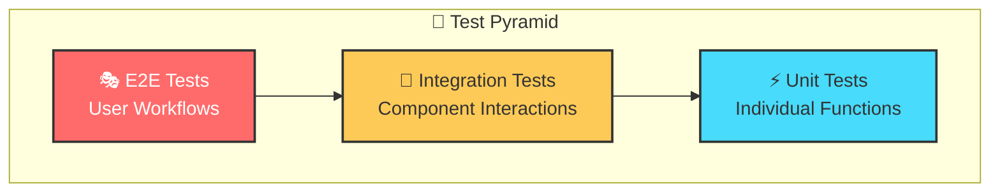
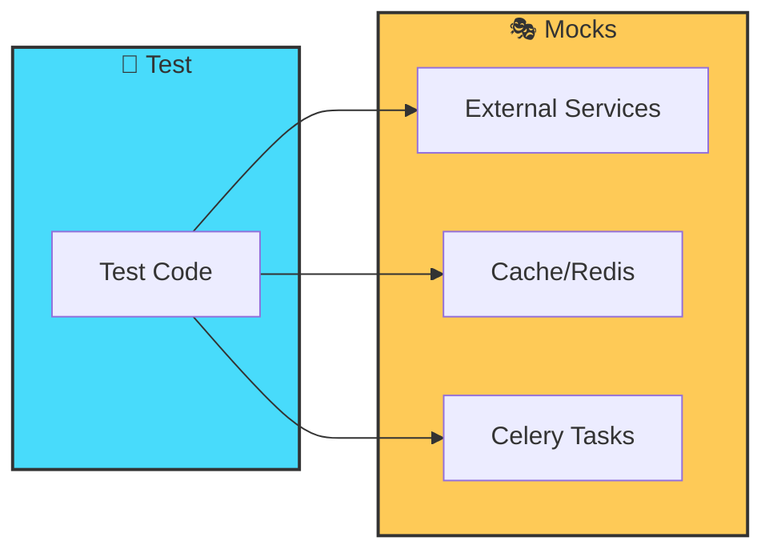
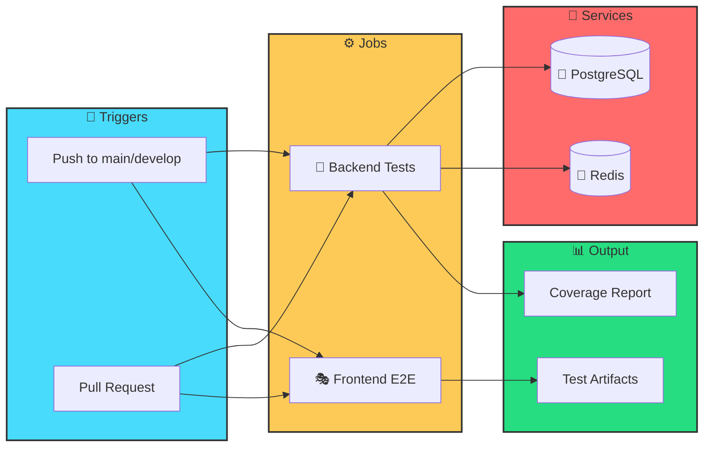

# 🧪 Testing Guide

> 📘 **Premium Documentation**
>
> This guide covers the SkySpy test suite architecture, running tests, writing new tests, and best practices for maintaining comprehensive test coverage.

---

## 🔬 Testing Overview

SkySpy employs a multi-layered testing strategy to ensure reliability across the entire stack.



[block:parameters]
{
  "data": {
    "h-0": "Layer",
    "h-1": "Framework",
    "h-2": "Location",
    "h-3": "Purpose",
    "0-0": "⚡ **Unit Tests**",
    "0-1": "pytest + pytest-django",
    "0-2": "`skyspy_django/skyspy/tests/`",
    "0-3": "Test individual functions, methods, and classes",
    "1-0": "🔗 **Integration Tests**",
    "1-1": "pytest + pytest-asyncio",
    "1-2": "`skyspy_django/skyspy/tests/`",
    "1-3": "Test component interactions and data flow",
    "2-0": "🔌 **Backend E2E**",
    "2-1": "pytest + Django Channels",
    "2-2": "`skyspy_django/skyspy/tests/e2e/`",
    "2-3": "Test WebSocket consumers and real-time features",
    "3-0": "🎭 **Frontend E2E**",
    "3-1": "Playwright",
    "3-2": "`web/e2e/`",
    "3-3": "Test user workflows in the browser"
  },
  "cols": 4,
  "rows": 4
}
[/block]

### 📊 Coverage Targets

[block:html]
{
  "html": "<div style=\"display: flex; gap: 16px; flex-wrap: wrap; margin: 20px 0;\">\n  <div style=\"background: linear-gradient(135deg, #667eea 0%, #764ba2 100%); padding: 20px; border-radius: 12px; color: white; flex: 1; min-width: 200px;\">\n    <div style=\"font-size: 36px; font-weight: bold;\">80%+</div>\n    <div style=\"opacity: 0.9;\">Backend Coverage</div>\n  </div>\n  <div style=\"background: linear-gradient(135deg, #f093fb 0%, #f5576c 100%); padding: 20px; border-radius: 12px; color: white; flex: 1; min-width: 200px;\">\n    <div style=\"font-size: 36px; font-weight: bold;\">100%</div>\n    <div style=\"opacity: 0.9;\">Critical Paths</div>\n  </div>\n  <div style=\"background: linear-gradient(135deg, #4facfe 0%, #00f2fe 100%); padding: 20px; border-radius: 12px; color: white; flex: 1; min-width: 200px;\">\n    <div style=\"font-size: 36px; font-weight: bold;\">✓</div>\n    <div style=\"opacity: 0.9;\">All User Workflows</div>\n  </div>\n</div>"
}
[/block]

> ✅ **Coverage Requirements**
>
> - **Backend**: Minimum 80% line coverage
> - **Critical Paths**: 100% coverage for authentication, alerts, and safety features
> - **Frontend E2E**: Cover all major user workflows

---

## 📁 Test Structure and Organization

### 🐍 Backend Tests

```
skyspy_django/skyspy/tests/
├── conftest.py                    # 🔧 Shared fixtures for all tests
├── factories.py                   # 🏭 Factory Boy model factories
├── e2e/
│   ├── conftest.py               # 🔧 E2E-specific fixtures
│   ├── test_e2e_stats.py         # 📊 Statistics E2E tests
│   └── test_e2e_websocket.py     # 🔌 WebSocket E2E tests
├── test_api_*.py                 # 🌐 REST API endpoint tests
├── test_consumers_*.py           # 📡 WebSocket consumer tests
├── test_services_*.py            # ⚙️ Business logic/service tests
├── test_tasks_*.py               # ⏰ Celery task tests
├── test_integration.py           # 🔗 Cross-component integration tests
└── test_settings.py              # ⚙️ Configuration tests
```

### 🎭 Frontend E2E Tests

```
web/e2e/
├── fixtures/
│   └── test-setup.js             # 🔧 Mock data generators and test utilities
├── tests/
│   ├── alerts.spec.js            # 🔔 Alert management tests
│   ├── map.spec.js               # 🗺️ Map and aircraft display tests
│   └── ...                       # 📦 Additional feature tests
└── playwright.config.js          # ⚙️ Playwright configuration
```

### 📝 Naming Conventions

[block:parameters]
{
  "data": {
    "h-0": "Pattern",
    "h-1": "Description",
    "h-2": "Example",
    "0-0": "`test_api_*.py`",
    "0-1": "🌐 API endpoint tests",
    "0-2": "`test_api_aircraft.py`",
    "1-0": "`test_consumers_*.py`",
    "1-1": "📡 WebSocket consumer tests",
    "1-2": "`test_consumers_aircraft.py`",
    "2-0": "`test_services_*.py`",
    "2-1": "⚙️ Service layer tests",
    "2-2": "`test_services_alerts.py`",
    "3-0": "`test_tasks_*.py`",
    "3-1": "⏰ Celery task tests",
    "3-2": "`test_tasks_airspace.py`",
    "4-0": "`test_e2e_*.py`",
    "4-1": "🔌 Backend E2E tests",
    "4-2": "`test_e2e_websocket.py`",
    "5-0": "`*.spec.js`",
    "5-1": "🎭 Frontend E2E tests",
    "5-2": "`map.spec.js`"
  },
  "cols": 3,
  "rows": 6
}
[/block]

---

## 🚀 Running Tests

### ⚙️ Prerequisites

> 📘 **Setup Required**
>
> Ensure you have the test dependencies installed before running tests.

[block:code]
{
  "codes": [
    {
      "code": "# Backend dependencies\ncd skyspy_django\npip install -e \".[test]\"",
      "language": "bash",
      "name": "🐍 Backend Setup"
    },
    {
      "code": "# Frontend dependencies\ncd web\nnpm install\nnpx playwright install",
      "language": "bash",
      "name": "🎭 Frontend Setup"
    }
  ]
}
[/block]

### ⚡ Unit Tests

[block:code]
{
  "codes": [
    {
      "code": "cd skyspy_django\npytest",
      "language": "bash",
      "name": "Run All Tests"
    },
    {
      "code": "pytest skyspy/tests/test_api_aircraft.py",
      "language": "bash",
      "name": "Specific Module"
    },
    {
      "code": "pytest -k \"aircraft\"",
      "language": "bash",
      "name": "Pattern Matching"
    },
    {
      "code": "pytest -v",
      "language": "bash",
      "name": "Verbose Output"
    }
  ]
}
[/block]

### 🔗 Integration Tests

```bash
# Run integration tests
pytest skyspy/tests/test_integration.py

# Run async integration tests
pytest skyspy/tests/test_integration.py -v --asyncio-mode=auto
```

### 🎭 E2E Tests

[block:callout]
{
  "type": "info",
  "title": "🔌 Backend E2E (WebSocket/Channels)",
  "body": "Tests real-time WebSocket functionality and Django Channels consumers."
}
[/block]

[block:code]
{
  "codes": [
    {
      "code": "pytest skyspy/tests/e2e/ -v",
      "language": "bash",
      "name": "All Backend E2E"
    },
    {
      "code": "pytest skyspy/tests/e2e/test_e2e_websocket.py::test_aircraft_position_updates -v",
      "language": "bash",
      "name": "Specific E2E Test"
    }
  ]
}
[/block]

[block:callout]
{
  "type": "info",
  "title": "🎭 Frontend E2E (Playwright)",
  "body": "Tests user workflows in real browser environments."
}
[/block]

[block:code]
{
  "codes": [
    {
      "code": "cd web\nnpx playwright test",
      "language": "bash",
      "name": "All Frontend E2E"
    },
    {
      "code": "npx playwright test tests/map.spec.js",
      "language": "bash",
      "name": "Specific Test File"
    },
    {
      "code": "npx playwright test --headed",
      "language": "bash",
      "name": "🖥️ Headed Mode"
    },
    {
      "code": "npx playwright test --ui",
      "language": "bash",
      "name": "🎨 UI Mode (Debug)"
    }
  ]
}
[/block]

### 🐳 Docker-Based Testing

```bash
docker-compose -f docker-compose.test.yaml up --build --abort-on-container-exit
```

> ✅ **Docker Test Environment Includes:**
>
> - 🐘 Isolated PostgreSQL database
> - 🔴 Redis for caching and Channels
> - 🌐 Proper network configuration
> - 📊 Coverage report generation

---

## 🔧 Test Fixtures and Factories

### 🐍 Backend Fixtures (`conftest.py`)

SkySpy uses pytest fixtures for test setup. Key fixtures are defined in `skyspy_django/skyspy/tests/conftest.py`:

[block:callout]
{
  "type": "success",
  "title": "💾 Database Fixtures",
  "body": "Manage database state and provide API clients for testing."
}
[/block]

```python
@pytest.fixture
def db_session(db):
    """Provides a database session with automatic rollback."""
    yield
    # Automatic rollback after test

@pytest.fixture
def api_client():
    """Returns a DRF APIClient for testing API endpoints."""
    from rest_framework.test import APIClient
    return APIClient()

@pytest.fixture
def authenticated_client(api_client, user):
    """Returns an authenticated API client."""
    api_client.force_authenticate(user=user)
    return api_client
```

[block:callout]
{
  "type": "success",
  "title": "🔌 WebSocket Fixtures",
  "body": "Enable testing of real-time WebSocket functionality."
}
[/block]

```python
@pytest.fixture
async def communicator(application):
    """WebSocket communicator for testing consumers."""
    from channels.testing import WebsocketCommunicator
    communicator = WebsocketCommunicator(application, "/ws/aircraft/")
    connected, _ = await communicator.connect()
    assert connected
    yield communicator
    await communicator.disconnect()
```

[block:callout]
{
  "type": "success",
  "title": "👤 User Fixtures",
  "body": "Create test users with various permission levels."
}
[/block]

```python
@pytest.fixture
def user(db):
    """Creates a standard test user."""
    from skyspy.models import User
    return User.objects.create_user(
        username="testuser",
        email="test@example.com",
        password="testpass123"
    )

@pytest.fixture
def admin_user(db):
    """Creates an admin user with elevated permissions."""
    from skyspy.models import User
    return User.objects.create_superuser(
        username="admin",
        email="admin@example.com",
        password="adminpass123"
    )
```

### 🏭 Factory Boy Factories (`factories.py`)

Factories generate realistic test data using Factory Boy:

```python
import factory
from factory.django import DjangoModelFactory
from skyspy.models import Aircraft, Alert, User

class UserFactory(DjangoModelFactory):
    class Meta:
        model = User

    username = factory.Sequence(lambda n: f"user{n}")
    email = factory.LazyAttribute(lambda obj: f"{obj.username}@example.com")
    password = factory.PostGenerationMethodCall("set_password", "testpass123")

class AircraftFactory(DjangoModelFactory):
    class Meta:
        model = Aircraft

    icao_hex = factory.Sequence(lambda n: f"A{n:05X}")
    callsign = factory.Sequence(lambda n: f"TEST{n:03d}")
    latitude = factory.Faker("latitude")
    longitude = factory.Faker("longitude")
    altitude = factory.Faker("random_int", min=1000, max=45000)
    speed = factory.Faker("random_int", min=100, max=600)
    heading = factory.Faker("random_int", min=0, max=359)

class AlertFactory(DjangoModelFactory):
    class Meta:
        model = Alert

    user = factory.SubFactory(UserFactory)
    name = factory.Sequence(lambda n: f"Alert Rule {n}")
    conditions = factory.LazyFunction(lambda: {
        "field": "altitude",
        "operator": "less_than",
        "value": 5000
    })
    is_active = True
```

[block:callout]
{
  "type": "info",
  "title": "💡 Using Factories in Tests",
  "body": "Factories simplify test data creation and make tests more readable."
}
[/block]

```python
def test_aircraft_list(authenticated_client):
    # Create test aircraft
    aircraft = AircraftFactory.create_batch(5)

    response = authenticated_client.get("/api/v1/aircraft/")

    assert response.status_code == 200
    assert len(response.json()["results"]) == 5

def test_alert_triggers(user):
    alert = AlertFactory(user=user, conditions={
        "field": "altitude",
        "operator": "less_than",
        "value": 3000
    })
    aircraft = AircraftFactory(altitude=2500)

    # Test alert evaluation logic
    assert alert.evaluate(aircraft) is True
```

### 🎭 Frontend Test Fixtures (`test-setup.js`)

Frontend E2E tests use custom fixtures for mock data and API mocking:

[block:code]
{
  "codes": [
    {
      "code": "// Generate mock aircraft data\nexport function generateMockAircraft(count = 10) {\n    return Array.from({ length: count }, (_, i) => ({\n        icao_hex: `A${String(i).padStart(5, '0')}`,\n        callsign: `TEST${String(i).padStart(3, '0')}`,\n        latitude: 40.7128 + (Math.random() - 0.5) * 2,\n        longitude: -74.0060 + (Math.random() - 0.5) * 2,\n        altitude: Math.floor(Math.random() * 40000) + 5000,\n        speed: Math.floor(Math.random() * 500) + 100,\n        heading: Math.floor(Math.random() * 360),\n        aircraft_type: 'B738',\n        registration: `N${100 + i}AA`\n    }));\n}",
      "language": "javascript",
      "name": "✈️ Mock Aircraft"
    },
    {
      "code": "// Generate mock ACARS messages\nexport function generateMockAcarsMessages(count = 5) {\n    return Array.from({ length: count }, (_, i) => ({\n        id: i + 1,\n        timestamp: new Date(Date.now() - i * 60000).toISOString(),\n        icao_hex: `A${String(i).padStart(5, '0')}`,\n        message: `ACARS message content ${i}`,\n        label: 'H1',\n        block_id: String.fromCharCode(65 + i)\n    }));\n}",
      "language": "javascript",
      "name": "📨 Mock ACARS"
    },
    {
      "code": "// Generate mock alert rules\nexport function generateMockAlertRules(count = 3) {\n    return Array.from({ length: count }, (_, i) => ({\n        id: i + 1,\n        name: `Alert Rule ${i + 1}`,\n        conditions: [{ field: 'altitude', operator: 'lt', value: 5000 }],\n        is_active: true,\n        notification_channels: ['browser']\n    }));\n}",
      "language": "javascript",
      "name": "🔔 Mock Alerts"
    }
  ]
}
[/block]

#### 🎭 Extended Playwright Test Fixture

```javascript
import { test as base, expect } from '@playwright/test';

export const test = base.extend({
    // Mock API routes
    mockApi: async ({ page }, use) => {
        const mocks = {
            aircraft: generateMockAircraft(20),
            alerts: generateMockAlertRules(3),
            acars: generateMockAcarsMessages(10)
        };

        await page.route('**/api/v1/aircraft/**', route => {
            route.fulfill({ json: { results: mocks.aircraft } });
        });

        await page.route('**/api/v1/alerts/**', route => {
            route.fulfill({ json: { results: mocks.alerts } });
        });

        await use(mocks);
    },

    // WebSocket mock
    wsMock: async ({ page }, use) => {
        const wsMock = new WebSocketMock();
        await page.exposeFunction('__wsMockSend', (data) => {
            wsMock.emit(JSON.parse(data));
        });
        await use(wsMock);
    },

    // Helper utilities
    helpers: async ({ page }, use) => {
        await use({
            waitForMapLoad: () => page.waitForSelector('.mapboxgl-canvas'),
            waitForAircraftMarkers: () => page.waitForSelector('[data-testid="aircraft-marker"]'),
            clickAircraft: (icao) => page.click(`[data-aircraft-id="${icao}"]`)
        });
    }
});
```

---

## 🎭 Mocking Strategies

### 🐍 Backend Mocking



[block:callout]
{
  "type": "info",
  "title": "🌐 Mocking External Services",
  "body": "Isolate tests from external API dependencies."
}
[/block]

```python
from unittest.mock import patch, MagicMock

def test_external_api_call():
    with patch("skyspy.services.external.fetch_weather") as mock_weather:
        mock_weather.return_value = {"temperature": 72, "conditions": "clear"}

        result = get_flight_conditions("KJFK")

        mock_weather.assert_called_once_with("KJFK")
        assert result["conditions"] == "clear"
```

[block:callout]
{
  "type": "info",
  "title": "🔴 Mocking Redis/Cache",
  "body": "Control cache behavior in tests."
}
[/block]

```python
@pytest.fixture
def mock_cache():
    with patch("django.core.cache.cache") as mock:
        mock.get.return_value = None
        mock.set.return_value = True
        yield mock

def test_cached_aircraft_data(mock_cache):
    mock_cache.get.return_value = {"icao": "ABC123", "cached": True}

    result = get_aircraft_data("ABC123")

    assert result["cached"] is True
```

[block:callout]
{
  "type": "info",
  "title": "⏰ Mocking Celery Tasks",
  "body": "Test task scheduling without running background workers."
}
[/block]

```python
from unittest.mock import patch

def test_task_scheduling():
    with patch("skyspy.tasks.process_aircraft.delay") as mock_task:
        mock_task.return_value.id = "test-task-id"

        schedule_aircraft_processing(["ABC123", "DEF456"])

        assert mock_task.call_count == 2
```

### 🎭 Frontend Mocking

[block:callout]
{
  "type": "info",
  "title": "🌐 API Route Mocking with Playwright",
  "body": "Intercept and mock API calls in browser tests."
}
[/block]

```javascript
test('displays aircraft list', async ({ page }) => {
    // Mock the aircraft API endpoint
    await page.route('**/api/v1/aircraft/', async route => {
        await route.fulfill({
            status: 200,
            contentType: 'application/json',
            body: JSON.stringify({
                results: [
                    { icao_hex: 'ABC123', callsign: 'TEST001', altitude: 35000 },
                    { icao_hex: 'DEF456', callsign: 'TEST002', altitude: 28000 }
                ],
                count: 2
            })
        });
    });

    await page.goto('/');
    await expect(page.locator('[data-testid="aircraft-list"]')).toContainText('TEST001');
});
```

[block:callout]
{
  "type": "info",
  "title": "🔌 WebSocket Mocking",
  "body": "Simulate real-time updates in browser tests."
}
[/block]

```javascript
class WebSocketMock {
    constructor() {
        this.handlers = new Map();
        this.messages = [];
    }

    on(event, handler) {
        this.handlers.set(event, handler);
    }

    emit(data) {
        const handler = this.handlers.get('message');
        if (handler) handler({ data: JSON.stringify(data) });
    }

    send(data) {
        this.messages.push(JSON.parse(data));
    }

    simulateAircraftUpdate(aircraft) {
        this.emit({
            type: 'aircraft.position',
            payload: aircraft
        });
    }
}

test('receives real-time aircraft updates', async ({ page, wsMock }) => {
    await page.goto('/');

    // Simulate incoming WebSocket message
    wsMock.simulateAircraftUpdate({
        icao_hex: 'ABC123',
        latitude: 40.7128,
        longitude: -74.0060,
        altitude: 35000
    });

    await expect(page.locator('[data-aircraft-id="ABC123"]')).toBeVisible();
});
```

[block:callout]
{
  "type": "info",
  "title": "🔐 Mocking Authentication State",
  "body": "Test authenticated user flows without real login."
}
[/block]

```javascript
test('authenticated user sees alerts', async ({ page }) => {
    // Set auth token in storage before navigation
    await page.addInitScript(() => {
        localStorage.setItem('auth_token', 'test-jwt-token');
        localStorage.setItem('user', JSON.stringify({
            id: 1,
            username: 'testuser',
            permissions: ['view_alerts', 'create_alerts']
        }));
    });

    await page.goto('/alerts');
    await expect(page.locator('h1')).toContainText('Alert Rules');
});
```

---

## 📊 Coverage Reporting

### 🐍 Backend Coverage

[block:code]
{
  "codes": [
    {
      "code": "cd skyspy_django\npytest --cov=skyspy --cov-report=html --cov-report=xml",
      "language": "bash",
      "name": "Generate Coverage"
    },
    {
      "code": "# Generate and open HTML report\npytest --cov=skyspy --cov-report=html\nopen htmlcov/index.html",
      "language": "bash",
      "name": "View HTML Report"
    },
    {
      "code": "# Generate coverage badge\ncoverage-badge -o coverage.svg -f",
      "language": "bash",
      "name": "Generate Badge"
    }
  ]
}
[/block]

> 📁 **Coverage Report Locations:**
>
> - **HTML Report**: `htmlcov/index.html` (open in browser)
> - **XML Report**: `coverage.xml` (for CI integration)
> - **Terminal Summary**: Displayed after test run

#### ⚙️ Coverage Configuration (`pyproject.toml`)

```toml
[tool.coverage.run]
source = ["skyspy"]
omit = [
    "*/migrations/*",
    "*/tests/*",
    "*/__pycache__/*",
    "*/admin.py"
]
branch = true

[tool.coverage.report]
exclude_lines = [
    "pragma: no cover",
    "def __repr__",
    "raise NotImplementedError",
    "if TYPE_CHECKING:",
    "if settings.DEBUG"
]
fail_under = 80
show_missing = true
```

---

## 🔄 CI/CD Integration



### 🐙 GitHub Actions Workflow

SkySpy uses GitHub Actions for continuous integration. The test workflow is triggered on:
- Push to `main` or `develop` branches
- Pull requests targeting `main`

[block:code]
{
  "codes": [
    {
      "code": "name: Tests\n\non:\n  push:\n    branches: [main, develop]\n  pull_request:\n    branches: [main]\n\njobs:\n  backend-tests:\n    runs-on: ubuntu-latest\n    services:\n      postgres:\n        image: postgres:15\n        env:\n          POSTGRES_DB: skyspy_test\n          POSTGRES_USER: postgres\n          POSTGRES_PASSWORD: postgres\n        ports:\n          - 5432:5432\n      redis:\n        image: redis:7\n        ports:\n          - 6379:6379\n\n    steps:\n      - uses: actions/checkout@v4\n\n      - name: Set up Python\n        uses: actions/setup-python@v5\n        with:\n          python-version: '3.11'\n\n      - name: Install dependencies\n        run: |\n          cd skyspy_django\n          pip install -e \".[test]\"\n\n      - name: Run tests with coverage\n        run: |\n          cd skyspy_django\n          pytest --cov=skyspy --cov-report=xml\n\n      - name: Upload coverage\n        uses: codecov/codecov-action@v4\n        with:\n          file: skyspy_django/coverage.xml",
      "language": "yaml",
      "name": "🐍 Backend Tests"
    },
    {
      "code": "  frontend-e2e:\n    runs-on: ubuntu-latest\n    steps:\n      - uses: actions/checkout@v4\n\n      - name: Set up Node.js\n        uses: actions/setup-node@v4\n        with:\n          node-version: '20'\n\n      - name: Install dependencies\n        run: |\n          cd web\n          npm ci\n          npx playwright install --with-deps\n\n      - name: Run E2E tests\n        run: |\n          cd web\n          npx playwright test\n\n      - name: Upload test artifacts\n        uses: actions/upload-artifact@v4\n        if: failure()\n        with:\n          name: playwright-report\n          path: web/playwright-report/",
      "language": "yaml",
      "name": "🎭 Frontend E2E"
    }
  ]
}
[/block]

### 🪝 Pre-commit Hooks

```bash
pip install pre-commit
pre-commit install
```

**Pre-commit configuration** (`.pre-commit-config.yaml`):

```yaml
repos:
  - repo: local
    hooks:
      - id: pytest-check
        name: pytest-check
        entry: pytest skyspy_django/skyspy/tests/ -x -q
        language: system
        pass_filenames: false
        always_run: true
```

### 🐳 Local CI Simulation

```bash
docker-compose -f docker-compose.test.yaml up --build
```

---

## ✍️ Writing New Tests

### 🐍 Backend Unit Test Template

```python
import pytest
from skyspy.tests.factories import AircraftFactory, UserFactory

class TestAircraftService:
    """Tests for the Aircraft service layer."""

    @pytest.fixture
    def service(self):
        from skyspy.services.aircraft import AircraftService
        return AircraftService()

    def test_get_aircraft_by_icao(self, db, service):
        """Test retrieving aircraft by ICAO hex code."""
        aircraft = AircraftFactory(icao_hex="ABC123")

        result = service.get_by_icao("ABC123")

        assert result is not None
        assert result.icao_hex == "ABC123"

    def test_get_aircraft_not_found(self, db, service):
        """Test behavior when aircraft is not found."""
        result = service.get_by_icao("NONEXISTENT")

        assert result is None

    def test_filter_by_altitude(self, db, service):
        """Test filtering aircraft by altitude range."""
        AircraftFactory(altitude=10000)
        AircraftFactory(altitude=20000)
        AircraftFactory(altitude=30000)

        result = service.filter_by_altitude(min_alt=15000, max_alt=25000)

        assert len(result) == 1
        assert result[0].altitude == 20000
```

### 🌐 Backend API Test Template

```python
import pytest
from rest_framework import status
from skyspy.tests.factories import AircraftFactory, UserFactory

class TestAircraftAPI:
    """Tests for the Aircraft REST API."""

    @pytest.fixture
    def auth_client(self, api_client, db):
        user = UserFactory()
        api_client.force_authenticate(user=user)
        return api_client

    def test_list_aircraft(self, auth_client):
        """Test listing all aircraft."""
        AircraftFactory.create_batch(3)

        response = auth_client.get("/api/v1/aircraft/")

        assert response.status_code == status.HTTP_200_OK
        assert len(response.json()["results"]) == 3

    def test_retrieve_aircraft(self, auth_client):
        """Test retrieving single aircraft."""
        aircraft = AircraftFactory(icao_hex="ABC123")

        response = auth_client.get(f"/api/v1/aircraft/{aircraft.id}/")

        assert response.status_code == status.HTTP_200_OK
        assert response.json()["icao_hex"] == "ABC123"

    def test_unauthenticated_access_denied(self, api_client):
        """Test that unauthenticated requests are rejected."""
        response = api_client.get("/api/v1/aircraft/")

        assert response.status_code == status.HTTP_401_UNAUTHORIZED
```

### 📡 Backend WebSocket Consumer Test Template

```python
import pytest
from channels.testing import WebsocketCommunicator
from skyspy.channels.consumers.aircraft import AircraftConsumer

@pytest.mark.asyncio
class TestAircraftConsumer:
    """Tests for the Aircraft WebSocket consumer."""

    @pytest.fixture
    async def communicator(self, application):
        communicator = WebsocketCommunicator(application, "/ws/aircraft/")
        connected, _ = await communicator.connect()
        assert connected
        yield communicator
        await communicator.disconnect()

    async def test_subscribe_to_aircraft(self, communicator):
        """Test subscribing to aircraft updates."""
        await communicator.send_json_to({
            "type": "subscribe",
            "channel": "aircraft.updates"
        })

        response = await communicator.receive_json_from()

        assert response["type"] == "subscription.confirmed"

    async def test_receive_position_update(self, communicator):
        """Test receiving aircraft position updates."""
        await communicator.send_json_to({
            "type": "subscribe",
            "channel": "aircraft.ABC123"
        })

        # Simulate position update from channel layer
        await self.send_position_update("ABC123", lat=40.7128, lon=-74.0060)

        response = await communicator.receive_json_from(timeout=5)

        assert response["type"] == "aircraft.position"
        assert response["payload"]["icao_hex"] == "ABC123"
```

### 🎭 Frontend E2E Test Template

```javascript
import { test, expect } from '../fixtures/test-setup';

test.describe('Aircraft Map Features', () => {
    test.beforeEach(async ({ page, mockApi }) => {
        // mockApi fixture automatically sets up API mocks
        await page.goto('/');
        await page.waitForSelector('.mapboxgl-canvas');
    });

    test('displays aircraft markers on map', async ({ page, helpers }) => {
        await helpers.waitForAircraftMarkers();

        const markers = await page.locator('[data-testid="aircraft-marker"]').count();
        expect(markers).toBeGreaterThan(0);
    });

    test('clicking aircraft shows detail panel', async ({ page }) => {
        await page.click('[data-testid="aircraft-marker"]');

        await expect(page.locator('[data-testid="aircraft-detail"]')).toBeVisible();
    });

    test('filter aircraft by altitude', async ({ page }) => {
        await page.click('[data-testid="filter-button"]');
        await page.fill('[data-testid="min-altitude"]', '10000');
        await page.fill('[data-testid="max-altitude"]', '20000');
        await page.click('[data-testid="apply-filter"]');

        // Verify filtered results
        const markers = await page.locator('[data-testid="aircraft-marker"]').all();
        for (const marker of markers) {
            const altitude = await marker.getAttribute('data-altitude');
            expect(parseInt(altitude)).toBeGreaterThanOrEqual(10000);
            expect(parseInt(altitude)).toBeLessThanOrEqual(20000);
        }
    });
});
```

---

## ✅ Test Checklist

When writing new tests, ensure you follow these best practices:

[block:html]
{
  "html": "<div style=\"background: linear-gradient(135deg, #667eea 0%, #764ba2 100%); padding: 24px; border-radius: 12px; color: white; margin: 20px 0;\">\n  <h3 style=\"margin-top: 0;\">📝 Pre-Submit Checklist</h3>\n  <div style=\"display: grid; gap: 8px;\">\n    <label style=\"display: flex; align-items: center; gap: 8px; cursor: pointer;\">\n      <input type=\"checkbox\" style=\"width: 18px; height: 18px;\"> Use descriptive test names that explain the expected behavior\n    </label>\n    <label style=\"display: flex; align-items: center; gap: 8px; cursor: pointer;\">\n      <input type=\"checkbox\" style=\"width: 18px; height: 18px;\"> Follow the Arrange-Act-Assert pattern\n    </label>\n    <label style=\"display: flex; align-items: center; gap: 8px; cursor: pointer;\">\n      <input type=\"checkbox\" style=\"width: 18px; height: 18px;\"> Use factories for test data creation\n    </label>\n    <label style=\"display: flex; align-items: center; gap: 8px; cursor: pointer;\">\n      <input type=\"checkbox\" style=\"width: 18px; height: 18px;\"> Mock external dependencies\n    </label>\n    <label style=\"display: flex; align-items: center; gap: 8px; cursor: pointer;\">\n      <input type=\"checkbox\" style=\"width: 18px; height: 18px;\"> Test both success and error cases\n    </label>\n    <label style=\"display: flex; align-items: center; gap: 8px; cursor: pointer;\">\n      <input type=\"checkbox\" style=\"width: 18px; height: 18px;\"> Test edge cases and boundary conditions\n    </label>\n    <label style=\"display: flex; align-items: center; gap: 8px; cursor: pointer;\">\n      <input type=\"checkbox\" style=\"width: 18px; height: 18px;\"> Include proper cleanup in fixtures\n    </label>\n    <label style=\"display: flex; align-items: center; gap: 8px; cursor: pointer;\">\n      <input type=\"checkbox\" style=\"width: 18px; height: 18px;\"> Add appropriate test markers (@pytest.mark.slow, @pytest.mark.integration)\n    </label>\n    <label style=\"display: flex; align-items: center; gap: 8px; cursor: pointer;\">\n      <input type=\"checkbox\" style=\"width: 18px; height: 18px;\"> Verify test runs in isolation (no test interdependencies)\n    </label>\n  </div>\n</div>"
}
[/block]

### 🏷️ Common Pytest Markers

```python
# Mark test as slow-running
@pytest.mark.slow
def test_large_dataset_processing():
    pass

# Mark test as requiring database
@pytest.mark.django_db
def test_database_operation():
    pass

# Mark test as async
@pytest.mark.asyncio
async def test_async_operation():
    pass

# Skip test conditionally
@pytest.mark.skipif(condition, reason="...")
def test_feature():
    pass

# Parametrize test with multiple inputs
@pytest.mark.parametrize("input,expected", [
    (1, 2),
    (2, 4),
    (3, 6),
])
def test_double(input, expected):
    assert input * 2 == expected
```

---

## 🔧 Troubleshooting

[block:callout]
{
  "type": "danger",
  "title": "❌ Database Not Cleaned Between Tests",
  "body": "Ensure you're using the `db` fixture or `@pytest.mark.django_db`"
}
[/block]

```python
@pytest.mark.django_db
def test_needs_database():
    # Database access works here
    pass
```

[block:callout]
{
  "type": "danger",
  "title": "❌ WebSocket Tests Timing Out",
  "body": "Increase the timeout or check consumer connection logic"
}
[/block]

```python
response = await communicator.receive_json_from(timeout=10)
```

[block:callout]
{
  "type": "danger",
  "title": "❌ Playwright Tests Flaky",
  "body": "Add explicit waits for elements"
}
[/block]

```javascript
await page.waitForSelector('[data-testid="element"]', { state: 'visible' });
```

[block:callout]
{
  "type": "danger",
  "title": "❌ Coverage Not Detecting Async Code",
  "body": "Ensure `pytest-asyncio` is properly configured"
}
[/block]

```ini
[pytest]
asyncio_mode = auto
```

### 🐛 Debug Mode

[block:code]
{
  "codes": [
    {
      "code": "pytest -v --tb=long --capture=no",
      "language": "bash",
      "name": "🐍 Backend Debug"
    },
    {
      "code": "npx playwright test --debug",
      "language": "bash",
      "name": "🎭 Frontend Debug"
    }
  ]
}
[/block]

---

## ⚡ Quick Reference

[block:parameters]
{
  "data": {
    "h-0": "Task",
    "h-1": "Command",
    "0-0": "🧪 Run all backend tests",
    "0-1": "`pytest`",
    "1-0": "📊 Run with coverage",
    "1-1": "`pytest --cov=skyspy`",
    "2-0": "📄 Run specific test file",
    "2-1": "`pytest path/to/test_file.py`",
    "3-0": "🔍 Run matching tests",
    "3-1": "`pytest -k \"pattern\"`",
    "4-0": "🎭 Run frontend E2E",
    "4-1": "`npx playwright test`",
    "5-0": "🖥️ Run E2E headed",
    "5-1": "`npx playwright test --headed`",
    "6-0": "🎨 Run E2E with UI",
    "6-1": "`npx playwright test --ui`",
    "7-0": "🐳 Docker test suite",
    "7-1": "`docker-compose -f docker-compose.test.yaml up`",
    "8-0": "📈 Generate coverage HTML",
    "8-1": "`pytest --cov=skyspy --cov-report=html`",
    "9-0": "🐛 Debug backend tests",
    "9-1": "`pytest -v --tb=long --capture=no`",
    "10-0": "🐛 Debug frontend tests",
    "10-1": "`npx playwright test --debug`"
  },
  "cols": 2,
  "rows": 11
}
[/block]

---

> 💬 **Need Help?**
>
> For questions or issues with testing, please open an issue on the GitHub repository.
