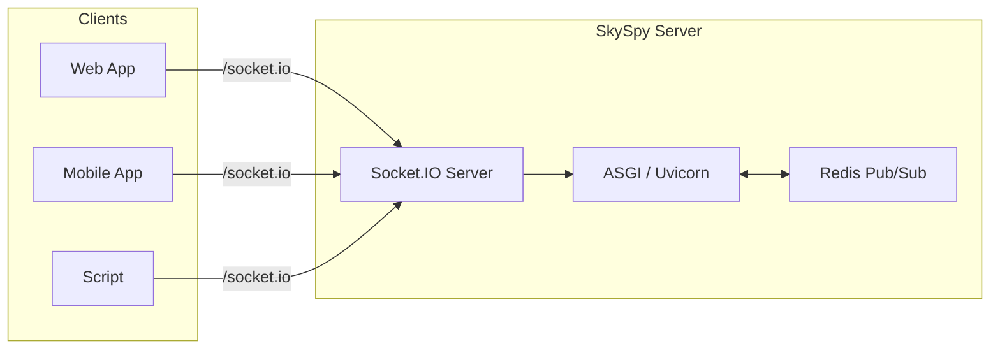
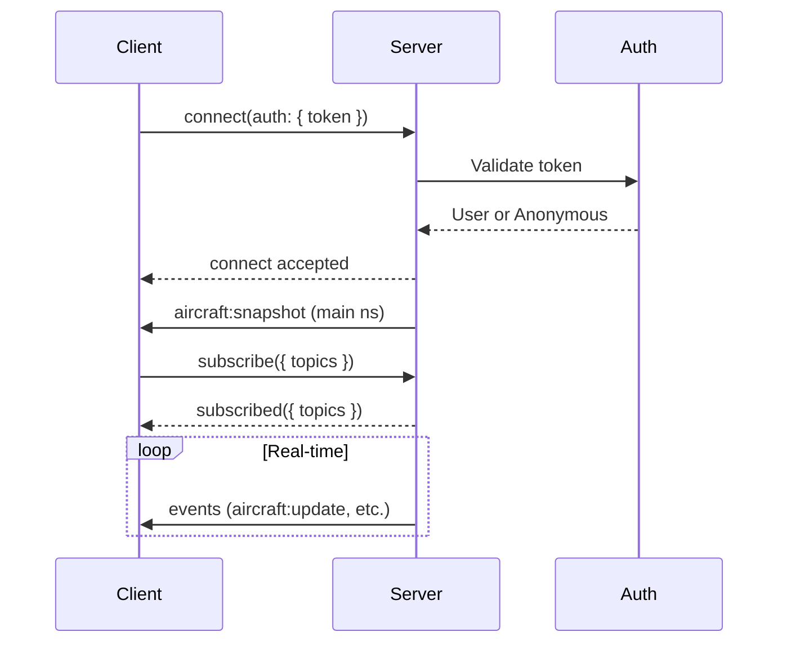

# Socket.IO API Reference

> 📘 Real-time aviation data at your fingertips
>
> SkySpy provides live streaming through Socket.IO with namespaces, topic subscriptions, rate limiting, and optional Redis-backed scaling.

## Overview

SkySpy's Socket.IO API delivers real-time bidirectional communication for tracking aircraft, monitoring safety events, and streaming aviation data. The server uses **python-socketio** (ASGI) with optional Redis for multi-process support.



### What You Can Stream

[block:parameters]
{
  "data": {
    "h-0": "Topic / Namespace",
    "h-1": "Description",
    "h-2": "Use Case",
    "0-0": "**Aircraft**",
    "0-1": "Live ADS-B position updates",
    "0-2": "Real-time tracking map",
    "1-0": "**Safety**",
    "1-1": "TCAS alerts, emergency squawks, conflicts",
    "1-2": "Safety monitoring",
    "2-0": "**Alerts**",
    "2-1": "Custom rule-based notifications",
    "2-2": "Personalized alerts",
    "3-0": "**ACARS**",
    "3-1": "Datalink messages (namespace or topic)",
    "3-2": "Message decoding",
    "4-0": "**Stats**",
    "4-1": "Live analytics and metrics",
    "4-2": "Dashboard widgets",
    "5-0": "**Airspace**",
    "5-1": "Advisories, NOTAMs, boundaries",
    "5-2": "Airspace awareness",
    "6-0": "**Audio**",
    "6-1": "Transcriptions, transmissions",
    "6-2": "Radio tab (/audio namespace)",
    "7-0": "**Cannonball**",
    "7-1": "Mobile threat detection",
    "7-2": "Mobile app (/cannonball namespace)"
  },
  "cols": 3,
  "rows": 8
}
[/block]

## Key Features

[block:parameters]
{
  "data": {
    "h-0": "Feature",
    "h-1": "Description",
    "0-0": "**Namespaces**",
    "0-1": "`/` (main), `/audio`, `/cannonball`; optional `/acars` for ACARS-only clients",
    "1-0": "**Topic Subscriptions**",
    "1-1": "Subscribe only to aircraft, safety, alerts, etc. on the main namespace",
    "2-0": "**Rate Limiting**",
    "2-1": "Per-topic rate limits to optimize bandwidth",
    "3-0": "**Message Batching**",
    "3-1": "High-frequency updates can be batched (alert/safety/emergency bypass batching)",
    "4-0": "**Delta Updates**",
    "4-1": "Only changed fields sent for position updates where supported",
    "5-0": "**Built-in Heartbeat**",
    "5-1": "Engine.IO ping/pong; custom `ping` event supported",
    "6-0": "**Auto-reconnect**",
    "6-1": "Socket.IO client exponential backoff with jitter",
    "7-0": "**Request/Response**",
    "7-1": "`request` event with `request_id` for on-demand queries"
  },
  "cols": 2,
  "rows": 8
}
[/block]

## Connection

### Base URL and Path

Socket.IO is served on the same host as the HTTP API. The default path is `/socket.io`.

- **Base URL:** `https://{host}` or `http://{host}` (same as your API base)
- **Path:** `/socket.io` (default; configurable on server)
- **Namespaces:** Connect to `/` (default), `/audio`, or `/cannonball` depending on what you need.

> 📘 Single Connection Design
>
> There are **no separate URLs per stream** (e.g. no `/ws/aircraft/`). Use a single connection to the default namespace and subscribe to topics, or connect to a dedicated namespace for audio or cannonball.

### Namespaces

[block:parameters]
{
  "data": {
    "h-0": "Namespace",
    "h-1": "Path",
    "h-2": "Description",
    "0-0": "**Main**",
    "0-1": "`/`",
    "0-2": "Aircraft, safety, alerts, ACARS, airspace, NOTAMs, stats. Subscribe via `subscribe` event.",
    "1-0": "**Audio**",
    "1-1": "`/audio`",
    "1-2": "Radio transmissions and transcription events.",
    "2-0": "**Cannonball**",
    "2-1": "`/cannonball`",
    "2-2": "Mobile threat detection; position updates and threat list.",
    "3-0": "**ACARS** (optional)",
    "3-1": "`/acars`",
    "3-2": "ACARS-only stream for clients that only want datalink messages."
  },
  "cols": 3,
  "rows": 4
}
[/block]

> 💡 Recommendation
>
> For most apps, connect to the **main namespace** (`/`) and subscribe to `aircraft`, `safety`, `alerts`, etc. Use `/audio` or `/cannonball` only when you need those features.

## Authentication

### Connection Handshake



### Authentication Modes

[block:parameters]
{
  "data": {
    "h-0": "Mode",
    "h-1": "Behavior",
    "0-0": "`public`",
    "0-1": "All connections allowed without authentication",
    "1-0": "`hybrid`",
    "1-1": "Anonymous allowed; auth required for some features; invalid token can be rejected if `WS_REJECT_INVALID_TOKENS` is True",
    "2-0": "`private`",
    "2-1": "All connections require valid authentication"
  },
  "cols": 2,
  "rows": 3
}
[/block]

### Passing the Token

> 🚧 Security Best Practice
>
> Send credentials in the **auth** object when connecting. Do not put tokens in query strings (they are often logged).

**JavaScript (socket.io-client):**

```javascript title="connect-with-auth.js"
const io = require('socket.io-client');

const socket = io('https://example.com', {
  path: '/socket.io',
  auth: {
    token: 'eyJhbGciOiJIUzI1NiIs...'  // JWT or API key
  },
  transports: ['websocket']
});
```

**Python (python-socketio):**

```python title="connect-with-auth.py"
import socketio

sio = socketio.Client()

@sio.event
def connect():
    print('connected')

sio.connect(
    'https://example.com',
    socketio_path='/socket.io',
    auth={'token': 'eyJhbGciOiJIUzI1NiIs...'},
    transports=['websocket']
)
```

### Supported Token Types

[block:parameters]
{
  "data": {
    "h-0": "Token Type",
    "h-1": "Format",
    "h-2": "Example",
    "0-0": "JWT Access Token",
    "0-1": "`eyJ...`",
    "0-2": "From `/api/auth/token/`",
    "1-0": "API Key (Live)",
    "1-1": "`sk_live_...`",
    "1-2": "Production API key",
    "2-0": "API Key (Test)",
    "2-1": "`sk_test_...`",
    "2-2": "Development API key"
  },
  "cols": 3,
  "rows": 3
}
[/block]

## Message Protocol

### Event-Based API

Socket.IO uses **events**. Client sends events (e.g. `subscribe`, `request`, `ping`); server sends events (e.g. `aircraft:snapshot`, `subscribed`, `response`). Each event has a **name** and a **payload** (usually an object).

### Client → Server Events

[block:parameters]
{
  "data": {
    "h-0": "Event",
    "h-1": "Payload",
    "h-2": "Description",
    "0-0": "`subscribe`",
    "0-1": "`{ topics: string[] }`",
    "0-2": "Subscribe to topics (e.g. `['aircraft','safety']`; use `'all'` for all).",
    "1-0": "`unsubscribe`",
    "1-1": "`{ topics: string[] }`",
    "1-2": "Unsubscribe from topics.",
    "2-0": "`request`",
    "2-1": "`{ type, request_id, params? }`",
    "2-2": "On-demand query; server replies with `response` or `error`.",
    "3-0": "`ping`",
    "3-1": "optional data",
    "3-2": "Custom keepalive; server replies with `pong`."
  },
  "cols": 3,
  "rows": 4
}
[/block]

**Example:**

```javascript title="client-events.js"
socket.emit('subscribe', { topics: ['aircraft', 'safety'] });
socket.emit('request', {
  type: 'aircraft-info',
  request_id: 'req_abc123',
  params: { icao: 'A1B2C3' }
});
```

### Server → Client Events

Server emits named events. The payload is typically a single object (e.g. snapshot data, list of topics).

[block:parameters]
{
  "data": {
    "h-0": "Event",
    "h-1": "When",
    "h-2": "Payload",
    "0-0": "`subscribed`",
    "0-1": "After subscribe",
    "0-2": "`{ topics, joined?, denied? }`",
    "1-0": "`unsubscribed`",
    "1-1": "After unsubscribe",
    "1-2": "`{ topics, remaining }`",
    "2-0": "`response`",
    "2-1": "Reply to request",
    "2-2": "`{ type, request_id, request_type, data }`",
    "3-0": "`error`",
    "3-1": "Request failed or generic error",
    "3-2": "`{ type?, request_id?, message }`",
    "4-0": "`pong`",
    "4-1": "Reply to ping",
    "4-2": "`{ timestamp }`",
    "5-0": "`aircraft:snapshot`",
    "5-1": "On connect (main ns) / snapshot request",
    "5-2": "`{ aircraft, count, timestamp }`",
    "6-0": "`aircraft:update`",
    "6-1": "Periodic / batched updates",
    "6-2": "aircraft list or delta",
    "7-0": "`aircraft:new`",
    "7-1": "New aircraft in range",
    "7-2": "single aircraft",
    "8-0": "`aircraft:remove`",
    "8-1": "Aircraft left / timeout",
    "8-2": "`{ hex, reason? }`",
    "9-0": "`aircraft:heartbeat`",
    "9-1": "Heartbeat",
    "9-2": "count/timestamp",
    "10-0": "`safety:snapshot`",
    "10-1": "Initial safety state",
    "10-2": "`{ events, count, timestamp }`",
    "11-0": "`safety:event`",
    "11-1": "New safety event",
    "11-2": "event object",
    "12-0": "`alert:triggered`",
    "12-1": "Alert rule fired",
    "12-2": "alert payload",
    "13-0": "`acars:message`",
    "13-1": "New ACARS message",
    "13-2": "message object",
    "14-0": "`batch`",
    "14-1": "Batched messages",
    "14-2": "`{ messages, count?, timestamp? }`"
  },
  "cols": 3,
  "rows": 15
}
[/block]

> 📘 Payload Compatibility
>
> Payloads match the formats described in the old WebSocket docs (aircraft, safety, alerts, etc.); only the transport is Socket.IO events instead of raw JSON messages.

### Batch Messages

High-frequency updates may be sent as a single `batch` event:

```json title="batch-event.json"
{
  "messages": [
    { "type": "aircraft:update", "data": {} },
    { "type": "aircraft:update", "data": {} }
  ],
  "count": 2,
  "timestamp": "2024-01-15T10:30:00.000Z"
}
```

> ✅ Critical Events Bypass Batching
>
> Critical types (e.g. alert, safety, emergency) bypass batching and are emitted immediately.

## Request/Response Pattern

Use the `request` event with a unique `request_id`; listen for `response` and `error`.

**Client send:**

```json title="request.json"
{
  "type": "aircraft-info",
  "request_id": "req_abc123",
  "params": { "icao": "A1B2C3" }
}
```

**Success:** server emits `response` with payload:

```json title="response.json"
{
  "type": "response",
  "request_id": "req_abc123",
  "request_type": "aircraft-info",
  "data": {
    "icao_hex": "A1B2C3",
    "registration": "N12345",
    "type_code": "B738",
    "operator": "Southwest Airlines"
  }
}
```

**Error:** server emits `error` with payload:

```json title="error.json"
{
  "type": "error",
  "request_id": "req_abc123",
  "message": "Aircraft not found"
}
```

## Main Namespace (`/`)

Default namespace. Connect here and use `subscribe` / `unsubscribe` to control which topics you receive.

### Topics

[block:parameters]
{
  "data": {
    "h-0": "Topic",
    "h-1": "Description",
    "0-0": "`aircraft`",
    "0-1": "Position and state updates",
    "1-0": "`safety`",
    "1-1": "Safety events",
    "2-0": "`stats`",
    "2-1": "Statistics",
    "3-0": "`alerts`",
    "3-1": "Alert triggers",
    "4-0": "`acars`",
    "4-1": "ACARS messages (if also broadcast to main)",
    "5-0": "`airspace`",
    "5-1": "Advisories, boundaries",
    "6-0": "`notams`",
    "6-1": "NOTAMs and TFRs",
    "7-0": "`all`",
    "7-1": "All of the above"
  },
  "cols": 2,
  "rows": 8
}
[/block]

### Aircraft Events (main namespace)

[block:parameters]
{
  "data": {
    "h-0": "Event",
    "h-1": "Trigger",
    "h-2": "Payload",
    "0-0": "`aircraft:snapshot`",
    "0-1": "On connect / request",
    "0-2": "`{ aircraft[], count, timestamp }`",
    "1-0": "`aircraft:update`",
    "1-1": "Periodic (rate-limited)",
    "1-2": "Full or batched list",
    "2-0": "`aircraft:new`",
    "2-1": "New detection",
    "2-2": "Single aircraft",
    "3-0": "`aircraft:remove`",
    "3-1": "Timeout / out of range",
    "3-2": "`{ hex, reason? }`",
    "4-0": "`aircraft:delta`",
    "4-1": "Position change (if used)",
    "4-2": "Delta object",
    "5-0": "`aircraft:heartbeat`",
    "5-1": "Keepalive",
    "5-2": "Count/timestamp"
  },
  "cols": 3,
  "rows": 6
}
[/block]

> 📘 Aircraft Payload Fields
>
> Aircraft payload fields match the previous API (e.g. `hex`, `flight`, `lat`, `lon`, `alt_baro`, `gs`, `track`, `squawk`, `category`, `distance_nm`).

### Request Types (main namespace)

Supported `request` types include (subset):

[block:parameters]
{
  "data": {
    "h-0": "Request Type",
    "h-1": "Parameters",
    "h-2": "Description",
    "0-0": "`aircraft`",
    "0-1": "`icao`",
    "0-2": "Single aircraft by ICAO",
    "1-0": "`aircraft_list`",
    "1-1": "`military_only`, `category`, `min_altitude`, `max_altitude`",
    "1-2": "Filtered list",
    "2-0": "`aircraft-info`",
    "2-1": "`icao`",
    "2-2": "Detailed aircraft info",
    "3-0": "`aircraft-info-bulk`",
    "3-1": "`icaos[]`",
    "3-2": "Bulk aircraft info",
    "4-0": "`aircraft-stats`",
    "4-1": "—",
    "4-2": "Live statistics",
    "5-0": "`aircraft-snapshot`",
    "5-1": "—",
    "5-2": "Current aircraft snapshot",
    "6-0": "`photo`",
    "6-1": "`icao`, `thumbnail`",
    "6-2": "Aircraft photo URL",
    "7-0": "`sightings`",
    "7-1": "`hours`, `limit`, `offset`, `icao_hex`, `callsign`",
    "7-2": "Historical sightings",
    "8-0": "`antenna-polar`",
    "8-1": "`hours`",
    "8-2": "Antenna polar coverage",
    "9-0": "`antenna-rssi`",
    "9-1": "`hours`, `sample_size`",
    "9-2": "RSSI vs distance",
    "10-0": "`safety-events`",
    "10-1": "`event_type`, `severity`, etc.",
    "10-2": "Safety events",
    "11-0": "`safety-event-detail`",
    "11-1": "`id` / `event_id`",
    "11-2": "Event detail",
    "12-0": "`safety-acknowledge`",
    "12-1": "`id` / `event_id`",
    "12-2": "Acknowledge event",
    "13-0": "`acars-stats`",
    "13-1": "—",
    "13-2": "ACARS statistics",
    "14-0": "`alert-rules`",
    "14-1": "—",
    "14-2": "Alert rules",
    "15-0": "`notification-channels`",
    "15-1": "—",
    "15-2": "Notification channels",
    "16-0": "`metars` / `taf` / `pireps`",
    "16-1": "`lat`, `lon`, `radius_nm`, etc.",
    "16-2": "Weather / PIREPs",
    "17-0": "`airports` / `navaids`",
    "17-1": "`lat`, `lon`, `radius_nm`, `limit`",
    "17-2": "Geodata",
    "18-0": "`airspace-boundaries` / advisories",
    "18-1": "—",
    "18-2": "Airspace",
    "19-0": "`system-info` / `system-status` / `health`",
    "19-1": "—",
    "19-2": "System",
    "20-0": "`stats-flight-patterns`, `stats-geographic`, etc.",
    "20-1": "—",
    "20-2": "Extended stats"
  },
  "cols": 3,
  "rows": 21
}
[/block]

> 📘 Additional Request Types
>
> Full set is implemented in the main namespace handler; permission checks apply where configured.

## Safety Events (main namespace)

- **Topics:** `safety`, or `all`.
- **Events:** `safety:snapshot` (initial), `safety:event` (new event). Severity and payload shape match the previous API (e.g. `event_type`, `severity`, `icao_hex`, `callsign`, `message`, `details`).
- **Requests:** `safety-events`, `safety-event-detail`, `safety-acknowledge`, `safety-stats`, etc.

## Alerts (main namespace)

- **Topics:** `alerts`, or `all`. User-specific channels for authenticated users.
- **Events:** `alert:triggered`, `alert:snapshot`. Payload includes rule and aircraft data.
- **Requests:** `alert-rules`, `alert-rule-create`, `alert-rule-update`, `alert-rule-delete`, `alert-rule-toggle`, etc.

## ACARS

- **Main namespace:** Subscribe to topic `acars` to receive `acars:message` (if the server broadcasts to the main namespace).
- **Dedicated namespace:** For ACARS-only clients, connect to namespace `/acars`; server broadcasts to room `acars_all` (and per-ICAO rooms). Event name: `acars:message`; payload format unchanged (e.g. `id`, `timestamp`, `source`, `icao_hex`, `callsign`, `label`, `text`, `decoded`, etc.).
- **Requests:** On main namespace, `acars-stats` and related request types.

## Stats (main namespace)

- **Topic:** `stats` or `all`.
- **Events:** `stats:update` and/or stat-specific events with `stat_type` and `data`.
- **Requests:** `stats-flight-patterns`, `stats-geographic`, `stats-tracking-quality`, `stats-engagement`, `stats-time-comparison`, `history-stats`, `history-trends`, etc.

## Airspace & NOTAMs (main namespace)

- **Topics:** `airspace`, `notams`, or `all`.
- **Events:** e.g. `airspace:update`, `notams:tfr_new`, `notams:stats`, etc.
- **Requests:** `airspace-boundaries`, advisories, `metars`, `taf`, `pireps`, `airports`, `navaids`, NOTAM-related types as implemented.

## Audio Namespace (`/audio`)

Connect to namespace `/audio` for radio and transcription streams.

- **Events:** `audio:snapshot`, `audio:transmission`, `audio:transcription_started`, `audio:transcription_completed`, `audio:transcription_failed`.
- **Requests:** e.g. `transmissions`, `transmission` (by ID), `stats`.

> 🚧 Permission Required
>
> Permission for the `audio` topic/feature is required.

## Cannonball Namespace (`/cannonball`)

Connect to namespace `/cannonball` for mobile threat detection.

**Flow:** Client sends `position_update` (lat, lon, optional heading); server emits `threats` with filtered list. Client can send `set_radius` (radius_nm); server confirms with `radius_updated`.

**Events (server → client):**
- `session_started` (session_id)
- `threats`
- `radius_updated`
- `error`

**Events (client → server):**
- `position_update`
- `set_radius`
- `get_threats`
- `request` (for other request types)

**Threat payload:** e.g. `hex`, `callsign`, `distance_nm`, `bearing`, `threat_level`, `trend`, `altitude`, etc.

## Connection Lifecycle

### Heartbeat

- Socket.IO's Engine.IO layer provides built-in ping/pong.
- The app also supports a custom `ping` event; server replies with `pong` and optional `timestamp`.

### Connection States (client)

[block:parameters]
{
  "data": {
    "h-0": "State",
    "h-1": "Description",
    "0-0": "Connecting",
    "0-1": "Initial connection or reconnecting",
    "1-0": "Connected",
    "1-1": "Connected and ready to emit/subscribe",
    "2-0": "Disconnected",
    "2-1": "Disconnected (check reason)",
    "3-0": "Connect error",
    "3-1": "Authentication or network error"
  },
  "cols": 2,
  "rows": 4
}
[/block]

### Reconnection

Socket.IO client reconnection (exponential backoff, jitter) is enabled by default. Typical config:

- `reconnection: true`
- `reconnectionDelay`: 1000 ms
- `reconnectionDelayMax`: 30000 ms
- `reconnectionAttempts`: Infinity
- `randomizationFactor`: 0.3

> 📘 Disconnect Reasons
>
> Disconnect reasons (e.g. `io server disconnect`, `io client disconnect`, `transport close`) indicate whether to reconnect or not (e.g. do not reconnect on auth failure if the server disconnects for that).

## Client Implementation

### JavaScript (socket.io-client)

```javascript title="client.js"
import { io } from 'socket.io-client';

const socket = io('https://example.com', {
  path: '/socket.io',
  auth: { token: getAccessToken() },
  transports: ['websocket'],
  reconnection: true,
  reconnectionDelay: 1000,
  reconnectionDelayMax: 30000,
  reconnectionAttempts: Infinity,
  randomizationFactor: 0.3,
});

socket.on('connect', () => {
  socket.emit('subscribe', { topics: ['aircraft', 'safety'] });
});

socket.on('subscribed', (data) => {
  console.log('Subscribed:', data.topics);
});

socket.on('aircraft:snapshot', (data) => {
  console.log('Aircraft count:', data.count);
});

socket.on('aircraft:update', (data) => {
  // Merge or replace aircraft state
});

socket.on('batch', (data) => {
  data.messages.forEach(msg => {
    socket.emit(msg.type, msg.data); // or handle by msg.type
  });
});

socket.on('response', (data) => {
  console.log('Response:', data.request_id, data.data);
});

socket.on('error', (data) => {
  console.error('Error:', data.message);
});
```

### Python (python-socketio)

```python title="client.py"
import socketio

sio = socketio.Client()

@sio.event
def connect():
    sio.emit('subscribe', {'topics': ['aircraft', 'safety']})

@sio.event
def subscribed(data):
    print('Subscribed:', data.get('topics'))

@sio.event
def aircraft_snapshot(data):
    print('Aircraft count:', data.get('count'))

@sio.event
def aircraft_update(data):
    pass  # merge aircraft state

@sio.event
def batch(data):
    for msg in data.get('messages', []):
        event = msg.get('type', '').replace(':', '_')
        payload = msg.get('data', msg)
        sio.emit(event, payload)

@sio.event
def response(data):
    print('Response:', data.get('request_id'), data.get('data'))

@sio.event
def error(data):
    print('Error:', data.get('message'))

sio.connect(
    'https://example.com',
    socketio_path='/socket.io',
    auth={'token': 'eyJ...'},
    transports=['websocket']
)
sio.wait()
```

> 📘 Event Name Handling
>
> python-socketio may use `aircraft_snapshot` for the event `aircraft:snapshot`; check client docs for colon handling.

### Request with timeout (JavaScript)

```javascript title="request-helper.js"
function request(socket, type, params = {}, timeoutMs = 10000) {
  return new Promise((resolve, reject) => {
    const requestId = `req_${Date.now()}_${Math.random().toString(36).slice(2)}`;
    const t = setTimeout(() => {
      reject(new Error(`Timeout: ${type}`));
    }, timeoutMs);

    const onResponse = (data) => {
      if (data.request_id !== requestId) return;
      clearTimeout(t);
      socket.off('response', onResponse);
      socket.off('error', onError);
      resolve(data.data ?? data);
    };
    const onError = (data) => {
      if (data.request_id !== requestId) return;
      clearTimeout(t);
      socket.off('response', onResponse);
      socket.off('error', onError);
      reject(new Error(data.message || 'Request failed'));
    };

    socket.once('response', onResponse);
    socket.once('error', onError);
    socket.emit('request', { type, request_id: requestId, params });
  });
}

// Usage
const info = await request(socket, 'aircraft-info', { icao: 'A1B2C3' });
```

## Rate Limits

[block:parameters]
{
  "data": {
    "h-0": "Topic / Type",
    "h-1": "Max rate (typical)",
    "h-2": "Notes",
    "0-0": "`aircraft:update`",
    "0-1": "~10 Hz",
    "0-2": "Full updates",
    "1-0": "`aircraft:delta`",
    "1-1": "~10 Hz",
    "1-2": "Delta updates",
    "2-0": "`stats:update`",
    "2-1": "~0.5 Hz",
    "2-2": "2 s min interval",
    "3-0": "Default",
    "3-1": "~5 Hz",
    "3-2": "Other types"
  },
  "cols": 3,
  "rows": 4
}
[/block]

> 📘 Batching Configuration
>
> Batching: window ~200 ms, max batch size ~50 messages or ~1 MB; alert/safety/emergency types are not batched.

## Error Handling

**Error event payload:**

```json title="error-payload.json"
{
  "type": "error",
  "request_id": "req_abc123",
  "message": "Description of the error"
}
```

[block:parameters]
{
  "data": {
    "h-0": "Message / Cause",
    "h-1": "Resolution",
    "0-0": "Invalid JSON / malformed",
    "0-1": "Check payload format",
    "1-0": "Unknown action / request type",
    "1-1": "Use supported events and request types",
    "2-0": "Missing parameter",
    "2-1": "Include required params",
    "3-0": "Permission denied",
    "3-1": "Check authentication and topic/request permissions",
    "4-0": "Invalid token",
    "4-1": "Refresh or re-issue token"
  },
  "cols": 2,
  "rows": 5
}
[/block]

## Security

> 🚧 Production Security Requirements
>
> - Use **TLS** in production (https / wss).
> - Prefer **auth** object for token; avoid query-string tokens.
> - Respect **topic and request permissions** (some require auth or specific permissions).
> - Handle **token expiry** and refresh (e.g. JWT).

## Troubleshooting

[block:parameters]
{
  "data": {
    "h-0": "Symptom",
    "h-1": "Possible cause",
    "h-2": "Action",
    "0-0": "Connection rejected",
    "0-1": "Auth required or invalid token",
    "0-2": "Check token; try in hybrid/public if testing",
    "1-0": "No events after connect",
    "1-1": "Not subscribed",
    "1-2": "Emit `subscribe` with `topics` after `connect`",
    "2-0": "No `aircraft:snapshot`",
    "2-1": "Listeners attached after connect",
    "2-2": "Subscribe and request `aircraft-snapshot` if needed",
    "3-0": "Delayed updates",
    "3-1": "Rate limiting / batching",
    "3-2": "Expected; critical events are not batched",
    "4-0": "ACARS not received on main ns",
    "4-1": "Server may send only on `/acars`",
    "4-2": "Connect to namespace `/acars` for ACARS-only stream"
  },
  "cols": 3,
  "rows": 5
}
[/block]

### Debug (client)

```javascript title="enable-debug.js"
localStorage.setItem('debug', 'socket.io-client:*');
```

### Server (Django)

```python title="settings.py"
LOGGING = {
    'loggers': {
        'skyspy.socketio': {'level': 'DEBUG'},
        'socketio': {'level': 'DEBUG'},
    },
}
```

---

> 📘 Need help?
>
> See the [REST API](05-rest-api.md), [testing guide](12-testing.md), or project README for more context.
